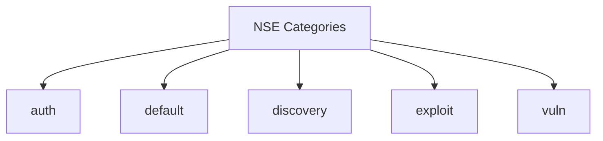

# 🔍 Nmap Cheat Sheet for OSCP Prep

> This comprehensive guide covers every major Nmap option, scan type, output format, NSE scripting, timing, and evasion technique — complete with practical examples.

---

## 🛠 Basic Syntax

```bash
nmap [Scan Type(s)] [Options] {target specification}
```

**Example:**
```bash
nmap -sS -p 1-1000 10.10.10.10
```

---

## 🎯 Target Specification

- **Single Host**:
  ```bash
  nmap 192.168.1.1
  ```
- **Multiple Hosts**:
  ```bash
  nmap 192.168.1.1 10.0.0.5
  ```
- **IP Range**:
  ```bash
  nmap 192.168.1.1-50
  ```
- **Subnet (CIDR)**:
  ```bash
  nmap 10.0.0.0/24
  ```
- **Octet Range**:
  ```bash
  nmap 192.168.0-255.1-254
  ```
- **From File**:
  ```bash
  nmap -iL targets.txt
  ```
- **Hostname**:
  ```bash
  nmap scanme.nmap.org
  ```

---

## 🌐 Host Discovery

- **Ping Scan (Skip port scan)**:
  ```bash
  nmap -sn 10.10.10.0/24
  ```
- **ARP Ping (Local LAN)**:
  ```bash
  nmap -PR 192.168.1.0/24
  ```
- **Disable Ping (Assume hosts are up)**:
  ```bash
  nmap -Pn 10.10.10.10
  ```

---

## 🚀 Scan Types

| Type | Flag | Description |
|------|------|-------------|
| TCP Connect | `-sT` | Full handshake; no root required |
| SYN (Half-open) | `-sS` | Stealthy; default for root |
| UDP Scan | `-sU` | Scans UDP ports |
| Null Scan | `-sN` | No flags set |
| FIN Scan | `-sF` | FIN flag only |
| Xmas Scan | `-sX` | FIN, PSH, URG flags |
| ACK Scan | `-sA` | Firewall rule discovery |
| Window Scan | `-sW` | Window size analysis |
| Maimon Scan | `-sM` | FIN/ACK exception |
| Protocol Scan | `-sO` | IP protocol scan |

**Example SYN + UDP Scan**:
```bash
nmap -sS -sU -p T:1-1000,U:1-100 10.10.10.10
```

---

## 📍 Port Specification

- **Single Port**:
  ```bash
  nmap -p 22 192.168.1.5
  ```
- **Port Range**:
  ```bash
  nmap -p 1-1024 10.10.10.10
  ```
- **Multiple Ports**:
  ```bash
  nmap -p 80,443,8080 192.168.1.5
  ```
- **All Ports**:
  ```bash
  nmap -p- 10.10.10.10
  ```

---

## 🧠 Service & Version Detection

- **Basic Version Scan**:
  ```bash
  nmap -sV 10.10.10.10
  ```
- **Aggressive Version Scan**:
  ```bash
  nmap -sV --version-all 10.10.10.10
  ```

---

## 🖥 OS Detection

```bash
nmap -O 10.10.10.10
nmap -sS -sV -O 10.10.10.10
```

---

## 📄 Output Formats

- **Normal**: `-oN`
  ```bash
  nmap -oN scan.txt 10.10.10.10
  ```
- **XML**: `-oX`
  ```bash
  nmap -oX scan.xml 10.10.10.10
  ```
- **Grepable**: `-oG`
  ```bash
  nmap -oG scan.gnmap 10.10.10.10
  ```
- **All Formats**: `-oA`
  ```bash
  nmap -oA full_scan 10.10.10.10
  ```

---

## ⚙️ Aggressive Scan

```bash
nmap -A 10.10.10.10
```
*Includes: OS & version detection, default scripts, traceroute (noisy).*

---

## 🧪 Nmap Scripting Engine (NSE)

- **Run Default Scripts**:
  ```bash
  nmap -sC 10.10.10.10
  ```
- **Specify Scripts**:
  ```bash
  nmap --script=http-title,smb-enum-shares 10.10.10.10
  ```
- **Category Scan**:
  ```bash
  nmap --script=vuln 10.10.10.10
  ```
- **Script Arguments**:
  ```bash
  nmap --script=http-brute --script-args http-brute.path=/admin 10.10.10.10
  ```

### NSE Script Categories



---

## ⏱ Timing Templates

| Template | Usage |
|----------|-------|
| T0 (Paranoid)   | `-T0` |
| T1 (Sneaky)     | `-T1` |
| T2 (Polite)     | `-T2` |
| T3 (Normal)     | `-T3` |
| T4 (Aggressive) | `-T4` |
| T5 (Insane)     | `-T5` |

**Example**:
```bash
nmap -sS -T4 10.10.10.10
```

---

## 🔐 Firewall & IDS Evasion

| Technique         | Command                          |
|-------------------|----------------------------------|
| Fragment Packets  | `-f`                             |
| Decoy Scan        | `-D RND:10`                      |
| Source Port Set   | `--source-port 53`               |
| MAC Spoofing      | `--spoof-mac 0A:1B:2C:3D:4E:5F`   |
| Idle (Zombie) Scan| `-sI zombie_host`                |

---

## 🧰 Real-World OSCP Examples

- **Full TCP Scan + Scripts + Detection**:
  ```bash
  nmap -sS -sV -sC -O -T4 -p- -oA full_scan 10.10.10.10
  ```
- **Web Enumeration**:
  ```bash
  nmap -p 80,443 --script=http-enum,http-title,http-methods 10.10.10.10
  ```
- **SMB Enumeration**:
  ```bash
  nmap -p 139,445 --script=smb-enum-shares,smb-os-discovery 10.10.10.10
  ```
- **DNS Zone Transfer**:
  ```bash
  nmap -p 53 --script=dns-zone-transfer --script-args dns-zone-transfer.domain=example.com 10.10.10.10
  ```

---

> **Tip:** Combine Nmap findings with tools like Gobuster, Nikto, and enum4linux for deeper enumeration.

---

## 📚 Further Reading

- [Nmap Official Manual](https://nmap.org/book/man.html)
- [Nmap NSE Documentation](https://nmap.org/book/nse.html)
- [Nmap Usage Summary](https://nmap.org/book/man-briefoptions.html)
- [DigitalOcean: Nmap Switches and Scan Types](https://www.digitalocean.com/community/tutorials/nmap-switches-scan-types)
