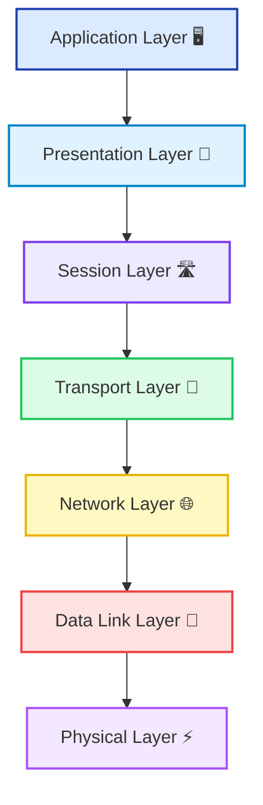

# 🧠 Understanding the OSI Model: A Simplified Guide

The **OSI (Open Systems Interconnection)** model is a conceptual framework that standardizes the functions of a computer network into seven distinct layers. Developed by the International Organization for Standardization (ISO), the OSI model is essential for understanding how different networking protocols and systems collaborate to enable communication across networks. 

Whether you're new to networking or looking for a solid refresher, this post will simplify the OSI model and walk you through each of its seven critical layers.

---

## ❓ What is the OSI Model?

The OSI model divides network communication into **seven hierarchical layers**, each with a specific role. Think of these layers like a relay team: each one passes the baton (data) to the next to ensure successful delivery from source to destination.

Here’s a quick breakdown of the seven layers from bottom (hardware) to top (user interaction):

1. **Physical Layer**
2. **Data Link Layer**
3. **Network Layer**
4. **Transport Layer**
5. **Session Layer**
6. **Presentation Layer**
7. **Application Layer**

Understanding these layers is key to diagnosing network issues and designing resilient systems. Let’s dive deeper!

---

## ⚡ 1. Physical Layer: The Hardware Backbone

The **Physical Layer** is the foundation of network communication. It focuses on the **physical connection** between devices and the **transmission of raw binary data** (0s and 1s) over various mediums.

**Key components**:
- **Cabling**: Ethernet cables, coaxial cables, fiber optics
- **Network Interface Cards (NICs)**
- **Repeaters, Hubs, and Switches**

**Functions**:
- Converts digital bits into electrical, radio, or optical signals.
- Defines hardware specifications like voltage levels and pin layout.

🔍 **Example**: Faulty cables or broken NICs impact this layer directly.

---

## 🧬 2. Data Link Layer: Reliable Local Transmission

The **Data Link Layer** ensures **error-free and reliable communication** between devices on the same network segment.

It is split into two sublayers:
- **Logical Link Control (LLC)**: Handles error checking and frame synchronization.
- **Media Access Control (MAC)**: Manages protocol access to the physical network medium.

**Responsibilities**:
- Frames data packets for transmission.
- Handles **error detection** and **collision management**.

🔍 **Example**: MAC addresses operate at this layer, and Ethernet works here too.

---

## 🌐 3. Network Layer: Smart Routing Across Networks

The **Network Layer** handles the delivery of packets between different networks, ensuring that data finds the most efficient path from source to destination.

**Key responsibilities**:
- **Routing**: Determining the optimal path for data.
- **IP Addressing**: Assigning and managing IP addresses.
- **Packet Forwarding**: Moving packets across networks.

**Protocols**:
- **IP (Internet Protocol)**
- **ICMP (Internet Control Message Protocol)**

🔍 **Example**: Routers work at the Network Layer by making routing decisions.

---

## 🚛 4. Transport Layer: End-to-End Connection and Reliability

The **Transport Layer** manages **end-to-end communication**, ensuring that data is delivered accurately, reliably, and in sequence.

**Key protocols**:
- **TCP (Transmission Control Protocol)**: Guarantees reliable delivery with acknowledgments and retransmissions.
- **UDP (User Datagram Protocol)**: Provides faster, connectionless communication without guarantees.

**Functions**:
- Flow control
- Error detection and correction
- Segmentation and reassembly of data

🔍 **Example**: Downloading a file uses TCP for reliability; video streaming often uses UDP for speed.

---

## 🛣️ 5. Session Layer: Managing Conversations

The **Session Layer** is responsible for **establishing, maintaining, and terminating sessions** between two communicating hosts.

**Responsibilities**:
- Setting up, managing, and tearing down sessions.
- Synchronization and dialog control.
- Session recovery after interruption.

🔍 **Example**: When you're logged into a remote server and your connection drops, the Session Layer tries to maintain or recover the session.

---

## 🎨 6. Presentation Layer: Translating and Encrypting Data

The **Presentation Layer** acts as a **translator** and **formatter** between the application and network.

**Main tasks**:
- **Data Encoding/Decoding**: Ensuring consistent data formatting (e.g., JSON, XML, JPEG).
- **Data Compression**: Reducing data size for faster transmission.
- **Encryption/Decryption**: Securing communication for privacy and integrity.

🔍 **Example**: HTTPS encrypts your browser data at this layer before sending it over the internet.

---

## 🖥️ 7. Application Layer: Where Users Interact

The **Application Layer** provides **services directly to user applications** to enable network communication.

**Common protocols**:
- **HTTP/HTTPS**: Web browsing
- **FTP**: File transfers
- **SMTP/POP3/IMAP**: Email communications
- **DNS**: Domain name resolution

🔍 **Example**: When you visit a website, your browser uses HTTP/HTTPS at the Application Layer to communicate with the server.

---

### 🔗 How Do the Layers Work Together?

When you send data, it moves **down the OSI model**:
- **Application** → **Presentation** → **Session** → **Transport** → **Network** → **Data Link** → **Physical**

At the receiving end, the data travels **up the OSI model**, where each layer processes its relevant information before handing it off to the next.

✅ Each layer **adds headers (encapsulation)** on the sender’s side  
✅ Each layer **strips headers (decapsulation)** on the receiver’s side

---

### 📚 Why is the OSI Model Important?

Understanding the OSI model is crucial because:

1. **Standardization**: Offers a universal standard for networking equipment and protocols.
2. **Troubleshooting**: Helps pinpoint network issues by isolating which layer is failing.
3. **Simplification**: Makes complex systems understandable and modular.

Whether you're fixing a broken network connection or designing a new architecture, using the OSI model gives you a logical, layered approach.

---

### 🧑‍🏫 Conclusion

The **OSI model** is more than just a theory; it’s a **practical tool** for anyone working with networking technologies. It breaks down the communication process into manageable parts, making it easier to understand, design, and troubleshoot systems.

Mastering the OSI model strengthens your foundation in networking and prepares you for real-world scenarios, from basic troubleshooting to advanced system architecture.

🛠️ **Tip**: When facing a network issue, think: *Which OSI layer is causing the problem?* It’s your secret weapon!

---

### 📊 Visualizing the OSI Model

