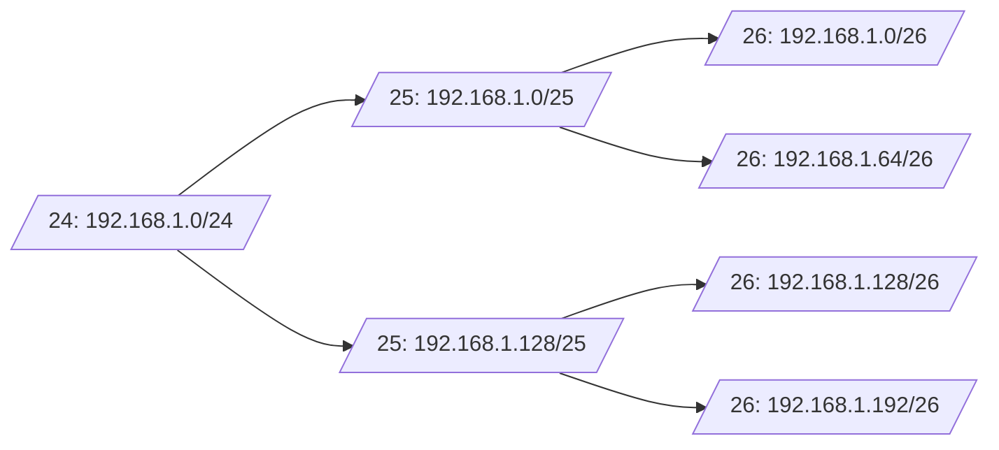
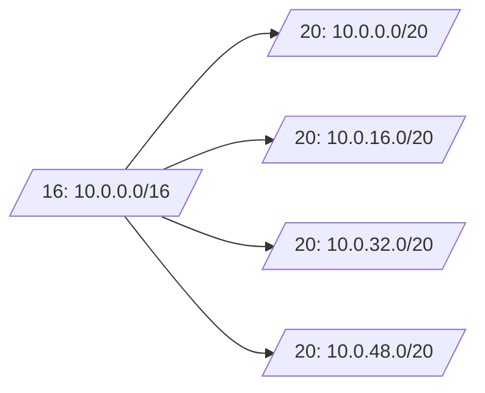

**Subnetting** is the process of dividing a large IP network into smaller, more efficient segments known as *subnets*. This segmentation helps improve routing performance, enhances network security, and simplifies IP address management. It works by applying a **32-bit subnet mask** to an IPv4 address, splitting it into *network* and *host* portions. Modern networks use **CIDR (Classless Inter-Domain Routing)** notation (e.g., `/24`, `/26`) to flexibly define subnet sizes, moving beyond the limitations of the traditional class A/B/C system.

Subnetting calculations rely on powers of two. Borrowing `n` bits creates `2ⁿ` subnets, while each subnet supports `2ʰ – 2` usable hosts (subtracting the network and broadcast addresses).

---

## What Is Subnetting?

Subnetting allows you to divide one large network into multiple smaller networks. Each subnet functions independently with its own address range and broadcast domain. This makes routing tables smaller and traffic more manageable—boosting efficiency and minimizing unnecessary broadcast traffic.

---

## IPv4 Address & Subnet Mask Breakdown

- **IPv4 Address**: A 32-bit number split into four decimal octets (e.g., `192.168.1.0`).  
- **Binary Format**: That same address is `11000000.10101000.00000001.00000000`.  
- **Subnet Mask**: Also 32 bits, it uses a sequence of 1s to denote the network portion, and 0s for the host portion. For example:  
  - `255.255.255.0` → `11111111.11111111.11111111.00000000`  

A **bitwise AND** operation between the IP address and the subnet mask reveals the **network address**. The remaining bits define the possible **hosts** in that subnet.

---

## CIDR Notation

CIDR (Classless Inter-Domain Routing) describes subnets using a suffix like `/24` to indicate how many bits are used for the network portion:

- `10.0.0.0/8`: 8 bits for the network, 24 for hosts  
- `192.168.1.0/26`: 26 bits for the network, 6 for hosts  

This eliminates the rigid structure of class A/B/C networks, enabling flexible and optimized subnetting.

---

## Calculating Subnets & Hosts

- **Number of subnets**: `2ⁿ` (where `n` is the number of borrowed host bits)  
- **Usable hosts per subnet**: `2ʰ – 2` (subtracting the network and broadcast addresses)

### Example: Splitting a `/24` into `/26`

Borrowing 2 bits from a `/24` (i.e., using `/26`) gives:
- `2² = 4 subnets`
- Each subnet has `2⁶ – 2 = 62 usable hosts`

---

## VLSM: Variable-Length Subnet Masking

**VLSM** lets you use subnets of different sizes within the same network. It’s especially useful when different segments of your network require different numbers of IP addresses.

With VLSM, you only allocate what each subnet needs, reducing IP waste.

---

## Practical Examples

### Example 1: Dividing a `/24` into Four `/26` Subnets

| Subnet              | Netmask           | Host Range                      | Broadcast         |
|---------------------|-------------------|----------------------------------|-------------------|
| `192.168.1.0/26`    | `255.255.255.192` | `192.168.1.1 – 192.168.1.62`     | `192.168.1.63`    |
| `192.168.1.64/26`   | `255.255.255.192` | `192.168.1.65 – 192.168.1.126`   | `192.168.1.127`   |
| `192.168.1.128/26`  | `255.255.255.192` | `192.168.1.129 – 192.168.1.190`  | `192.168.1.191`   |
| `192.168.1.192/26`  | `255.255.255.192` | `192.168.1.193 – 192.168.1.254`  | `192.168.1.255`   |

Each `/26` supports 62 usable hosts.

### Example 2: Dividing a `/16` into `/20` Subnets

- Borrowed bits: 4  
- Subnets: `2⁴ = 16`  
- Usable hosts per subnet: `2¹² – 2 = 4094`

---

## Private vs. Public IP Address Ranges

Per **RFC 1918**, these ranges are reserved for private networks:

| Range            | Address Space        | Approx. Hosts       |
|------------------|----------------------|---------------------|
| `10.0.0.0/8`     | 10.0.0.0 – 10.255.255.255 | ~16.7 million    |
| `172.16.0.0/12`  | 172.16.0.0 – 172.31.255.255 | ~1 million     |
| `192.168.0.0/16` | 192.168.0.0 – 192.168.255.255 | ~65,000      |

Private IPs require **NAT** (Network Address Translation) to access public Internet resources.

---

## Further Reading

- [Cloudflare: What is a Subnet Mask?](https://www.cloudflare.com/learning/network-layer/what-is-a-subnet/)
- [DigitalOcean: IP Addresses, Subnets & CIDR](https://www.digitalocean.com/community/tutorials/understanding-ip-addresses-subnets-and-cidr-notation-for-networking)
- [Cisco: Configure IP Addresses & Subnetting](https://www.cisco.com/c/en/us/support/docs/ip/routing-information-protocol-rip/13788-3.html)
- [Wikipedia: Subnet](https://en.wikipedia.org/wiki/Subnet)
- [GeeksforGeeks: Introduction to Subnetting](https://www.geeksforgeeks.org/introduction-to-subnetting/)
- [TutorialsPoint: IPv4 Subnetting](https://www.tutorialspoint.com/ipv4/ipv4_subnetting.htm)
- [TechTarget: RFC 1918 Definition](https://www.techtarget.com/whatis/definition/RFC-1918)
