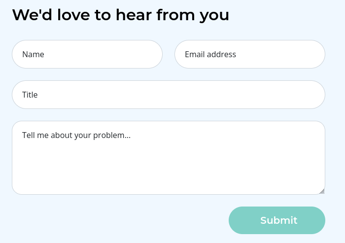
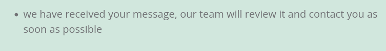
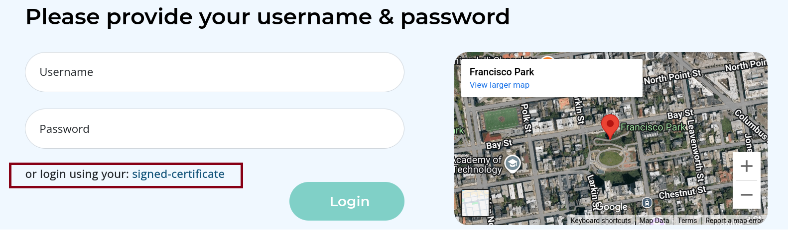
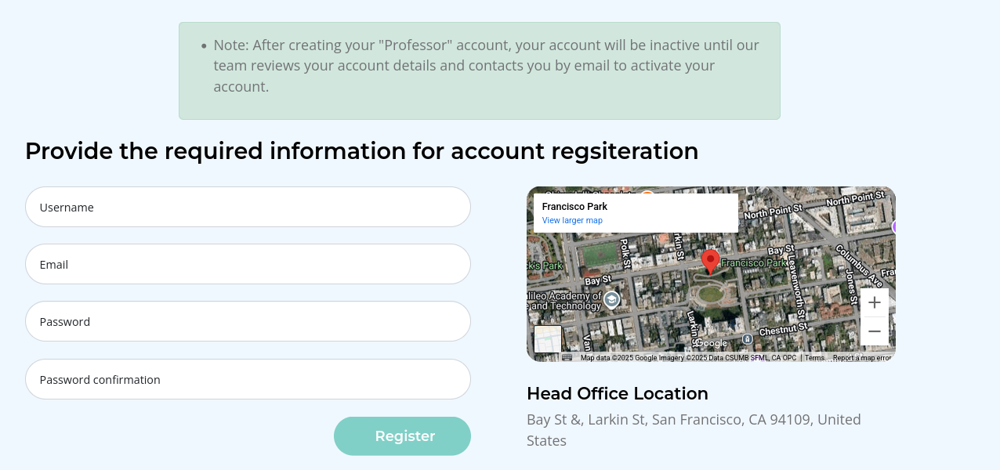
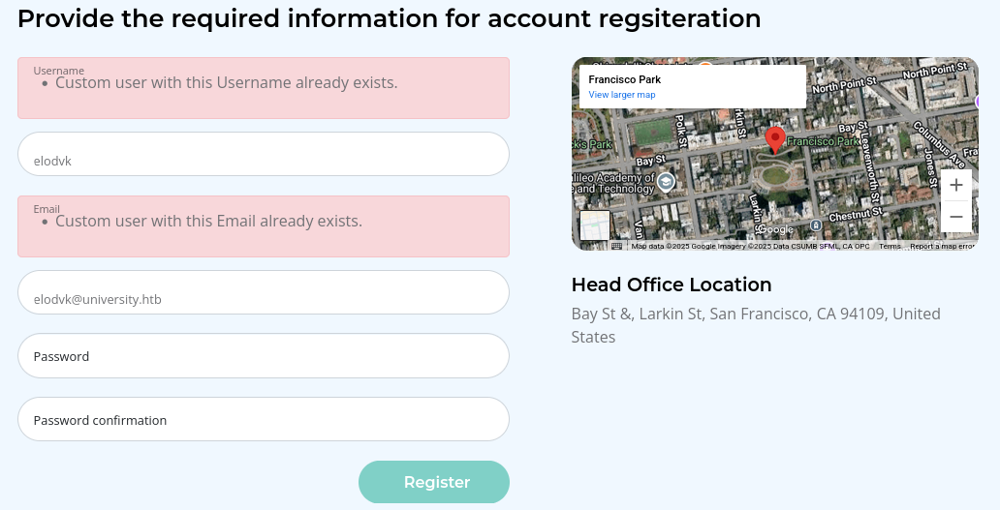
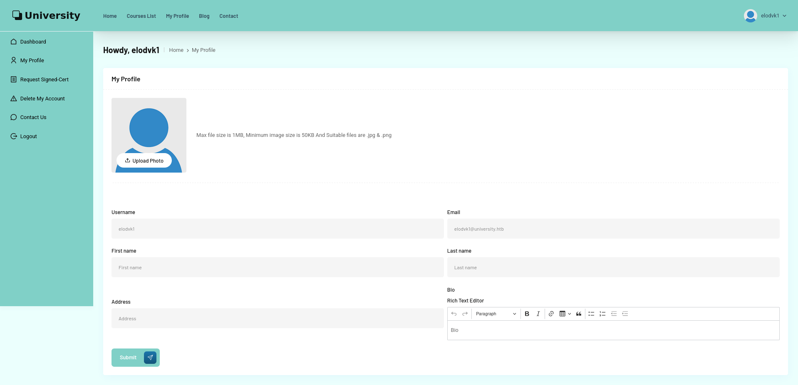

## Recon

### Nmap

As always, I am going to start by running an `nmap` scan against the target to find the open ports.

```shell
nmap -p- -sC -sV -T4 -oA reports/nmap_out 10.129.231.193
```

**Output**

The box shows many of the ports associated with a Windows Domain Controller. The domain is `university.htb`, and the hostname is `DC`.

```
PORT      STATE SERVICE       VERSION
53/tcp    open  domain        Simple DNS Plus
80/tcp    open  http          nginx 1.24.0
|_http-server-header: nginx/1.24.0
|_http-title: Did not follow redirect to http://university.htb/
88/tcp    open  kerberos-sec  Microsoft Windows Kerberos (server time: 2025-08-11 15:39:01Z)
135/tcp   open  msrpc         Microsoft Windows RPC
139/tcp   open  netbios-ssn   Microsoft Windows netbios-ssn
389/tcp   open  ldap          Microsoft Windows Active Directory LDAP (Domain: university.htb0., Site: Default-First-Site-Name)
445/tcp   open  microsoft-ds?
464/tcp   open  kpasswd5?
593/tcp   open  ncacn_http    Microsoft Windows RPC over HTTP 1.0
636/tcp   open  tcpwrapped
2179/tcp  open  vmrdp?
3268/tcp  open  ldap          Microsoft Windows Active Directory LDAP (Domain: university.htb0., Site: Default-First-Site-Name)
3269/tcp  open  tcpwrapped
5985/tcp  open  http          Microsoft HTTPAPI httpd 2.0 (SSDP/UPnP)
|_http-title: Not Found
|_http-server-header: Microsoft-HTTPAPI/2.0
9389/tcp  open  mc-nmf        .NET Message Framing
47001/tcp open  http          Microsoft HTTPAPI httpd 2.0 (SSDP/UPnP)
|_http-server-header: Microsoft-HTTPAPI/2.0
|_http-title: Not Found
49664/tcp open  msrpc         Microsoft Windows RPC
49665/tcp open  msrpc         Microsoft Windows RPC
49666/tcp open  msrpc         Microsoft Windows RPC
49667/tcp open  msrpc         Microsoft Windows RPC
49669/tcp open  msrpc         Microsoft Windows RPC
49670/tcp open  ncacn_http    Microsoft Windows RPC over HTTP 1.0
49671/tcp open  msrpc         Microsoft Windows RPC
49673/tcp open  msrpc         Microsoft Windows RPC
49677/tcp open  msrpc         Microsoft Windows RPC
49696/tcp open  msrpc         Microsoft Windows RPC
55954/tcp open  msrpc         Microsoft Windows RPC
Service Info: Host: DC; OS: Windows; CPE: cpe:/o:microsoft:windows

Host script results:
| smb2-time: 
|   date: 2025-08-11T15:39:59
|_  start_date: N/A
|_clock-skew: 7h00m53s
| smb2-security-mode: 
|   3:1:1: 
|_    Message signing enabled and required
```

I will use `netexec` to make a hosts file entry and put it at the top of my `/etc/hosts` file:

```shell
┌──(elodvk㉿kali)-[~/hack-the-box/university]
└─$ netexec smb 10.129.231.193 --generate-hosts hosts 
SMB         10.129.231.193  445    DC               [*] Windows 10 / Server 2019 Build 17763 x64 (name:DC) (domain:university.htb) (signing:True) (SMBv1:False)


┌──(elodvk㉿kali)-[~/hack-the-box/university]
└─$ cat hosts /etc/hosts | sudo sponge /etc/hosts

```

### SMB TCP/445

Guest account is disabled and anonymous bind is not allowed.

```shell
┌──(elodvk㉿kali)-[~/hack-the-box/university]
└─$ netexec smb 10.129.231.193 -u guest -p ''                          
SMB         10.129.231.193  445    DC               [*] Windows 10 / Server 2019 Build 17763 x64 (name:DC) (domain:university.htb) (signing:True) (SMBv1:False)
SMB         10.129.231.193  445    DC               [-] university.htb\guest: STATUS_ACCOUNT_DISABLED 
                                                                                                                              
┌──(elodvk㉿kali)-[~/hack-the-box/university]
└─$ netexec smb 10.129.231.193 -u elodvk -p ''
SMB         10.129.231.193  445    DC               [*] Windows 10 / Server 2019 Build 17763 x64 (name:DC) (domain:university.htb) (signing:True) (SMBv1:False)
SMB         10.129.231.193  445    DC               [-] university.htb\elodvk: STATUS_LOGON_FAILURE
```

### HTTP TCP/80

The site is for an online university:


There is a contact form on `/contact`:



Submitting returns a message:



In the login page, I noticed that I can either login with a username and password, or I could login with a signed certificate.




In the registration, I have the option to register as profession and/or student.

On the professior registration page, there is a note that the new account would remain inactive until their team completes the review of account details and that I would be contacted via email for account activation.



Although I was able to register as a profession, but login was not possible. It said that my account is inactive.


Then I tried to register as a student. 

Trying to register with the same username failed:



Registering with a different username was successful and I was able to login successfully:




