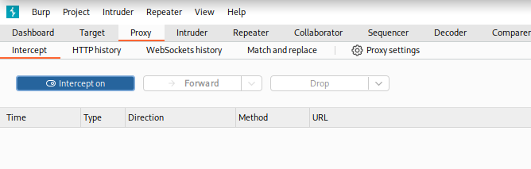
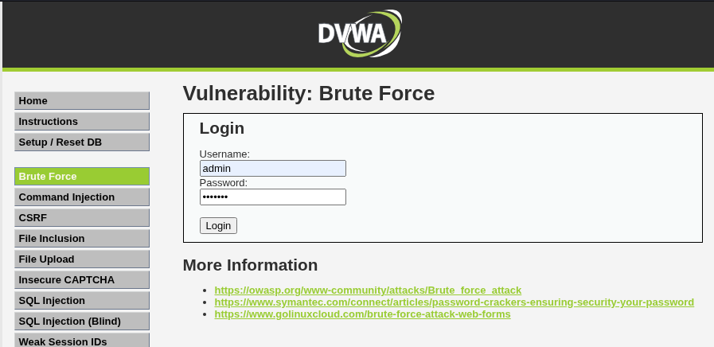
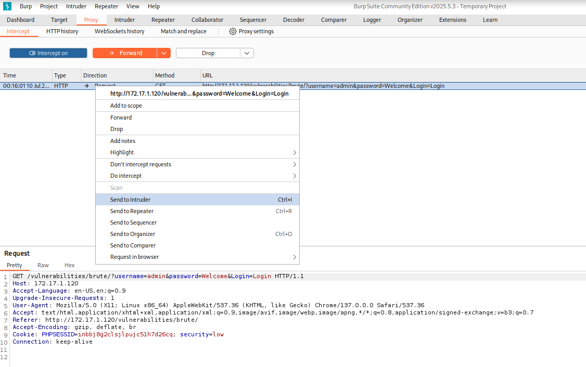
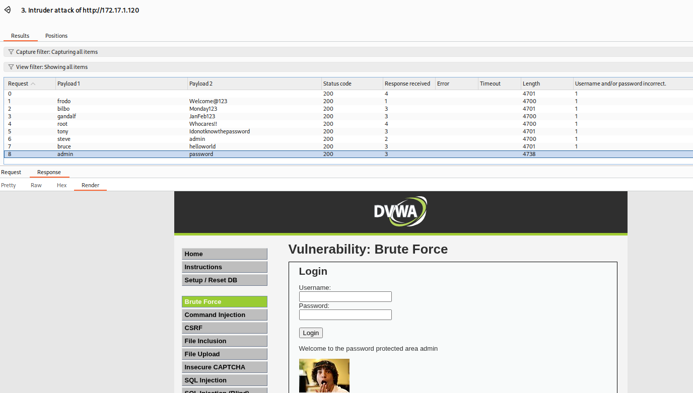
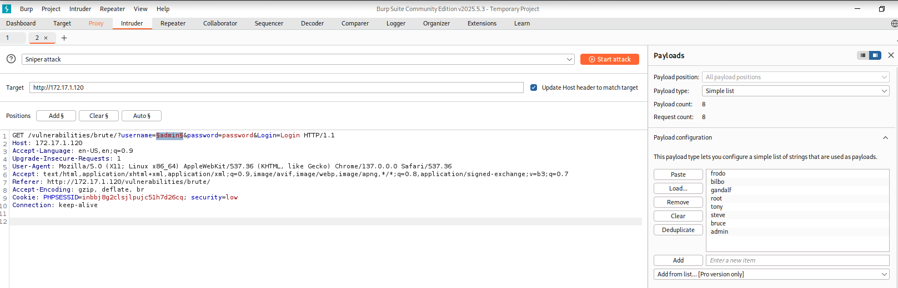

Understanding how attackers automate password guessing is crucial for building secure applications. Two of the most common techniques are **Credential Stuffing** and **Password Spraying**. While they sound similar, their execution and purpose are distinct.

This guide will walk you through performing both attacks using Burp Suite against the Damn Vulnerable Web Application (DVWA).

 - **Credential Stuffing**: An attacker takes lists of usernames and passwords from a known data breach (e.g., the LinkedIn breach) and "stuffs" them into the login forms of other websites. The logic is that people often reuse passwords across different services. This is a many-users, many-passwords attack, testing specific known pairs.

 - **Password Spraying**: An attacker takes a large list of valid usernames and tries a single, common password (like `password123 `or `Summer2025`) against every single account. This is a "low-and-slow" method designed to fly under the radar of account lockout policies. This is a many-users, one-password attack.

:::warning **Disclaimer** : This guide is for educational purposes only. Unauthorized attempts to access accounts are illegal. All activities should be performed on systems you own or have explicit permission to test.
:::

## Prerequisites

 - **DVWA Instance**: A running Damn Vulnerable Web Application.
 - **Burp Suite**: The Community or Professional edition will work.
 - **Configured Proxy**: Your browser must be configured to send its traffic through Burp Suite.

## Initial Setup: DVWA and Burp Suite

Before we begin, log into your DVWA instance and set the DVWA Security level to Low from the menu on the left. This simplifies the demonstration by removing complexities like CSRF tokens.

## Part 1: Credential Stuffing with Burp Intruder

In this scenario, we're simulating an attack where we have a list of known username-password pairs from a data breach.

### Step 1: Intercept the Login Request

1. In Burp Suite, go to the **Target** tab and click on **Open Browser**. This will open the chromium browser which comes default with Burp Suite.
2. In the chromium browser, navigate to the **Brute Force** page - `http://172.17.1.120/vulnerabilities/brute/`.
3. In Burp Suite, go to the Proxy tab and ensure Intercept is on.
    
4. Enter any dummy credentials (e.g., admin:Welcome) and click **Login**.
    
4. Burp will capture the request. It should look like this:
    ```http
    GET /vulnerabilities/brute/?username=admin&password=Welcome&Login=Login HTTP/1.1
    Host: 172.17.1.120
    Accept-Language: en-US,en;q=0.9
    Upgrade-Insecure-Requests: 1
    User-Agent: Mozilla/5.0 (X11; Linux x86_64) AppleWebKit/537.36 (KHTML, like Gecko) Chrome/137.0.0.0 Safari/537.36
    Accept: text/html,application/xhtml+xml,application/xml;q=0.9,image/avif,image/webp,image/apng,*/*;q=0.8,application/signed-exchange;v=b3;q=0.7
    Referer: http://172.17.1.120/vulnerabilities/brute/
    Accept-Encoding: gzip, deflate, br
    Cookie: PHPSESSID=inbbj8g2clsjlpujc51h7d26cq; security=low
    Connection: keep-alive
    ```
5. Right-click on the request and select **Send to Intruder** (or use the shortcut `Ctrl+I`).
    

### Step 2: Configure Intruder Positions

1. Go to the **Intruder** tab. You'll see the request loaded in the Positions sub-tab.
2. Burp automatically marks potential payload positions with the § symbol. For our attack, we need a specific setup.
3. First, select the **Pitchfork attack** type from the dropdown menu. This type is perfect for credential stuffing because it allows us to use two separate lists (usernames and passwords) and test every combination.
4. Click the **Clear §** button on the right to remove the default positions.
5. Now, highlight the value of the `username` parameter (`admin` in our example) and click **Add §**.
6. Do the same for the value of the `password` parameter (`Welcome`). Your request should now look like this, with two distinct payload markers:

```
POST /login.php HTTP/1.1
Host: localhost
...

username=admin&password=Welcome&Login=Login&user_token=7bcc4ee2bcf87501da212d4e590ff461
```

### Step 3: Configure Payloads

1. Go to the **Payloads** sub-tab.
2. Since we are using the **Pitchfork attack**, you will see options for **Payload Set 1** and **Payload Set 2**.
3. For **Payload Set 1**, this will be our list of usernames. Under **Payload Options**, click **Load** and select your file of usernames.
4. For **Payload Set 2**, this will be our password list. Click **Load** and select your password file.

:::note **Important:** For a true credential stuffing attack, line 1 of your username file should correspond to line 1 of your password file, and so on.
:::

### Step 4: Launch and Analyze

1. Click the **Start attack **button in the top right.
2. A new window will open showing the Intruder attack in progress.
3. The key to finding a successful login is to look for a response that is different from the others. Click on the **Length** column header to sort the results. A successful login will almost always have a different content length than a failed one. It may also have a different Status code (e.g., 302 instead of 200).
    
4. In the example above, one request has a different length. Clicking on it and viewing the Response tab confirms a successful login by showing the welcome page. We've found a valid credential pair!


## Part 2: Password Spraying with Burp Intruder

Now, let's simulate a password spraying attack. We have a long list of potential usernames but only one common password to try against all of them.

### Step 1: Intercept the Request

This is the same as Step 1 in the previous section. Send the captured POST `http://172.17.1.120/vulnerabilities/brute/` request to Intruder.

### Step 2: Configure Intruder Positions

1. Go to the **Intruder** > **Positions** tab.
3. From the attack type dropdown, select **Sniper attack**.
3. Click **Clear §** to remove default markers.
4. Highlight the `username` value and click **Add §**.
5. Highlight the `password` value and replace it with the password that you spray. In mu case, I am replacing `Welcome` with `password`.


### Step 3: Configure Payloads

1. Go to the Payloads tab.
2. Under Payload type, select **Simple list**.
3. In the Payload Options box below, click Add and type in the usernames.



### Step 4: Launch and Analyze

1. Click Start attack.
2. Just like before, watch the results window and sort by the Length column. Any deviation from the standard "failed login" response length indicates a potential success.

## Summary of Key Differences

| Feature          | Credential Stuffing                       | Password Spraying                                    |
|------------------|-------------------------------------------|------------------------------------------------------|
| Goal             | Test known username:password pairs.       | Test one weak password against many users.           |
| Burp Attack Type | Pitchfork attack                          | Sniper attack                                        |
| Payloads         | Two separate lists (users and passwords). | One user list and one single password.               |
| Stealth          | Noisy. Can cause account lockouts.        | Stealthier. Avoids multiple failures on one account. |

## Mitigation Strategies

Defending against these attacks requires a multi-layered approach:

 - **Multi-Factor Authentication (MFA)**: The single most effective defense. Even if an attacker has a valid password, they can't log in without the second factor.
 - **Account Lockout Policies**: Lock accounts after a small number of consecutive failed attempts to thwart brute-force attacks.
 - **Rate Limiting**: Slow down attackers by limiting the number of login attempts from a single IP address in a given time frame.
 - **Breached Password Detection**: Check user passwords against lists of known breached credentials (like the Pwned Passwords API) and force users to change them.