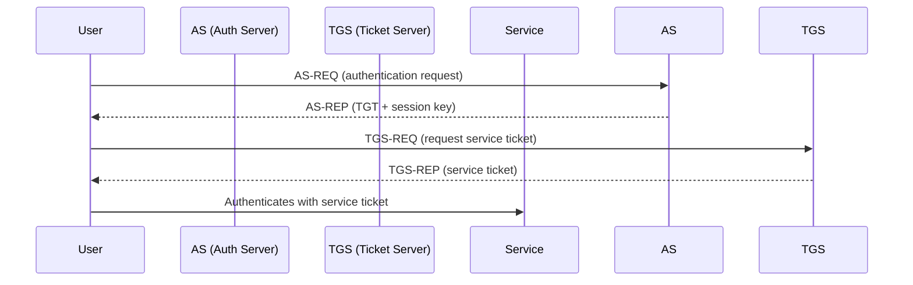

# 🛡️ Introduction to Kerberos

Kerberos is a **ticket-based network authentication protocol** developed by MIT for Project Athena. It uses strong cryptography to prove the identities of users and services in a networked environment. **Windows Active Directory** environments use Kerberos extensively for authenticating users and services.

> 📜 **Fun Fact**: The name comes from Greek mythology — Cerberus (Kerberos) was a three-headed dog guarding the underworld!

## 🎯 Goals of Kerberos
- Mutual authentication (client ↔ server)
- Minimize password transmission over the network
- Reduce password exposure
- Ticket-based session authorization

---

**Key Components**:
- **Client/User**: Requests authentication.
- **KDC (Key Distribution Center)**: Core of Kerberos (AS + TGS).
- **Service Server**: The resource/server the user wants to access.
- **Tickets**: Tokens proving identity without sending passwords.

---

# 🔥 Common Kerberos Attack Techniques

## 1. 🎭 Kerberoasting

**Kerberoasting** targets service accounts with Service Principal Names (SPNs) registered in AD. Attackers request service tickets (TGS) and attempt to crack them offline to retrieve plaintext passwords.

### Steps:
1. Enumerate SPNs.
2. Request TGS tickets for those SPNs.
3. Export tickets.
4. Crack offline (e.g., Hashcat, John the Ripper).

```bash
GetUserSPNs.py domain/user:password@dc-ip
hashcat -m 13100 hashes.txt wordlist.txt
```

✅ **Why Effective**: Weak service account passwords are often overlooked!

---

## 2. 🔥 Pass-the-Ticket (PTT)

After stealing a valid Kerberos ticket (TGT or TGS), an attacker injects it into their session to impersonate the user.

```bash
# Example using mimikatz
kerberos::ptt ticket.kirbi
```

✅ **Pro Tip**: TGTs are golden for lateral movement.

---

## 3. 👑 Golden Ticket Attack

If attackers compromise the **KRBTGT account password**, they can forge TGTs for any user, effectively giving them **domain admin** privileges.

```bash
mimikatz # kerberos::golden /user:Administrator /domain:domain.local /sid:S-1-5-21-XXXXX /krbtgt:HASH
```

✅ **Ultimate persistence**: even resetting user passwords won't help unless you reset KRBTGT twice!

---

## 4. 🏵️ Silver Ticket Attack

Instead of forging TGTs, attackers forge **service tickets (TGS)** directly for a specific service.

✅ **Quieter** than golden tickets because it doesn’t interact with the Domain Controller after initial ticket creation.

---

## 5. 🕵️ AS-REP Roasting

Users with **"Do not require Kerberos preauthentication"** option enabled are vulnerable. Attackers request authentication data and brute-force the resulting encrypted blob offline.

```bash
GetNPUsers.py domain/ -usersfile users.txt -no-pass
```

✅ **Key Target**: Misconfigured user accounts.

---

# 🧯 Defenses Against Kerberos Attacks

| Attack               | Defense Measures |
|----------------------|------------------|
| Kerberoasting        | Complex passwords, managed service accounts |
| Pass-the-Ticket      | Ticket lifespan restrictions, session monitoring |
| Golden Ticket        | Frequent KRBTGT resets, tiered admin model |
| Silver Ticket        | Service account hardening, monitoring |
| AS-REP Roasting      | Enforce Kerberos preauthentication |

---

# 🏰 Real-World Example

**Target**: Enterprise with misconfigured SPNs.

- The attacker uses **Kerberoasting** to retrieve hashes of service accounts.
- Cracks the service account password.
- Escalates privileges to **Domain Admin** using lateral movement.
- Plants a **Golden Ticket** for long-term persistence.

Result: **Full domain compromise.**

---

# 🎨 Kerberos Authentication Flow (Simplified)



---

# ✨ Key Kerberos Concepts

| Term | Description |
|-----|-------------|
| **TGT (Ticket Granting Ticket)** | Issued by AS; used to request service tickets. |
| **SPN (Service Principal Name)** | Unique name identifying a service instance. |
| **KDC (Key Distribution Center)** | Composed of AS and TGS. |
| **PAC (Privilege Attribute Certificate)** | Contains user's group membership. |

---

# 📌 Conclusion

Kerberos is foundational to Active Directory security. Understanding it — along with its attack surface and defenses — is essential for any penetration tester, blue teamer, or system administrator.

✅ **Master Kerberos, and you're halfway to mastering AD security!**

---

# 📚 References
- [RFC 4120: Kerberos Authentication](https://datatracker.ietf.org/doc/html/rfc4120)
- [Harmj0y's Kerberos Attack Series](https://posts.specterops.io/kerberos-attacks-2019-edition-89e7ccc6871a)
- [Mimikatz Tool](https://github.com/gentilkiwi/mimikatz)