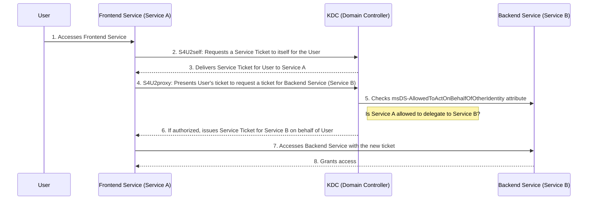
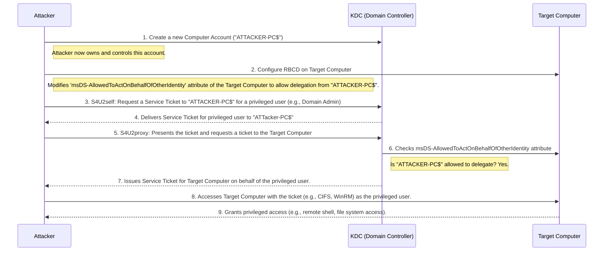

At its core, **Resource-Based Constrained Delegation (RBCD)** is a security feature in Windows Active Directory that allows a resource (like a file server or a web service) to control which other services can act on behalf of a user to access it. This is a more secure and flexible model than traditional constrained delegation.

## The Key Players

Before diving into the process, let's identify the main components involved:

1. **User**: The individual trying to access a resource.

2. **Frontend Service (Service A)**: The initial service the user interacts with (e.g., a web server). This service needs to access another service on the user's behalf.

3. **Backend Service (Service B)**: The resource the Frontend Service needs to access (e.g., a database server). This service has RBCD configured.

4. **Key Distribution Center (KDC)**: A domain controller service that issues Kerberos tickets.

## How Resource-Based Constrained Delegation Works

The process unfolds in a series of steps involving Kerberos ticket exchanges. The diagram below illustrates this flow, followed by a detailed explanation of each step.

**Step-by-Step Explanation**

1. **User Accesses Frontend Service**: The process begins with the user authenticating and accessing the Frontend Service (Service A).

2. **S4U2self (Service-for-User-to-Self)**: The Frontend Service needs to impersonate the user to access the Backend Service. It initiates this by requesting a Kerberos service ticket to itself on behalf of the user. This is a "Service-for-User-to-Self" (S4U2self) request to the Key Distribution Center (KDC).

3. **KDC Issues Ticket to Frontend Service**: The KDC processes the S4U2self request and issues a service ticket to the Frontend Service for the user. This ticket essentially says, "Service A is acting on behalf of this User."

4. **S4U2proxy (Service-for-User-to-Proxy)**: Now that the Frontend Service has a ticket representing the user, it sends a "Service-for-User-to-Proxy" (S4U2proxy) request to the KDC. It presents the ticket it just received and requests a new service ticket to access the Backend Service (Service B) on behalf of the user.

5. **KDC Verifies Delegation Rights**: This is the crucial step for RBCD. The KDC examines the msDS-AllowedToActOnBehalfOfOtherIdentity attribute on the Active Directory object of the Backend Service (Service B). This attribute lists the services that are permitted to delegate to it. The KDC checks if the Frontend Service (Service A) is on this list.

6. **Issuance of Service Ticket for Backend Service**: If the Frontend Service is authorized, the KDC issues a new service ticket. This ticket grants the Frontend Service access to the Backend Service as the user.

7. **Accessing the Backend Service**: The Frontend Service then presents this newly acquired service ticket to the Backend Service.

8. **Access Granted**: The Backend Service validates the ticket with the KDC and, upon successful validation, grants the Frontend Service access to the requested resources as if the user were directly accessing them.

## The Attack Unfolded: A Step-by-Step Guide

The diagram below illustrates the attack flow, followed by a detailed explanation of each step. The goal is to impersonate a privileged user (like a Domain Admin) to access a high-value Target Computer.

### The Key Players in the Attack:

 - **Attacker**: A low-privileged, authenticated user in the domain.

 - **Attacker's Computer**: A machine controlled by the attacker.

 - **Target Computer**: A high-value server the attacker wants to compromise (e.g., a file server, or even a Domain Controller).

 - **KDC (Domain Controller)**: The authority that issues Kerberos tickets.

### Detailed Explanation of the Attack Steps

1. **Create a New Computer Account**: The attacker, using their standard user credentials, creates a new computer account in the domain (let's call it ATTACKER-PC$). They have full control over this object because they created it. This is typically done with tools like impacket-addcomputer or the Active Directory PowerShell module. The attacker also sets a known password for this new computer account.

2. **Configure Resource-Based Constrained Delegation**: This is the core of the attack. The attacker now configures the Target Computer to trust their newly created computer account for delegation. To do this, they modify the msDS-AllowedToActOnBehalfOfOtherIdentity attribute on the Target Computer's Active Directory object. They populate this attribute with the security descriptor of their ATTACKER-PC$ account. An attacker needs some level of write permissions on the target computer object to do this, which can sometimes be obtained through other vulnerabilities or misconfigurations. However, if the attacker already compromised a user who has write access to the target computer's attributes, this step becomes trivial.

3. **S4U2self (Service-for-User-to-Self)**: The attacker, now controlling ATTACKER-PC$, initiates the Kerberos delegation process. They perform an S4U2self request to the KDC, asking for a service ticket to ATTACKER-PC$ on behalf of a user they want to impersonate. The attacker doesn't need this user's password; they simply specify the username (e.g., a known Domain Admin). Tools like Rubeus or impacket-getST are commonly used for this step.

4. **KDC Delivers Ticket**: The KDC processes the request and sends back a service ticket for the specified privileged user to ATTACKER-PC$.

5. **S4U2proxy (Service-for-User-to-Proxy)**: The attacker immediately uses the ticket from the previous step to make another request to the KDC. This time, it's an S4U2proxy request asking for a service ticket to the Target Computer, still on behalf of the privileged user.

6. **KDC Verifies Delegation Rights**: The KDC checks the configuration of the Target Computer. It reads the msDS-AllowedToActOnBehalfOfOtherIdentity attribute and sees that ATTACKER-PC$ is explicitly trusted to perform delegation. Because the attacker configured this in step 2, the check succeeds.

7. **KDC Issues Ticket for the Target**: With the check passed, the KDC issues the attacker a service ticket that grants ATTACKER-PC$ access to the Target Computer as the impersonated privileged user.

8. **Gain Unauthorized Access**: The attacker now possesses a valid Kerberos service ticket. They can use this ticket to authenticate to the Target Computer over services like CIFS (for file access) or WinRM (for remote command execution) as the user they impersonated.

9. **Privileged Access Granted**: The Target Computer validates the ticket and grants the attacker a session with the full rights and privileges of the impersonated user, leading to a full compromise of the target machine. If the target was a Domain Controller, the attacker has effectively compromised the entire domain.

