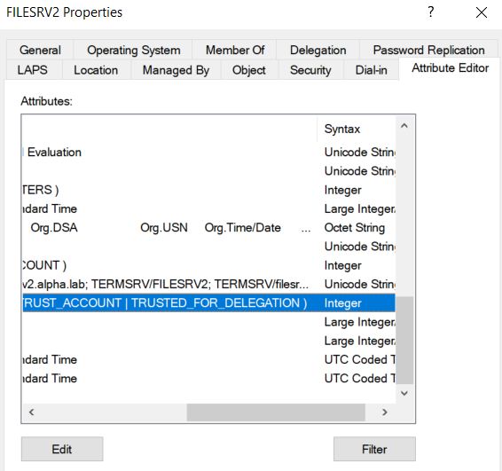
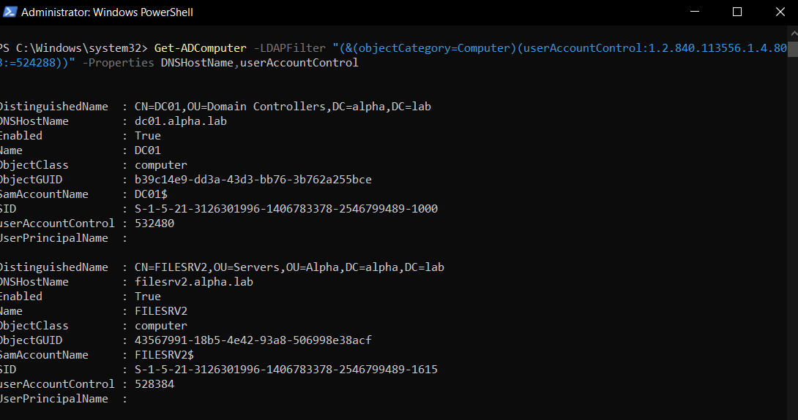

Unconstrained Delegation means, that an account is allowed to impersonate ANY user to ANY service. So from an attackers perspective this seems like a really valuable target to to get control over, as it most likely means game over.  

When a user requests a ```ST``` for the webservice from the example above, the KDC will include the user's ```TGT``` inside the ```ST``` for the webservice. The service account is then able to extract and cache the ```TGT``` from the ```ST``` and with that ticket request another ```ST``` as that user for the SQL service, ultimately authentication to that service as the user and not as himself.

The config of an AD object looks like this (all objects that have an ```SPN``` can be configured for delegation):  


When a user (```lowpriv``` in this case) accesses the system ```epo``` configured with Unconstrained Delegation enabled:  


The ```TGT``` of that user automagically gets cached. We can use [Rubeus](https://github.com/GhostPack/Rubeus) with the ```triage``` or ```monitor``` function to play along and watch them tickets flying in:  

```
Rubeus.exe monitor /interval:10 /targetuser:lowpriv
``` 


```
Rubeus.exe triage
``` 


## Unconstrained Delegation - recon and abuse

### Recon

If an account is set up for Unconstrained Delegation, it’s `userAccountControl` attribute contains `TRUSTED_FOR_DELEGATION`:



We can issue `PowerView` to get the job done for us:

```
Get-DomainComputer -Unconstrained -Properties distinguishedname,useraccountcontrol
```


or even the native PowerShell AD cmdlets:

```powershell
Get-ADComputer -LDAPFilter "(&(objectCategory=Computer)(userAccountControl:1.2.840.113556.1.4.803:=524288))" -Properties DNSHostName,userAccountControl
```



### Abuse

The first step is to always compromise an account that is configured for Unconstrained Delegation. This can be a user or a system. For this demo we assume that we compromised the system `filesrv` which is allowed for Unconstrained Delegation, and that we have control over the user service which is local admin on this system.

We now either already have a Kerberos ticket, or we coerce authentication to get one ([SpoolSample](https://github.com/leechristensen/SpoolSample), PetitPotam, ShadowCoerce and alike) or we just wait until an account we want to impersonate accesses our system. In this case the user Administrator accessed the system via SMB:

```cmd
.\Rubeus.exe monitor /targetuser:Administrator /interval:5
```

As you can see, our current user is not able to access the DC.

In the next step we pass the `TGT` to our current session and are so able to impersonate the admin user and gain acccess to the DC:

```cmd
.\Rubeus.exe ptt /ticket:doIFczCCBW+g...
```