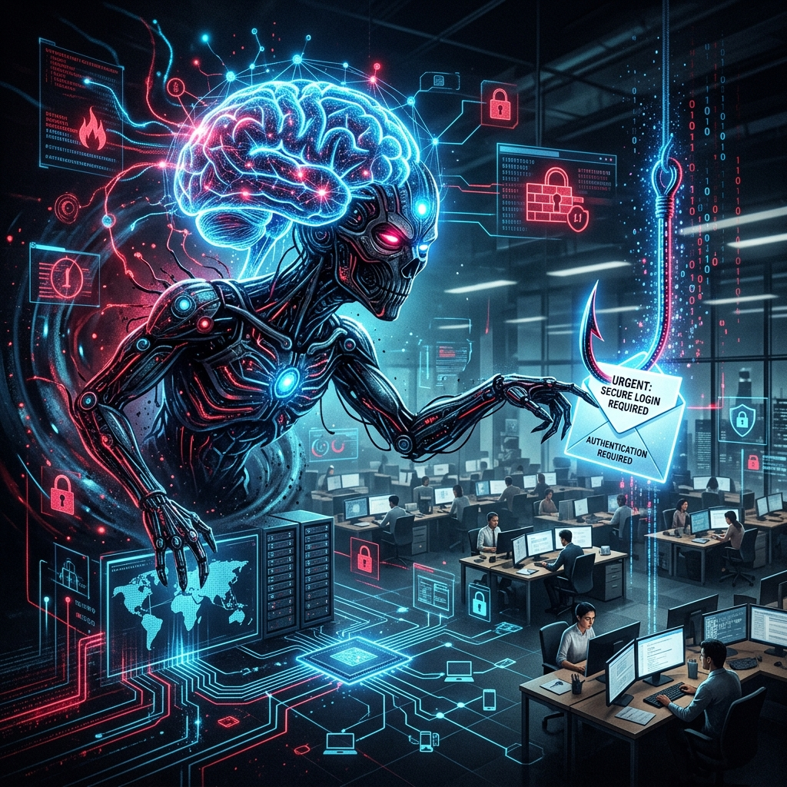
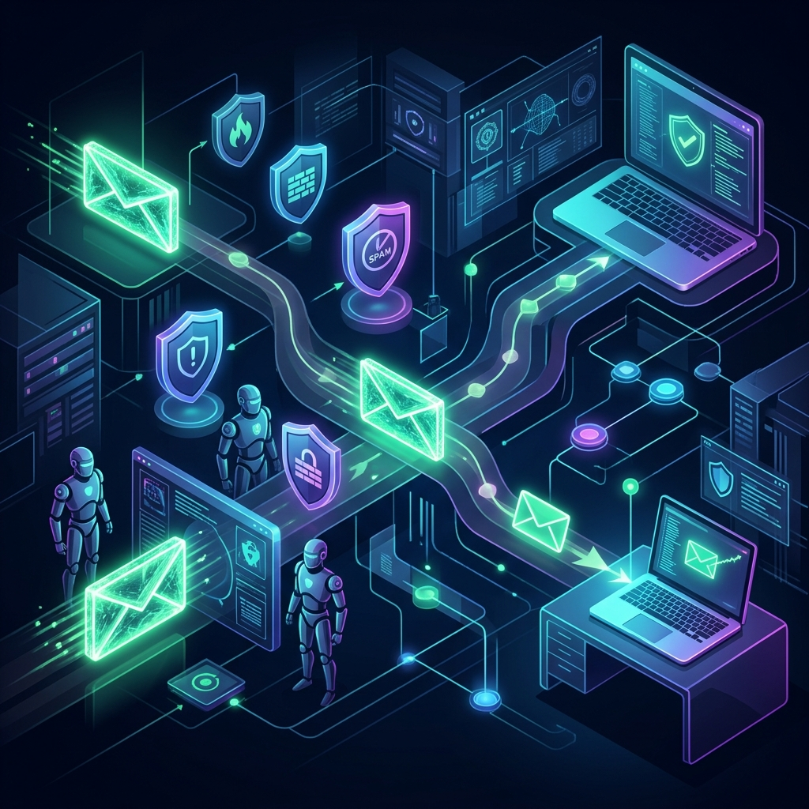

# The Phishing Epidemic of 2026: How Generative AI Reshaped Social Engineering

If you haven't updated your mental model of a phishing attack since 2023, you are already compromised. 

Gone are the days of poorly translated emails asking for iTunes gift cards or Nigerian prince scams riddled with grammatical errors. As of mid-2026, the cyber threat landscape has been fundamentally reshaped by generative AI. We have transitioned from high-volume, low-sophistication spam to hyper-personalized, automated, and highly deceptive social engineering attacks that consistently bypass traditional defenses.

Recent intelligence indicates that a staggering **82.6% of phishing emails** detected in 2026 utilized AI to improve formatting, grammar, and personalization. And the success rate? AI-driven spear-phishing campaigns are now seeing click-through rates as high as **54%**.

This is no longer a human-scale problem. It is an algorithmic arms race. Let's explore exactly how threat actors are weaponizing AI, the new evasion techniques bypassing Secure Email Gateways (SEGs), and how defenders are fighting back.

<!-- more -->

---

## The AI Weaponization Toolkit: What's Changed?

Threat actors have industrialized social engineering. They are no longer writing emails; they are programming LLMs to write them. Here are the core trends defining the 2026 threat landscape:

### 1. Hyper-Personalization at Scale
In the past, spear-phishing required a human attacker to spend hours researching a single target. Today, attackers leverage LLMs to scrape public data (social media, corporate websites, and past data leaks) and auto-generate highly contextual lures.

These AI-crafted emails perfectly mimic the writing style, tone, and context of specific individuals or organizations. They reference recent company news, mirror the recipient's internal jargon, and create a false sense of familiarity that exploits cognitive biases.

### 2. The Rise of "Vishing" and Deepfake Voice Cloning
Voice cloning has evolved from an expensive, lab-only capability to a mass-market tool available for mere dollars. Attackers now routinely use real-time voice synthesis to impersonate CEOs, CFOs, or IT administrators during phone calls or video conferences.

Voice-based social engineering (Vishing) is increasingly used to bypass identity checks and authorize high-stakes actions like wire transfers or password resets. In some corporate environments, voice-based attacks have overtaken email as the primary initial access vector.

### 3. ClickFix and Browser-Based Deception
A major trend in 2026 is the rise of "ClickFix" campaigns. Instead of sending a malicious attachment, attackers trick users into copying and pasting malicious commands into their own terminals (e.g., PowerShell or Command Prompt). 

Operating under the guise of "security verification" or "urgent software updates," these attacks weaponize the user's own actions against them, completely bypassing EDR solutions that trust user-initiated terminal commands.

### 4. Phishing-as-a-Service (PhaaS)
The industrialization of cybercrime continues with AI-integrated PhaaS platforms. These platforms enable even non-technical script kiddies to launch sophisticated campaigns. Tools like "EvilTokens" have demonstrated how attackers can bypass traditional Multi-Factor Authentication (MFA) by automating Adversary-in-the-Middle (AiTM) attacks at scale.

---

## Bypassing the Gateways: Evasion Techniques in 2026

*AI-crafted lures are designed to smoothly navigate past traditional signature-based Secure Email Gateways.*

Business Email Compromise (BEC) remains a top-tier threat, accounting for billions in cumulative losses. Attackers are successfully bypassing SEGs using several key evasion methods:

### Trusted-Account and Vendor Impersonation
Over 61% of BEC attacks now involve the impersonation of external third parties (vendors or partners) rather than internal employees. By compromising a real vendor's mailbox, attackers send emails from legitimate domains that pass SPF, DKIM, and DMARC checks. To a traditional gateway defense, the email is cryptographically verified and perfectly safe.

### Conversational AI Lures
Because AI models generate grammatically perfect and contextually relevant text, they easily defeat keyword-based and heuristic filters. The emails don't contain known bad URLs or malicious attachments; they contain a conversation designed to manipulate the target into taking an action *outside* the email client (e.g., calling a deepfake phone number).

### Evasive Content Delivery
- **Quishing (QR Code Phishing):** Embedding malicious links in QR codes within images or PDFs to bypass standard text-based link scanners.
- **Fileless / Legitimate Hosting:** Hosting payloads on trusted platforms like Google Drive, SharePoint, or Notion to avoid reputation-based blocking.

### Adversary-in-the-Middle (AiTM)
Attackers use proxy servers to sit directly between the user and the legitimate service (e.g., Microsoft 365 or Google Workspace). When the user logs in and completes their MFA challenge, the attacker captures the authenticated session cookie, bypassing the MFA requirement entirely.

---

## The Defender's Playbook: Identity-Centric Security

*The shift toward Zero-Trust architecture and identity-centric defense is critical in the AI era.*

Because traditional, signature-based filters are failing, the cybersecurity industry is shifting toward **behavioral intelligence** and **identity-centric defense**.

Here is how modern enterprises are responding to the AI phishing threat:

### 1. From Content to Context
Security solutions are moving toward analyzing the "behavioral baseline" of senders and organizations. Instead of just scanning the content of an email, AI-native triage agents ask:
- Does the timing of this email align with historical norms for this sender?
- Is the tone unusual for this executive?
- Is the request type (e.g., changing billing details) common for this vendor?

### 2. Zero-Trust Identity Proofing
Organizations are prioritizing strict identity verification for high-stakes workflows (such as wire transfers, credential resets, and billing account updates). 

Because voice biometrics and standard caller ID can be spoofed by deepfakes, organizations are implementing "out-of-band" verification processes. This includes mandatory secondary approval loops or using pre-agreed safe words that deepfake operators wouldn't know.

### 3. FIDO2 and Phishing-Resistant MFA
To combat AiTM attacks, enterprises are abandoning SMS-based 2FA and time-based authenticator apps in favor of FIDO2-compliant hardware security keys (like YubiKeys) or passkeys. These methods bind the authentication challenge to the specific domain, making them cryptographically resistant to proxy-based phishing.

### 4. Human-Centric Defense (Beyond "Spot the Typos")
Traditional awareness training—teaching employees to look for spelling errors or hover over links—is obsolete against LLM-generated lures. Training is evolving to emphasize a **verification culture**. Employees are empowered (and required) to verify financial or sensitive requests out-of-band, without fear of reprimand from executives.

---

## The Bottom Line

The integration of Generative AI into social engineering has fundamentally changed the rules of engagement. Phishing is no longer a numbers game; it is a highly targeted, automated, and psychologically manipulative operation. 

Defenders can no longer rely on spotting the "obvious" signs of a scam. The future of phishing defense lies in verifying identity, establishing behavioral baselines, and adopting a Zero-Trust mindset for every critical transaction.

***

## References & Citations

- **[1] Check Point Research**. [*The Role of AI in Modern Social Engineering*](https://www.checkpoint.com). 2026.
- **[2] Cloud Range**. [*ClickFix Campaigns and Browser Deception*](https://www.cloudrangecyber.com).
- **[3] Huntress**. [*Phishing-as-a-Service and AiTM Tokens*](https://www.huntress.com).
- **[4] JPMorgan Chase**. [*Defending Against Voice Cloning and Deepfake Fraud*](https://www.jpmorgan.com).
- **[5] Red Canary**. [*Behavioral Baselines and AI-Native Triage*](https://redcanary.com).
