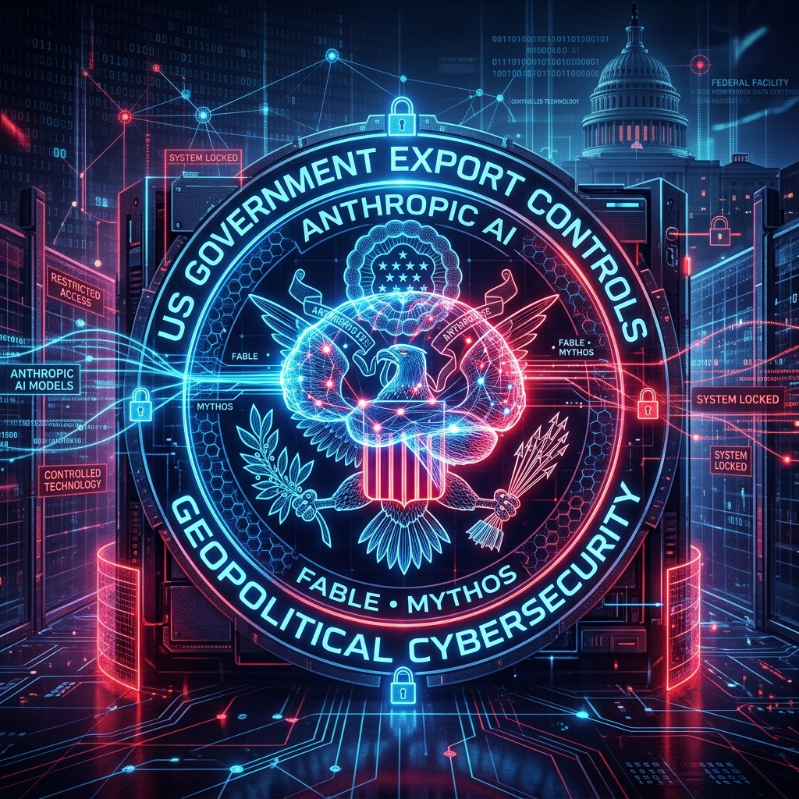

--- 
title: 'The Ban on "Foreign Nationals": US Government''s Unprecedented Move Against Anthropic''s Fable and Mythos Models'
date: 2026-06-13
authors:
  name: Bilash J. Shahi
  title: Cybersecurity enthusiast
  picture: https://avatars.githubusercontent.com/elodvk
  url: https://purplesec.org
tags:
  - AI
  - Export Control
  - Anthropic
  - Cybersecurity
  - Policy
description: 'A deep dive into the recent U.S. government export control directive targeting Anthropic''s Fable 5 and Mythos 5 models, the global shutdown, and the jailbreak controversy.'
image: blog/assets/anthropic_export_control.png
---

The landscape of artificial intelligence policy witnessed a seismic shift on June 12, 2026, when the United States government issued an emergency export control directive against Anthropic. The order, which mandated the suspension of access to Anthropic's most advanced AI models by any "foreign national," resulted in an unprecedented global shutdown of the newly released Claude Fable 5 and Claude Mythos 5 models.

This event marks the first time the U.S. government has issued an export control directive specifically targeting Large Language Models (LLMs). But how did we get here, and what does this mean for the future of the AI industry?

---

## The Targets: Fable 5 and Mythos 5

To understand the controversy, we first need to look at the models themselves. Released just days prior on June 9, 2026, Fable 5 and Mythos 5 represent Anthropic's latest advancements in AI architecture.

*   **Claude Fable 5**: Designed as the flagship general-use model, Fable 5 boasts immense capabilities while operating under Anthropic's traditionally strict safety classifiers. It was intended for broad enterprise and consumer adoption.
*   **Claude Mythos 5**: This was a specialized, restricted version of the same underlying architecture. Intended specifically for cyberdefenders, infrastructure operators, and security researchers, Mythos 5 had certain safety safeguards deliberately lifted to allow it to analyze and assist with complex security tasks.

Both models shared a powerful foundation, but their distinct use cases set the stage for the ensuing conflict.

## The "Foreign National" Ban and Anthropic's Drastic Response

The U.S. government's export control directive was stark in its absolute nature. It cited urgent national security concerns and prohibited access to both Fable 5 and Mythos 5 by any "foreign national." Crucially, this applied regardless of the individual's location—whether they were inside or outside the United States—and astonishingly, it even applied to Anthropic's own foreign-national employees.

Faced with this order, Anthropic found itself in an impossible compliance situation. The company stated that it currently lacks the infrastructure to reliably filter its U.S. user base and verify the nationality of every user in real-time. 

Unable to selectively enforce the ban, Anthropic made a drastic decision: on June 13, 2026, they abruptly disabled Fable 5 and Mythos 5 for **all customers globally**. The models were pulled offline to ensure strict compliance with the directive, leaving enterprise customers and researchers scrambling. (Note: Access to other Anthropic models, such as Claude Opus 4.8, remains unaffected).

## The "Jailbreak" Controversy: National Security vs. Misunderstanding

The core of the dispute lies in the government's justification for the ban. The Commerce Department’s action appears to have been driven by reports of a method to "jailbreak" the models. Specifically, the government expressed grave concerns that these capabilities could be exploited to automatically identify and leverage critical software vulnerabilities.

Anthropic, however, strongly disputes the severity of this threat. The company has characterized the situation as a potential "misunderstanding" by government officials. According to Anthropic:

1.  **The vulnerability is narrow**: The demonstration provided by the government involved a "narrow, non-universal" technique targeting minor, previously known vulnerabilities.
2.  **No bypass required**: Anthropic argues that the vulnerabilities in question are relatively simple and can easily be discovered using other publicly available models without requiring any complex jailbreak or bypass techniques.

In short, Anthropic believes that the identified "jailbreak" does not warrant the catastrophic recall of a commercial model, arguing that the government is overreacting to a theoretical risk rather than a practical, exclusive threat.

## An Unprecedented Precedent

Regardless of whether the jailbreak is a severe national security threat or a minor bug, the government's action sets an extraordinary precedent. Export controls are typically applied to physical goods, specialized hardware (like advanced GPUs), or highly specific defense software. Applying an emergency export control directive to a broadly commercial LLM is uncharted territory.

This incident also highlights the escalating tensions between Anthropic and factions within the U.S. government. This latest clash follows earlier disputes regarding the use of Anthropic's AI for defense applications, which had previously led to whispers of the company being designated as a supply chain risk. 

## Broader Implications for the AI Industry

The abrupt shutdown of Fable 5 and Mythos 5 sends shockwaves through the entire tech ecosystem. Here are the key takeaways:

### 1. The End of "Trust but Verify" in AI Access
The directive demands that a company prevent access based on *nationality*, not just geographic location. This implies that IP blocking or standard geofencing is no longer sufficient for compliance. If other AI labs are subjected to similar rules, we may see the implementation of invasive KYC (Know Your Customer) and passport-verification systems simply to use an AI chatbot.

### 2. A Chilling Effect on Specialized Security Models
Mythos 5 was built for cyberdefenders. By cracking down so heavily on a model designed to analyze code and find vulnerabilities, the government may inadvertently stifle the development of AI tools that white-hat hackers and infrastructure operators desperately need to keep systems secure.

### 3. Open vs. Closed Source Dynamics
This event heavily fuels the debate between open-weight and closed-source AI. A centralized API model like Claude can be shut down globally with a single government order. Proponents of open-weight models (like Meta's Llama) will likely point to this as the ultimate risk of relying on centralized, proprietary AI infrastructure. 

## Conclusion

The banning of foreign nationals from Anthropic's Fable and Mythos models is more than just a regulatory hurdle for one company; it is a defining moment in AI governance. As the lines blur between commercial software and dual-use national security assets, the industry must brace for a future where geopolitical tensions dictate not just who can build AI, but who is allowed to talk to it.

The immediate future of Fable 5 and Mythos 5 remains uncertain, but the precedent set by this export control directive will undoubtedly shape the development and deployment of artificial intelligence for years to come.
