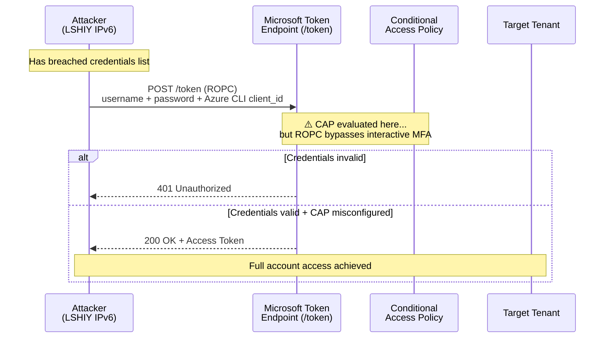

On June 30, 2026, cybersecurity firm **Huntress** published findings on one of the largest automated credential attacks ever observed against Microsoft 365 environments. Between **June 12 and June 26**, a threat actor generated over **81 million login attempts** against Huntress customer accounts, successfully compromising **78 Microsoft accounts across 64 organizations**.

The attack didn't use a novel zero-day. It didn't exploit a memory corruption bug. It abused a **deprecated OAuth flow** that Microsoft has warned against for years but never fully disabled — and it walked straight through MFA because most organizations had misconfigured their Conditional Access Policies.

This is a detailed breakdown of how the campaign worked, why so many organizations were vulnerable despite having MFA enabled, and exactly what you need to do to prevent it.

---

## The Attack at a Glance

| Metric | Detail |
|---|---|
| **Campaign Duration** | June 12–26, 2026 (14 days, ongoing) |
| **Total Login Attempts** | 81+ million |
| **Accounts Compromised** | 78 across 64 organizations |
| **Attack Vector** | Azure CLI via ROPC (Resource Owner Password Credentials) |
| **Credential Source** | Previously breached username/password combinations |
| **Origin Infrastructure** | IPv6 range `2a0a:d683::/32`, LSHIY LLC (AS32167) |
| **MFA Bypassed?** | Yes — in 15 of 23 organizations hit on peak day |
| **Discovered By** | Huntress Security Research |

---

## How Password Spraying Works

Password spraying is a brute-force variant designed to evade account lockout policies. Instead of trying thousands of passwords against one account (which triggers lockouts), the attacker tries **one or two passwords against thousands of accounts** simultaneously, then rotates to the next password.

In this campaign, however, the threat actor wasn't even guessing. They were replaying **credentials that had already been exposed in previous data breaches** — username/password pairs that victims had never rotated. This converts the attack from a probabilistic spray into a **deterministic credential validation operation**.

The math is straightforward: with 81 million attempts over 14 days, that's approximately **5.8 million attempts per day**, or about **67 per second** sustained. The low success rate (78 out of 81 million = 0.000096%) is typical for credential stuffing — but when you're operating at this scale, even that tiny percentage yields dozens of compromised accounts.

---

## The Critical Flaw: ROPC (Resource Owner Password Credentials)

The heart of this attack is the **ROPC OAuth 2.0 grant type**. Understanding it is essential to understanding why MFA failed for so many organizations.

### What is ROPC?

ROPC is a legacy OAuth flow where an application sends a username and password **directly to the `/token` endpoint** and receives an access token in return. There is no browser redirect. No interactive login screen. No opportunity for the identity provider to prompt for a second factor.

```
POST https://login.microsoftonline.com/{tenant}/oauth2/v2.0/token

Content-Type: application/x-www-form-urlencoded

client_id=04b07795-4dff-4272-b355-80d759a32172   ← Azure CLI's app ID
grant_type=password
username=user@company.com
password=P@ssw0rd123
scope=https://management.azure.com/.default
```

That `client_id` (`04b07795-4dff-4272-b355-80d759a32172`) is the **Microsoft Azure CLI** first-party application. Because it's a Microsoft-owned, pre-consented application, it's trusted by every Entra ID tenant by default.

### Why ROPC Bypasses MFA

The key issue: **ROPC sends credentials directly to the token endpoint, bypassing the authorization endpoint entirely**. Conditional Access Policies that enforce MFA are typically evaluated at the authorization endpoint — the interactive login screen. Since ROPC never hits that endpoint, MFA is never triggered.

Microsoft's own documentation explicitly warns against ROPC:

> *"Microsoft recommends you do not use the ROPC flow; it's incompatible with multifactor authentication (MFA)."*
> — [Microsoft Entra documentation](https://learn.microsoft.com/en-us/entra/identity-platform/v2-oauth-ropc)

ROPC was deprecated in OAuth 2.1, but it remains functional in Microsoft Entra ID for backward compatibility. The Azure CLI still supports it.

### The Attack Flow



---

## Why MFA Didn't Help: The Conditional Access Gaps

On **June 22** — the peak day with 30 compromises across 23 organizations — Huntress analyzed the Conditional Access configurations of the impacted tenants. The results were sobering.

Of the 23 businesses compromised that day:

- **15 had MFA enforced** via Conditional Access Policies
- **8 had no MFA policy at all**

Among the 15 with MFA, here's why it failed:

### Gap 1: MFA Scoped to Specific Apps (Not "All Cloud Apps")

Some organizations enforced MFA only for specific applications — typically "Microsoft Admin Portals" or "Office 365". The Azure CLI (`04b07795-4dff-4272-b355-80d759a32172`) was not included in their app scope, so authentications via the CLI slipped through.

### Gap 2: MFA Enforced Only for Admin Groups

Multiple organizations configured MFA only for privileged groups (e.g., "Global Admins", "Security Admins"). Standard users — the ones actually compromised — were not in scope.

### Gap 3: MFA Required Only from "Untrusted" Locations

Several businesses set up location-based policies that only triggered MFA from IP ranges outside their trusted network. Because the attacker's IPv6 addresses geolocated inconsistently (some to the U.S., some to China depending on the geolocation provider used), some were incorrectly classified as "trusted."

### Gap 4: Policies in "Report Only" Mode

Two organizations had MFA policies configured but left in **report-only mode** — meaning the policies generated audit logs but never actually enforced anything. These organizations believed they had MFA but effectively had none.

---

## The Infrastructure: LSHIY LLC

The attacks originated from the IPv6 range **`2a0a:d683::/32`**, belonging to **LSHIY LLC** operating under **AS32167** (registered June 14, 2021).

LSHIY describes itself as an internet infrastructure provider offering IP transit, colocation, dedicated servers, and DNS services. It operates a second ASN, **AS955**, registered in June 2022.

The company has registered business addresses at:

- Two factory buildings in **Hong Kong** and **Wuhan, China**
- **TKO Suites, 42 Broadway, 12th Floor, New York, NY 10004** — a shared office rental space

The New York address is notable: TKO Suites is a co-working space, meaning the registered U.S. address provides no meaningful insight into who actually controls the infrastructure.

Huntress found that specific IPv6 addresses in the attacking range were recently allocated, including a maintainer record created on **June 11, 2026** — one day before the campaign began. This suggests the infrastructure was provisioned specifically for this operation.

Huntress reported the activity via LSHIY's abuse contact but received no response.

---

## The Scale: 155x Increase in Spray Volume

This campaign isn't an isolated incident. Huntress reports that over the past six months, password spray volume against their customer base has increased by over **155 times**. The current average is approximately **1,964 failed login attempts per month per tenant**, with heavily targeted tenants seeing significantly more.

The surge began in late May 2026 and has continued to escalate. The LSHIY campaign represents the most concentrated burst, but it's part of a broader trend of automated credential attacks against Microsoft 365 environments.

---

## Post-Compromise Activity

While Huntress's report focuses on the initial access phase, compromised accounts in Microsoft 365 environments typically lead to:

- **Business Email Compromise (BEC)**: Attackers read mailboxes, identify ongoing financial conversations, and inject fraudulent wire transfer instructions.
- **Internal phishing**: Using the compromised account to send convincing phishing emails to colleagues and business partners from a trusted address.
- **Data exfiltration**: Downloading SharePoint/OneDrive contents, Teams messages, and email archives.
- **OAuth app consent attacks**: Registering malicious OAuth applications with broad permissions while using the compromised session.
- **Lateral movement**: Using the access token to enumerate Azure resources accessible to the compromised identity.

---

## Detection

### Key Indicators

| Indicator | Detail |
|---|---|
| **Source IPv6 range** | `2a0a:d683::/32` |
| **ASN** | AS32167 (LSHIY LLC) |
| **Client Application** | Azure CLI (`04b07795-4dff-4272-b355-80d759a32172`) |
| **Auth Flow** | ROPC (Resource Owner Password Credentials) |
| **Token Endpoint** | `login.microsoftonline.com/{tenant}/oauth2/v2.0/token` |

### Azure Sign-In Log Detection (KQL)

```kql
SigninLogs
| where AppId == "04b07795-4dff-4272-b355-80d759a32172"  // Azure CLI
| where AuthenticationProtocol == "ropc"
| where ResultType == "0"  // Successful login
| where IPAddress startswith "2a0a:d683"
| project TimeGenerated, UserPrincipalName, IPAddress, Location, 
          ConditionalAccessStatus, AuthenticationRequirement
| sort by TimeGenerated desc
```

### Broader ROPC Monitoring

Even if this specific campaign moves to different infrastructure, you should monitor for **any** ROPC-based logins to detect future variants:

```kql
SigninLogs
| where AuthenticationProtocol == "ropc"
| where ResultType == "0"
| summarize Count=count(), DistinctUsers=dcount(UserPrincipalName) by AppDisplayName, bin(TimeGenerated, 1h)
| where Count > 10
```

---

## Mitigation: How to Lock This Down

### Priority 1: Fix Your Conditional Access Policies

The single most important action is ensuring your CAPs cover this attack vector:

**Create or update a policy with these settings:**

| Setting | Value |
|---|---|
| **Users** | All users (or at minimum, all non-excluded identities) |
| **Target resources** | All cloud apps |
| **Client apps** | All client apps (including "Other clients") |
| **Grant** | Require multifactor authentication |
| **Session** | Sign-in frequency: every time |

The critical setting: under **Conditions → Client apps**, ensure **"Other clients"** is checked. This category covers ROPC flows. If you only have "Browser" and "Mobile apps and desktop clients" selected, ROPC slips through.

### Priority 2: Block ROPC Entirely

If your organization doesn't need Azure CLI via ROPC (most don't), block it:

```
Conditional Access Policy:
  Name: Block ROPC / Legacy Auth
  Users: All users
  Target resources: All cloud apps
  Conditions → Client apps: Other clients (Exchange ActiveSync, Other)
  Grant: Block access
```

Alternatively, use the authentication strength setting `userStrongAuthClientAuthNRequired` which enforces strong authentication at the client level and causes ROPC flows to fail outright.

### Priority 3: Rotate Breached Credentials

The attacker used **previously breached credentials that were never changed**. Audit your environment:

1. Enable **Entra ID Password Protection** to block known-breached passwords.
2. Cross-reference your user list against known breach databases (HaveIBeenPwned API).
3. Force password resets for any accounts whose credentials appear in known breaches.
4. Implement passwordless authentication (FIDO2 keys, Windows Hello, Authenticator passkeys) where possible — these are immune to password spray entirely.

### Priority 4: Restrict Azure CLI Access

If your users don't need Azure CLI access:

```
Conditional Access Policy:
  Name: Restrict Azure CLI
  Users: All users except cloud admins
  Target resources: Azure Resource Manager (or specifically Azure CLI app ID)
  Grant: Block access
```

This ensures only authorized administrators can authenticate via the CLI.

### Priority 5: Monitor and Alert

- Set up alerts for ROPC-based sign-ins (see KQL queries above).
- Monitor for logins from the LSHIY IPv6 range.
- Alert on sudden increases in failed sign-in volume (signal of active spraying).
- Review sign-in logs weekly for any Azure CLI authentications from unexpected users.

---

## The Bigger Picture: Why This Keeps Happening

This campaign exposes a systemic problem in how organizations deploy identity security:

1. **MFA is not a checkbox.** Having MFA "enabled" is meaningless if the policy doesn't cover all authentication flows, all users, and all applications. Most compromised organizations in this campaign *thought* they had MFA.

2. **Legacy protocols are attack surfaces.** ROPC exists for backward compatibility with applications that can't perform interactive auth. But if you're not actively using it, it's an open door.

3. **Breach credential reuse is epidemic.** Despite years of awareness campaigns, users still don't rotate passwords after breaches. The credentials used in this campaign were old — exposed in previous breaches but never changed.

4. **IPv6 is a blind spot.** Many security tools and geolocation databases are less reliable for IPv6 addresses. Attackers operating from IPv6 ranges can evade location-based policies more easily.

5. **Scale solves everything for attackers.** At 81 million attempts, even a 0.0001% success rate yields 78 compromises. At commodity cloud pricing, this volume costs the attacker almost nothing.

---

## Timeline

| Date | Event |
|---|---|
| **June 11, 2026** | New IPv6 maintainer record created in LSHIY's range |
| **June 12, 2026** | Campaign begins; first successful compromises observed |
| **June 12–21** | Steady trickle of 2–4 compromises per day |
| **June 19** | Spike to 12 compromises in a single day |
| **June 22** | Major surge: 30 accounts across 23 organizations compromised |
| **June 26** | Last day of Huntress's reporting window (campaign ongoing) |
| **June 30, 2026** | Huntress publishes findings |
| **July 1, 2026** | Coverage by BleepingComputer, The Hacker News, SecurityWeek |

---

## Conclusion

The LSHIY password spray campaign is not sophisticated. It's not novel. It's basic credential stuffing at massive scale, targeting a legacy authentication flow that Microsoft has deprecated but never killed. And it worked — not because of brilliant hacking, but because organizations across industries are still deploying MFA with critical gaps in coverage.

If you take one thing from this article: **open your Conditional Access Policies right now and check whether "Other clients" is covered under Client apps**. If it's not, you're vulnerable to exactly this attack. It takes five minutes to fix. Don't wait for 81 million login attempts to be the wake-up call.

---

*Sources: [Huntress — "No (Bad) CAP: Inside an Ongoing LSHIY Password Spray Attack"](https://www.huntress.com/blog/lshiy-password-spray-attack) (June 30, 2026), [BleepingComputer](https://www.bleepingcomputer.com/news/security/hackers-target-microsoft-365-accounts-with-81-million-login-attempts/) (July 1, 2026), [The Hacker News](https://thehackernews.com/2026/07/azure-cli-password-spray-hits-at-least.html) (July 1, 2026), [Microsoft ROPC Documentation](https://learn.microsoft.com/en-us/entra/identity-platform/v2-oauth-ropc). Content was rephrased for compliance with licensing restrictions.*
