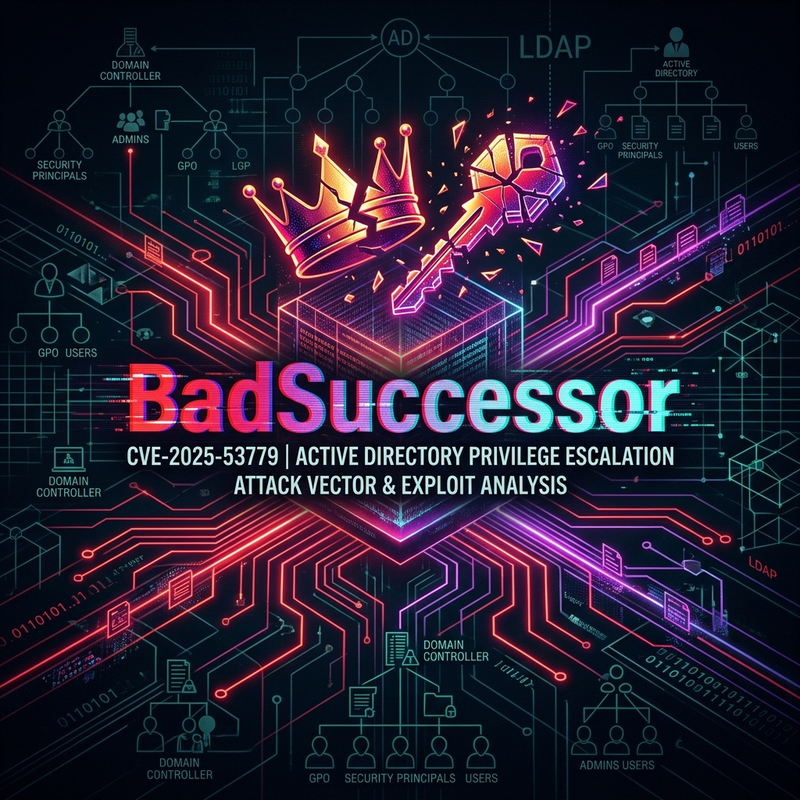
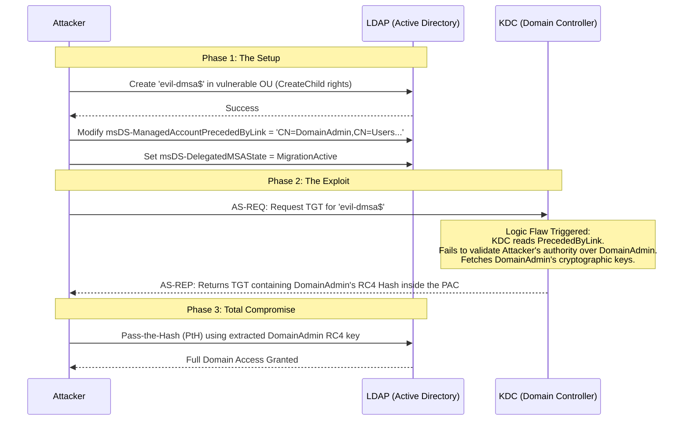

When Microsoft introduced **Windows Server 2025**, one of the most highly anticipated security features was the **delegated Managed Service Account (dMSA)**. Designed as a modern evolution of the traditional Group Managed Service Account (gMSA), the dMSA feature aimed to securely manage credentials for scheduled tasks, services, and application pools, ultimately eliminating the dangerous practice of hardcoding passwords. 

However, in May 2025, security researchers at Akamai uncovered a critical design flaw in how these accounts were processed by the Active Directory Key Distribution Center (KDC) during account migration phases. Dubbed **BadSuccessor** (and later tracked as **CVE-2025-53779**), this vulnerability allowed attackers to achieve complete Active Directory domain compromise with relatively low-level privileges by exploiting a logic flaw in Kerberos ticket generation.

In this deep dive, we'll explore the underlying architecture of dMSAs, the exact cryptographic and logical mechanics of the BadSuccessor attack, Microsoft's remediation efforts, and why defenders must continue to treat dMSA abuse as a persistent threat.

---

## 1. The Origin Story: Discovery by Akamai

The BadSuccessor technique was discovered and publicly disclosed in May 2025 by Akamai security researcher Yuval Gordon. During a deep architectural analysis of the newly introduced dMSA features in Windows Server 2025, the research team identified a logic flaw in how Active Directory Key Distribution Centers (KDCs) handled the concept of "successor" accounts.

!!! danger "Vulnerability Profile: CVE-2025-53779"
    - **Name:** BadSuccessor
    - **CVSS Score:** 7.2 (High)
    - **Vulnerability Type:** Privilege Escalation / Relative Path Traversal in Kerberos
    - **Affected Systems:** Windows Server 2025 Domain Controllers
    - **Disclosed:** May 2025
    - **Patched:** August 2025 Patch Tuesday

Akamai's research sent shockwaves through the security community because of its high success rate in real-world environments. The attack does not require existing Domain Admin credentials. Instead, it relies on misconfigured Object Access Control Lists (ACLs)—specifically, non-administrative users possessing `CreateChild` or `GenericWrite` permissions over Organizational Units (OUs). Akamai's telemetry suggested that over **90% of tested enterprise environments** harbored these common AD misconfigurations, leaving them wide open to the exploit.

---

## 2. Architectural Context: What is a dMSA?

To understand the exploit, we must first understand the intended functionality of dMSAs and how they differ from older service accounts.

Traditional service accounts require manual password management. gMSAs automated this, but they lacked granular delegation capabilities. The **delegated Managed Service Account (dMSA)** was introduced to allow administrators to securely delegate the management of the service account to specific users or groups without granting them sweeping domain privileges.

### The Migration Mechanism
A core feature of the dMSA architecture is seamless migration. Organizations often need to migrate an old, insecure service account (e.g., `SVC_Legacy`) to a secure dMSA (e.g., `SVC_New_dMSA$`). 

To prevent service downtime during this transition, Active Directory allows the KDC to provide the new dMSA with the cryptographic keys of the *old* account. This ensures that the new dMSA can decrypt service tickets that were encrypted with the legacy account's key. 

This relationship is defined by two specific LDAP attributes on the new dMSA object:
1. `msDS-ManagedAccountPrecededByLink`: The Distinguished Name (DN) pointing to the legacy account being migrated.
2. `msDS-DelegatedMSAState`: An integer flag indicating the state of the dMSA migration (e.g., "MigrationActive").

---

## 3. Technical Deep Dive: The Logic Flaw

The BadSuccessor attack weaponizes the migration logic described above. The vulnerability is fundamentally a **logic flaw in the KDC's authorization boundary checks** when evaluating the `msDS-ManagedAccountPrecededByLink` attribute.

### The Exploit Mechanics

1. **Reconnaissance & Pre-requisites:** An attacker maps the Active Directory ACLs (using tools like BloodHound) to identify an Organizational Unit (OU) where they have `CreateChild` permissions.
2. **Malicious Object Creation:** The attacker creates a rogue dMSA object (e.g., `evil-dmsa$`) inside the vulnerable OU. Because they created the object, they implicitly have full control (`GenericAll`) over it.
3. **Attribute Manipulation (The Setup):** The attacker modifies the `msDS-ManagedAccountPrecededByLink` attribute of `evil-dmsa$`. Instead of pointing to a legitimate legacy service account, they set this attribute to point to a highly privileged target—such as a Domain Admin user, an Enterprise Admin, or even the `krbtgt` account.
4. **The Trigger (Kerberos Request):** The attacker requests a Kerberos Ticket Granting Ticket (TGT) for their controlled `evil-dmsa$` account.
5. **The KDC Logic Failure:** When the KDC processes the TGT request, it checks the dMSA migration attributes. It reads `msDS-ManagedAccountPrecededByLink` and implicitly trusts that `evil-dmsa$` is the legitimate "successor" to the high-privileged target account. 
6. **Key Extraction:** Due to the "relative path traversal" flaw in the KDC's validation routine, the KDC fails to verify if the creator of the dMSA actually had authority over the target account. The KDC dutifully fetches the NTLM/RC4 cryptographic keys of the highly privileged target and bundles them inside the Privilege Attribute Certificate (PAC) of the TGS response sent back to the attacker.
7. **Full Compromise:** The attacker extracts the target's RC4 hash from the TGS response. They can now perform a standard Pass-the-Hash (PtH) attack to authenticate as the Domain Admin, achieving total domain compromise.

### Visualizing the Attack Flow

---

## 4. Patches, Fixes, and Current State

### The August 2025 Patch Tuesday
Microsoft acknowledged the severity of the flaw and addressed CVE-2025-53779 in the **August 2025 security updates**. 

The patch fundamentally altered the KDC's evaluation logic. Following the update, when a dMSA requests a ticket during a migration state, the KDC strictly validates authorization boundaries. It verifies that the principal attempting to link the dMSA to a predecessor actually possesses the requisite administrative rights (`GenericWrite` or `WriteProperty`) over the *target* predecessor account. If the attacker only has rights over the OU but not the target Domain Admin, the KDC drops the request and throws an access denied error, neutralizing the arbitrary key extraction.

### The Post-Patch Reality: TTP Persistence
While the direct, unauthenticated BadSuccessor exploit is mitigated on patched Domain Controllers, security experts warn that **dMSA abuse is far from dead**.

The underlying mechanism—manipulating dMSA attributes—remains a valid and highly effective **Tactics, Techniques, and Procedures (TTP)** for lateral movement. Consider a scenario where an attacker compromises a mid-level IT administrator account. If that IT admin legitimately holds administrative rights over existing dMSAs, the attacker can still manipulate those specific dMSA objects to pivot through the network, establish persistence, or bypass certain logging mechanisms. 

Therefore, defenders must treat dMSA manipulation as a permanent fixture in the Active Directory threat landscape, cataloging it alongside established techniques like Kerberoasting or AS-REP Roasting.

---

## 5. Lessons Learned & Mitigations

Relying solely on the August 2025 patch is insufficient for long-term security. A defense-in-depth approach is required to secure Windows Server 2025 environments against advanced identity attacks.

### 1. Rigorous Audit of Organizational Unit (OU) Permissions
The absolute prerequisite for the BadSuccessor attack was the ability of a non-admin to create objects within the directory structure.
- **Action:** Regularly audit `CreateChild` and `GenericWrite` permissions on all OUs. OUs containing sensitive objects or structural containers should only be writable by Tier 0 administrators.
- **Tooling:** Utilize tools like BloodHound CE to continuously map out unintended delegation paths and identify shadow admins who possess excessive rights over OUs.

### 2. Monitor Directory Service Changes (Event ID 5136)
You cannot protect what you cannot see. Security Operations Centers (SOCs) must build detections around dMSA lifecycles.
- **Action:** Ingest and monitor Windows Security **Event ID 5136** (A directory service object was modified).
- **Detection Logic:** Alert immediately if the `msDS-ManagedAccountPrecededByLink` attribute is modified on *any* object. Investigate the source IP and the user making the modification. If the attribute points to a Tier 0 account (Domain Admins, Enterprise Admins, `krbtgt`), treat it as a critical incident.

### 3. Restrict dMSA Deployment and Disable if Unused
If your organization has migrated domain controllers to Windows Server 2025 but does not have an active, documented project to utilize delegated Managed Service Accounts, disable the feature entirely.
- **Action:** Security teams (such as Semperis) have recommended temporarily configuring the Active Directory schema to block the dMSA migration use cases if they are not explicitly required by business operations. Reduce the attack surface by turning off features you don't use.

### 4. Enforce Strict Tiered Administration
A robust tiered administration model limits the blast radius of any single compromised account, preventing lateral movement from escalating into domain dominance.
- **Action:** Ensure that Tier 0 assets (Domain Controllers, highly privileged service accounts, and administrative groups) are strictly segregated. Lower-tier accounts must never possess any form of Write, Modify, or Create rights over Tier 0 objects or the OUs that contain them.

---

## 6. References & Further Reading

For those looking to dive deeper into the technical mechanics, cryptography, and defensive strategies surrounding BadSuccessor, the following resources are highly recommended:

- **NVD Vulnerability Database:** [CVE-2025-53779 Detail](https://nvd.nist.gov/vuln/detail/CVE-2025-53779)
- **Akamai Security Research:** [Abusing dMSA for Privilege Escalation in Active Directory](https://www.akamai.com/blog/security-research/abusing-dmsa-for-privilege-escalation-in-active-directory)
- **Semperis Analysis:** [BadSuccessor: Active Directory Privilege Escalation via dMSA](https://www.semperis.com/blog/badsuccessor/)
- **Microsoft Security Response Center:** [August 2025 Security Updates](https://msrc.microsoft.com/)

*By understanding both the cryptographic flaws and the intended functionality of new Active Directory features, security teams can build more resilient architectures capable of withstanding the next generation of identity-based attacks.*
