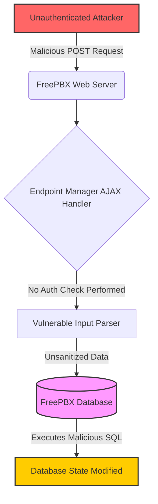
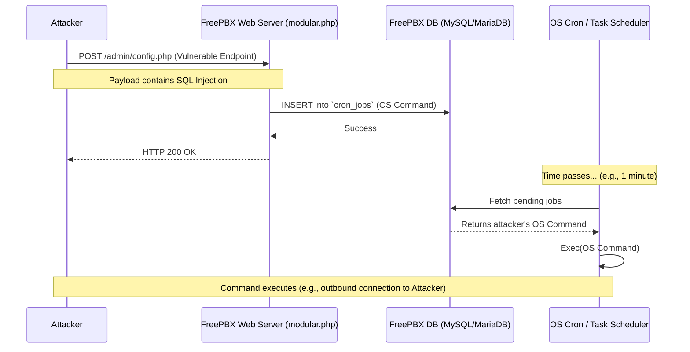

# Deep Dive: CVE-2025-57819 - Critical RCE in Sangoma FreePBX

In the ever-evolving landscape of cybersecurity, vulnerabilities in core communication infrastructure represent some of the most severe risks to organizations. **CVE-2025-57819** is one such vulnerability, a critical flaw discovered in Sangoma FreePBX that allows unauthenticated attackers to achieve Remote Code Execution (RCE) with root-level privileges. 

Boasting a critical CVSS score of **9.8/10.0**, this vulnerability has been actively exploited in the wild since late August 2025, prompting the Cybersecurity and Infrastructure Security Agency (CISA) to add it to its Known Exploited Vulnerabilities (KEV) catalog.

In this deep dive, we will unpack the technical details, analyze the exploitation chain, outline crucial Indicators of Compromise (IoCs), and provide remediation strategies.

## Overview of the Vulnerability

**CVE-2025-57819** targets the commercial **Endpoint Manager (EPM)** module within Sangoma FreePBX. FreePBX is a widely used web-based open-source GUI that manages Asterisk, a voice over IP and telephony server. The Endpoint Manager is a crucial component that allows administrators to auto-provision and manage supported phones directly from the GUI.

*   **Vulnerability Types:** Authentication Bypass (CWE-288) and SQL Injection (CWE-89)
*   **CVSS Score:** 9.8 (Critical)
*   **Affected Versions:**
    *   FreePBX 15: Versions prior to `15.0.66`
    *   FreePBX 16: Versions prior to `16.0.89`
    *   FreePBX 17: Versions prior to `17.0.3`

## Technical Breakdown

The root cause of CVE-2025-57819 lies in the insufficient sanitization of user-supplied data handled by the AJAX handler in the Endpoint Manager module. This oversight allows an attacker to inject malicious SQL queries directly into the backend database.

### 1. Authentication Bypass
The architecture of the Endpoint Manager handles certain AJAX requests before invoking the core FreePBX authentication middleware. Because the vulnerable AJAX handler processes requests before requiring valid administrative authentication, an attacker can interact with the endpoint without any prior credentials. This exposes the attack surface to anyone who can reach the FreePBX web interface.

### 2. SQL Injection (SQLi)
By crafting a malicious payload, the attacker abuses the unsanitized input within the `POST` request parameters to execute arbitrary SQL commands. This SQL injection provides read and write access to the underlying FreePBX database, allowing the attacker to manipulate its contents at will.



### 3. Remote Code Execution (RCE)
SQL injection is rarely the end goal; it is merely a stepping stone. In the case of FreePBX, the attacker can chain the SQLi vulnerability to achieve Remote Code Execution. They typically do this by manipulating specific database tables used by the FreePBX task scheduling engine.

#### The Exploitation Chain
1.  **Stage 1: Initial Injection.** The attacker sends the SQLi payload to the vulnerable endpoint (`modular.php`).
2.  **Stage 2: Database Manipulation.** The payload executes an `INSERT` or `UPDATE` statement targeting the `cron_jobs` or `tasks` table. The attacker injects a command intended for the operating system (e.g., a reverse shell or a command to download a backdoor).
3.  **Stage 3: Execution.** FreePBX periodically processes these tables via legitimate background jobs (e.g., cron). When the job runner encounters the attacker's injected entry, it blindly executes the malicious command with the privileges of the Asterisk user (which in many misconfigured setups is functionally equivalent to root, or easily escalated).



Alternatively, attackers can use the SQLi to insert a new rogue administrator account into the `ampusers` table, granting them full GUI access to configure the system and upload malicious dialplans or modules directly.

## Exploitation in the Wild

Active exploitation of CVE-2025-57819 was detected on or before August 21, 2025. Attackers have automated the exploitation process, aggressively scanning the internet for exposed FreePBX instances. Once compromised, these systems are often roped into botnets, used for toll fraud (SIP trunk hijacking), or serve as pivot points into internal corporate networks.

## Indicators of Compromise (IoCs)

If you suspect your FreePBX instance may have been exposed, it is critical to hunt for the following IoCs. Keep in mind that merely patching the vulnerability **does not remove an existing infection**.

> [!WARNING]
> If any of these IoCs are found, assume the system is fully compromised. The safest remediation path is a clean rebuild and data restore from a known good backup.

### File System Anomalies
*   **`.clean.sh` Script:** The presence of a file named `/var/www/html/.clean.sh`. This file is not part of a legitimate FreePBX installation and is a strong indicator of compromise.
*   **Modified `freepbx.conf`:** Any unexpected modifications or the complete removal of `/etc/freepbx.conf`.
*   **Rogue PHP Files:** Unrecognized PHP files dropped in the webroot (`/var/www/html/`).

### Database Anomalies
*   **`ampusers` Table:** Review the `ampusers` table for any newly created or unrecognized administrative accounts.
*   **`cron_jobs` Table:** Inspect the database for unexpected or malicious scheduled tasks. Look for unusual calls, such as unexpected routing to extension `9998`.

### Log Anomalies
*   **Web Server Logs:** Check your Apache/HTTPD access logs for unusual `POST` requests directed at `modular.php` or `config.php`, especially those originating from untrusted IP addresses dating back to August 2025.

## Remediation and Mitigation

Given the critical nature of this vulnerability, immediate action is required.

### 1. Patch the Endpoint Manager Module
The primary fix is to update the Endpoint Manager module to a patched version. This can be done via the FreePBX Module Admin GUI or the command line.

**Command Line Update:**
```bash
fwconsole ma upgradeall
fwconsole reload
```
Ensure your Endpoint module is at least version `15.0.66`, `16.0.89`, or `17.0.3` depending on your FreePBX major version.

### 2. Restrict Administrative Access
The most effective defense against this and future vulnerabilities is to minimize the attack surface. **Never expose the FreePBX administrative interface directly to the public internet.**

*   Use the built-in **FreePBX Firewall** module to restrict access.
*   Implement strict network ACLs so that only trusted internal IP addresses or VPN subnets can access the web interface.

### 3. Conduct Threat Hunting
As emphasized, patching only closes the door. You must actively investigate the IoCs provided above to ensure an attacker didn't slip in before the patch was applied.

## Conclusion

CVE-2025-57819 serves as a stark reminder of the risks associated with exposing administrative interfaces. A seemingly minor sanitization error in an AJAX handler can rapidly unravel into a full system compromise. Organizations running FreePBX must prioritize updating their systems, locking down access, and rigorously monitoring for signs of post-exploitation activity.
