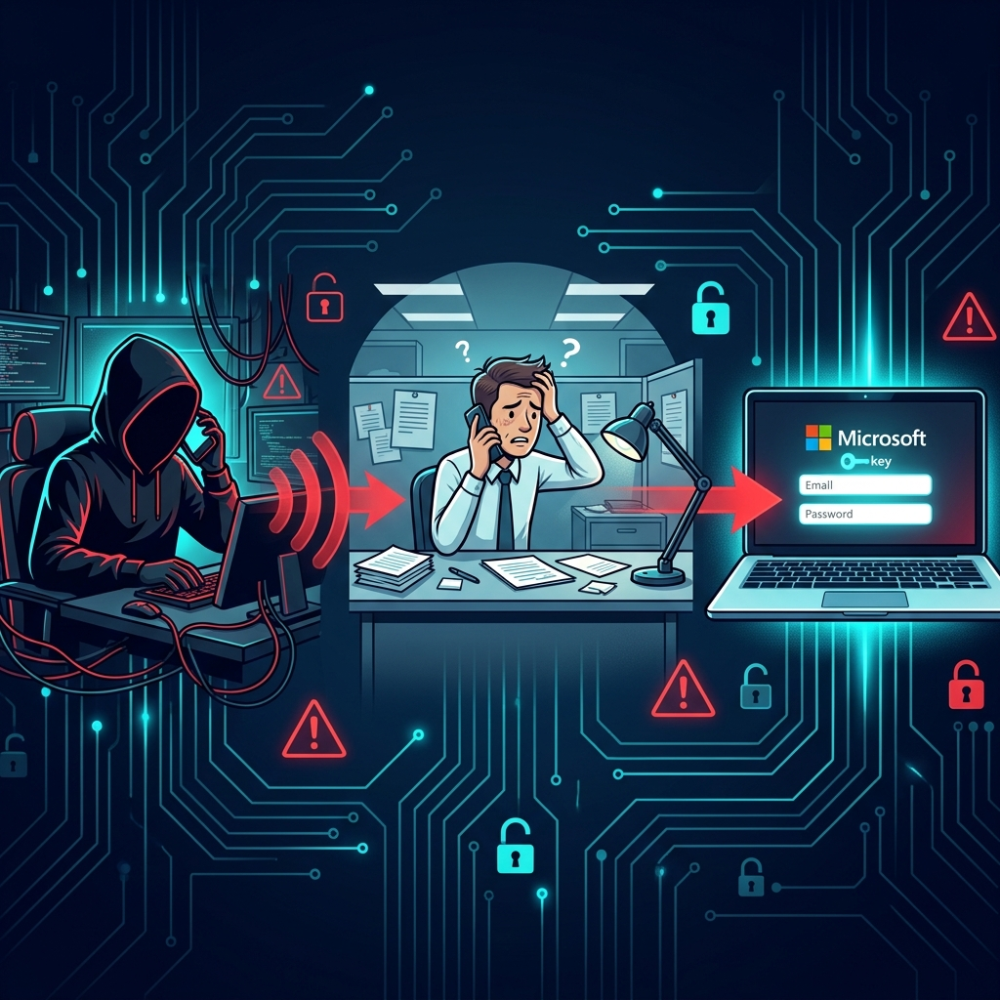
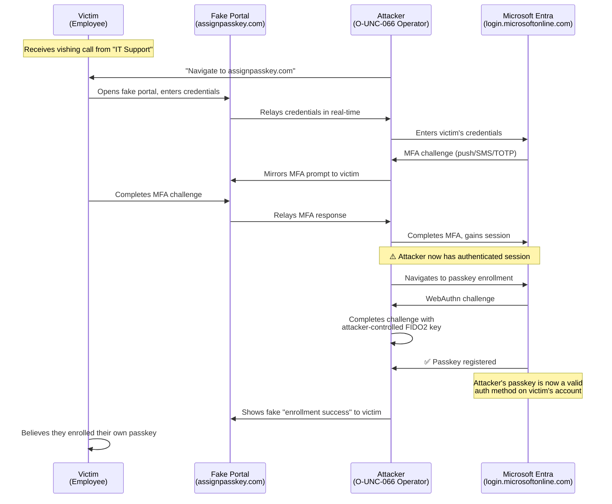

Passkeys were supposed to be the future — a phishing-resistant, passwordless authentication method that would make credential theft obsolete. Microsoft, Google, and Apple have spent the last two years aggressively pushing passkey adoption, and Microsoft's own "nudge" campaigns have been urging millions of Entra ID users to enroll FIDO2 passkeys for their Microsoft 365 accounts.

Threat actors noticed. And they figured out something devastating: **you don't need to break the technology if you can hijack the enrollment process itself.**

Since April 2026, a threat group tracked as **O-UNC-066** (also known as **"Pink"** and **CL-CRI-1147** by Palo Alto Unit 42) has been running a sophisticated social engineering campaign that abuses the legitimate Microsoft Entra passkey enrollment workflow. They don't exploit a software vulnerability. They don't crack cryptographic keys. They call you on the phone, convince you to "enroll a new passkey for security," and walk you through the process — except the passkey you enroll belongs to them.

Once their passkey is registered on your account, they have persistent, MFA-resistant access that **survives password resets, session revocations, and traditional incident response playbooks**. Then comes the data exfiltration. Then comes the ransom demand.

This is the most detailed breakdown available of how this attack works, why it's so effective, and exactly what you need to do to protect your organization.

---

## The Attack at a Glance

| Metric | Detail |
|---|---|
| **Threat Actor** | O-UNC-066 / "Pink" / CL-CRI-1147 |
| **Active Since** | April 2026 (ongoing) |
| **Attack Vector** | Vishing → operator-controlled phishing kit → passkey enrollment hijack |
| **Targets** | Technology, healthcare, automotive, construction, aviation, food & beverage |
| **Primary Goal** | Data extortion (not direct financial fraud) |
| **Exfiltration Window** | Typically within 72 hours of account takeover |
| **Software Exploited** | None — this is a process-level attack, not a software vulnerability |
| **Tracked By** | Okta, Palo Alto Unit 42, SC Magazine, The Hacker News, BleepingComputer |

---

## Why This Is Different: Understanding the Paradox

Here's the core irony of this attack: **passkeys are genuinely phishing-resistant**. The FIDO2/WebAuthn protocol that underpins passkeys is cryptographically designed to prevent exactly this kind of abuse. When a passkey is created, it's bound to a specific domain (the "Relying Party ID"). The browser or operating system enforces this binding at the platform level — a passkey created for `login.microsoftonline.com` will mathematically refuse to sign a challenge from `login.micros0ft-security.com`.

This means that, in theory, passkeys can't be phished. And that's true — **if the user already has a passkey enrolled**.

The vulnerability isn't in the technology. It's in the **transition period** — the gap between when an organization decides to adopt passkeys and when every user has successfully enrolled one. During this window, users are primed to expect IT support calls about "new security requirements," and they're conditioned to follow enrollment instructions. O-UNC-066 weaponizes that expectation.

---

## The Full Attack Chain: Step by Step



### Phase 1: Reconnaissance and Targeting

Before any phone call is made, the attackers gather intelligence on target organizations:

- **Identify organizations actively migrating to passkeys.** Microsoft's "nudge" campaigns (which display enrollment prompts to users) generate chatter on internal Slack/Teams channels, IT helpdesk tickets, and even public blog posts. This makes it easy to identify organizations in the enrollment window.
- **Collect employee contact information.** LinkedIn, corporate directories, data broker sites, and previously breached databases provide names, phone numbers, email addresses, and role information.
- **Register lookalike domains.** The attackers create domains containing the word "passkey" and set up per-target subdomains branded with the victim organization's name.

### Phase 2: The Vishing Call

The attacker calls the target employee, typically on their direct corporate line or personal mobile number. The call follows a carefully scripted playbook:

> *"Hi, this is [Name] from IT Security. We're rolling out the new passkey authentication system that was announced last week. I need to walk you through the enrollment process right now — it's mandatory and needs to be completed by end of day for compliance."*

Key psychological elements that make this effective:

- **Authority:** The caller claims to be from internal IT security — a department that employees are trained to cooperate with.
- **Urgency:** "By end of day," "mandatory," "compliance" — language designed to prevent the victim from stopping to verify.
- **Contextual plausibility:** If the organization is actually rolling out passkeys (as many are, thanks to Microsoft's push), this call sounds perfectly legitimate. Even if they're not, most employees have seen Microsoft's nudge prompts and know "passkeys" are a real security initiative.
- **Social proof:** "This was announced last week" implies that the victim is behind schedule and that their colleagues have already complied.

### Phase 3: The Operator-Controlled Phishing Kit

This is where O-UNC-066's approach diverges sharply from traditional phishing. They don't use automated adversary-in-the-middle (AitM) proxy kits like Evilginx2 or Tycoon2FA. Instead, they deploy an **operator-controlled PHP panel** — a phishing kit that is manually operated in real-time by a human attacker.

The caller directs the victim to navigate to a domain like:

```
https://[victim-company].assignpasskey.com
```

The site displays a convincing replica of the Microsoft Entra login page, often customized with the victim organization's branding (logo, colors, and domain name). But behind the scenes, a human operator is controlling every screen the victim sees.

#### Why operator-controlled matters:

Traditional AitM phishing kits are automated — they blindly proxy everything between the victim and the real login page. This works, but it's inflexible. If the target organization uses a non-standard MFA method, an unusual Conditional Access challenge, or a custom login flow, automated kits often break.

The O-UNC-066 operator solves this problem by **watching the victim's authentication requirements in real-time** and adapting:

| Scenario | Operator Response |
|---|---|
| Victim prompted for SMS OTP | Operator presents fake SMS code entry screen, relays code to real portal |
| Victim prompted for push notification | Operator triggers real push, tells victim to approve on their phone |
| Victim prompted for number matching | Operator reads the number from real portal, displays it on fake screen |
| Victim prompted for TOTP code | Operator presents fake authenticator code entry, relays to real portal |

The operator simultaneously maintains two sessions: one with the victim on the fake site, and one with the real Microsoft Entra portal. Every credential and MFA response the victim provides is immediately relayed to the real portal.

### Phase 4: The Passkey Enrollment Hijack

Once the operator has successfully authenticated to the victim's real Microsoft 365 account (using the victim's own credentials and MFA), they proceed to the core objective: **registering an attacker-controlled passkey**.

The process works like this:

1. **The operator navigates to the real Microsoft Entra passkey enrollment page** (typically `https://mysignins.microsoft.com/security-info` or via the Microsoft Graph API).
2. **The enrollment flow generates a challenge** that must be completed by a FIDO2 authenticator.
3. **The operator completes this challenge using their own FIDO2 security key or platform authenticator**, binding their device to the victim's account.
4. **Meanwhile, the victim sees a fake "enrollment confirmation" screen** on the phishing site, making them believe they just enrolled their own passkey.



The result: the attacker's FIDO2 key is now a **legitimate, registered authentication method** on the victim's Microsoft Entra account. It shows up in the user's Security Info as a valid passkey. It will work for authentication even after:

- ✅ Password resets
- ✅ Session revocations
- ✅ Conditional Access policy changes
- ✅ MFA method resets (unless the passkey itself is specifically removed)

### Phase 5: The BIP-39 Seed Phrase Diversion

One of the most creative elements of this campaign is the **BIP-39 seed phrase diversion tactic**. While the operator is completing the passkey enrollment on the real portal (Phase 4), the victim needs to be kept occupied. The fake portal displays a screen that looks like this:

> **🔐 Your Passkey Recovery Phrase**
>
> Please write down the following 12-word recovery phrase and store it in a secure location. You will need this phrase if you ever lose access to your passkey.
>
> `abandon ability able about above absent absorb abstract absurd abuse access accident`
>
> *Do not share this phrase with anyone. Microsoft will never ask you to enter this phrase online.*

This is entirely fabricated. Microsoft Entra passkey enrollment **does not involve BIP-39 seed phrases** — those are a cryptocurrency wallet concept (Bitcoin Improvement Proposal 39). But most employees don't know that, and the screen is convincing enough to keep them busy writing down 12 words while the operator finishes registering their own passkey on the real portal.

It's a brilliant piece of social engineering theater: the fake "security step" simultaneously:

1. **Distracts the victim** during the critical window when the real enrollment happens
2. **Reinforces the narrative** that the victim just completed a legitimate security process
3. **Creates a false sense of control** — the victim believes they have a "recovery phrase" that gives them ownership
4. **Provides a convenient excuse** if the victim ever tries to "recover" their passkey using these words (it won't work, but by then the damage is done)

### Phase 6: Data Exfiltration and Extortion

With a registered passkey, the attacker can now authenticate to the victim's Microsoft 365 account at any time without the victim's involvement. The typical post-compromise timeline:

- **Hours 0–12:** The operator inventories the account — mailbox, OneDrive, SharePoint, Teams. They identify sensitive data (financial records, contracts, customer data, intellectual property, HR files).
- **Hours 12–48:** Bulk data exfiltration using tools like `rclone`, direct Graph API calls, or simply downloading files through the web interface. The attacker's access appears legitimate because they're authenticating with a valid FIDO2 passkey.
- **Hours 48–72:** The ransom demand arrives, typically via email from an anonymous address. The threat: pay, or the exfiltrated data gets published.

---

## Technical Deep Dive: Why FIDO2 Doesn't Protect the Enrollment Phase

To understand why this attack works despite passkeys being "phishing-resistant," you need to understand what that term actually means — and where its protection boundaries begin and end.

### What FIDO2 Origin Binding Actually Does

When a FIDO2 passkey is created, the WebAuthn protocol performs the following:

1. **The Relying Party (e.g., `login.microsoftonline.com`) sends a challenge** to the browser.
2. **The browser verifies the origin** — the domain in the address bar must match the Relying Party ID.
3. **If the origin matches**, the browser forwards the challenge to the authenticator (security key, platform authenticator, or synced passkey).
4. **The authenticator signs the challenge** with a private key that is cryptographically bound to that specific origin.
5. **The signed assertion is returned** to the Relying Party, which verifies it against the stored public key.

The critical security property: **Step 2 is enforced by the browser, not the user.** A user on `assignpasskey.com` cannot trigger a valid WebAuthn assertion for `login.microsoftonline.com`, because the browser will refuse to forward the challenge to an authenticator bound to a different origin.

This means that **an existing, legitimately enrolled passkey cannot be phished**. Even if a user visits a fake site and clicks "Sign in with passkey," the browser will either:
- Show no passkey options (because none are bound to the fake domain), or
- Refuse to sign the challenge (because the origin doesn't match)

### Where the Protection Ends: Enrollment

The origin-binding protection only applies to **using** an existing passkey. It does **not** protect the **enrollment** of a new passkey, because enrollment requires:

1. An authenticated session (which the attacker obtains via the AitM relay)
2. A WebAuthn registration ceremony performed on the **real** domain

In the O-UNC-066 attack, the attacker is performing the enrollment on `login.microsoftonline.com` — the **real** Microsoft domain — using their own browser and their own authenticator. The origin binding works perfectly: the attacker's passkey is correctly bound to `login.microsoftonline.com`. The problem isn't that the binding is broken — it's that the binding is being applied to the **attacker's key** instead of the victim's.

This is a fundamental insight: **FIDO2 protects credential use, but credential enrollment is only as secure as the session that authorizes it.**

### The Microsoft Graph API Attack Surface

Beyond the browser-based enrollment flow, there's another vector that security teams need to be aware of. The Microsoft Graph API exposes the `fido2AuthenticationMethod` resource, which allows programmatic management of FIDO2 keys:

```
POST https://graph.microsoft.com/v1.0/users/{user-id}/authentication/fido2Methods
```

If an attacker compromises an application with the `UserAuthenticationMethod.ReadWrite.All` Graph API permission — or if a malicious application is granted this permission through consent phishing — they can potentially provision their own FIDO2 key on any user's account without any user interaction at all.

This converts the attack from a social engineering exercise to a fully automated credential takeover, limited only by the scope of the compromised API permissions.

---

## The Infrastructure: Known IOCs

### Malicious Domains

The attackers register domains containing the word "passkey" and create per-target subdomains branded with the victim organization's name (e.g., `contoso.assignpasskey.com`):

| Domain | Status |
|---|---|
| `assignpasskey[.]com` | Active |
| `passkeydeploy[.]com` | Active |
| `deploypasskey[.]com` | Active |
| `passkeyadd[.]com` | Active |
| `setpasskey[.]com` | Active |

> ⚠️ **Note:** This list is not exhaustive. O-UNC-066 rotates infrastructure frequently. The common pattern is domains containing "passkey" combined with action verbs (assign, deploy, add, set, enroll, register).

### Hosting Infrastructure

| Provider | ASN |
|---|---|
| DDoS-Guard | AS57724 |
| IQWeb FZ-LLC | AS59692 |

### Known IP Addresses

| IP Address | Context |
|---|---|
| `185[.]178.208.153` | Phishing infrastructure |
| `172[.]93.100.252` | Phishing infrastructure |
| `96[.]232.20.66` | Post-compromise activity |

### Observed User-Agent Strings

| User-Agent | Context |
|---|---|
| `Microsoft.Graph.Client/5.62.0` | Post-compromise Graph API calls |
| `python-requests/2.28` | Automated data exfiltration |

---

## Detection: Finding This in Your Logs

Because this attack uses legitimate enrollment flows, traditional "block the malicious domain" approaches are insufficient. Detection requires identifying anomalies in authentication behavior and method registration patterns.

### KQL Query 1: Detect New Passkey Registrations

Monitor for any new FIDO2 key or passkey enrollments. Cross-reference against your organization's official provisioning workflows to identify unauthorized registrations.

```kql
AuditLogs
| where TimeGenerated > ago(7d)
| where OperationName has_any (
    "Add Passkey (device-bound)",
    "Add Passkey",
    "Add FIDO2 security key",
    "User registered security info"
)
| extend InitiatedBy = tostring(parse_json(tostring(InitiatedBy.user)).userPrincipalName)
| extend TargetUser = tostring(TargetResources[0].userPrincipalName)
| extend IPAddress = tostring(parse_json(tostring(InitiatedBy.user)).ipAddress)
| project TimeGenerated, OperationName, TargetUser, InitiatedBy, IPAddress, Result, ResultDescription
| sort by TimeGenerated desc
```

### KQL Query 2: Suspicious MFA Method Changes

Identify any changes to authentication methods that occur outside of standard business hours or from unusual IP addresses.

```kql
AuditLogs
| where TimeGenerated > ago(24h)
| where OperationName in (
    "User registered security info",
    "User registered all required security info",
    "User changed default security info",
    "Admin registered security info"
)
| where Result == "success"
| extend TargetUser = tostring(TargetResources[0].userPrincipalName)
| extend Initiator = tostring(parse_json(tostring(InitiatedBy.user)).userPrincipalName)
| extend IPAddress = tostring(parse_json(tostring(InitiatedBy.user)).ipAddress)
| project TimeGenerated, OperationName, TargetUser, Initiator, IPAddress, ResultDescription
| sort by TimeGenerated desc
```

### KQL Query 3: Passkey Registration Following Suspicious Sign-In

This is the highest-fidelity detection. It correlates a new passkey registration with a preceding sign-in that was flagged as risky or originated from a suspicious location.

```kql
let SuspiciousSignIns = SigninLogs
| where TimeGenerated > ago(7d)
| where RiskLevelDuringSignIn in ("medium", "high")
   or ResultType == 0  // Successful sign-in
| where AuthenticationDetails has "phishing"
   or AuthenticationDetails has "anonymizedIP"
| project SignInTime = TimeGenerated, UserPrincipalName, IPAddress, RiskLevelDuringSignIn;
//
let PasskeyRegistrations = AuditLogs
| where TimeGenerated > ago(7d)
| where OperationName has_any ("Add Passkey", "Add FIDO2")
| extend TargetUser = tostring(TargetResources[0].userPrincipalName)
| extend RegIP = tostring(parse_json(tostring(InitiatedBy.user)).ipAddress)
| project RegTime = TimeGenerated, TargetUser, RegIP, OperationName;
//
PasskeyRegistrations
| join kind=inner SuspiciousSignIns on $left.TargetUser == $right.UserPrincipalName
| where RegTime between (SignInTime .. (SignInTime + 1h))
| project RegTime, TargetUser, OperationName, SignInTime, RiskLevelDuringSignIn, RegIP, SignInIP = IPAddress
```

### KQL Query 4: Graph API Abuse for Authentication Method Manipulation

Detect programmatic access to authentication method APIs that may indicate automated passkey provisioning by a compromised application.

```kql
AuditLogs
| where TimeGenerated > ago(7d)
| where OperationName has_any (
    "Add Passkey",
    "Add FIDO2 security key",
    "Update user"
)
| extend InitiatedByApp = tostring(parse_json(tostring(InitiatedBy.app)).displayName)
| extend InitiatedByServicePrincipal = tostring(parse_json(tostring(InitiatedBy.app)).servicePrincipalId)
| where isnotempty(InitiatedByApp)
| extend TargetUser = tostring(TargetResources[0].userPrincipalName)
| project TimeGenerated, OperationName, InitiatedByApp, InitiatedByServicePrincipal, TargetUser, Result
| sort by TimeGenerated desc
```

---

## Hardening: A Complete Defense-in-Depth Playbook

This attack cannot be fixed with a patch. It requires layered defenses across process, policy, and technology.

### Priority 1: Lock Down Passkey Enrollment Workflows

**This is your single most important action item.**

- ✅ **Define an official enrollment process.** Document exactly how your organization enrolls passkeys: which portal, which URL, which authentication flow, and under what circumstances. Publish this to all employees.
- ✅ **Require in-person or verified video enrollment for privileged accounts.** Administrators, executives, and anyone with access to sensitive data should only enroll passkeys through an in-person session with IT staff — never over the phone.
- ✅ **Use Temporary Access Pass (TAP) for enrollment.** Microsoft Entra supports Temporary Access Pass — a time-limited passcode issued by an admin that can be used for passkey enrollment. This eliminates the need for users to enter their primary credentials during enrollment and prevents the AitM relay.
- ✅ **Disable self-service passkey enrollment if not actively rolling out.** If your organization hasn't started its passkey migration, disable self-service enrollment entirely via the Authentication Methods policy in Entra ID.

### Priority 2: Enforce Phishing-Resistant MFA with Conditional Access

Configure Conditional Access policies to require phishing-resistant authentication for sensitive operations:

```
Conditional Access Policy: Require Phishing-Resistant MFA for Security Info Registration

Assignments:
  Users: All users (or specific pilot groups)
  Cloud apps: "User actions" → "Register security information"
  
Conditions:
  (none — apply universally)

Grant:
  Require authentication strength → "Phishing-resistant MFA"
  (FIDO2 security key, Windows Hello for Business, or Passkeys in Microsoft Authenticator)
```

This policy creates a chicken-and-egg protection: to enroll a passkey, you need to authenticate with a passkey (or another phishing-resistant method). This prevents attackers from relaying a traditional MFA challenge to authorize passkey enrollment.

### Priority 3: Enable Token Protection (Token Binding)

Token Protection binds session tokens to the device that issued them. Even if an attacker steals a session cookie via an AitM relay, the token will not work from the attacker's machine because the device binding check will fail.

As of mid-2026, Token Protection is available in Conditional Access for specific scenarios. Enable it for:
- Sign-in sessions to Exchange Online and SharePoint Online
- Security information registration events
- All privileged role activations (PIM)

### Priority 4: Monitor and Alert on Authentication Method Changes

- ✅ **Deploy the KQL queries above** in Microsoft Sentinel or your SIEM of choice.
- ✅ **Create alerts for any passkey registration** that occurs outside your documented enrollment workflow.
- ✅ **Alert on passkey registrations from IPs** that don't match your corporate network or VPN ranges.
- ✅ **Review authentication methods weekly** for privileged accounts. Use the Entra admin center → Users → Authentication Methods to see all registered methods for each user.
- ✅ **Extend log retention beyond 30 days.** The default Entra ID audit log retention is 30 days. Export to a Log Analytics workspace or SIEM for long-term retention and threat hunting.

### Priority 5: User Awareness Training — Specifically for This Attack

Generic "don't click phishing links" training is insufficient for this attack. Your training must address:

- ❌ **"IT will never call you to enroll a passkey over the phone."** Make this an absolute rule and communicate it repeatedly.
- ❌ **"Microsoft never uses seed phrases or recovery words for passkeys."** Any request to write down a BIP-39-style word list is a scam. Period.
- ❌ **"If someone calls you about security changes, hang up and call the IT help desk on the number you already know."** Provide employees with a verified callback number and make them use it.
- ❌ **"Only enroll passkeys through [your specific internal URL]."** Give employees one canonical URL and tell them to distrust any other.

### Priority 6: Restrict Graph API Permissions

Audit all applications in your Entra ID tenant that have permissions related to authentication method management:

- `UserAuthenticationMethod.ReadWrite.All`
- `UserAuthenticationMethod.Read.All`
- `Policy.ReadWrite.AuthenticationMethod`

Remove these permissions from any application that doesn't absolutely require them. These permissions allow an application to add, modify, or read FIDO2 authentication methods for any user — effectively the keys to the kingdom.

### Priority 7: Network-Level Protections

- ✅ **Block known malicious domains** at your DNS resolver or web proxy. Add the IOC domains listed above and create a pattern-based rule for any newly registered domain containing "passkey" combined with action verbs.
- ✅ **Block known hosting providers** used by the campaign (DDoS-Guard AS57724, IQWeb FZ-LLC AS59692) if they serve no legitimate business purpose in your environment.
- ✅ **Monitor DNS logs** for lookups to domains containing "passkey" that are not `microsoft.com` or your organization's own domains.

---

## Incident Response: What to Do If You've Been Compromised

If you suspect an O-UNC-066 compromise, the following response steps are critical — and order matters:

### Step 1: Remove the Rogue Passkey (Immediately)

Navigate to **Entra admin center → Users → [affected user] → Authentication Methods** and delete any passkey or FIDO2 key that wasn't provisioned through your official enrollment process. This is time-critical — every minute the attacker's passkey remains registered is another minute of potential data exfiltration.

### Step 2: Revoke All Sessions

Use the **"Revoke sessions"** button in the Entra admin center for the affected user. This invalidates all existing access tokens and refresh tokens.

### Step 3: Force Password Reset

Even though the attacker used a passkey (not the password), resetting the password ensures any cached credentials or alternate access methods are invalidated.

### Step 4: Review Authentication Methods

Check all registered authentication methods for the affected user. Remove anything that wasn't explicitly provisioned by your IT team:
- FIDO2 keys and passkeys
- Phone numbers for SMS/voice MFA
- Authenticator app registrations
- Email addresses for password reset

### Step 5: Audit Data Access

Review the user's activity in Microsoft 365 over the past 72 hours (or since the suspected compromise):
- **Unified Audit Log:** Search for file downloads, mailbox access, and SharePoint/OneDrive activity.
- **Graph API activity:** Check for unusual API calls, especially from the `python-requests` or `Microsoft.Graph.Client` user agents.
- **Mail forwarding rules:** Attackers often create hidden mail forwarding rules. Check with `Get-InboxRule` in Exchange Online PowerShell.

### Step 6: Contain Lateral Movement

If the compromised user had access to shared mailboxes, SharePoint sites, Teams channels, or Azure resources, assume those may also be compromised. Audit access logs for all connected resources.

---

## The Bigger Picture: Security in the Transition Period

This campaign exposes a fundamental truth about security transitions: **the migration period is always the most dangerous moment.**

When organizations moved from on-premises to cloud, the hybrid period was the most vulnerable. When organizations moved from VPNs to Zero Trust, the transition created gaps. Now, as organizations move from passwords to passkeys, the enrollment period is the attack surface.

The O-UNC-066 campaign is not a failure of passkey technology. FIDO2 passkeys remain the strongest form of authentication available. But the technology's strength is only realized once enrollment is complete and the old authentication methods are decommissioned. During the transition:

1. **Users are conditioned to expect enrollment prompts.** Microsoft's nudge campaigns train users to anticipate being asked to set up passkeys — exactly the behavior the attackers exploit.

2. **Help desks are overwhelmed.** During mass enrollments, IT staff are fielding hundreds of "I need help with my passkey" calls, making it harder to distinguish legitimate requests from social engineering.

3. **The old MFA is still active.** Because users haven't fully migrated, their accounts still accept legacy MFA methods (push notifications, SMS, TOTP) that can be relayed by the attacker's phishing kit.

4. **Monitoring baselines don't exist yet.** When passkey enrollment is new, there's no established baseline for "normal" enrollment patterns, making anomaly detection harder.

The lesson isn't to delay passkey adoption — it's to treat the transition itself as a security-critical operation that requires its own threat model, its own incident response plan, and its own monitoring infrastructure.

---

## Timeline of Key Events

| Date | Event |
|---|---|
| **April 2026** | First O-UNC-066 / Pink campaigns observed |
| **April–June 2026** | Campaigns escalate across technology, healthcare, and automotive sectors |
| **June 2026** | Okta publishes initial analysis of the vishing + passkey enrollment attack chain |
| **June–July 2026** | SC Magazine, The Hacker News, BleepingComputer, and Security Week publish detailed reports |
| **July 2026** | Palo Alto Unit 42 assigns tracking name CL-CRI-1147 |
| **July 2026** | IOCs shared across ISACs; domains and IPs added to threat intelligence feeds |
| **Ongoing** | Campaign continues to evolve with new domains and infrastructure rotation |

---

## Conclusion

O-UNC-066's passkey enrollment hijack campaign is a masterclass in attacking the process, not the technology. Passkeys are the most secure form of authentication ever widely deployed — but their security only protects the authentication ceremony itself. The enrollment process, the human who initiates it, and the session that authorizes it remain vulnerable to social engineering and real-time credential relay.

If you take one thing from this article: **your passkey enrollment process needs the same level of security scrutiny as your passkey authentication process.** If any user in your organization can enroll a passkey by clicking a link someone gave them over the phone, you are vulnerable to this attack right now.

Lock down enrollment. Train your users. Monitor your logs. And remember: the attackers aren't breaking cryptography — they're breaking trust.

---

*Sources: [Okta Security Blog — "O-UNC-066 Passkey Enrollment Campaign"](https://www.okta.com) (June 2026), [SC Magazine — "Pink Threat Actor Targets M365 Via Passkey Vishing"](https://www.scmagazine.com) (June 2026), [The Hacker News — "Hackers Abuse Microsoft Entra Passkey Enrollment in Vishing Attacks"](https://thehackernews.com) (July 2026), [BleepingComputer — "O-UNC-066 Campaign Enrolls Rogue Passkeys on Corporate Accounts"](https://www.bleepingcomputer.com) (July 2026), [Help Net Security — "Operator-Controlled Phishing Kits Target FIDO2 Enrollment"](https://www.helpnetsecurity.com) (July 2026), [Palo Alto Unit 42 — CL-CRI-1147 Threat Brief](https://unit42.paloaltonetworks.com) (July 2026), [Microsoft Entra Documentation — FIDO2 Authentication Methods](https://learn.microsoft.com/en-us/entra/identity/authentication/concept-authentication-passwordless). Content was rephrased for compliance with licensing restrictions.*
