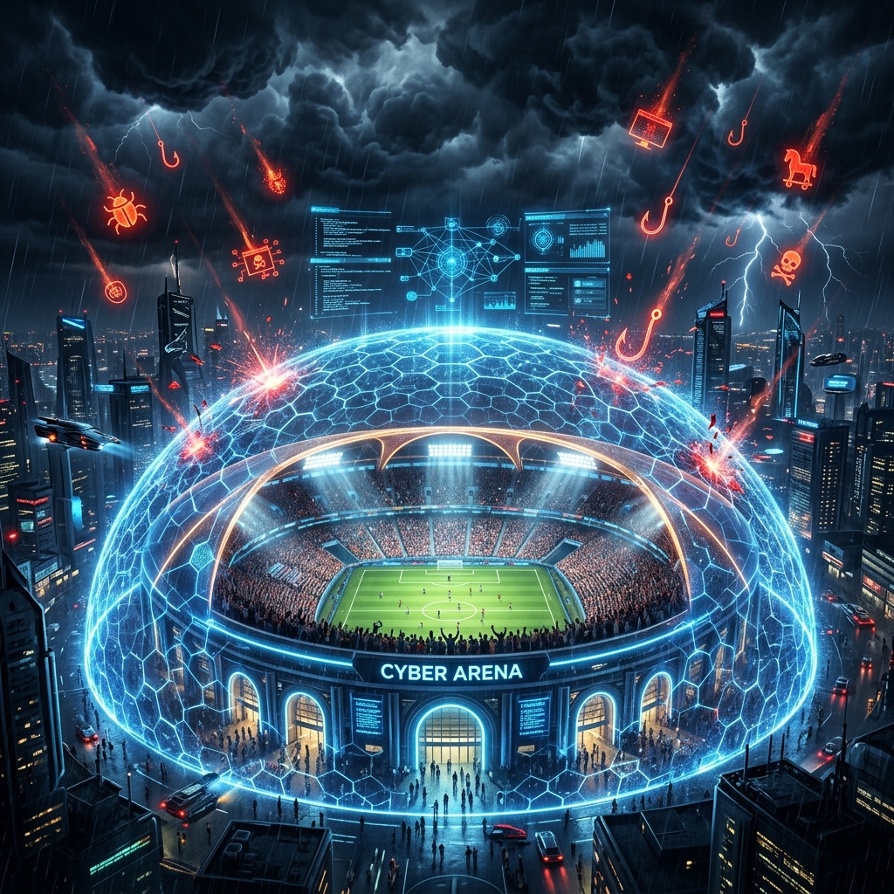
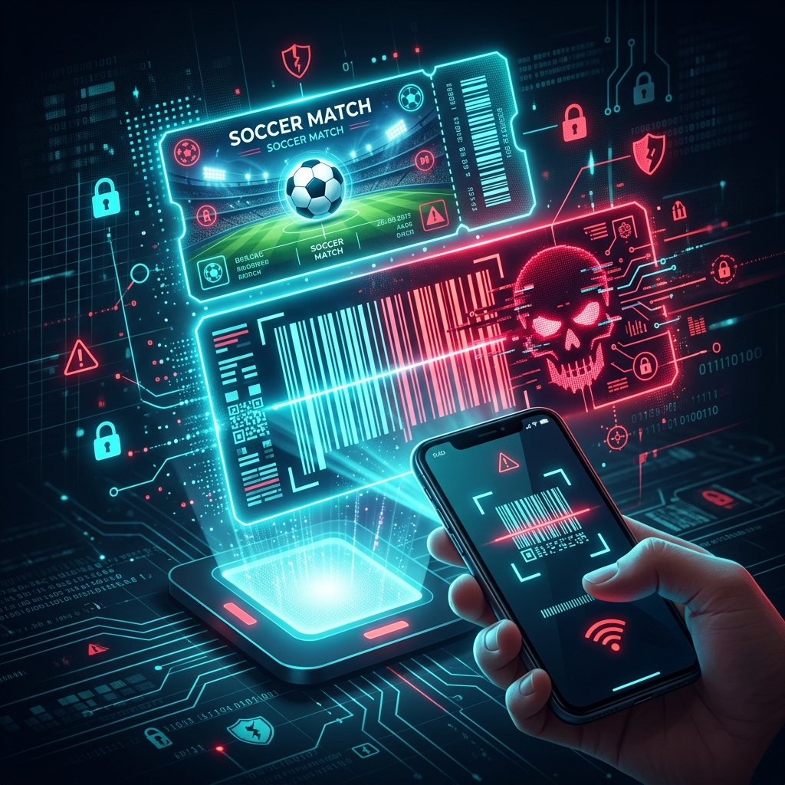
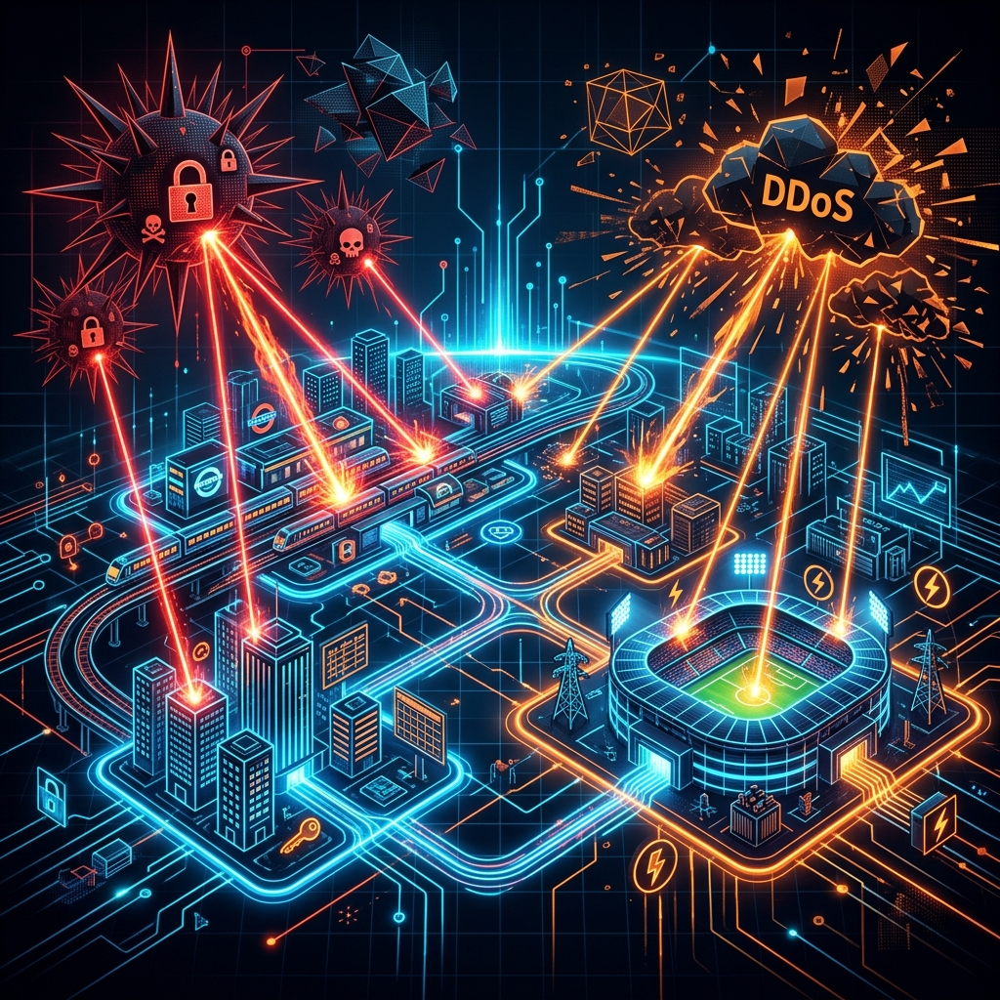

# FIFA World Cup 2026: The Largest Cyber Attack Surface in Sporting History

The 2026 FIFA World Cup is unprecedented in its scale. Spanning three countries—the United States, Canada, and Mexico—and utilizing 16 host cities, it is a logistical marvel. But for cybersecurity professionals, this expansive footprint represents something else entirely: **the largest and most complex digital attack surface in sporting history.**

The tournament's reliance on interconnected digital infrastructure, spanning transit systems, stadium operations, broadcast networks, and a massive hospitality ecosystem, creates a unique convergence of vulnerabilities. Cybercriminals, hacktivists, and nation-state actors are all actively exploiting this event.

Based on recent threat intelligence and reports from the FBI and CISA, here is a detailed breakdown of the cyber risks defining the 2026 World Cup—and what organizations and attendees need to know to stay secure.

<!-- more -->

---

## 1. The Consumer Frontline: Ticketing Fraud and Typosquatting

*Cybercriminals have registered thousands of malicious, FIFA-themed domains to host "pixel-perfect" replica websites for credential harvesting.*

The most visible and widespread cyber threat facing the 2026 World Cup is targeted directly at the fans: ticketing and hospitality fraud. 

Because demand for tickets vastly exceeds supply, cybercriminals have successfully weaponized urgency and scarcity. Analysts have tracked the registration of thousands of fraudulent, FIFA-themed domains. These threat actors employ **typosquatting** (e.g., registering domains like `fifa-world-cup2026-tickets.com` instead of the official URLs) to create pixel-perfect replicas of legitimate portals.

These fraudulent sites are designed to:

- **Harvest PII and Credentials:** Stealing personal data and payment information.
- **Sell Fake Assets:** Offering nonexistent tickets, VIP hospitality packages, and counterfeit merchandise.
- **Distribute Malware:** Often pushing fake mobile applications (like spoofed travel or sports betting apps) that act as infostealers once installed on a victim's device.

The FBI's Internet Crime Complaint Center (IC3) has repeatedly warned the public that purchasing from unofficial channels almost guarantees financial loss or identity theft.

## 2. Targeting the Supply Chain and "Hospitality Stack"

The World Cup doesn't just rely on stadiums; it relies on a sprawling ecosystem of secondary and tertiary partners, including airlines, regional hotels, logistics providers, and private security contractors. 

Threat actors know that while a major stadium might have a mature Security Operations Center (SOC), a regional logistics provider might not. This makes the **supply chain** a highly lucrative vector for Business Email Compromise (BEC) and ransomware.

### The Ransomware Threat to Hospitality
Security experts have identified the "hospitality stack"—the interconnected networks of reservation systems, digital room keys, point-of-sale (POS) systems, and Wi-Fi portals—as a prime target for ransomware operators. Disrupting these systems during a period of maximum capacity guarantees maximum leverage for extortion.

### Supply Chain Phishing
Using AI-enhanced conversational lures, attackers are impersonating official vendors. By compromising just one legitimate vendor's email account, attackers can bypass DMARC and SPF checks, sending malicious invoices or credential-harvesting links directly to high-value targets within the World Cup organizing bodies.

## 3. Critical Infrastructure and Nation-State Activity

*Stadium power grids, municipal transit systems, and broadcast networks represent high-value targets for disruption.*

While cybercriminals seek financial gain, nation-state actors and hacktivists seek disruption, geopolitical leverage, or reputational damage to the host nations.

### DDoS and Broadcast Disruption
Hacktivist groups have historically used Distributed Denial of Service (DDoS) attacks as a tool for political messaging during high-profile events. The 2026 tournament's heavy reliance on digital streaming and municipal services (such as smart traffic signals and public transport networks) presents a massive target for disruptive DDoS campaigns.

### ICS and SCADA Vulnerabilities
Perhaps the most severe threat involves state-aligned actors targeting Industrial Control Systems (ICS) and Programmable Logic Controllers (PLCs) that support the host cities. CISA has conducted extensive vulnerability assessments at host stadiums to mitigate risks against physical infrastructure, including power grids, HVAC systems, and physical security access controls. 

A successful intrusion into a stadium's operational technology (OT) network could have catastrophic consequences, moving the threat from the digital realm into physical safety.

---

## Defensive Posture and Mitigation Strategies

Securing an event of this magnitude requires unprecedented cross-border and cross-sector coordination. Here is how agencies and organizations are defending the tournament:

### For Organizations and Host Cities:

- **Zero-Trust and Segmentation:** Ensuring that IT networks (like ticketing and Wi-Fi) are strictly segmented from OT networks (like stadium lighting and access control).
- **Supply Chain Auditing:** Mandating strict MFA and DMARC enforcement for all official partners and third-party vendors.
- **Continuous Monitoring and Takedowns:** Partnering with brand protection services to actively monitor and execute rapid takedowns of typosquatted domains and fraudulent social media profiles.

### For Attendees and Fans:

- **Use Only Official Channels:** Never purchase tickets, hospitality packages, or merchandise from links received via email, SMS, or social media ads. Always navigate directly to `fifa.com`.
- **Beware of Urgency:** If an offer claims tickets are "selling out in minutes" or requires payment via cryptocurrency or wire transfer, it is a scam.
- **Guard Your Credentials:** Do not post pictures of your event tickets or VIP badges on social media; attackers use these images to clone barcodes and forge credentials.

---

## Conclusion

The 2026 FIFA World Cup is a celebration of global unity and athletic excellence. However, it is also a crucible for modern cybersecurity. The event highlights a fundamental truth of the digital age: as our physical and digital worlds become increasingly intertwined, securing a physical event requires securing the entire digital ecosystem that supports it.

***

## References & Citations

- **[1] FBI Internet Crime Complaint Center (IC3)**. [*Scammers Targeting High-Profile Sporting Events*](https://www.ic3.gov/Media/Y2024/PSA240118). 
- **[2] Cybersecurity and Infrastructure Security Agency (CISA)**. [*Securing Public Gatherings and Special Events*](https://www.cisa.gov/topics/physical-security/securing-public-gatherings).
- **[3] Center for Strategic and International Studies (CSIS)**. [*The Cyber Threat to Major Sporting Events*](https://www.csis.org).
- **[4] Fortinet Threat Research**. [*Cybercriminals Target Global Sporting Events with Fraud and Malware*](https://www.fortinet.com/blog/threat-research).
- **[5] Palo Alto Networks Unit 42**. [*Critical Infrastructure and OT Security Trends*](https://unit42.paloaltonetworks.com).
