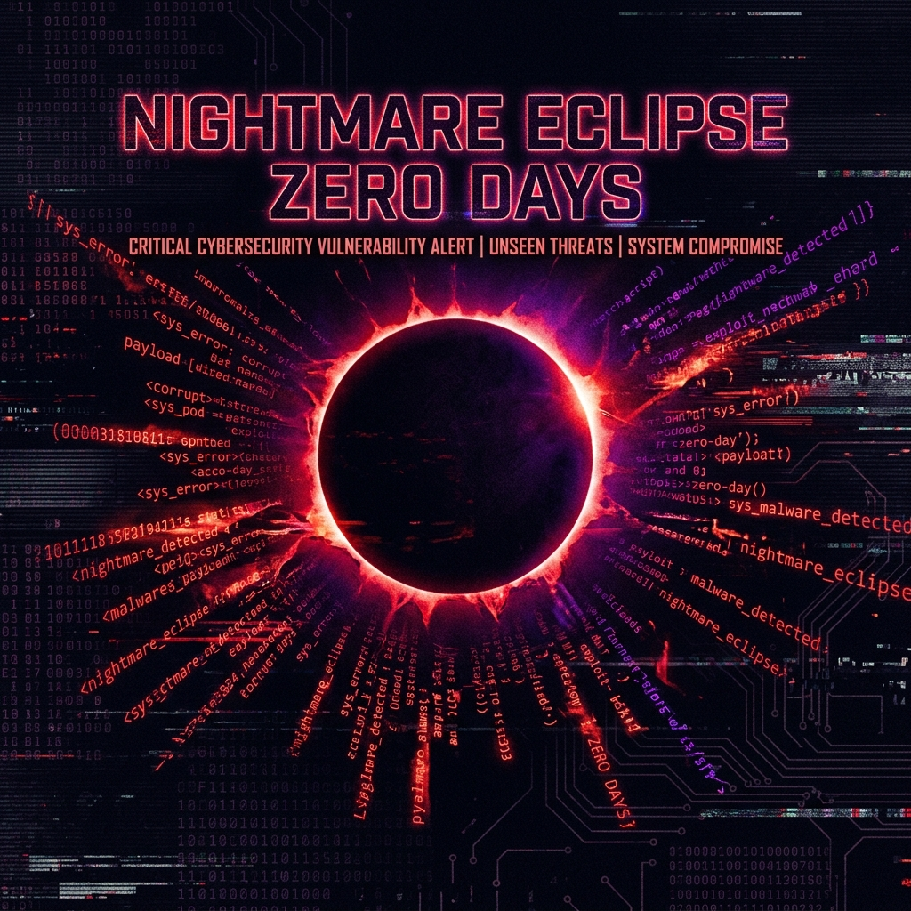

<div class="ps-blog-audio" data-audio="/podcasts/Microsoft_Insider_Weaponized_Eight_Zero_Days.m4a" data-cover="/assets/images/podcast_cover.png" data-title="Microsoft Insider Weaponized Eight Zero Days"></div>

In the spring and summer of 2026, the cybersecurity world watched in real-time as a single disgruntled security researcher waged what can only be described as a systematic, retaliatory campaign against Microsoft—dropping fully weaponized zero-day exploit after zero-day exploit targeting the Windows kernel, Microsoft Defender, and BitLocker encryption. The exploits were not theoretical. They were functional, field-tested, and in several cases, actively exploited by threat actors within hours of public release.

The researcher, operating under the aliases **Nightmare Eclipse**, **Chaotic Eclipse**, and later **MSNightmare**, is a former Microsoft security employee whose grievances with the company's vulnerability handling processes metastasized into one of the most consequential uncoordinated disclosure campaigns in modern history.

This is the full story: the researcher's background, every exploit in the arsenal, the CVE details and patch timelines, Microsoft's escalating response, the CISA KEV entries, and the fundamental questions this saga forces the industry to confront about the economics of vulnerability research.

---

## 1. The Researcher: Who is Nightmare Eclipse?

### Background

Investigations by journalists including Brian Krebs (KrebsOnSecurity) and reporters at *The Register* identified Nightmare Eclipse as a **former full-time Microsoft security employee** who worked at the company from approximately **September 2022 to June 2025**. The researcher's expertise was specifically in Windows internals and Microsoft Defender—the very components they would later target.

### The Grievances

According to manifestos and public statements published alongside the exploit code on GitHub and later on self-hosted Git repositories, the researcher's motivations included:

1. **Ignored vulnerability reports:** Multiple high-severity bugs submitted to the Microsoft Security Response Center (MSRC) were allegedly triaged at lower severity or left unaddressed for months.
2. **Unpaid bounties:** The researcher claimed that Microsoft's bug bounty program failed to compensate them for several valid submissions, despite the bugs being silently patched in subsequent updates.
3. **Account deletion:** MSRC allegedly deleted the researcher's security researcher account, effectively erasing their submission history and any pending bounty claims.
4. **Professional humiliation:** The researcher described feeling personally and professionally humiliated by Microsoft's treatment, characterizing the company's behavior as dismissive and retaliatory.

### The Decision to Go Public

After exhausting what they perceived as every legitimate channel, the researcher made a calculated decision: abandon coordinated vulnerability disclosure entirely and begin releasing fully weaponized proof-of-concept code directly to the public internet, without any advance notice to Microsoft.

The message was clear: *if Microsoft would not fix these bugs when reported privately, the world would force them to fix them publicly.*

---

## 2. The Complete Zero-Day Arsenal

Beginning in April 2026, Nightmare Eclipse released at least **eight distinct zero-day vulnerabilities** across three major attack categories: Microsoft Defender exploitation, BitLocker bypasses, and Windows kernel privilege escalation.

### The Complete Vulnerability Catalog

| # | Codename | CVE | Category | Type | Patch Status | CISA KEV |
|---|---|---|---|---|---|---|
| 1 | **BlueHammer** | CVE-2026-33825 | Microsoft Defender | LPE (TOCTOU) | ✅ Patched (April 2026) | ✅ Yes |
| 2 | **RedSun** | CVE-2026-41091 | Microsoft Defender | LPE (Link Following) | ✅ Patched (May 2026) | ✅ Yes |
| 3 | **UnDefend** | CVE-2026-45498 | Microsoft Defender | DoS / Security Bypass | ✅ Patched (May 2026) | ✅ Yes |
| 4 | **YellowKey** | CVE-2026-45585 | BitLocker | Security Feature Bypass | ✅ Patched (June 2026) | ✅ Yes |
| 5 | **GreenPlasma** | CVE-2026-45586 | Windows (ctfmon) | LPE | ✅ Patched (June 2026) | — |
| 6 | **MiniPlasma** | CVE-2020-17103 (regressed) | Windows (cldflt.sys) | LPE | ⚠️ Re-patched (June 2026) | — |
| 7 | **RoguePlanet** | Pending | Microsoft Defender | LPE (TOCTOU) | ❌ Unpatched | — |
| 8 | **GreatXML** | Pending | BitLocker / WinRE | Security Feature Bypass | ❌ Unpatched | — |

---

### 2.1 BlueHammer (CVE-2026-33825) — The Opening Salvo

**Released:** April 2026 | **Patched:** April 2026 | **Severity:** Important

BlueHammer was the first exploit released in the campaign and established the pattern that would define the entire series: exploiting race conditions in Microsoft Defender's file operations pipeline.

**Technical Mechanism:**

The vulnerability is a classic **Time-of-Check to Time-of-Use (TOCTOU)** race condition within Defender's signature update workflow. The exploit chain works as follows:

1. The attacker creates a carefully crafted directory structure using **NTFS symbolic links** (symlinks) and **reparse points**.
2. When Defender's signature update service processes files in the targeted directory, it first *checks* the file path to verify it is safe.
3. Between the time of the check and the time Defender *uses* (writes to) the file path, the attacker uses an **opportunistic lock (Oplock)** to pause the write operation.
4. During this pause, the attacker swaps the symlink target to point to a protected system location.
5. Defender's privileged write operation completes—but now it writes to the attacker-controlled destination.
6. The result: arbitrary file write as `NT AUTHORITY\SYSTEM`, leading to code execution.

```mermaid
sequenceDiagram
    participant A as Attacker
    participant D as Defender Service<br/>(SYSTEM)
    participant FS as File System

    A->>FS: Create symlink pointing to<br/>safe temp directory
    A->>D: Trigger signature update
    D->>FS: CHECK: Verify path is safe ✅
    
    rect rgb(80, 0, 0)
    Note over A,FS: RACE WINDOW (Oplock pause)
    A->>FS: Swap symlink target →<br/>C:\Windows\System32\target.dll
    end
    
    D->>FS: USE: Write update to path<br/>(now points to System32)
    Note over D: Arbitrary file overwrite<br/>as SYSTEM achieved
```



**Impact:** Full local privilege escalation to SYSTEM on all supported Windows 10 and Windows 11 versions.

---

### 2.2 RedSun (CVE-2026-41091) — The Rollback Exploit

**Released:** April–May 2026 | **Patched:** May 2026 (Engine 1.1.26040.8) | **Severity:** Important

RedSun targeted a different component of Defender: the **cloud file rollback mechanism**. This feature is designed to restore files that Defender quarantines if the quarantine was a false positive.

**Technical Mechanism:**

RedSun is an **improper link resolution** (CWE-59) vulnerability in the Microsoft Malware Protection Engine.

1. The attacker creates a file tagged with **Cloud Files API** attributes in a user-controlled directory.
2. When Defender processes the file for remediation, it attempts to "roll back" the file to its original location.
3. The attacker manipulates the rollback path using **directory junctions** (a type of NTFS reparse point).
4. Defender follows the junction and overwrites a protected system file with attacker-controlled content.
5. The overwritten file is then loaded by a SYSTEM-level process, granting the attacker code execution as SYSTEM.

**Key difference from BlueHammer:** While BlueHammer abused the *update* pipeline, RedSun abused the *remediation* pipeline. This meant organizations that disabled automatic updates (as a mitigation for BlueHammer) were still vulnerable to RedSun through Defender's core scanning and quarantine functionality.

**Fixed Version:** Microsoft Malware Protection Engine ≥ 1.1.26040.8

---

### 2.3 UnDefend (CVE-2026-45498) — The Blinding Attack

**Released:** May 2026 | **Patched:** May 2026 (Platform 4.18.26040.7) | **Severity:** Important

UnDefend represents a different category of attack: rather than escalating privileges, it **disables the defender entirely**.

**Technical Mechanism:**

UnDefend exploits a flaw in the Microsoft Defender Antimalware Platform that allows an authorized local user to crash or freeze Defender's real-time protection engine. The attack is particularly insidious because:

1. Defender's service appears to remain running (no visible crash to administrators).
2. The Windows Security Center continues to report a "healthy" status.
3. Signature updates silently fail.
4. Real-time protection is effectively blind.

**Operational Impact:** UnDefend was rapidly adopted by threat actors as a **pre-stage** in attack chains. The typical pattern observed in the wild was:

```
Initial Access → UnDefend (blind Defender) → BlueHammer or RedSun (escalate to SYSTEM) → Payload deployment
```

This combination was devastatingly effective because the security stack that would normally detect the LPE exploits was already neutralized.

**Fixed Version:** Microsoft Defender Antimalware Platform ≥ 4.18.26040.7

!!! danger "CISA Known Exploited Vulnerabilities"
    All three Defender vulnerabilities—**BlueHammer**, **RedSun**, and **UnDefend**—were added to CISA's **Known Exploited Vulnerabilities (KEV)** catalog after confirmed active exploitation in the wild. Federal agencies were given mandatory remediation deadlines under BOD 22-01.

---

### 2.4 YellowKey (CVE-2026-45585) — The BitLocker Killer

**Released:** May 2026 | **Patched:** June 2026 | **Severity:** Important

YellowKey is arguably the most dramatic exploit in the arsenal: a complete bypass of Microsoft BitLocker full-disk encryption on Windows 11 and Windows Server 2025.

**Technical Mechanism:**

The exploit targets the **Windows Recovery Environment (WinRE)** and abuses **Transactional NTFS (TxF)** operations:

1. The attacker crafts a specially prepared `$TxfLog` (FsTx) folder on a USB drive or within the EFI System Partition.
2. When the machine boots into WinRE (triggered by the attacker forcing a recovery boot), the system processes the NTFS transaction logs.
3. The crafted transaction journal contains operations that **delete `winpeshl.ini`**—the configuration file that controls what WinRE launches on startup.
4. With `winpeshl.ini` deleted, WinRE falls back to spawning an unrestricted `cmd.exe` prompt.
5. Because WinRE is a trusted boot component, the **TPM has already transparently released the BitLocker Volume Master Key (VMK)**.
6. The attacker now has a SYSTEM-level command prompt on a fully decrypted drive.

!!! warning "Physical Access Required"
    YellowKey requires physical access to the target machine or the ability to force a WinRE boot (e.g., via an already compromised user account or RDP session). It does not work remotely in isolation.

**Critical Mitigation (Pre-Patch):**

Microsoft released an emergency mitigation script that removes the `autofstx.exe` entry from the `BootExecute` registry value within the WinRE image:

```powershell
# Microsoft's recommended mitigation (pre-patch)
# Modify the WinRE image to disable FsTx processing
reagentc /disable
# Mount and modify the WinRE image
# Remove autofstx.exe from BootExecute in the offline SYSTEM hive
reagentc /enable
```

**Permanent Fix:** Enable **TPM + PIN** (pre-boot authentication) for BitLocker. This prevents the TPM from automatically releasing the VMK without user interaction, neutralizing the WinRE-based attack path.

*For a comprehensive technical analysis, see our full [YellowKey Deep Dive](CVE-2026-45585_YellowKey_DeepDive.md).*

---

### 2.5 GreenPlasma (CVE-2026-45586) — The ctfmon Exploit

**Released:** May 2026 | **Patched:** June 2026 | **Severity:** Important

GreenPlasma targeted the Windows **CTF Monitor** (`ctfmon.exe`), a component of the Text Services Framework responsible for managing alternative text input methods and handwriting recognition.

**Technical Mechanism:**

The exploit abused the CTF protocol's inter-process communication (IPC) mechanism to inject code into a higher-privileged process, achieving local privilege escalation to SYSTEM.

GreenPlasma received somewhat less media attention than the Defender and BitLocker exploits, but its reliability made it a favorite among penetration testers and red teamers who needed a quick, stable LPE on fully patched Windows 10/11 machines.

---

### 2.6 MiniPlasma — The Zombie Bug

**Released:** May 2026 | **Patched:** Re-patched (June 2026)

MiniPlasma was perhaps the most controversial individual disclosure in the campaign—not because of its technical sophistication, but because of its *history*.

**The Claim:** Nightmare Eclipse asserted that MiniPlasma exploits **CVE-2020-17103**, a vulnerability in the Windows Cloud Filter driver (`cldflt.sys`) that was originally patched by Microsoft **six years earlier** in 2020. The researcher claimed that the original fix had been **silently rolled back** in a subsequent Windows update, reintroducing the vulnerability.

**The Implication:** If true, this meant that Microsoft's patch management process had a systemic failure—patches could be inadvertently undone during cumulative updates without anyone noticing. This "zombie bug" narrative added fuel to the researcher's argument that Microsoft's security processes were fundamentally broken.

Microsoft has not publicly confirmed or denied the regression claim but did re-issue a fix in June 2026.

---

### 2.7 RoguePlanet — The Post-Patch Tuesday Drop

**Released:** June 10, 2026 | **Patched:** ❌ Unpatched (as of publication)

RoguePlanet was disclosed just **hours after** Microsoft's June 2026 Patch Tuesday—the largest in the company's history, addressing 206 vulnerabilities. The timing was widely interpreted as a deliberate provocation.

**Technical Mechanism:**

RoguePlanet is another **TOCTOU race condition** in Microsoft Defender, but it targets the **quarantine pipeline** rather than the update or rollback pipelines:

1. When Defender detects a suspicious file, it moves it to a quarantine directory.
2. Between the time Defender *verifies* the file path and the time it *moves* the file, the attacker redirects the operation.
3. The attacker uses this window to replace a legitimate system binary (such as `wermgr.exe`, the Windows Error Reporting Manager) with a malicious payload.
4. The next time the replaced binary is invoked by a SYSTEM-level process, the attacker achieves code execution as SYSTEM.

**Current Status:** As of mid-June 2026, RoguePlanet remains **unpatched**. Microsoft has acknowledged the report but has not released a fix or formal mitigation guidance.

---

### 2.8 GreatXML — The Second BitLocker Bypass

**Released:** June 2026 | **Patched:** ❌ Unpatched (as of publication)

Shortly after RoguePlanet, the researcher (now operating as MSNightmare) released GreatXML—a second BitLocker bypass primitive that takes a different approach from YellowKey.

**Technical Mechanism:**

GreatXML abuses the **Defender Offline Scan** feature. When a user initiates an offline scan, Windows reboots into WinRE to scan the disk before the OS loads. GreatXML manipulates the offline scan configuration to redirect WinRE's boot flow, ultimately achieving the same result as YellowKey: an unrestricted command prompt on a TPM-unlocked drive.

---

## 3. Microsoft's Escalating Response

Microsoft's response to the Nightmare Eclipse campaign escalated through several phases as the scope and impact of the disclosures became clear.

### Phase 1: Condemnation (April 2026)
Microsoft publicly condemned the uncoordinated disclosures, emphasizing that releasing functional exploit code without vendor notification places "enterprise and consumer customers at direct and measurable risk." The company positioned itself as the protector of end users caught in the crossfire of a personal vendetta.

### Phase 2: Platform Takedowns (April–May 2026)
Microsoft leveraged its ownership of GitHub to suspend Nightmare Eclipse's accounts and repositories. The researcher's code was removed from GitHub within hours of each publication.

When the researcher migrated to **GitLab**, Microsoft issued Digital Millennium Copyright Act (DMCA) and Terms of Service violation takedown notices, resulting in the removal of repositories there as well.

The researcher responded by:

- Creating new aliases (Chaotic Eclipse → MSNightmare)
- Hosting exploit code on self-hosted Git servers and paste sites
- Distributing code through encrypted channels and security community forums

### Phase 3: Legal Threats (May 2026)
Microsoft's **Digital Crimes Unit (DCU)** reportedly began exploring legal action against the researcher, including:

- Violation of the Computer Fraud and Abuse Act (CFAA)
- Violation of GitHub and GitLab Terms of Service
- Intentional dissemination of harmful computer code

Legal experts noted that the case was legally complex: the researcher was disclosing *their own* security research, not distributing malware or conducting unauthorized access. The distinction between "security research tool" and "weapon" has historically been contested in court.

### Phase 4: Emergency Mitigations (May–June 2026)
With no permanent patches available for several vulnerabilities (particularly YellowKey and later RoguePlanet), Microsoft was forced into an emergency posture:

- Published **out-of-band mitigation scripts** for YellowKey
- Released **accelerated Defender engine updates** for BlueHammer, RedSun, and UnDefend
- Issued **Security Advisory** guidance recommending TPM + PIN enforcement
- Coordinated with CISA on adding exploited vulnerabilities to the KEV catalog

---

## 4. The July 14 Threat — And the Walkback

In late May 2026, Nightmare Eclipse publicly threatened a **"bone-shattering" mass disclosure** scheduled for **July 14, 2026**—a date deliberately chosen to coincide with Microsoft's July Patch Tuesday.

The threat sent the security community into high alert. Organizations began pre-positioning incident response teams and developing hypothetical mitigation strategies for unknown vulnerabilities.

However, in a rare moment of vulnerability, the researcher subsequently **walked back** the July 14 threat. In public statements, they admitted that the process of developing and weaponizing complex exploits like RoguePlanet had taken a severe toll on their mental and physical health. The "big drop" was canceled.

Despite this, the researcher has indicated they possess a **"batch" of additional memory corruption vulnerabilities** in Defender and other Windows components, suggesting the campaign is paused—not concluded.

---

## 5. Active Exploitation and Threat Actor Adoption

The Nightmare Eclipse exploits were not merely academic. Multiple cybersecurity firms documented rapid weaponization by threat actors:

### Observed Attack Chains

```mermaid
graph TD
    A["Initial Access<br/>(Phishing / RDP)"] --> B["UnDefend<br/>(Blind Defender)"]
    B --> C{"Choose LPE"}
    C --> D["BlueHammer<br/>(TOCTOU)"]
    C --> E["RedSun<br/>(Link Following)"]
    C --> F["GreenPlasma<br/>(ctfmon)"]
    D --> G["SYSTEM Access"]
    E --> G
    F --> G
    G --> H["Lateral Movement /<br/>Ransomware Deployment"]
    
    style B fill:#6b1d1d
    style G fill:#2d1b69
    style H fill:#4a1942
```



### Timeline of Active Exploitation

| Date | Event |
|---|---|
| April 2026 (within 48 hours) | BlueHammer PoC observed in commodity malware droppers. |
| May 2026 (within 72 hours) | UnDefend integrated into ransomware pre-stage toolkits. |
| May 2026 | CISA adds BlueHammer, RedSun, and UnDefend to KEV catalog. |
| May–June 2026 | Multiple incident response firms report YellowKey being used in targeted attacks against organizations with physical access vectors (insider threats, stolen laptops). |
| June 2026 | RoguePlanet PoC shared in underground forums within 24 hours of release. |

---

## 6. Detection and Defense

### Immediate Actions for Defenders

#### Priority 1: Verify Defender Engine and Platform Versions

```powershell
# Check current Defender versions
Get-MpComputerStatus | Select-Object `
  AMEngineVersion,
  AMProductVersion,
  AntivirusSignatureLastUpdated,
  RealTimeProtectionEnabled
```

**Required minimum versions:**

| Component | Minimum Safe Version |
|---|---|
| Malware Protection Engine | 1.1.26040.8 |
| Antimalware Platform | 4.18.26040.7 |
| Windows 11 / Server 2025 | June 2026 cumulative update |

#### Priority 2: BitLocker Hardening

```powershell
# Enforce TPM + PIN for BitLocker (Group Policy)
# Computer Configuration → Administrative Templates →
# Windows Components → BitLocker Drive Encryption →
# Operating System Drives → Require additional authentication at startup
# Set: Require PIN with TPM
```

#### Priority 3: Monitor for Exploitation Indicators

| Indicator | What to Watch |
|---|---|
| Suspicious symlink creation in `%TEMP%` | BlueHammer / RedSun pre-stage |
| `wermgr.exe` hash mismatch | RoguePlanet exploitation |
| Defender service running but signatures stale | UnDefend exploitation |
| WinRE boot events without user initiation | YellowKey / GreatXML exploitation |
| Unexpected `ctfmon.exe` child processes | GreenPlasma exploitation |

### SIEM Detection Rules

```yaml
# Sigma Rule: Detect potential UnDefend exploitation
title: Microsoft Defender Real-Time Protection Silently Disabled
status: experimental
description: >
  Detects when Defender's real-time protection stops updating
  signatures while the service remains running (UnDefend indicator)
logsource:
  product: windows
  service: microsoft-defender
detection:
  selection:
    EventID: 2001
    # Defender signature update failure
  timeframe: 4h
  condition: selection | count() > 10
level: high
```

---

## 7. The Bigger Picture: The Disclosure Debate

The Nightmare Eclipse saga has become the defining case study of 2026 in the vulnerability disclosure debate. Both sides have legitimate arguments, and the truth—as always—is uncomfortable.

### The Case Against the Researcher

- **Measurable harm:** Real organizations were compromised using these exploits. Ransomware operators weaponized BlueHammer and UnDefend within days.
- **No warning:** Releasing fully functional exploit code without vendor notification gives defenders zero response time.
- **Personal vendetta ≠ public interest:** Regardless of the researcher's legitimate grievances, using zero-days as weapons of personal revenge is ethically indefensible to many in the community.
- **Legal precedent:** If retaliatory disclosure becomes normalized, it incentivizes disgruntled employees to weaponize their knowledge, creating a chilling effect on corporate security hiring.

### The Case For Understanding the Root Cause

- **Systemic failure:** The researcher's allegations—ignored reports, unpaid bounties, deleted accounts—describe a pattern that many independent researchers have reported with MSRC.
- **Broken incentives:** When the expected value of coordinated disclosure is negative (months of unpaid work, potential for silent patching without credit), some researchers will inevitably choose adversarial disclosure.
- **Forcing function:** Every vulnerability in the Nightmare Eclipse campaign was eventually patched. Without the public pressure, some may have lingered unfixed for months or years.
- **Power asymmetry:** A solo researcher has effectively zero leverage against a trillion-dollar corporation. Full disclosure, while destructive, is sometimes perceived as the only equalizer.

### The Middle Ground

The security industry's consensus—insofar as one exists—is that the Nightmare Eclipse incident exposes **failures on both sides** that require structural reform:

1. **Vendor accountability:** Bug bounty programs need transparent SLAs, guaranteed acknowledgment timelines, and independent dispute resolution mechanisms.
2. **Researcher accountability:** The community needs stronger norms around responsible disclosure, including mandatory cooling-off periods and third-party coordination (e.g., through CERT/CC).
3. **Legal reform:** Clearer legal frameworks are needed to distinguish between security research, responsible disclosure, and the intentional weaponization of vulnerabilities.

---

## 8. Lessons Learned

### For Security Teams

1. **Don't trust a single layer.** UnDefend proved that if your entire defense strategy relies on Defender detecting threats, a single vulnerability can blind you completely. Layer EDR, network detection, and application whitelisting.

2. **BitLocker without TPM+PIN is incomplete.** YellowKey demonstrated that TPM-only BitLocker is vulnerable to physical attacks. Enforce pre-boot authentication for any device that could be physically accessed.

3. **Patch Defender independently of OS updates.** Defender engine and platform updates ship on a different cadence than Windows cumulative updates. Verify both are current.

4. **Monitor for absence, not just presence.** The most insidious indicator of UnDefend exploitation is *nothing happening*—signatures not updating, detections not firing. Build alerts for the absence of expected security telemetry.

### For the Industry

5. **Bug bounty programs need reform.** The economic incentives must make coordinated disclosure more attractive than adversarial disclosure. This means guaranteed minimum payouts, transparent timelines, and researcher protections.

6. **Zero-day stockpiling by individuals is a systemic risk.** A single person with deep knowledge of Windows internals accumulated enough firepower to keep Microsoft's security organization in crisis mode for three months.

7. **Former employees are the highest-risk insiders.** Nightmare Eclipse's deep familiarity with Defender's architecture—gained during employment—was the key enabler of the campaign. Organizations must account for the risk that departing security staff carry institutional knowledge that can be weaponized.

---

## 9. Timeline of Events

| Date | Event |
|---|---|
| **Sep 2022** | Researcher begins employment at Microsoft in a security role. |
| **Jun 2025** | Researcher's employment at Microsoft ends. |
| **Late 2025** | Researcher begins submitting vulnerability reports to MSRC as an external researcher. |
| **Early 2026** | Researcher alleges MSRC ignores reports, fails to pay bounties, and deletes their account. |
| **Apr 2026** | **BlueHammer** (CVE-2026-33825) released publicly. Microsoft patches within weeks. |
| **Apr–May 2026** | **RedSun** (CVE-2026-41091) released. Active exploitation confirmed. |
| **May 2026** | **UnDefend** (CVE-2026-45498) released. CISA adds all three to KEV catalog. Microsoft patches RedSun and UnDefend with engine/platform updates. |
| **May 2026** | **YellowKey** (CVE-2026-45585) released. Microsoft publishes emergency mitigation script. GitHub repositories suspended. |
| **May 2026** | **GreenPlasma** (CVE-2026-45586) and **MiniPlasma** released. Researcher migrates to GitLab, then self-hosted infrastructure. |
| **Late May 2026** | Researcher threatens **"bone-shattering" mass disclosure on July 14, 2026**. |
| **Jun 10, 2026** | Microsoft's largest-ever Patch Tuesday (206 CVEs). Hours later, **RoguePlanet** released. YellowKey and GreenPlasma patched. |
| **Jun 2026** | **GreatXML** (second BitLocker bypass) released under MSNightmare alias. |
| **Mid-Jun 2026** | Researcher walks back July 14 threat, citing mental and physical exhaustion. Indicates possession of additional unreleased exploits. |
| **Ongoing** | RoguePlanet and GreatXML remain unpatched. Campaign status: **paused, not concluded**. |

---

## 10. References & Further Reading

### Primary Sources
- **KrebsOnSecurity** — [Nightmare Eclipse Investigation](https://krebsonsecurity.com/)
- **The Register** — [Former Microsoft Employee Behind Zero-Day Campaign](https://www.theregister.com/)
- **Dark Reading** — [Nightmare Eclipse Coverage](https://www.darkreading.com/)

### Vulnerability Details
- **NIST NVD** — [CVE-2026-33825 (BlueHammer)](https://nvd.nist.gov/vuln/detail/CVE-2026-33825)
- **NIST NVD** — [CVE-2026-41091 (RedSun)](https://nvd.nist.gov/vuln/detail/CVE-2026-41091)
- **NIST NVD** — [CVE-2026-45498 (UnDefend)](https://nvd.nist.gov/vuln/detail/CVE-2026-45498)
- **NIST NVD** — [CVE-2026-45585 (YellowKey)](https://nvd.nist.gov/vuln/detail/CVE-2026-45585)
- **NIST NVD** — [CVE-2026-45586 (GreenPlasma)](https://nvd.nist.gov/vuln/detail/CVE-2026-45586)
- **CISA** — [Known Exploited Vulnerabilities Catalog](https://www.cisa.gov/known-exploited-vulnerabilities-catalog)

### Vendor Advisories
- **Microsoft** — [June 2026 Security Updates](https://msrc.microsoft.com/update-guide/releaseNote/2026-Jun)
- **Microsoft** — [YellowKey Mitigation Guidance](https://msrc.microsoft.com/)
- **Eclypsium** — [YellowKey BitLocker Bypass Analysis](https://eclypsium.com/)
- **Rapid7** — [June 2026 Patch Tuesday Analysis](https://www.rapid7.com/blog/post/2026/06/10/patch-tuesday-june-2026/)

### Community Analysis
- **ThreatLocker** — [RoguePlanet Zero-Day Analysis](https://www.threatlocker.com/)
- **Cyderes** — [GreatXML BitLocker Bypass](https://www.cyderes.com/)
- **SecurityWeek** — [Nightmare Eclipse: The Disclosure Debate](https://www.securityweek.com/)
- **CyberScoop** — [Record-Breaking Patch Tuesday and the Eclipse Response](https://cyberscoop.com/)
- **Help Net Security** — [CVE-2026-41091 and CVE-2026-45498 Analysis](https://www.helpnetsecurity.com/)

---

*This article represents the author's independent analysis based on publicly available information, vendor advisories, and community research. The tools and techniques described are documented for defensive awareness only. The author does not condone uncoordinated vulnerability disclosure that places end users at risk.*
