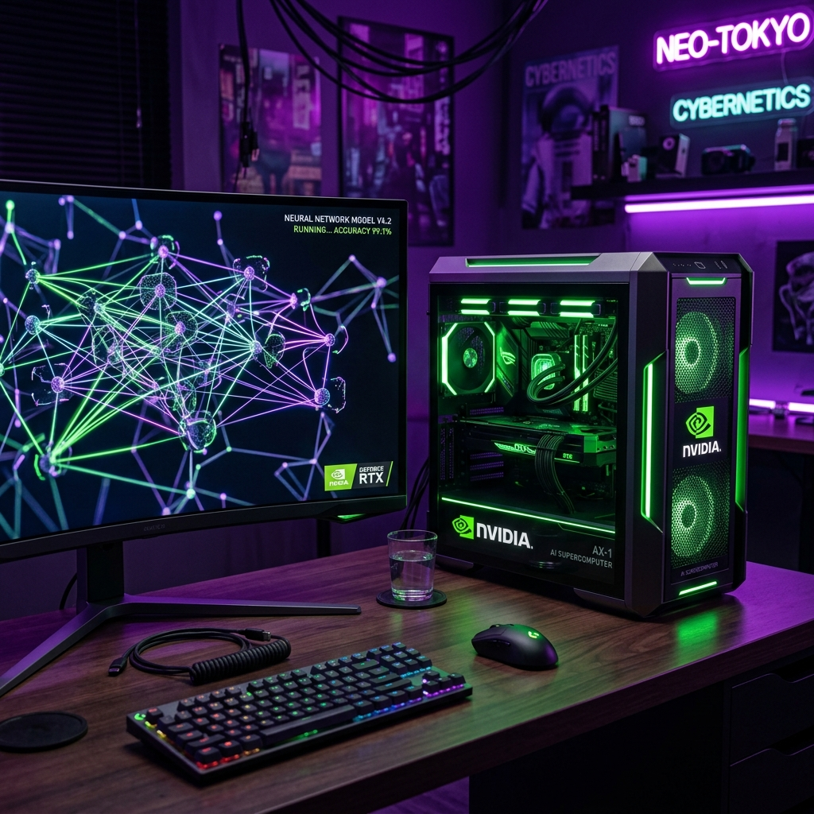
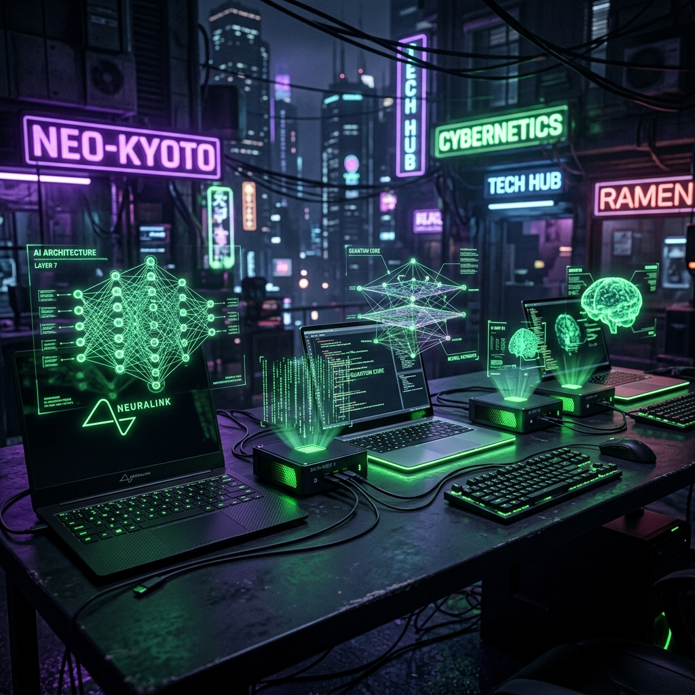
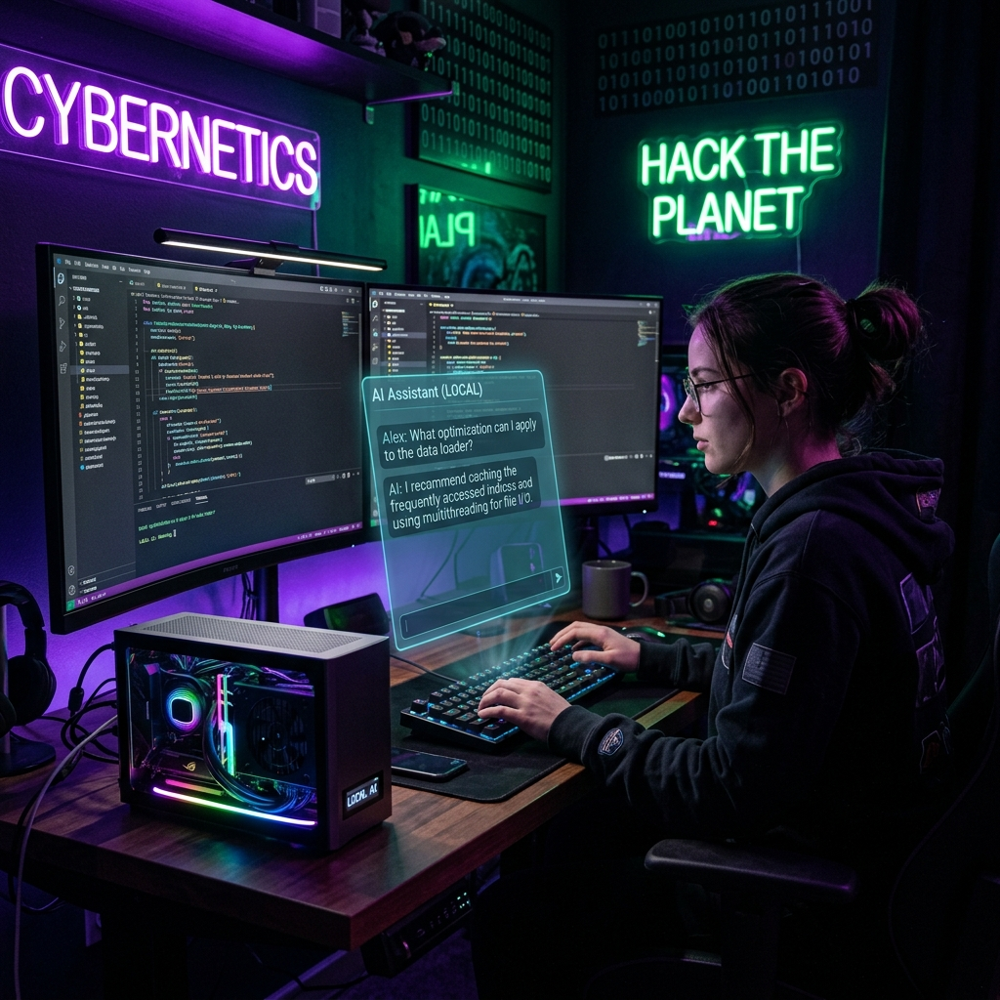

--- 
title: 'NVIDIA RTX Spark & DGX Spark: The Dawn of Personal AI Supercomputers and What It Means for Local LLM Enthusiasts'
date: 2026-06-11
authors:
  name: Bilash J. Shahi
  title: Cybersecurity Professional
  picture: https://avatars.githubusercontent.com/elodvk
  url: https://purplesec.org
tags:
  - NVIDIA
  - AI
  - LLM
  - DGX Spark
  - RTX Spark
  - Local AI
  - Hardware
  - Grace Blackwell
description: 'An in-depth look at NVIDIA RTX Spark and DGX Spark — the new personal AI supercomputers powered by Grace Blackwell silicon. From the 128GB unified memory architecture to running 200B-parameter models locally, we explore what these machines mean for developers, researchers, and the local LLM community.'
image: blog/assets/dgx_spark_hero.png
---

For years, running large language models locally has been a game of creative compromises. You buy the most GPU VRAM you can afford, quantize models down to 4-bit or lower until they barely resemble their original quality, stack multiple consumer GPUs with hacky multi-GPU setups, and still hit walls with anything beyond 70B parameters. The cloud was always the fallback — and the cloud always meant giving up privacy, paying per-token, and trusting someone else's infrastructure with your data.

NVIDIA just upended that entire equation. Not once, but twice.

At Computex 2026, they unveiled two distinct product lines that share the same revolutionary core: the **DGX Spark** — a compact desktop AI supercomputer running Linux — and the **RTX Spark** — a consumer-focused platform bringing the same silicon to Windows laptops and mini PCs from every major manufacturer on the planet.

Both deliver **1 petaflop of FP4 AI performance** and **128GB of unified memory** in form factors that fit on your desk or in your backpack. This isn't a spec sheet gimmick. This is a fundamental shift in who gets to run frontier AI models.

Let's break down everything.

---

## Part 1: DGX Spark — The AI Lab in a Box

### The Origin Story: From "Project DIGITS" to DGX Spark

The DGX Spark started life as **"Project DIGITS"** — an NVIDIA skunkworks initiative to shrink the data center DGX experience into something a single researcher could put on their desk. The premise was simple but radical: *What if every AI developer had their own personal supercomputer that spoke the same language as the billion-dollar clusters in NVIDIA's data centers?*

The answer shipped in early 2026, and it's been selling out faster than anyone anticipated.

### Hardware Specifications

| Spec | Details |
|---|---|
| **Processor** | NVIDIA GB10 Grace Blackwell Superchip |
| **CPU** | NVIDIA Grace (Arm Neoverse V2), 10 cores |
| **GPU** | NVIDIA Blackwell architecture |
| **Memory** | 128GB unified LPDDR5X (coherent CPU+GPU) |
| **AI Performance** | 1 petaFLOP (FP4) / 1,000 TOPS |
| **Networking** | ConnectX-7 (up to 200Gb/s) |
| **Multi-Node** | Link 2 units for 256GB / 405B+ parameter models |
| **Form Factor** | ~6" × 6" compact desktop |
| **OS** | DGX OS (Ubuntu-based Linux) |
| **Price** | $4,699 MSRP (raised from $3,999 due to memory supply constraints) |

### The Architecture: Why Unified Memory Changes Everything

The single most important specification is one that doesn't get enough attention: **128GB of unified, coherent memory**.

In traditional GPU computing, you have separate pools of memory — system RAM (DDR5, cheap, lots of it) and GPU VRAM (HBM or GDDR, expensive, limited). Moving data between them requires explicit transfers across the PCIe bus, which is relatively slow. This is why running a 70B model on a consumer GPU with 24GB of VRAM requires aggressive quantization and constant memory swapping — the model literally doesn't fit.

The Grace Blackwell architecture eliminates this boundary. The CPU and GPU share a single, coherent 128GB memory pool connected via **NVLink-C2C** — NVIDIA's chip-to-chip interconnect. There's no "system RAM" vs. "VRAM" distinction. The entire 128GB is accessible to both the CPU and GPU at full bandwidth without any data transfer overhead.

**What this means in practice:**

- A **Llama 3.3 70B** model at FP16 needs ~140GB of memory. With 4-bit quantization (GGUF Q4_K_M), it needs ~40GB. On DGX Spark, you can run it at **FP8 or even higher precision** with room to spare — meaning better quality output than the heavily quantized versions running on consumer hardware.
- A **200B parameter model** can fit in memory on a single unit, something that would require a multi-GPU server rack with traditional hardware.
- Two DGX Spark units linked via ConnectX-7 provide 256GB of unified memory — enough to run **Llama 3.1 405B** with aggressive quantization, or comfortably handle 200B+ models at high precision.

### The Software Stack

DGX Spark ships with the complete NVIDIA AI software ecosystem pre-installed:

- **DGX OS**: Ubuntu-based Linux, purpose-built for AI workloads
- **NVIDIA NIM**: Containerized inference microservices for deploying models
- **Ollama**: For quick, easy local model management
- **PyTorch & TensorFlow**: Pre-configured with CUDA and cuDNN optimizations
- **Jupyter Lab**: For interactive development
- **vLLM**: High-performance inference engine with tensor parallelism support

This isn't a consumer device where you're fighting driver issues and manually compiling CUDA libraries. It's designed to be a miniature data center node that just works out of the box.

### Real-World Model Performance

Based on community reports and early benchmarks:

| Model | Precision | Memory Usage | Performance |
|---|---|---|---|
| Llama 3.3 70B | Q4_K_M | ~40GB | Excellent — fast inference, plenty of headroom |
| Llama 3.3 70B | FP8 | ~70GB | Very good — higher quality than quantized |
| Llama 3.1 405B | Q4 (single unit) | ~120GB+ | Tight fit — slow but functional |
| Llama 3.1 405B | FP8 (2× linked units) | ~200GB | Usable — requires 2-node cluster |
| Mistral Large 2 (123B) | FP8 | ~62GB | Smooth — ideal workload for this hardware |
| Stable Diffusion XL | FP16 | ~8GB | Extremely fast — well within capabilities |

> **Pro tip from the community:** If you're using Ollama on DGX Spark, install it natively rather than via Docker. Multiple users have reported significant performance regressions when running Ollama inside Docker containers on this platform. For production workloads, consider vLLM or llama.cpp for better control over tensor parallelism and memory management.

---

## Part 2: RTX Spark — Blackwell for the Masses

While DGX Spark is a specialized Linux appliance for AI developers, **RTX Spark** brings the same Grace Blackwell silicon to the Windows PC ecosystem — laptops, mini PCs, and compact desktops from every major manufacturer.

Unveiled jointly by NVIDIA and Microsoft at Computex on May 31, 2026, RTX Spark represents a new category: **personal AI PCs** that can run frontier models locally while also functioning as everyday creative and gaming workstations.

### RTX Spark Superchip Specifications

| Spec | Details |
|---|---|
| **CPU** | 20-core NVIDIA Grace (Arm) |
| **GPU** | Blackwell RTX, 48 SMs, 6,144 CUDA cores, 5th-gen Tensor Cores |
| **Memory** | Up to 128GB unified LPDDR5X |
| **AI Performance** | Up to 1 petaFLOP (FP4) |
| **Interconnect** | NVLink-C2C (chip-to-chip) |
| **Connectivity** | Wi-Fi 7, Bluetooth 5.4, 10GbE, USB-C 20Gbps |
| **OS** | Windows 11 (Arm) |
| **Availability** | Fall 2026 |
| **Price** | TBD (estimates suggest ~$2,900+ for premium configs) |

### The Partner Ecosystem

Unlike DGX Spark (which is an NVIDIA-branded device), RTX Spark is a **platform** — think of it like Qualcomm's Snapdragon for PCs, but from NVIDIA. Multiple OEMs are building devices around it:

**Mini PCs & Desktops:**

- **Microsoft Surface RTX Spark Dev Box**: A compact developer-focused mini PC with a 100W sustained thermal envelope. Specifically marketed for building and testing AI agents locally.
- **ASUS ProArt GA10 Mini PC**: Targeted at creative professionals — 3D rendering, video editing, and AI-assisted workflows.
- **Dell XPS RTX Spark Desktop**: Small form factor with 10GbE, multiple USB-C ports, and HDMI output.
- **MSI EdgeMesa N AI+**: SFF desktop aimed at data scientists and AI developers.
- **HP OmniDesk Mini Desktop PC**: Enterprise-focused compact desktop.
- **Lenovo SFF RTX Spark**: Additional compact desktop options.

**Laptops:**

- **ASUS ProArt P16 (H7607) & P14 (H7407)**: Premium creator laptops with Lumina Pro OLED displays.
- **MSI Prestige N16 Flip AI+**: 16-inch 2-in-1 convertible with stylus support.
- **HP OmniBook Ultra 16**: Enterprise ultrabook with AI capabilities.
- **Surface Laptop Ultra**: Microsoft's premium consumer offering.

### RTX Spark vs. DGX Spark: Which Is For You?

| Aspect | DGX Spark | RTX Spark |
|---|---|---|
| **OS** | DGX OS (Linux) | Windows 11 (Arm) |
| **Target User** | AI researchers, ML engineers | Creators, power users, gamers |
| **Primary Use** | Model training, fine-tuning, inference | AI agents, creative apps, gaming |
| **Networking** | ConnectX-7 (200Gb/s, multi-node) | Wi-Fi 7, 10GbE (standard) |
| **Multi-Node** | Yes (link 2+ units) | No |
| **Software Stack** | DGX OS, NIM, vLLM, PyTorch | Windows apps, CUDA, DirectML |
| **Gaming** | No | Yes (DLSS, Ray Tracing, 1440p 100+ FPS) |
| **Form Factor** | Compact desktop only | Laptops + Mini PCs |
| **Available** | Now ($4,699) | Fall 2026 (TBD) |

**Choose DGX Spark if:** You're a developer or researcher who needs a Linux-based AI development environment, wants multi-node clustering, and primarily cares about model training and high-precision inference.

**Choose RTX Spark if:** You want a daily-driver PC that also happens to be capable of running large AI models locally — and you need Windows for creative software, gaming, or general productivity.

---

## Part 3: The DGX Station for Windows — The Monster in the Room

NVIDIA also unveiled a third product that deserves mention: the **DGX Station for Windows**. If DGX Spark is a scooter and RTX Spark is a sedan, the DGX Station is a freight train.

| Spec | DGX Spark | DGX Station for Windows |
|---|---|---|
| **Chip** | GB10 Grace Blackwell | GB300 Grace Blackwell Ultra Desktop |
| **CPU** | Grace (10 cores) | Grace (72 cores, Neoverse V2) |
| **GPU Memory** | Unified 128GB LPDDR5X | 252GB HBM3e (7.1 TB/s bandwidth) |
| **System Memory** | (included in unified pool) | 496GB LPDDR5X (396 GB/s) |
| **Total Memory** | 128GB | **748GB** |
| **AI Performance** | 1 petaFLOP (FP4) | **20 petaFLOPS (FP4)** |
| **Networking** | ConnectX-7 (200Gb/s) | ConnectX-8 SuperNIC (800 Gb/s) |
| **Price** | $4,699 | TBD (enterprise pricing) |
| **Availability** | Now | Q4 2026 |

With **748GB of memory** and **20 petaFLOPS**, the DGX Station for Windows can run **trillion-parameter models** locally. It can also pair with an additional RTX PRO 6000 Blackwell GPU for visualization workloads. This is clearly an enterprise machine, but it signals where the technology is heading.

---

## Part 4: What This Means for the Local LLM Community

This is the section that matters most. If you're someone who runs Ollama, llama.cpp, or vLLM on your home setup — if you've spent hours optimizing GGUF quantization parameters, debating Q4_K_M vs. Q5_K_S, or cobbling together multi-GPU rigs — these products represent a tectonic shift in what's possible.

### 1. The End of the VRAM Wall

The biggest limitation for local LLM enthusiasts has always been VRAM. Consumer GPUs top out at 24GB (RTX 4090 / RTX 5090), which means:

- **7B models**: Comfortable at any precision
- **13B models**: Fine at Q4–Q8
- **70B models**: Requires aggressive quantization (Q4 or lower) and even then, barely fits
- **100B+ models**: Practically impossible on a single consumer GPU

With 128GB of unified memory, the DGX Spark and RTX Spark **obliterate this wall**. A 70B model at FP8 precision uses ~70GB of memory — leaving 58GB free for context, KV cache, and concurrent applications. You're no longer trading model quality for the ability to run it at all.

### 2. Quantization Becomes a Choice, Not a Necessity

Today, most local LLM users run quantized models because they *have* to, not because they *want* to. Q4_K_M is the sweet spot between "fits in VRAM" and "doesn't sound like it had a stroke."

With 128GB of unified memory:

- **70B models at FP16**: ~140GB — tight, but possible with careful memory management
- **70B models at FP8**: ~70GB — comfortable, with room for large context windows
- **70B models at Q6_K**: ~55GB — extremely high quality, plenty of headroom
- **120B+ models at Q4–Q5**: ~60–75GB — models that were completely inaccessible to single-GPU users

You can now choose quantization levels based on **quality preference** rather than **hardware constraints**. That's a paradigm shift.

### 3. Privacy and Sovereignty

For cybersecurity professionals, lawyers, medical researchers, journalists, and anyone working with sensitive data — running models locally isn't just a preference, it's a **requirement**. Client data, patient records, classified documents, and proprietary code cannot be sent to OpenAI's or Anthropic's servers.

DGX Spark gives these users a viable path to running frontier-class models with zero data exfiltration risk. Your prompts, your data, your model weights — everything stays on your desk. No API keys, no usage logs, no third-party data processing agreements.

### 4. Fine-Tuning at Home

This is underappreciated. DGX Spark isn't just an inference machine — it ships with the full NVIDIA AI training stack. You can:

- Fine-tune a 7B or 13B model with **LoRA/QLoRA** on your own dataset
- Run **supervised fine-tuning (SFT)** on 70B models with gradient checkpointing
- Perform **RLHF experiments** locally without cloud compute costs
- Prototype training runs before scaling to a data center

For researchers and hobbyists who've been running LoRA fine-tunes on 24GB GPUs with batch sizes of 1, the jump to 128GB of unified memory is transformative.

### 5. The Agent Runtime

Both NVIDIA and Microsoft are betting heavily on **agentic AI** — models that don't just respond to prompts but autonomously plan, execute tasks, use tools, and interact with your operating system. RTX Spark in particular is positioned as an "AI agent runtime" where:

- A local reasoning model runs persistently in the background
- It monitors your workflow, suggests optimizations, and executes multi-step tasks
- It can browse the web, write and execute code, manage files, and interact with APIs
- All of this happens **locally**, without cloud latency or privacy concerns

This is the vision: your computer doesn't just have AI — your computer *is* an AI, running a persistent local model that understands your context and acts on your behalf.

### 6. The Cost Calculation

Let's do the math on why DGX Spark makes economic sense for heavy local LLM users:

**Cloud alternative (OpenAI API):**
- GPT-4o: ~$2.50 per 1M input tokens
- Heavy daily use (50K tokens/day): ~$45/month → **$540/year**
- For a team of 3 developers: **$1,620/year**

**DGX Spark:**
- One-time cost: $4,699
- Electricity: ~$50/year (estimated, given the compact form factor)
- Break-even vs. cloud for a single heavy user: **~8.5 months**
- Break-even for a team of 3: **~3 months**

After break-even, it's essentially free compute — no per-token costs, no rate limits, no vendor lock-in, and no data privacy concerns. For research labs, small startups, and independent developers, the economics are compelling.

---

## Part 5: Limitations and Honest Caveats

No technology review is complete without acknowledging what these devices *can't* do:

### DGX Spark Limitations
- **Not for training large models from scratch**: 128GB is enough for inference and fine-tuning, not for pre-training a 70B model (that requires thousands of GPUs and petabytes of data).
- **Single unit won't run 405B well**: Despite the marketing, a single DGX Spark running Llama 3.1 405B at usable precision is extremely tight. You realistically need 2 linked units.
- **Price increase**: The MSRP jumped from $3,999 to $4,699 due to memory supply constraints. Some third-party sellers are charging even more.
- **Linux only**: DGX Spark runs DGX OS (Ubuntu). If you need Windows, wait for RTX Spark devices.

### RTX Spark Limitations
- **Not available yet**: Fall 2026 launch means you can't buy one today. Pricing is unconfirmed.
- **Windows on Arm**: Software compatibility is improving but still imperfect. Some x86 applications may run through emulation with performance overhead.
- **No multi-node clustering**: Unlike DGX Spark, you can't link RTX Spark units together.
- **Gaming vs. AI trade-offs**: Running a large model in the background while gaming will compete for the same unified memory pool.

---

## The Bottom Line

NVIDIA has done something remarkable: they've compressed the AI compute capability that cost millions of dollars just three years ago into devices that cost less than a high-end MacBook Pro.

**For local LLM enthusiasts specifically:**

- If you've been running Ollama on a 24GB GPU and dreaming of more, **DGX Spark is the upgrade you've been waiting for**. 128GB of unified memory at $4,699 is genuinely unprecedented.
- If you want a Windows daily driver that can also run 100B+ parameter models, **wait for RTX Spark devices this fall**.
- If money is no object and you want to run trillion-parameter models on your desk, the **DGX Station for Windows** (Q4 2026) is your endgame.

The era of local AI being a compromise is ending. The era of local AI being a **choice** — a choice made for privacy, for control, for economics, for sovereignty — has arrived.

Welcome to the age of the personal AI supercomputer.

---

## References & Further Reading

- [NVIDIA DGX Spark Product Page](https://www.nvidia.com/en-us/products/dgx-spark/)
- [NVIDIA RTX Spark Announcement](https://nvidianews.nvidia.com/news/rtx-spark-ai-superchip-windows-pcs)
- [NVIDIA DGX Station for Windows](https://www.nvidia.com/en-us/products/workstations/dgx-station/)
- [Microsoft Surface RTX Spark Dev Box](https://www.microsoft.com/en-us/surface)
- [ASUS ProArt RTX Spark Devices](https://www.asus.com/proart/)
- [Ollama on DGX Spark](https://ollama.com)
- [vLLM Documentation](https://docs.vllm.ai)
