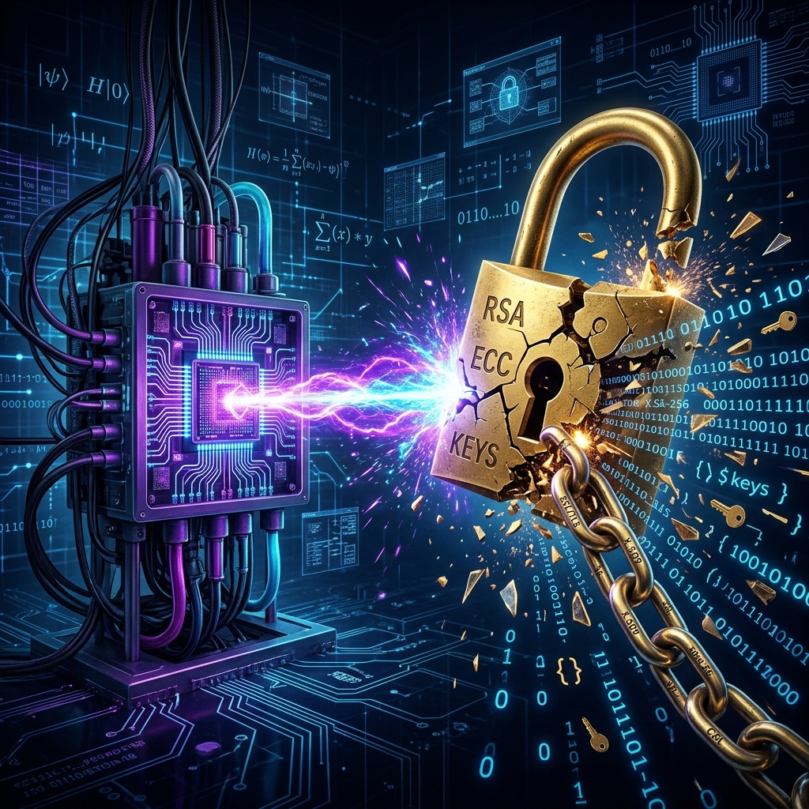
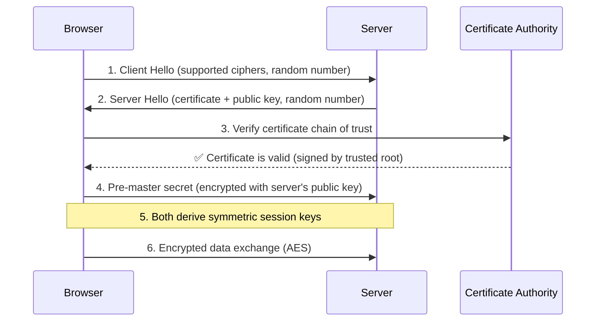
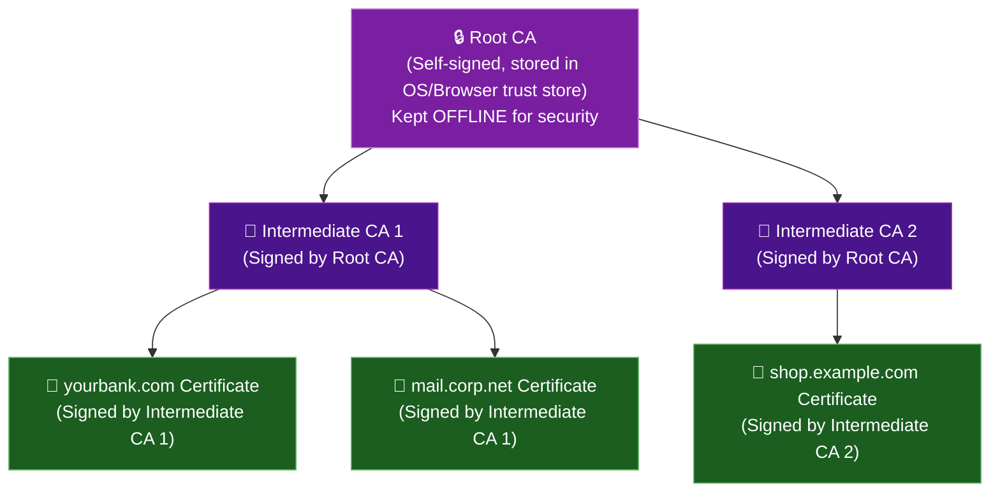
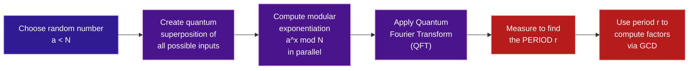
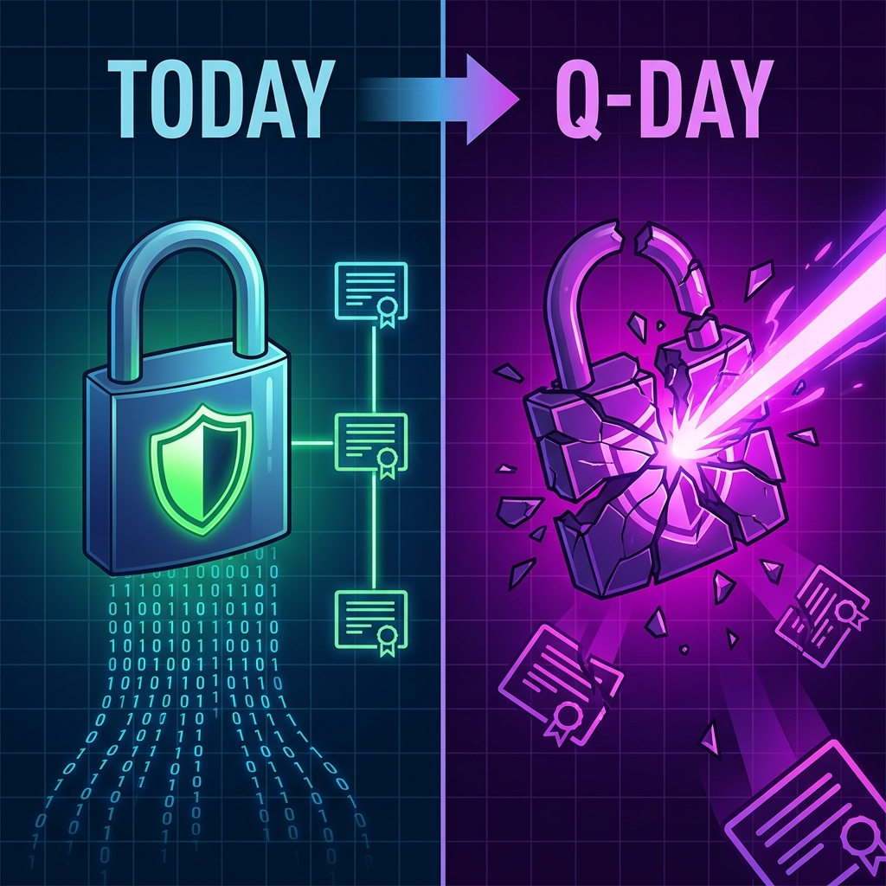
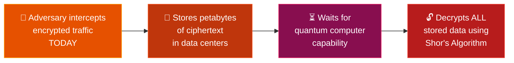
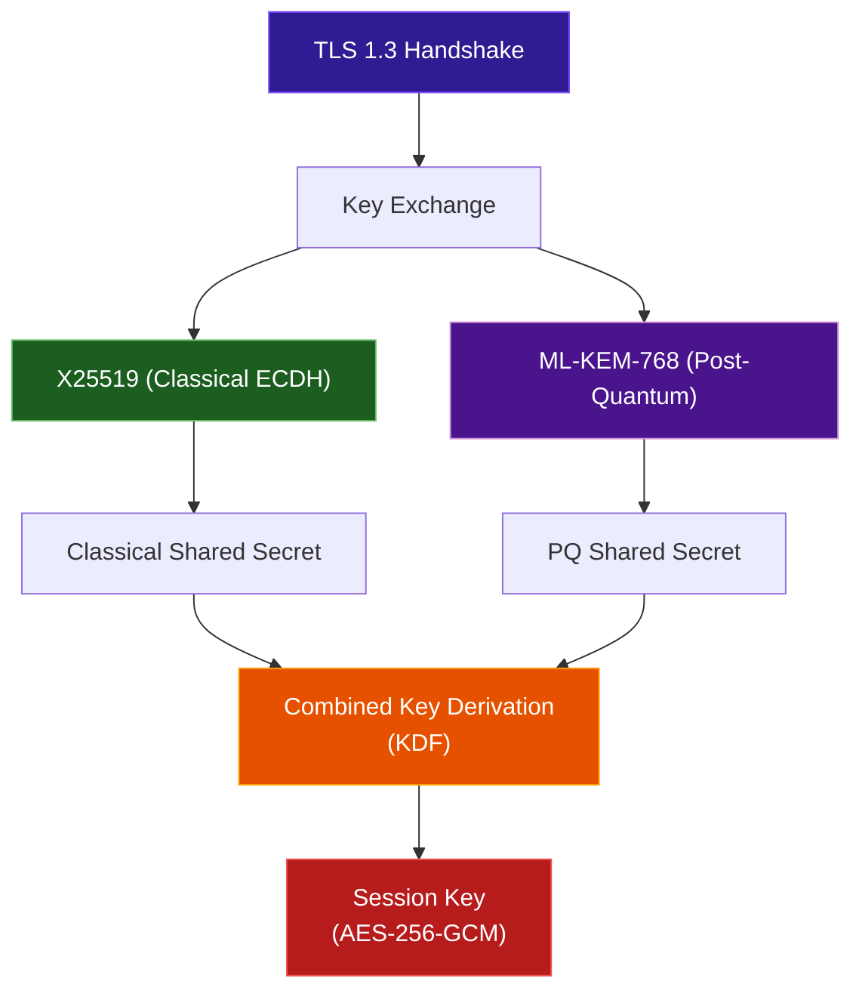
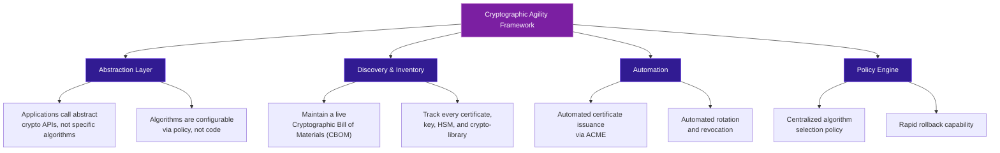

--- 
title: "Quantum Computing and PKI: The Looming Cryptographic Apocalypse and How to Survive It"
date: 2026-06-12
authors:
  name: Bilash J. Shahi
  title: Cybersecurity Professional
  picture: https://avatars.githubusercontent.com/elodvk
  url: https://purplesec.org
tags:
  - Quantum Computing
  - PKI
  - Post-Quantum Cryptography
  - Cryptography
  - TLS
  - NIST
description: "A comprehensive deep dive into how quantum computing threatens to dismantle Public Key Infrastructure (PKI), the backbone of internet security. Covers Shor's and Grover's algorithms, the Harvest Now Decrypt Later threat, NIST's post-quantum standards (ML-KEM, ML-DSA, SLH-DSA), real-world hybrid TLS deployments by Google and Cloudflare, Quantum Key Distribution vs PQC, cryptographic agility, and a practical enterprise migration checklist."
image: assets/images/blog/quantum_pki_hero.png
---

Every time you see that padlock icon in your browser, visit your bank, send an email, or sign a document digitally — you are relying on **Public Key Infrastructure (PKI)**. It is the invisible backbone of digital trust. It authenticates servers, encrypts data in transit, verifies software signatures, and secures everything from government communications to cryptocurrency wallets.

And quantum computing is about to break it.

Not *might*. Not *could*. **Will** — given sufficient time and engineering. The mathematical foundations that have secured the internet for decades — the difficulty of factoring large numbers and solving discrete logarithms — are trivially solvable by a sufficiently powerful quantum computer running **Shor's algorithm**.

The question is not *if* this will happen. The question is **when** — and whether you'll be ready.

---

## Part 1: Understanding PKI — The Foundation Under Threat

Before we can understand the threat, we need to understand what's being threatened. PKI is not a single technology — it's an **ecosystem of policies, hardware, software, and procedures** that manages the creation, distribution, storage, and revocation of digital certificates.

### The Core Components

| Component | Role |
|---|---|
| **Certificate Authority (CA)** | The trusted third party that issues, signs, and manages digital certificates. Verifies the identity of entities before issuing certificates. |
| **Registration Authority (RA)** | The gatekeeper for the CA. Verifies applicant information before the CA generates a certificate. |
| **Digital Certificates** | Cryptographic "digital passports" that bind a public key to an entity's identity. Contains the entity's information, the issuer (CA), the public key, and validity period. |
| **Hardware Security Module (HSM)** | Physical hardware used to securely store and manage cryptographic keys, protecting them from unauthorized access. |
| **Certificate Policies (CP/CPS)** | Documents defining the rules, procedures, and legal framework for how the CA operates. |

### How TLS/SSL Actually Works

When you connect to `https://yourbank.com`, a complex dance happens in milliseconds:

**The critical insight**: TLS uses **asymmetric cryptography** (RSA/ECC) only for the **handshake** — to authenticate the server and exchange a symmetric key. The actual data transfer uses **symmetric encryption** (AES), which is far more efficient. This is the hybrid model that powers every secure connection on the internet.

### The Chain of Trust

Trust in PKI is **hierarchical**. Your browser doesn't need to trust every website's certificate individually. Instead, it trusts a small set of **Root Certificate Authorities** — and any certificate that chains back to those roots is considered trustworthy.

If **any link** in this chain uses cryptography that a quantum computer can break — the **entire chain of trust collapses**.

---

## Part 2: Quantum Computing — A Crash Course

To understand *why* quantum computing threatens PKI, you need to understand *how* quantum computers fundamentally differ from classical ones.

### Classical Bits vs. Qubits

A classical computer processes information using **bits** — each bit is either `0` or `1`. A quantum computer uses **qubits**, which exploit two quantum mechanical phenomena:

| Property | Classical Bit | Qubit |
|---|---|---|
| **State** | Definitely `0` or `1` | Can be `0`, `1`, or **both simultaneously** (superposition) |
| **Interaction** | Independent | Can be **entangled** with other qubits — measuring one instantly determines the other |
| **Processing** | Sequential exploration of possibilities | Parallel exploration of **all** possibilities simultaneously |

!!! info "The Power of Superposition"
    A classical computer with 3 bits can represent **one** of 8 possible states at a time (`000`, `001`, ..., `111`). A quantum computer with 3 qubits can represent **all 8 states simultaneously** and process them in parallel. With 300 qubits, you can represent more states than there are atoms in the observable universe.

### Where Quantum Computing Stands Today (2026)

The industry has moved past the "Noisy Intermediate-Scale Quantum" (NISQ) era into the **Era of Early Fault-Tolerance**:

| Milestone | Status (2026) |
|---|---|
| **Error Correction** | Proven practical — teams have demonstrated below-threshold error suppression |
| **Primary Metric** | Shifted from physical qubit counts to **Logical Qubits** and **QuOps** (error-free operations) |
| **Google Willow** | 105-qubit processor confirmed exponential error reduction via surface codes |
| **IBM Nighthawk** | Square lattice architecture targeting 7,500-gate circuits; prototyping real-time on-chip error correction |
| **IBM Starling (2029)** | Target: 200 logical qubits capable of 100 million quantum operations |
| **AI-Accelerated Research** | IBM using LLMs to discover new, more efficient quantum error correction codes |

!!! warning "The Gap"
    Breaking RSA-2048 is estimated to require approximately **4,000 logical qubits** (which translates to **millions of physical qubits** due to error correction overhead). We're currently at ~105 physical qubits. The gap is enormous — but the trajectory is exponential, not linear.

---

## Part 3: How Quantum Computers Break PKI

Two quantum algorithms represent existential threats to modern cryptography: **Shor's Algorithm** and **Grover's Algorithm**. They target different types of encryption — and the severity of their threat differs dramatically.

### Shor's Algorithm — The PKI Killer

Shor's algorithm, published by Peter Shor in 1994, is a **period-finding** algorithm that solves two mathematical problems exponentially faster than any classical method:

1. **Integer Factorization** (breaks RSA)
2. **Discrete Logarithm Problem** (breaks ECC/DH/DSA)

**How it works (simplified):**

**The devastating implication:**

| Algorithm | Mathematical Hardness | Classical Time | Quantum Time (Shor's) | Impact |
|---|---|---|---|---|
| **RSA-2048** | Integer Factorization | ~2^112 operations (billions of years) | Polynomial time (hours) | 💀 **Broken** |
| **ECDSA-256** | Elliptic Curve Discrete Log | ~2^128 operations | Polynomial time (hours) | 💀 **Broken** |
| **DH / ECDH** | Diffie-Hellman Key Exchange | ~2^128 operations | Polynomial time (hours) | 💀 **Broken** |
| **DSA** | Discrete Logarithm | ~2^112 operations | Polynomial time (hours) | 💀 **Broken** |

Every TLS handshake, every digital signature, every certificate in every chain of trust — **all of it** relies on one of these algorithms.

### Grover's Algorithm — The Symmetric Weakener

Grover's algorithm provides a **quadratic** (not exponential) speedup for searching unstructured databases. Applied to symmetric encryption:

| Symmetric Cipher | Classical Security | Post-Quantum Security (Grover's) | Status |
|---|---|---|---|
| **AES-128** | 128-bit | 64-bit (effectively weakened) | ⚠️ Theoretically vulnerable |
| **AES-192** | 192-bit | 96-bit | ✅ Still strong |
| **AES-256** | 256-bit | 128-bit | ✅ **Quantum-safe** |

!!! tip "The Good News"
    Unlike asymmetric encryption, symmetric encryption is **not broken** by quantum computing — it's merely **weakened**. The fix is simple: use **AES-256** instead of AES-128. No new algorithms needed.

!!! note "Why Grover's Is Less Scary Than Shor's"
    Running Grover's algorithm against AES-128 would still require performing $2^{64}$ quantum operations — each involving a full AES circuit implemented as a reversible quantum gate. The physical qubit and error-correction overhead makes this attack practically infeasible for the foreseeable future. AES-256 makes it mathematically impossible.

---

## Part 4: The "Harvest Now, Decrypt Later" Threat

Here's why the quantum threat is **not a future problem** — it's a **present danger**.

### The Attack Pattern

Nation-state adversaries and sophisticated threat actors are executing a strategy called **"Harvest Now, Decrypt Later" (HNDL)**:

**What's at risk right now:**

- **Government classified communications** with multi-decade sensitivity
- **Medical records** protected by HIPAA (with lifelong privacy requirements)
- **Financial data** including transaction records and account credentials
- **Intellectual property** — trade secrets, patents, R&D data
- **Military and intelligence communications**
- **Legal documents** — contracts, NDAs, privileged communications
- **Personal data** — anything encrypted today that should remain private in 10+ years

!!! danger "The Math Is Simple"
    If your data needs to remain confidential for **X years**, and a quantum computer capable of breaking your encryption will exist in **Y years**, and it takes your organization **Z years** to migrate to quantum-safe cryptography — then if **X + Z > Y**, your data is **already compromised**. You just don't know it yet.

---

## Part 5: The NIST Post-Quantum Cryptography Standards

In August 2024, after an 8-year evaluation process, NIST finalized the first three **Post-Quantum Cryptography (PQC)** standards — the algorithms designed to replace RSA and ECC in a quantum-computing world.

### The Three Standards

#### FIPS 203: ML-KEM (Module-Lattice-Based Key-Encapsulation Mechanism)

- **Formerly**: CRYSTALS-Kyber
- **Purpose**: Key encapsulation — securely establishing a shared secret key over a public channel. Replaces ECDH and RSA key exchange.
- **Mathematical Basis**: Module Learning with Errors (M-LWE) — a lattice-based problem
- **Security Levels**: ML-KEM-512, ML-KEM-768, ML-KEM-1024 (increasing security, decreasing performance)

#### FIPS 204: ML-DSA (Module-Lattice-Based Digital Signature Algorithm)

- **Formerly**: CRYSTALS-Dilithium
- **Purpose**: Digital signatures — authentication, integrity, and non-repudiation. Drop-in replacement for RSA and ECDSA signatures.
- **Mathematical Basis**: Module-LWE and Module-SIS (Short Integer Solution) using the "Fiat-Shamir with aborts" paradigm
- **Use Case**: General-purpose digital signatures in certificates, code signing, document signing

#### FIPS 205: SLH-DSA (Stateless Hash-Based Digital Signature Algorithm)

- **Formerly**: SPHINCS+
- **Purpose**: Conservative alternative to lattice-based signatures. Security derived **entirely from hash functions** — no lattice math.
- **Mathematical Basis**: Cryptographic hash functions (no new mathematical assumptions)
- **Use Case**: High-value, long-lived applications — root CAs, treaties, deeds, long-term document signing — where security endurance is prioritized over performance

### Comparison of NIST PQC Standards

| Feature | ML-KEM (FIPS 203) | ML-DSA (FIPS 204) | SLH-DSA (FIPS 205) |
|---|---|---|---|
| **Type** | Key Encapsulation | Digital Signature | Digital Signature |
| **Math Basis** | Lattice (M-LWE) | Lattice (M-LWE/SIS) | Hash-based |
| **Replaces** | RSA/ECDH key exchange | RSA/ECDSA signatures | RSA/ECDSA signatures |
| **Key Size** | ~800–1,568 bytes | ~1,312–2,592 bytes | ~32–64 bytes (but signatures are **large**: 7–49 KB) |
| **Performance** | Fast | Fast | Slower (but conservative) |
| **Trust Basis** | Lattice hardness assumption | Lattice hardness assumption | Hash function security (well-understood) |
| **Best For** | TLS key exchange, VPNs | General-purpose signing | Root CAs, long-term signing |

!!! info "Why Two Signature Standards?"
    ML-DSA is the **primary** recommendation — fast, compact, and efficient. SLH-DSA exists as a **backup** based on different mathematical assumptions. If someone discovers an attack on lattice-based cryptography, SLH-DSA (which relies only on hash functions) remains unaffected. This is defense-in-depth at the algorithmic level.

### The Key Size Problem

One of the biggest practical challenges of PQC is the **dramatic increase in key and signature sizes**:

| Algorithm | Public Key | Signature / Ciphertext |
|---|---|---|
| **RSA-2048** (classical) | 256 bytes | 256 bytes |
| **ECDSA P-256** (classical) | 64 bytes | 64 bytes |
| **ML-KEM-768** (PQC) | 1,184 bytes | 1,088 bytes |
| **ML-DSA-65** (PQC) | 1,952 bytes | 3,309 bytes |
| **SLH-DSA-128s** (PQC) | 32 bytes | 7,856 bytes |

This size increase has real implications:

- **TLS handshakes** become larger, potentially requiring multiple round-trips
- **Certificate chains** grow significantly, impacting page load times
- **IoT devices** with limited memory and bandwidth face constraints
- **DNS and DNSSEC** records may exceed UDP packet size limits

---

## Part 6: Real-World Deployment — It's Already Happening

The transition to post-quantum cryptography is not theoretical. As of mid-2026, major industry players have already deployed hybrid quantum-safe protections at scale.

### Google Chrome

Chrome has fully integrated **hybrid post-quantum key exchange** using **X25519MLKEM768** — a combination of the classical X25519 (Curve25519 ECDH) and post-quantum ML-KEM-768. This is enabled **by default** in Chrome 131+ for both TLS 1.3 and QUIC connections.

### Cloudflare

Cloudflare has deployed hybrid ML-KEM + X25519 key exchange across its **entire global network**. As of early 2026, the majority of human-initiated traffic through Cloudflare is already protected by post-quantum encryption.

### The Hybrid Approach

The industry has wisely adopted a **"hybrid-first"** strategy:

**Why hybrid?**

- If ML-KEM is broken (e.g., a lattice attack is discovered), X25519 still protects the connection
- If a quantum computer breaks X25519, ML-KEM still protects the connection
- **Both** must be compromised simultaneously to break the session — defense-in-depth

### Accelerated Timelines

In April 2026, both Google and Cloudflare announced a **2029 deadline** for achieving full post-quantum security — including not just key exchange but also **post-quantum authentication** (digital signatures in certificates).

| Phase | Focus | Status (2026) |
|---|---|---|
| **Phase 1** | Key Exchange (protect against HNDL) | ✅ Deployed at scale |
| **Phase 2** | Authentication (PQ signatures in certificates) | 🔄 In progress |
| **Phase 3** | Full PQ security (all protocols, all layers) | 📋 Targeted for 2029 |

---

## Part 7: Quantum Key Distribution (QKD) — The Physics-Based Alternative

Post-Quantum Cryptography isn't the only approach to quantum-safe security. **Quantum Key Distribution (QKD)** takes a fundamentally different path — using the laws of physics rather than mathematical hardness.

### How QKD Works

QKD uses quantum mechanical properties (specifically, the **no-cloning theorem** and **Heisenberg's uncertainty principle**) to distribute encryption keys:

1. **Photon Transmission**: The sender encodes key bits onto individual photons using polarization states
2. **Quantum Measurement**: The receiver measures the photons using randomly chosen bases
3. **Basis Reconciliation**: Both parties publicly compare their measurement bases (not results) and keep only the bits where they used the same basis
4. **Eavesdropping Detection**: Any interception attempt disturbs the quantum state of the photons, introducing detectable errors. If the error rate exceeds a threshold, the key is discarded

### QKD vs. PQC — A Comparison

| Feature | QKD (Physics-Based) | PQC (Math-Based) |
|---|---|---|
| **Security Guarantee** | Provable (laws of physics) | Computational (mathematical assumption) |
| **Eavesdrop Detection** | ✅ Built-in | ❌ Not available |
| **Infrastructure** | Requires dedicated fiber optic/satellite links | Runs on existing internet infrastructure |
| **Distance** | Limited (~100-400 km without repeaters) | Unlimited (software-based) |
| **Scalability** | Low (point-to-point) | High (global deployment) |
| **Cost** | Very high (specialized hardware) | Low (software update) |
| **Consumer Devices** | ❌ Cannot run on phones/laptops | ✅ Works everywhere |
| **Standardization** | Limited | NIST FIPS 203/204/205 finalized |

!!! note "The Verdict"
    QKD is a **premium, physics-guaranteed** solution for ultra-high-value point-to-point links (government, military, financial backbone). PQC is the **practical, scalable standard** for securing the broader internet. They are complementary, not competing technologies. Many experts recommend using both where feasible — PQC as the universal foundation, QKD for the highest-value links.

---

## Part 8: Cryptographic Agility — The Meta-Strategy

Beyond any specific algorithm, the overarching lesson of the quantum threat is the need for **cryptographic agility** — the ability to swap cryptographic algorithms without rebuilding your entire infrastructure.

### Why Agility Matters

History shows that cryptographic algorithms have a shelf life:

| Year | Event |
|---|---|
| 1977 | DES standardized |
| 1999 | DES broken by brute force (22 hours) |
| 2001 | AES replaces DES |
| 2004 | MD5 collision attacks demonstrated |
| 2005 | SHA-1 theoretical weaknesses found |
| 2017 | SHA-1 practical collision (Google's SHAttered) |
| 2024 | NIST finalizes PQC standards |
| 202X | ??? (Future lattice-based attack discovered?) |

If your systems are hardcoded to a single algorithm, every transition is a multi-year, multi-million-dollar crisis. If your systems are **cryptographically agile**, it's a configuration change.

### Building Cryptographic Agility

---

## Part 9: The Forcing Function — 47-Day Certificate Lifespans

As the industry prepares for the quantum transition, another massive shift is happening concurrently: the drastic reduction of certificate lifetimes.

In April 2025, the CA/Browser Forum passed **Ballot SC-081v3**, officially adopting a phased plan led by Apple and Google to reduce the maximum lifetime of publicly trusted TLS/SSL certificates from 398 days down to just **47 days** by 2029.

### The Phased Timeline

| Effective Date | Max Certificate Lifetime | Impact |
|---|---|---|
| **Current** | 398 days | Annual manual renewals are barely manageable |
| **March 15, 2026** | 200 days | Bi-annual renewals begin to force automation adoption |
| **March 15, 2027** | 100 days | Manual management becomes effectively impossible |
| **March 15, 2029** | 47 days | Continuous automated issuance (e.g., ACME) is mandatory |

### Why This Matters for Quantum Readiness

This reduction isn't happening in a vacuum. It is a deliberate **forcing function** for cryptographic agility. 

1. **Limiting Exposure:** If a private key is compromised (whether by a classical breach or a future quantum attack), a shorter certificate lifespan drastically reduces the window of vulnerability.
2. **Forcing Automation:** You cannot manually renew thousands of certificates every 47 days. The new rules force enterprises to implement **Automated Certificate Management Environments (ACME)**. Once you have an automated pipeline, swapping out an RSA certificate for an ML-DSA (post-quantum) certificate across your entire infrastructure becomes a centralized configuration change rather than a multi-year IT project.

### Does This Impact Enterprise Internal PKI?

**Officially, no. Practically, yes.**

The CA/Browser Forum rules apply strictly to **publicly trusted certificates** (those issued by CAs embedded in browser/OS trust stores like DigiCert, Let's Encrypt, etc.). If you run a private, internal Root CA (e.g., Microsoft AD CS, HashiCorp Vault) for your intranet, VPNs, or internal microservices, the 47-day limit is not enforced by browsers for *your* private root.

However, enterprises are adopting the 47-day (or even shorter) lifespan for internal PKI for several reasons:

- **Unified Tooling:** It makes no sense to maintain an automated ACME pipeline for public certificates and a manual, spreadsheet-based process for internal ones. Standardizing on automated issuance reduces operational overhead.
- **Zero Trust Architecture:** Modern internal architectures (like service meshes or Kubernetes mTLS) already issue certificates with lifetimes measured in hours or days, not years.
- **Quantum Preparation:** The same crypto-agility benefits apply internally. When you need to rotate your internal infrastructure to post-quantum algorithms, a short-lived, fully automated internal PKI is the only way to execute the transition smoothly.

---

## Part 10: Your Action Plan — The Enterprise Migration Checklist

The migration to post-quantum PKI is a **multi-year program**, not a weekend project. Here's a structured roadmap:

### Phase 1: Discovery & Assessment (Start Now)

- [ ] **Establish a PQC Steering Committee** — Security, IT, Legal, Compliance, and business leadership
- [ ] **Build a Cryptographic Inventory (CBOM)** — Catalog every certificate, key, HSM, and crypto-library in your environment
- [ ] **Classify Data by Sensitivity** — Identify data requiring long-term confidentiality (10+ years): medical, financial, IP, legal
- [ ] **Assess HNDL Exposure** — Determine what sensitive data is currently being transmitted using vulnerable algorithms
- [ ] **Map Regulatory Requirements** — Align with NIST SP 800-208, CNSA 2.0, DORA, NIS2, and sector-specific mandates
- [ ] **Vendor Assessment** — Survey all third-party vendors, cloud providers, and partners on their PQC readiness

### Phase 2: Architecture & Planning (2026–2027)

- [ ] **Adopt a Hybrid-First Strategy** — Never deploy PQC algorithms in isolation; always pair with classical algorithms
- [ ] **Prioritize Key Exchange** — Deploy ML-KEM for TLS/VPN to mitigate HNDL risk immediately
- [ ] **Upgrade to TLS 1.3** — Mandatory for effective PQC implementation
- [ ] **Modernize PKI Infrastructure** — Ensure CA/RA systems support PQC and hybrid certificate chains
- [ ] **Deploy Automated Certificate Lifecycle Management** — ACME-based automation; manual processes won't survive the transition
- [ ] **Update HSMs** — Verify hardware security modules support PQC key generation and storage
- [ ] **Update CP/CPS Documents** — Include hybrid certificate issuance and rollback procedures

### Phase 3: Implementation & Testing (2027–2029)

- [ ] **Pilot PQC in Sandboxed Environments** — Use PQC-ready libraries (Bouncy Castle, liboqs, wolfSSL) to test interoperability
- [ ] **Performance Benchmarking** — Monitor latency, bandwidth, and storage impacts from larger PQC keys/signatures
- [ ] **Transition Digital Signatures** — Migrate to ML-DSA for general signing; SLH-DSA for root CAs and long-term documents
- [ ] **Require PQC Support in Procurement** — All new hardware and software purchases must support PQC
- [ ] **Enable Hybrid TLS** — Deploy X25519MLKEM768 on public-facing services

### Phase 4: Full Migration & Monitoring (2029–2035)

- [ ] **Deprecate Legacy Algorithms** — Phase out RSA and ECC for new deployments
- [ ] **Continuous Monitoring** — Dashboards tracking migration progress and cryptographic asset status
- [ ] **Incident Response Updates** — Playbooks for cryptographic algorithm failure and rapid revocation
- [ ] **Regular Reassessment** — Monitor quantum computing milestones and adjust timelines accordingly

### Key Compliance Deadlines

| Deadline | Requirement |
|---|---|
| **2027** | US National Security Systems must begin CNSA 2.0 compliance |
| **2029** | Google/Cloudflare target for full PQ security |
| **2030** | Multiple EU/APAC regulatory frameworks require PQC readiness |
| **2035** | Full deprecation of legacy algorithms; complete transition expected |

---

## Part 11: What Quantum Computing Does NOT Break

It's equally important to understand what quantum computing **does not** threaten:

| Technology | Quantum Impact | Required Action |
|---|---|---|
| **AES-256** | Reduced to 128-bit security (still extremely strong) | ✅ Already quantum-safe |
| **SHA-256 / SHA-3** | Grover's provides quadratic speedup, but still computationally infeasible | ✅ Already quantum-safe |
| **HMAC** | Unaffected | ✅ No action needed |
| **Symmetric key protocols** | Weakened but not broken | Upgrade to 256-bit keys |
| **Blockchain PoW** | Mining advantage, not breakage | Monitor |
| **Blockchain signatures (ECDSA)** | 💀 **Broken** | Migrate to PQC signatures |

!!! tip "The Pattern"
    Quantum computing **destroys asymmetric/public-key cryptography** (RSA, ECC, DH) but only **weakens symmetric cryptography** (AES, SHA). The fix for symmetric is simple (larger keys). The fix for asymmetric requires entirely new algorithms — which is exactly what NIST's PQC standards provide.

---

## Conclusion: The Clock Is Ticking

The quantum threat to PKI is not a distant, abstract concern. It is a **present-day operational risk** because of Harvest Now, Decrypt Later attacks. Every day that passes with data encrypted by RSA or ECC in transit is another day of potential exposure.

The good news: the tools to defend against this threat **already exist**. NIST has finalized the standards. Google and Cloudflare have proven they work at scale. Libraries like `liboqs`, Bouncy Castle, and wolfSSL provide implementations. The hybrid approach means you don't have to bet everything on new, unproven algorithms — you layer them with battle-tested classical crypto.

The bad news: the migration is **hard**. It touches every certificate, every TLS endpoint, every HSM, every code-signing workflow, every VPN, and every API in your organization. It requires cryptographic agility — the ability to swap algorithms without rebuilding infrastructure. Organizations that start now will have years to migrate gracefully. Organizations that wait will face a panicked, error-prone scramble.

The era of RSA and ECC as the bedrock of digital trust has an expiration date. **The only question is whether you'll be ready when it arrives.**

---

## References & Further Reading

- [NIST Post-Quantum Cryptography Standards (FIPS 203, 204, 205)](https://csrc.nist.gov/projects/post-quantum-cryptography)
- [NIST SP 800-208: Recommendation for Stateful Hash-Based Signature Schemes](https://csrc.nist.gov/publications/detail/sp/800-208/final)
- [Cloudflare: Post-Quantum Cryptography Deployment](https://blog.cloudflare.com/post-quantum-for-all/)
- [Google Security Blog: Quantum-Safe Connections in Chrome](https://security.googleblog.com/)
- [CISA: Post-Quantum Cryptography Initiative](https://www.cisa.gov/quantum)
- [IBM Quantum Roadmap](https://www.ibm.com/quantum/roadmap)
- [Peter Shor's Original Paper (1994)](https://arxiv.org/abs/quant-ph/9508027)
- [PQShield: Post-Quantum Enterprise Guidance](https://pqshield.com/)
- [Cloudflare Radar: Post-Quantum Statistics](https://radar.cloudflare.com/)
- [CNSA 2.0 Algorithm Guidance (NSA)](https://media.defense.gov/2022/Sep/07/2003071834/-1/-1/0/CSA_CNSA_2.0_ALGORITHMS_.PDF)
