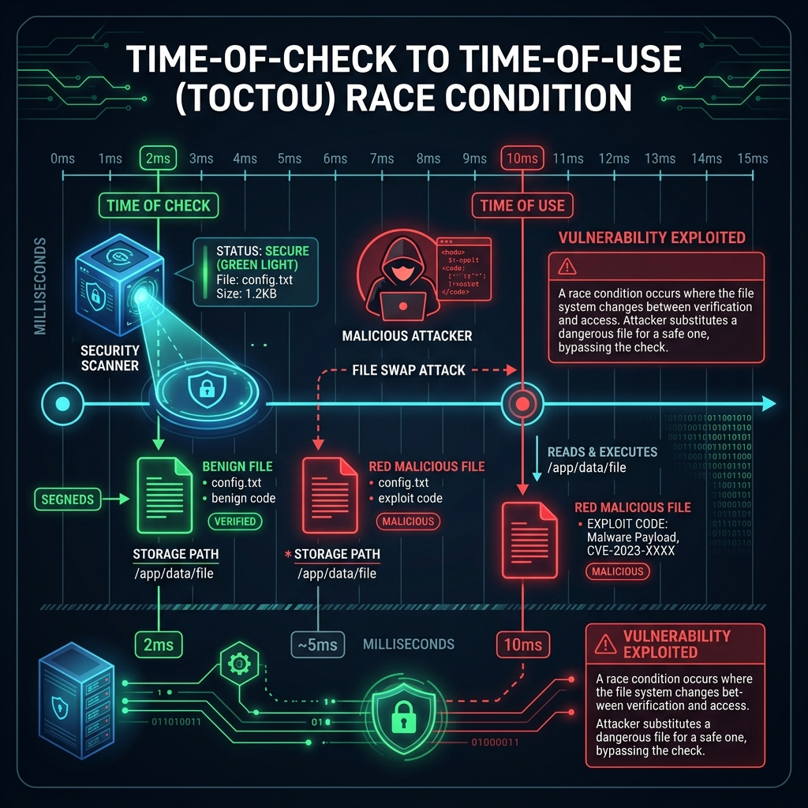

# RoguePlanet: Deep Dive into the Microsoft Defender TOCTOU Zero-Day (CVE-2026-50656)

On June 10, 2026, the cybersecurity landscape was jolted by the release of a highly critical zero-day exploit dubbed **RoguePlanet**. Targeting the omnipresent Microsoft Defender, this exploit enables local privilege escalation (LPE) to full `SYSTEM` authority on fully patched Windows 10 and Windows 11 machines.

The release of RoguePlanet is the latest escalation in a fierce, high-profile dispute between Microsoft and a prolific anonymous researcher known as **Nightmare Eclipse** (also tracked as *Chaotic Eclipse*). In this post, we’ll break down the technical mechanics of the vulnerability, the context of its release, and what defenders need to know right now.

## The Threat Actor: Nightmare Eclipse

Before diving into the bits and bytes, it is essential to understand the origin of this exploit. The researcher known as **Nightmare Eclipse** has been on a relentless disclosure campaign since March 2026. Prior to RoguePlanet, they released a string of high-impact Windows zero-days, including *BlueHammer*, *RedSun*, *UnDefend*, *YellowKey*, and *GreenPlasma*.

Industry reports heavily suspect that Nightmare Eclipse may be a former Microsoft employee. Their deep, undocumented knowledge of internal Windows architectures and their explicitly confrontational disclosure timeline—often releasing exploits hours after "Patch Tuesday" to maximize the exposure window—points to a targeted vendetta regarding vulnerability reporting and professional disputes.

### A Public Cry of Agony

What sets RoguePlanet apart from previous releases in the Nightmare Eclipse campaign is the intensely personal and emotional nature of its public disclosure. The exploit was published in a public GitHub repository (`MSNightmare/RoguePlanet`), and embedded directly within the source code of the Proof-of-Concept (PoC) is a raw, agonizing message directed at the Microsoft Security Response Center (MSRC):

```cpp
// The RoguePlanet exploit by Nightmare-Eclipse
// MSRC you won't be able to keep up.

// I really hate doing this, I really do, but I don't have any choices,
// For the first time in my life, my tears burned my eyes adding more pain to the existing agony.
// You know that Microsoft, why do you keep doing this to me...
```

This desperate commentary strongly reinforces the theory that Nightmare Eclipse is a deeply disillusioned former insider. The juxtaposition of a highly sophisticated, low-level TOCTOU exploit with a message of profound personal grief paints a picture of a researcher who feels completely betrayed by the organization they once defended. It transforms RoguePlanet from a mere software vulnerability into a high-stakes psychological drama playing out on the global cybersecurity stage.

## Technical Analysis: CVE-2026-50656

Microsoft has officially tracked the RoguePlanet vulnerability under **CVE-2026-50656**. At its core, RoguePlanet is a **Time-of-Check to Time-of-Use (TOCTOU)** race condition located within Microsoft Defender's real-time scanning engine (`MsMpEng.exe`).

### The TOCTOU Mechanism

Time-of-Check to Time-of-Use vulnerabilities occur when a system verifies a condition (such as file permissions or file identity) but the state of that condition changes before the system actually uses or acts upon the file. 



In the case of Microsoft Defender:
1. **The Check Phase:** When a new file is created or modified, Defender's filesystem filter driver intercepts the action. The engine briefly locks or inspects the file to determine its threat level. It checks the path, attributes, and file contents.
2. **The Race Window:** There is a microsecond delta between when Defender approves the file and when the OS executes the subsequent privileged operations (like a quarantine rollback, signature update, or scanning log write).
3. **The Use Phase (Exploitation):** The RoguePlanet PoC aggressively abuses NTFS directory junctions and opportunistic locks (Oplocks) to pause the Defender thread. During this tiny window, the exploit swaps the legitimate file that was just "checked" with a malicious payload or a hardlink pointing to a protected system binary.
4. **Execution:** Because Defender operates with `NT AUTHORITY\SYSTEM` privileges, when the scanner attempts to modify or interact with the file during the "use" phase, it inadvertently overwrites arbitrary system files or triggers the execution of the attacker's payload at the highest privilege level.

### Exploit Reliability

Because TOCTOU vulnerabilities inherently rely on winning a CPU race condition, the RoguePlanet PoC is noted to be occasionally unreliable. Attackers may need to trigger the exploit multiple times to successfully win the race. However, when the race is won, the result is an immediate, unprompted `SYSTEM` shell.

## Defense and Mitigation

As of late June 2026, Microsoft has acknowledged the vulnerability and is actively working on a "high-quality security update" to address the flaw. However, patching race conditions in core filesystem filter drivers is notoriously complex and prone to causing system instability, which explains the delayed patch cycle.

### What Defenders Can Do Today

While we wait for the official patch for CVE-2026-50656, defenders must rely on behavioral heuristics and defense-in-depth strategies:

1. **Monitor Oplock Abuse:** TOCTOU exploits frequently rely on Opportunistic Locks (Oplocks) to win race conditions. Monitor for unusual processes aggressively requesting and releasing Oplocks, particularly on temporary files or within user-writable directories.
2. **Watch for Suspicious Junctions:** The exploit requires the creation of rapid NTFS directory junctions (using mechanisms similar to `CreateMountPoint`). High-frequency creation and deletion of junctions by unprivileged processes should trigger EDR alerts.
3. **Restrict Local Execution:** Since this is a Local Privilege Escalation (LPE) vulnerability, an attacker must first gain a foothold on the system. Enforcing strict AppLocker policies, restricting PowerShell, and maintaining robust phishing defenses will prevent attackers from getting the initial access required to run RoguePlanet.

## The Broader Implications

RoguePlanet is not just a fascinating technical flaw; it is a flashpoint in the ongoing debate around vulnerability disclosure. By intentionally weaponizing the Patch Tuesday cycle, Nightmare Eclipse is forcing a conversation—albeit destructively—about how mega-vendors handle bug bounty communications and patch timelines.

Until Microsoft delivers a definitive fix for CVE-2026-50656, organizations must remain highly vigilant, assuming that any standard user account compromise can now trivially escalate to full Domain dominance if left unchecked.

***

*Stay tuned to the PurpleSec Knowledge Base as we continue to track the Nightmare Eclipse zero-day campaign and provide updates on mitigation strategies.*
