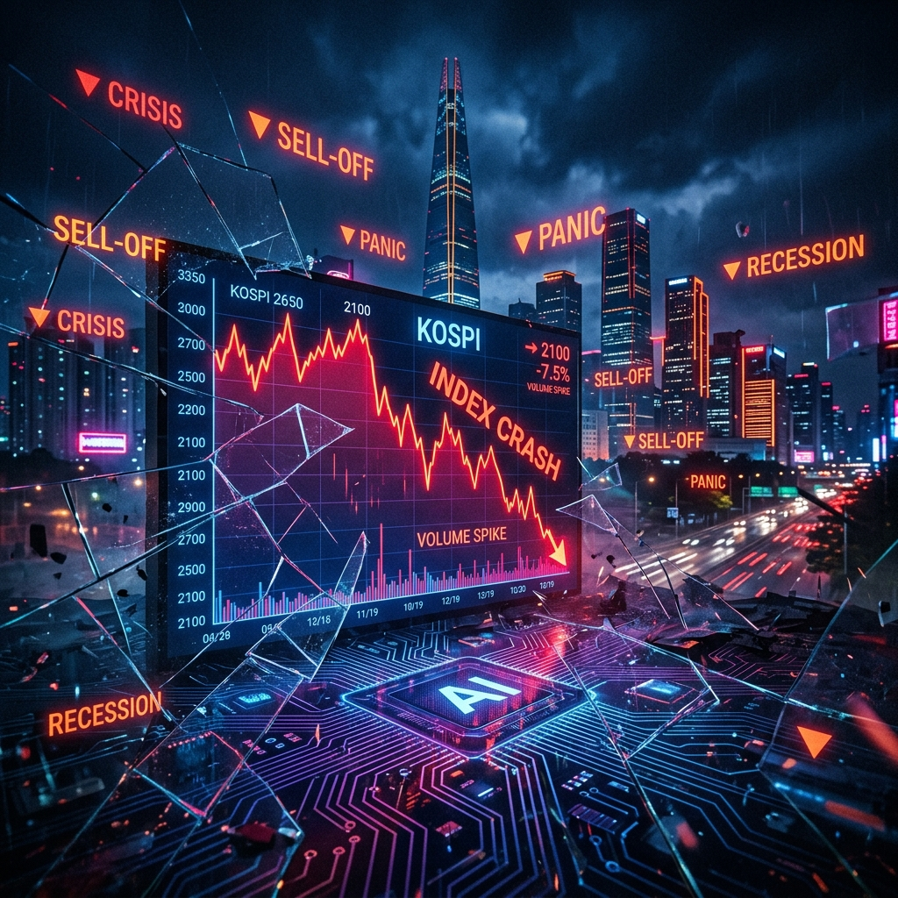
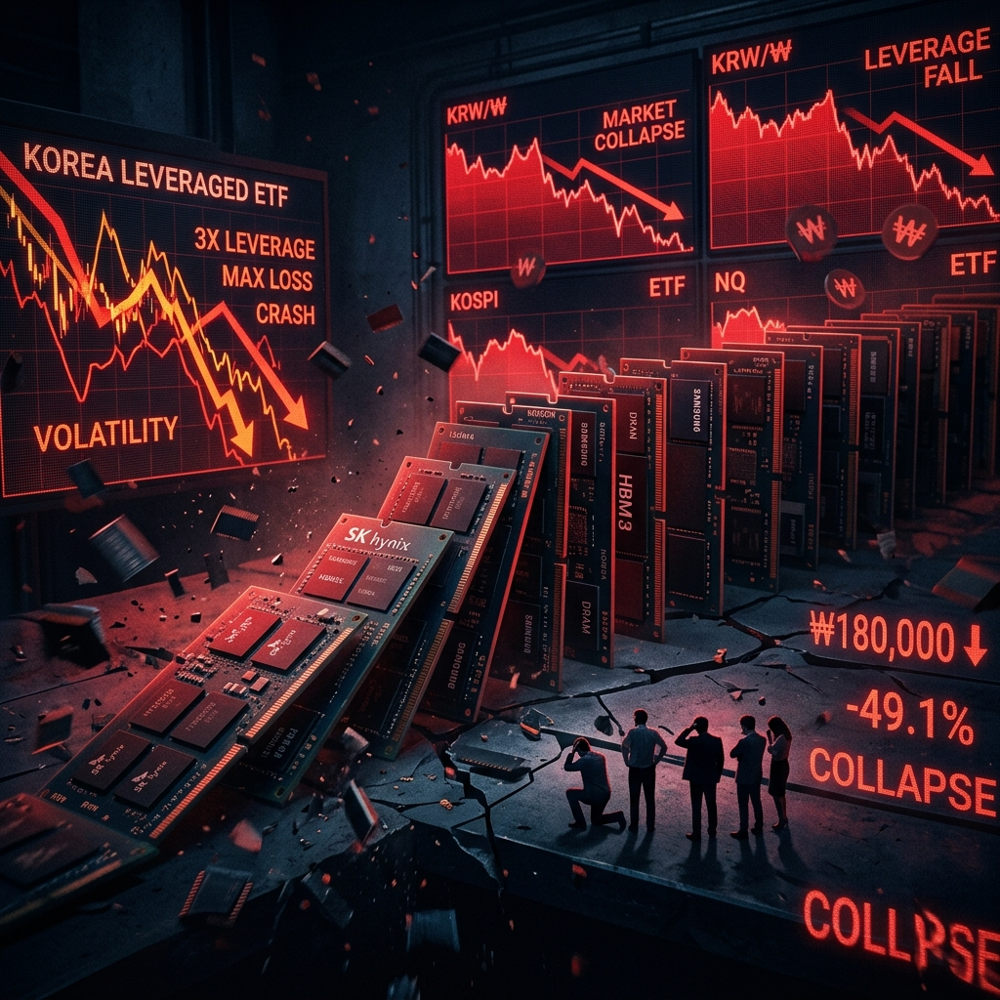
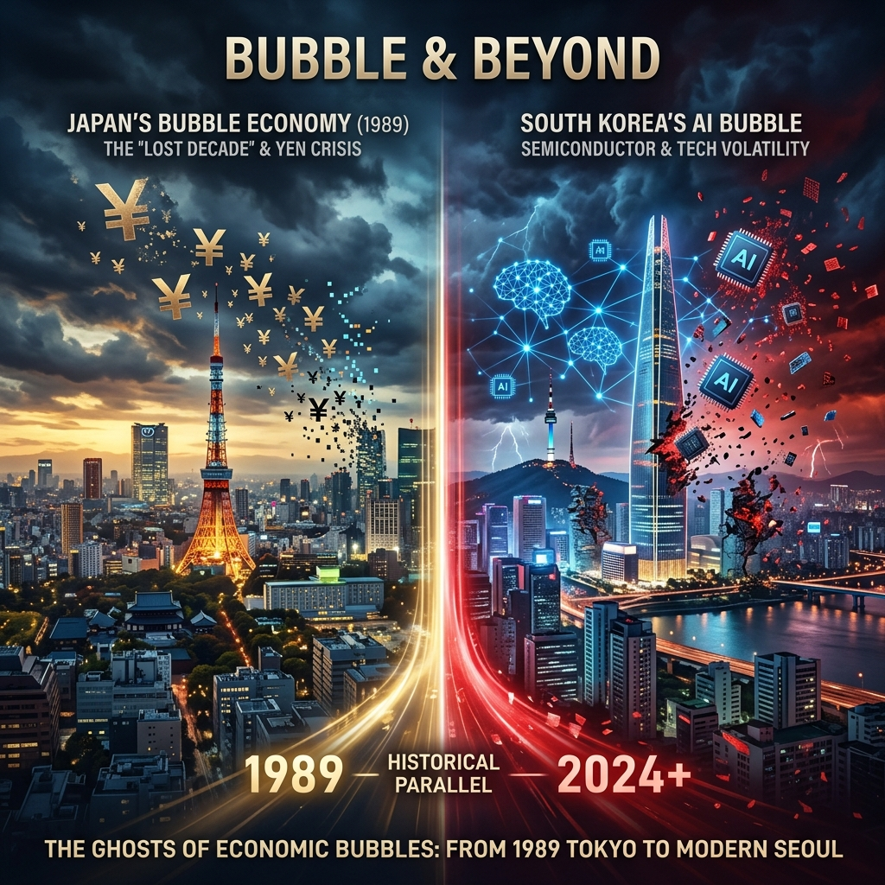

--- 
title: 'The Great Korean AI Crash: Inside the $2 Trillion Meltdown That Shattered the KOSPI'
date: 2026-07-31
authors:
  name: Bilash J. Shahi
  title: Cybersecurity Professional
  picture: https://avatars.githubusercontent.com/elodvk
  url: https://purplesec.org
tags:
  - AI
  - Finance
  - South Korea
  - Semiconductors
  - Market Crash
  - KOSPI
  - Samsung
  - SK Hynix
description: "A comprehensive deep-dive into the South Korean AI bubble burst of July 2026 — from the KOSPI's parabolic 180% rise to its catastrophic 40% collapse, the leveraged ETF catastrophe, the $2 trillion in erased market value, the China CXMT competitive threat, the Finance Minister's public apology, and the eerie historical parallels with Japan's 1989 Lost Decade and the Dot-Com crash.
image: blog/assets/sk_ai_bubble_hero.png"
---

On July 31, 2026, the world watches as South Korea's benchmark **KOSPI** index posts a record-breaking **17.9% single-day surge** — its largest daily gain in the exchange's entire history. Circuit breakers fire. Trading halts. Buy orders overwhelm the system.

But this is not a celebration. This is the aftershock of a catastrophe.

Just **48 hours earlier**, the same index had plunged over **16% in two days**, incinerating approximately **$2 trillion** in market capitalization. Samsung Electronics and SK Hynix — two companies that together account for over half the KOSPI's total value — had cratered by 45% and 55% respectively from their June peaks. Leveraged ETFs tied to these semiconductor giants had fallen **over 80%**. Hundreds of thousands of retail investors — the so-called "ant investors" (개미투자자) — saw their life savings vaporize in real time.

This is the story of how South Korea bet its entire economy on the AI revolution, built the most concentrated stock market in the developed world, introduced weapons-grade financial leverage to retail investors, and then watched the whole thing detonate in the span of six weeks.

This is the **Great Korean AI Crash**.

---

## Part I: The Setup — How South Korea Became the AI Market

### The Semiconductor Monarchy

To understand why South Korea's stock market crashed so hard, you first need to understand something unusual about the KOSPI: it is, functionally, a **two-stock index**.

Samsung Electronics and SK Hynix together account for **over 50%** of the KOSPI's total market capitalization. No other major market in the world has this level of concentration in a single sector. For comparison, the top two companies in the S&P 500 (Apple and Microsoft) account for roughly 14% of the index. In Japan's Nikkei 225, the top two companies represent about 10%.

In South Korea, if Samsung and SK Hynix sneeze, the entire market catches pneumonia. And in 2025–2026, both companies didn't just sneeze — they first ran a marathon at sprint speed, and then collapsed.

### The HBM Supercycle

The fuel for the rally was **High-Bandwidth Memory (HBM)** — a specialized type of DRAM chip that has become the lifeblood of AI infrastructure. Every NVIDIA H100, H200, and Blackwell GPU requires stacks of HBM to function. Every AI data center being built by Microsoft, Google, Meta, and Amazon needs thousands of these GPUs, each loaded with HBM.

And there are essentially only two companies on Earth that can manufacture HBM at scale: **Samsung Electronics** and **SK Hynix**.

SK Hynix, in particular, had established a commanding lead in the HBM market. As the primary supplier for NVIDIA's most advanced AI chips, the company rode the "AI supercycle" to record-breaking profits. By mid-2026:

- SK Hynix reported a **557% year-over-year increase** in quarterly operating profit.
- Samsung Electronics posted a staggering **1,800% (19-fold) increase** in Q2 2026 operating profit.
- Both companies approached or exceeded **$1 trillion in market capitalization** — milestones previously reserved for American tech giants.
- HBM supply for 2026 was described by both companies as **"fully sold out,"** with demand characterized as **"exponential and explosive."**
- Bottlenecks in HBM and advanced packaging were projected to persist through **at least 2027**.

The numbers were so extraordinary that they seemed almost fictional. And for investors, they were irresistible.

### The 180% Rally

Between September 2025 and June 2026, the KOSPI index rose approximately **180%** — one of the most violent upward moves in the history of any major stock market.

On **June 19, 2026**, the KOSPI hit an all-time intraday high of **9,385.59**. The closing record came three days later, on June 22, at **9,114.55**.

To put this in perspective: the KOSPI had traded between roughly 2,300 and 2,700 for most of the period from 2020 to early 2025. In the span of 10 months, it had nearly **tripled**.

South Korea's retail investors — millions of individual traders who had shifted capital from memecoins, real estate, and savings deposits into semiconductor stocks — were euphoric. The AI revolution wasn't just an American story. It was *their* story. Their companies. Their chips. Their moment.

What they didn't realize was that the financial system had quietly loaded a gun and pointed it at their heads.

---

## Part II: The Weapon — Single-Stock Leveraged ETFs

### May 2026: The Fatal Product Launch

In **May 2026**, South Korean financial regulators approved the listing of **single-stock leveraged exchange-traded funds (ETFs)** — products designed to deliver **2× the daily return** of an underlying stock.

The most popular of these new products were tied to Samsung Electronics and SK Hynix.

The appeal was obvious. If Samsung goes up 5% in a day, the leveraged ETF goes up 10%. For retail investors who were already bullish on semiconductors, these products offered a way to amplify their gains without needing a margin account.

But leverage is a double-edged sword with a poisoned blade. If Samsung falls 5%, the leveraged ETF falls 10%. And if the stock falls 10%, the ETF falls 20%. And due to the mathematical properties of daily leveraged products — specifically **volatility decay** (also known as beta slippage) — holding these instruments over multiple days during volatile periods can destroy value even if the underlying stock eventually recovers to its original price.

These were, in the words of one former regulatory official, **"weapons of mass financial destruction"** handed to retail traders with minimal disclosure, minimal education, and no guardrails.

### The Mechanical Doom Loop

What made the leveraged ETFs especially dangerous was not just their leverage, but their **rebalancing mechanics**.

At the end of each trading day, leveraged ETFs must rebalance their portfolios to maintain their 2× exposure. If the underlying stock has fallen, the ETF must **sell additional shares** to reduce exposure. If the stock has risen, the ETF must **buy additional shares** to increase exposure.

This creates a **pro-cyclical feedback loop**:

1. The stock falls during the day.
2. At market close, the leveraged ETF must sell shares to rebalance.
3. The forced selling pushes the stock price down further.
4. Other leveraged products and margin accounts are triggered, forcing additional selling.
5. The next day opens lower, and the cycle repeats.

In a concentrated market where two stocks account for half the index, and where billions of dollars of leveraged ETF exposure are tied to those exact two stocks, this feedback loop becomes **systemic**. The ETFs don't just amplify volatility — they **generate** it.

This is precisely what happened in late July 2026.

---

## Part III: The Catalysts — What Lit the Fuse

### Catalyst #1: SK Hynix Earnings — Great Numbers, Wrong Expectations

On **July 24, 2026**, SK Hynix reported its quarterly earnings. By any objective measure, the results were spectacular:

- Revenue and operating profit hit all-time records.
- HBM shipments grew significantly quarter-over-quarter.
- The company reaffirmed that AI memory demand remained robust and supply was constrained.

But the market didn't care about objective measures. It cared about **expectations**. And expectations, after a 180% rally, had become completely untethered from reality.

Analysts had projected even higher revenue figures. Some had modeled capacity expansion timelines that were more aggressive than what SK Hynix confirmed. The company's forward guidance, while positive, contained cautionary language about the timing of next-generation HBM4 production ramps.

The stock fell sharply on the earnings report. Not because the numbers were bad. Because they weren't **godlike**.

### Catalyst #2: CXMT — The Chinese Shadow

Adding to the anxiety was the growing specter of **ChangXin Memory Technologies (CXMT)**, China's most advanced domestic DRAM manufacturer.

In July 2026, CXMT completed a **record-breaking IPO**, raising approximately **$8.6 billion** — the largest semiconductor IPO in Chinese history. The offering was a signal to the world that China was serious about building a self-sufficient memory chip industry, backed by massive state subsidies and a domestic market hungry for alternatives to Korean suppliers.

While CXMT remained **2–3 technology generations behind** Samsung and SK Hynix, and lacked access to the EUV lithography machines needed for cutting-edge production, the competitive narrative was powerful:

- CXMT's global DRAM bit shipment share had risen from **~3% in 2025 to ~8–9% in early 2026**.
- Projections indicated it could reach **11–18% by 2028**.
- The company was rapidly filling the "mainstream" DRAM segment, forcing Samsung and SK Hynix to compete on price in commodity markets while trying to maintain margins in premium AI memory.

The CXMT IPO didn't change Samsung or SK Hynix's near-term fundamentals. But in a market running on narrative and momentum, the mere **possibility** of future margin compression was enough to shake confidence.

### Catalyst #3: The Hyperscaler Doubt

A quieter but equally important catalyst was growing skepticism in the global investment community about whether the hyperscalers — Microsoft, Google, Meta, Amazon — could sustain their current levels of AI infrastructure spending.

By mid-2026, these companies had collectively committed to spending **hundreds of billions of dollars** on AI data centers, GPU clusters, and related infrastructure. The question investors began to ask was: *Where is the revenue?*

While AI services were growing rapidly, the gap between infrastructure investment and demonstrated revenue returns was widening. Some analysts warned of a potential "cash burn" scenario, where hyperscalers would be forced to slow capital expenditure if AI revenues failed to accelerate fast enough to justify the spend.

If the hyperscalers pulled back on AI capex, demand for HBM would slow. And if demand for HBM slowed, the entire thesis underlying Samsung and SK Hynix's valuations — and by extension, the entire KOSPI rally — would crumble.

---

## Part IV: The Crash — Six Days That Shook Seoul

### July 23–25: The First Tremors

The KOSPI began sliding in the final days of June and continued through early July, but the sell-off was initially orderly. Profit-taking was expected after a 180% run-up.

Then SK Hynix reported earnings on July 24. The disappointment — relative to stratospheric expectations — triggered a sharper decline. By July 25 (Friday), the KOSPI had fallen approximately **15%** from its June peak.

### July 28 (Monday): The Dam Breaks

The weekend provided no relief. International investors, reviewing positions over the break, initiated heavy selling on Asian markets. The KOSPI opened sharply lower and continued to fall throughout the day.

The first **circuit breaker** was triggered, halting trading for 20 minutes. When trading resumed, selling intensified. A second circuit breaker fired.

By the end of Monday, the KOSPI had fallen approximately **8%** in a single session. Samsung Electronics dropped over 10%. SK Hynix fell 14%.

But the worst was yet to come.

### July 29 (Tuesday): Black Tuesday

The leveraged ETF rebalancing from Monday's close had forced billions of won worth of selling into the market. This selling hit a market already gripped by panic.

Tuesday's open saw an immediate further decline. The KOSPI fell an additional **8–9%** by midday. Circuit breakers were triggered repeatedly.

Finance Minister **Koo Yun-cheol** appeared before the National Assembly's Strategy and Finance Committee and delivered a **rare public apology**:

> *"The introduction of single-stock leveraged ETFs was executed without sufficient consideration of the risks they posed to market stability and individual investors. I deeply regret that the ministry failed to anticipate the speculative behavior and amplified volatility that followed their launch."*

By the close on Tuesday, July 29:

- The KOSPI had fallen **over 16%** in two days.
- Samsung Electronics had declined **~44%** from its June peak.
- SK Hynix had fallen **over 55%** from its all-time high.
- Single-stock leveraged ETFs tied to these companies had lost **over 80%** of their value since their June peaks.
- An estimated **$2 trillion** in total market capitalization had been erased in approximately five weeks.

### The Ant Investors

The human cost of the crash was staggering.

South Korea has one of the highest rates of retail stock market participation in the world. Millions of individual investors — office workers, small business owners, retirees, university students — had poured their savings into semiconductor stocks during the rally.

Many had used **margin loans** to increase their positions. When stocks fell, they received **margin calls** — demands from brokerages to deposit additional cash or have their positions liquidated. Those who couldn't meet the calls — and many couldn't — were forced to sell at the worst possible time, locking in catastrophic losses.

The term **"ant investors"** (개미투자자, *gaemi tujaja*) — a self-deprecating nickname Korean retail traders have used for decades — took on a darker meaning. The ants had been crushed.

Reports emerged of:

- Individual accounts suffering **unrealized losses exceeding 50%** of their total value.
- Retirement savings accounts being decimated by leveraged ETF positions.
- A surge in calls to financial counseling hotlines and mental health services.
- Social media platforms flooding with stories of ordinary investors who had lost years of savings in days.

The market, once a source of national pride and financial empowerment, had become what critics called a **"gambling arena"** — a casino where the house had rigged the game with products that amplified losses far beyond what retail investors could understand or withstand.

---

## Part V: The Government Response — Regret, Reform, and ₩20 Trillion

### Emergency Regulatory Actions

In the immediate aftermath of Black Tuesday, the South Korean government and the Financial Services Commission (FSC) launched a series of emergency measures:

| Measure | Details |
|---|---|
| **New Leveraged ETF Listings Suspended** | All new listings of single-stock leveraged ETFs and ETNs were immediately frozen. |
| **Portfolio Concentration Cap** | Individual retail investors' holdings of single-stock leveraged ETFs capped at **20% of total portfolio value**. |
| **Minimum Cash Deposit Raised** | Minimum cash balance required to trade leveraged ETFs raised to **₩30 million** (~$20,300), effective July 31, 2026. |
| **Marketing Ban** | All advertising and promotion of leveraged ETF products prohibited. |
| **Anti-Speculation Trading Costs** | New "excessive order fees" (similar to futures market mechanisms) imposed on high-frequency and speculative leveraged ETF trades. |
| **Rebalancing Spread** | Asset managers and liquidity providers required to spread rebalancing trades across the entire trading day, eliminating the end-of-day concentration that amplified volatility. |
| **Investor Education Mandate** | Retail investors required to complete educational modules before trading leveraged products. |

### The $14 Billion Sovereign Wealth Fund

On **July 31, 2026** — the same day as the historic 17.9% rebound — the South Korean government announced the launch of a **20 trillion won (approximately $14 billion) strategic sovereign wealth fund** dedicated to providing "patient capital" for the AI and semiconductor industries.

The fund was designed to:

1. **Stabilize market sentiment** by signaling long-term government commitment to the semiconductor sector.
2. **Provide direct investment** in domestic chipmakers, packaging companies, and AI infrastructure projects.
3. **Insulate strategic industries** from the kind of short-term market volatility that had just decimated the KOSPI.

The message was clear: whatever the market did in the short term, South Korea was not abandoning its AI bet. The government raised its GDP growth forecast to **3%**, citing the fundamental strength of semiconductor exports and a massive, state-backed push toward national AI infrastructure.

### The Triple-Axis Strategy

The sovereign wealth fund was part of a broader **"triple-axis" national AI strategy** that the government had been building throughout 2026:

1. **Axis 1 — Chips**: Over **$600–880 billion** in combined public-private investment mobilized for semiconductor manufacturing capacity, R&D, and talent development.
2. **Axis 2 — Infrastructure**: Construction of major new semiconductor production clusters, AI data centers, and "sovereign AI" compute infrastructure.
3. **Axis 3 — Ecosystem**: Development of domestic AI models, AI talent pipelines, and strategic partnerships with global hyperscalers.

The scale of commitment was staggering — but so was the concentration risk it represented. South Korea was doubling down on the exact bet that had just blown up its stock market.

---

## Part VI: The Rebound — July 31, 2026

### The 17.9% Miracle

On Thursday, July 31, the KOSPI didn't just recover. It **exploded** upward.

The catalyst came from the United States. On the evening of July 30 (U.S. time), both **Microsoft** and **Amazon** reported quarterly earnings that significantly exceeded expectations. Both companies cited strong AI revenue growth and reaffirmed their commitment to continued AI infrastructure spending.

The implications for Samsung and SK Hynix were immediate: if the hyperscalers were still spending aggressively on AI, demand for HBM was not slowing. The bearish thesis — that AI capex would cool and memory demand would fall — was, at least temporarily, invalidated.

When the Korean market opened on July 31:

- **SK Hynix** surged to its daily price limit, gaining **30%** — the maximum allowed in a single session.
- **Samsung Electronics** rocketed up approximately **27–28%**.
- The KOSPI surged **17.9%**, its largest single-day gain in the entire history of the exchange.
- The intensity of buying was so extreme that a **buy-side circuit breaker** was triggered — a trading halt designed to manage upward volatility. A buy-side circuit breaker on the KOSPI was virtually unprecedented.

### A Recovery, Not a Restoration

Despite the historic single-day gain, the KOSPI on July 31 remained **significantly below** its June 2026 peak. The rebound recovered a fraction of the losses incurred during the preceding weeks.

For investors who had bought at the top — especially those holding leveraged ETFs — the rebound was largely irrelevant. An 80% loss requires a **400% gain** to break even. A 17.9% index gain, while historic, did not come close.

The rebound was a powerful reminder of a fundamental market truth: **markets can be both violent in decline and explosive in recovery, and still leave investors underwater.**

---

## Part VII: Historical Parallels — Echoes of Bubbles Past

The South Korean AI crash has drawn immediate and extensive comparisons to two of the most famous financial bubbles in modern history.

### Japan 1989: The Lost Decade Blueprint

The parallels between South Korea's 2026 experience and Japan's 1989 asset bubble are striking — and deeply unsettling for Korean policymakers.

| Factor | Japan (1989) | South Korea (2026) |
|---|---|---|
| **National narrative** | "Japan Inc." — Japanese industrial and financial dominance as destiny. | "K-AI" — Korean semiconductor dominance as destiny. |
| **Market concentration** | Heavy weighting in banking, real estate, and electronics conglomerates. | Over 50% of KOSPI in two semiconductor companies. |
| **Leverage** | Massive corporate and real estate leverage; speculative zaiteku. | Retail leveraged ETFs; margin trading; high household debt (~89% of GDP). |
| **Catalyst for collapse** | Bank of Japan rate hikes; overvalued real estate. | Earnings disappointments; China competition fears; AI capex doubts. |
| **Demographic backdrop** | Aging population; declining birthrate. | Fertility rate of ~0.72 — the lowest in the world. |
| **Government response** | Initially slow; then decades of zero-interest-rate policy and fiscal stimulus. | Rapid emergency measures; $14B sovereign wealth fund. |

The fear — whispered but not yet spoken aloud by major institutions — is that South Korea could face its own **"Lost Decade."** A scenario where the KOSPI, having detached from fundamentals during the AI euphoria, spends years or even decades recovering to its 2026 peak.

Japan's Nikkei 225 peaked at 38,957.44 on December 29, 1989. It did not reclaim that level until **February 2024** — nearly **35 years later**.

### The Dot-Com Bubble (2000): The Speed Parallel

If Japan's bubble offers a cautionary tale about duration, the Dot-Com crash offers a parallel about **speed**.

Like the KOSPI rally, the late-1990s NASDAQ surge was driven by a new transformative technology (the internet). Like South Korea's crash, the Dot-Com bust happened when investors realized that the gap between infrastructure investment and actual revenue generation was unsustainable.

The NASDAQ Composite peaked at 5,048.62 on March 10, 2000, and fell approximately **78%** to a trough of 1,114.11 by October 2002. The speed of the initial collapse — the index fell roughly 40% in the first five months — mirrors the KOSPI's trajectory closely.

But here's the crucial difference: the Dot-Com crash killed thousands of speculative companies, but the surviving ones — Google, Amazon, Apple — went on to become the most valuable companies in human history. The internet *was* transformative. The bubble just got ahead of the timeline.

Is the same true of AI? That is the **$2 trillion question** that South Korea — and the entire global market — is now trying to answer.

### Key Differences: What Makes 2026 Unique

While historical parallels are illuminating, the Korean AI crash has several features that are genuinely unprecedented:

1. **The Leverage Amplifier**: Neither Japan's 1989 crash nor the Dot-Com bust featured retail-accessible leveraged ETFs that mechanically amplified daily moves. This made the Korean sell-off faster and more violent than either historical precedent.

2. **Concentration Risk at a National Level**: South Korea's economic dependence on Samsung and SK Hynix has no precedent in any developed economy. The crash was not just a stock market event — it was a **national economic event** with implications for GDP growth, employment, fiscal revenue, and international competitiveness.

3. **The China Variable**: Neither Japan in 1989 nor the U.S. in 2000 faced a state-subsidized competitor rapidly scaling up in their core industry. CXMT's emergence adds a structural dimension to the Korean crash that was absent in prior bubbles.

4. **Speed of Government Response**: The Korean government's response — from the Finance Minister's apology to the sovereign wealth fund announcement — was far faster than the delayed reactions seen in Japan (1989) or the U.S. (2000). Whether speed translates to effectiveness remains to be seen.

5. **Global Supply Chain Integration**: The Korean semiconductor industry is so deeply embedded in the global AI supply chain that the crash had immediate ripple effects across global markets, from U.S. tech stocks to European equipment makers. This is not a local story.

---

## Part VIII: The $2 Trillion Question — Bubble or Correction?

As of July 31, 2026, the global investment community remains deeply divided on the fundamental question: **Is the AI boom a bubble, or is this a healthy correction in a secular growth story?**

### The Bull Case

Those who argue the crash was a **correction, not a collapse**, point to the following:

- **HBM demand remains "sold out."** Both Samsung and SK Hynix report that their advanced memory production capacity is fully allocated through 2026 and into 2027.
- **Hyperscaler spending is accelerating.** Microsoft and Amazon's July earnings confirmed that AI capex is not slowing — it's increasing. Meta and Google are expected to report similar trends.
- **The technology is real.** Unlike the Dot-Com era, where many bubble companies had no revenue and no product, AI is already generating measurable economic value across coding, healthcare, finance, legal, and creative industries.
- **Samsung is closing the HBM gap.** With HBM4 production scaling in late 2026, Samsung is positioned to challenge SK Hynix for market leadership, diversifying South Korea's exposure within the HBM market.
- **The crash was mechanical, not fundamental.** The leveraged ETF rebalancing loop amplified what would have been a normal 10–15% correction into a 40% crash. Remove the leverage, and the fundamentals don't justify this level of decline.

### The Bear Case

Those who believe the crash signals a deeper problem argue:

- **The market priced in perfection.** A 180% rally in 10 months priced in not just current AI demand, but years of future growth. Even if AI is real, the stocks were trading at valuations that required *everything* to go right for a *decade*.
- **China is a structural threat.** CXMT's rise, combined with continued Chinese government subsidies, will inevitably pressure margins in the broader DRAM market. Even if Samsung and SK Hynix maintain HBM leadership, pricing power in mainstream memory will erode.
- **Household debt is a time bomb.** South Korean household debt at ~89% of GDP, combined with the world's lowest fertility rate (~0.72), creates a demographic and financial backdrop that makes sustained recovery difficult.
- **AI revenue remains unproven at scale.** While hyperscalers are spending aggressively, the actual return on AI infrastructure investment remains uncertain. If AI fails to generate returns proportional to the capital deployed, a broader capex pullback is inevitable.
- **The regulatory damage is done.** The leveraged ETF crisis has eroded retail investor confidence. Even if markets recover, the loss of trust could depress valuations for years.

---

## Part IX: Lessons for the Global Tech Investor

The South Korean AI crash offers several lessons that extend far beyond Seoul:

### 1. Concentration Kills

When an entire market — or an entire economy — is concentrated in a single sector or a handful of companies, any negative development in that sector becomes a systemic crisis. Diversification isn't just a portfolio strategy; it's a national security imperative.

### 2. Leverage Transforms Corrections into Catastrophes

A 10–15% correction is normal and healthy in any bull market. But when that correction is fed through leveraged instruments with mechanical rebalancing requirements, it can cascade into a 40% crash. The introduction of retail-accessible leveraged products without adequate safeguards was a policy failure of historic proportions.

### 3. Earnings Don't Matter in a Momentum Market

SK Hynix reported 557% profit growth and the stock crashed. Samsung posted a 19-fold increase in operating profit and the stock crashed. When markets are driven by momentum and narrative rather than fundamentals, even spectacular results can disappoint if they fall short of euphoric expectations.

### 4. The Gap Between "AI Is Real" and "AI Stocks Are Fairly Valued" Is Enormous

AI may well be the most important technology of the 21st century. That does not mean that every company in the AI supply chain is correctly priced. The internet was transformative, and NASDAQ still fell 78%. Technology and valuation are separate questions.

### 5. Governments Can Move Fast, But They Can't Undo Damage

South Korea's regulatory response was among the fastest ever seen in a major market crisis. But no amount of ETF bans, sovereign wealth funds, or parliamentary apologies can restore the savings of retail investors who bought leveraged products at the top. Speed of response and quality of prevention are different things entirely.

---

## Part X: What Happens Next

As of July 31, 2026, the situation remains highly fluid:

- **The KOSPI** has stabilized in the mid-6,000s after the historic rebound, but remains **~35% below** its June peak.
- **Samsung and SK Hynix** continue to report robust operational performance, with HBM demand showing no signs of slowing.
- **CXMT** continues to scale, with its IPO funds earmarked for aggressive capacity expansion in mainstream DRAM.
- **The Korean government** is implementing its regulatory reforms while simultaneously deploying the $14 billion sovereign wealth fund.
- **Global AI capex** remains on an upward trajectory, supported by the latest U.S. earnings reports.
- **Retail investor sentiment** is shattered. The psychological recovery may take far longer than the financial one.

The next few months will be decisive. If AI revenues begin to materialize at a pace that justifies hyperscaler spending, the crash may indeed prove to be a painful but temporary correction. If they don't — if the revenue gap widens and capex begins to slow — South Korea may find itself at the beginning of a much longer and more painful adjustment.

One thing is certain: the era of unquestioned AI euphoria is over. What follows — whether it's a recovery, a stagnation, or a collapse — will be determined not by narratives and momentum, but by whether artificial intelligence can actually deliver on the trillion-dollar promises that have been made in its name.

---

## Timeline: Key Dates in the Korean AI Crash

| Date | Event |
|---|---|
| **Sep 2025** | KOSPI begins its AI-driven rally, fueled by Samsung and SK Hynix semiconductor demand. |
| **May 2026** | South Korean regulators approve single-stock leveraged ETFs tied to Samsung and SK Hynix. |
| **Jun 19, 2026** | KOSPI hits all-time intraday high of **9,385.59**. |
| **Jun 22, 2026** | KOSPI posts all-time closing high of **9,114.55**. |
| **Jul 2026** | CXMT completes $8.6 billion IPO — China's largest semiconductor IPO ever. |
| **Jul 24, 2026** | SK Hynix reports record earnings that miss elevated expectations; sell-off accelerates. |
| **Jul 28, 2026** | KOSPI falls ~8% in a single session. Multiple circuit breakers triggered. |
| **Jul 29, 2026** | "Black Tuesday" — KOSPI falls another ~8%. Finance Minister Koo Yun-cheol apologizes to parliament. Total two-day decline exceeds 16%. |
| **Jul 31, 2026** | KOSPI surges **17.9%** — its largest single-day gain in history. Buy-side circuit breaker triggered. Government announces ₩20 trillion sovereign wealth fund. |

---

## Final Thoughts

The Great Korean AI Crash is not just a financial story. It is a story about what happens when a nation's economic identity becomes fused with a single technology narrative, when financial regulators introduce instruments they don't fully understand, when retail investors are given access to leverage they can't survive, and when the distance between "this technology is real" and "this stock is fairly priced" is measured in trillions of dollars.

South Korea's semiconductor industry remains world-class. Samsung and SK Hynix are not going bankrupt. HBM demand is genuine. AI is not a mirage.

But markets are not the economy. Stocks are not companies. And prices are not value.

The ants learned that lesson at a cost of $2 trillion. The question now is whether anyone else is paying attention.

---

*Disclaimer: This blog post is for informational and educational purposes only. It does not constitute financial advice. All figures cited are based on publicly available reports and news sources as of July 31, 2026.*
