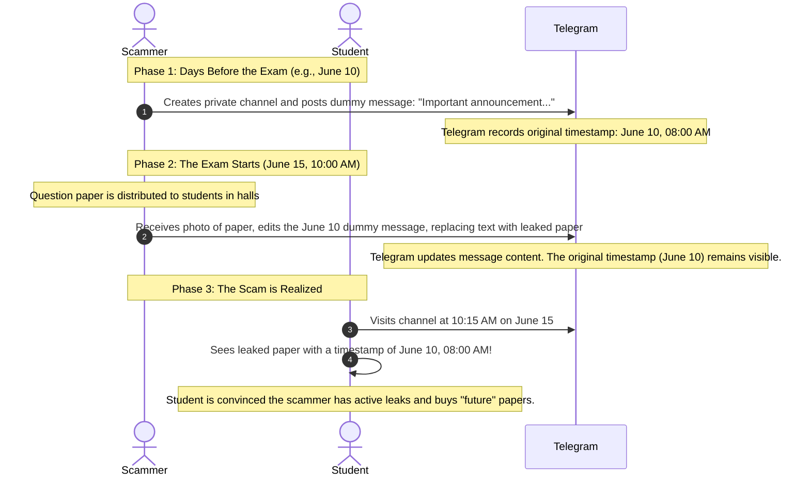

On June 16, 2026, millions of Telegram users across India woke up to find their channels failing to load, media stuck on perpetual buffering, and messages refusing to send. Without any grand public announcements, the Indian government had pulled the plug. The Ministry of Electronics and Information Technology (MeitY), acting in coordination with the Ministry of Education and the National Testing Agency (NTA), initiated a **temporary nationwide block on Telegram scheduled from June 16 to June 22, 2026**.

But this was not just another routine internet block. Embedded in the blocking order was a highly specific, unprecedented technical directive: **Telegram must completely disable its message-editing feature for all users within India until June 30, 2026**.

To the uninitiated, blocking a chat app over a national entrance exam might seem like an extreme overreaction. But to security analysts, this ban is the intersection of a massive domestic crisis—the leaked **NEET-UG 2026** medical entrance examination papers—and a global, slow-burning war over platform moderation, encryption, and state sovereignty.

This deep dive unpacks the technical mechanics of the exam leaks, the "timestamp forgery" exploit that scammers utilized to deceive students, Pavel Durov's ongoing global legal battles, and the existential threat now facing decentralized and semi-encrypted messaging platforms.

---

## Part 1: The Indian Catalyst — NEET-UG and the Telegram Black Market

To understand why a messaging app with over 150 million users in India was blocked, one must understand the stakes of the **NEET-UG (National Eligibility cum Entrance Test)**. It is the sole gatekeeper for admission to undergraduate medical courses in India, sat by over 2.4 million students annually. A few marks can dictate whether a student secures a highly coveted government college seat or is priced out of their medical dream entirely.

When the initial exam in May 2026 was cancelled due to credible allegations of paper leaks, it triggered nationwide protests, judicial scrutiny, and a Central Bureau of Investigation (CBI) probe. When the government scheduled a re-examination, the pressure to maintain absolute security was astronomical.

Enter Telegram. 

Unlike traditional end-to-end encrypted apps like WhatsApp or Signal, Telegram operates primarily as a public-facing broadcasting platform. A single channel can host up to **4 million subscribers**. These channels are searchable, support massive file sharing (up to 2GB per file), and offer a high degree of anonymity for creators. This made Telegram the perfect marketplace for cheating syndicates. 

Rackets advertised "leaked" exam papers, charging desperate candidates anywhere from ₹5,000 to ₹50,000 ($60 to $600 USD) for VIP access to private channels where the leaked questions were allegedly posted.

---

## Part 2: The Technical Exploit — How Scammers Forged Time

The most fascinating aspect of the Indian government's directive is the order to **disable the message-editing feature**. Why would a simple "edit post" button cause a national security intervention? 

Scammers exploited a subtle logical loophole in Telegram’s message-editing behavior to perform **timestamp forgery**. This exploit allowed them to fabricate "proof" that they had access to the leaked question papers *days before the exam actually occurred*.

Here is how the exploit works step-by-step:



By utilizing this flow, cheating rackets could post a series of blank or dummy messages weeks in advance. Once the exam paper was distributed and inevitably photographed by a co-conspirator inside a testing center, the scammer would quickly edit one of their pre-dated posts to include the real question paper. 

To a desperate student arriving on the channel, it appeared as though the channel owner had successfully leaked the paper days ahead of schedule. The student would then eagerly pay massive sums for the "next" leak, only to be scammed. 

This created a double crisis:
1. **Real leaks** were distributed rapidly to thousands of candidates simultaneously.
2. **Fake leaks** (forged via timestamps) created widespread panic, leading the public to believe the entire exam database was compromised days in advance, forcing the NTA's hand.

Disabling the editing feature strips scammers of their ability to manipulate chronological proof, forcing all posts to bear the true, real-time timestamp of when the content was actually uploaded.

---

## Part 3: The Global Crackdown on Telegram

While India’s block is a targeted, short-term crisis response, it is symptomatic of a global trend. Telegram has long positioned itself as the "anti-censorship" refuge of the internet. However, its hands-off moderation policy has turned it into a battleground for law enforcement worldwide.

### The Paris Incident: The Arrest of Pavel Durov

The watershed moment in Telegram’s history occurred in **August 2024**, when Durov was arrested by French authorities upon landing his private jet at Paris-Le Bourget Airport. 

The French judicial inquiry targeted Durov personally under a strict new law that holds tech executives criminally liable if their platforms are knowingly used for:
- Distribution of Child Sexual Abuse Material (CSAM)
- Narcotics trafficking and organized cyber-fraud
- Facilitating illegal transactions (money laundering)
- Refusal to cooperate with lawful interceptions (intercepting criminal communications)

Durov was indicted and released on a €5 million bail under strict judicial supervision, preventing him from leaving French territory. 

```
┌────────────────────────────────────────────────────────────────────────┐
│                        THE GLOBAL SCRUTINY OF TELEGRAM                 │
├───────────────────┬────────────────────────────────────────────────────┤
│ Jurisdiction      │ Core Grievance & Regulatory Action                 │
├───────────────────┼────────────────────────────────────────────────────┤
│ India             │ NEET-UG Exam paper leaks, timestamp scams (Ban)     │
├───────────────────┼────────────────────────────────────────────────────┤
│ France            │ Durov indicted for non-cooperation on cyber-crimes │
├───────────────────┼────────────────────────────────────────────────────┤
│ European Union    │ DSA probe into underreported user counts (41M limit)│
├───────────────────┼────────────────────────────────────────────────────┤
│ Ukraine           │ Ban on government, military & critical infra devs  │
├───────────────────┼────────────────────────────────────────────────────┤
│ Brazil            │ Temporary bans over neo-Nazi group non-cooperation │
└───────────────────┴────────────────────────────────────────────────────┘
```

### The Post-Arrest Shift: The End of "Absolute Privacy"?

Faced with personal jail time, Durov and Telegram quietly enacted one of the largest policy reversals in the company's history. 

In late September 2024, Telegram updated its **Terms of Service and Privacy Policy**. The platform officially declared that it would disclose users’ **IP addresses and phone numbers** to relevant authorities in response to valid judicial orders. Furthermore, Telegram deployed specialized AI moderation teams to strip search functionalities of illicit content and bots.

Despite these changes, countries like India, Ukraine, and various EU regulators argue that Telegram's compliance remains "too little, too late." Ukraine recently banned the use of Telegram on official devices used by government, military, and critical infrastructure staff due to concerns over Russian intelligence interception. Meanwhile, the EU is investigating whether Telegram deliberately underreported its user metrics to avoid being designated a "Very Large Online Platform" (VLOP) under the **Digital Services Act (DSA)**, which carries strict audit requirements.

---

## Part 4: The Encryption Misconception

Much of the public debate surrounding the Telegram ban is clouded by a fundamental misunderstanding of how the platform’s security architecture works. 

When users hear of a "secure messaging app," they assume it operates like Signal or WhatsApp, where all messages are encrypted end-to-end (E2EE) by default. On those platforms, even the company hosting the servers cannot read the messages, meaning a government block cannot force the provider to hand over chat history.

**Telegram does not work this way.**

By default, all standard Telegram chats, group chats, and channels are **Cloud Chats**. 
- They are encrypted in transit, but decrypted on Telegram’s servers.
- The decryption keys are managed and held by Telegram.
- This allows users to access their complete chat history from any device instantly, but it also means Telegram's centralized databases contain plaintext copies of your conversations.
- Only "Secret Chats"—which must be manually initiated between two users and are not supported for groups or channels—are truly end-to-end encrypted.

```
+-------------------------------------------------------------------------+
|                    TELEGRAM CLOUD CHAT ARCHITECTURE                     |
+-------------------------------------------------------------------------+
|                                                                         |
|  [ User A ] =======( encrypted in transit )=======> [ Telegram Server ]  |
|                                                     ( Decrypted & Saved)|
|  [ User B ] <======( encrypted in transit )=======  [ Keys held by Co. ]|
|                                                                         |
+-------------------------------------------------------------------------+
```

Because Telegram holds the keys to the kingdom, governments know that Telegram *has* the technical capability to take down channels, block message-editing features, and harvest user data. When Telegram refuses or delays cooperation, it is viewed by states not as a technical limitation (like Signal), but as a deliberate political choice.

---

## Part 5: The Philosophical Debate: Security vs. Censorship

Pavel Durov’s response to the Indian ban highlights the classic defense of libertarian tech platforms: 

> "Blocking access to an entire platform of 150 million innocent users to stop a handful of bad actors is disproportionate and ultimately futile. The bad actors will simply migrate to other platforms, while ordinary citizens are stripped of their primary tool for communication, business, and coordination."
> — *Pavel Durov (June 2026, translated statement)*

There is truth in Durov's argument. Within hours of the Telegram block, Indian cybersecurity forums noted a massive surge in searches for VPN services, alongside coordinates for alternative channels on platforms like Signal, WhatsApp, and decentralized Matrix servers. 

However, from the state’s perspective, the sheer scale and design of Telegram make it a unique threat. A WhatsApp group is limited to 1,024 members; a Signal group to 1,000. Telegram’s capacity to broadcast anonymously to millions of users instantly makes it an amplifier for societal disruption—whether through leaking exams, distributing pirated materials, or spreading coordinate attacks.

---

## Conclusion: The Horizon of Regulatory Compliance

The temporary ban in India is a warning shot. By demanding the removal of core UI features (message editing) and threatening permanent blockades, governments are demonstrating that they are no longer willing to accept "safe harbor" defenses from tech giants. 

As we progress through 2026, the era of the untouchable, laissez-faire messaging platform is coming to an end. Platforms will be forced to choose between two paths:
1. **The Signal Path:** Implement absolute, default end-to-end encryption across all features, stripping the company of any capability to moderate or comply, and accept being banned in authoritarian or heavily regulated jurisdictions.
2. **The Corporate Compliance Path:** Maintain cloud-based convenience but invest heavily in automated moderation, immediate compliance with local judicial warrants, and feature modifications (like disabling edits) to satisfy state demands.

For Telegram, which sits uncomfortably in the middle, the transition will be painful. But as the Indian NEET-UG re-examination proceeds under a silent, edited-disabled Telegram ecosystem, one thing is clear: the code of our communication apps is no longer dictated solely by developers in Dubai or Silicon Valley, but by judges and ministries in New Delhi, Paris, and Brussels.
