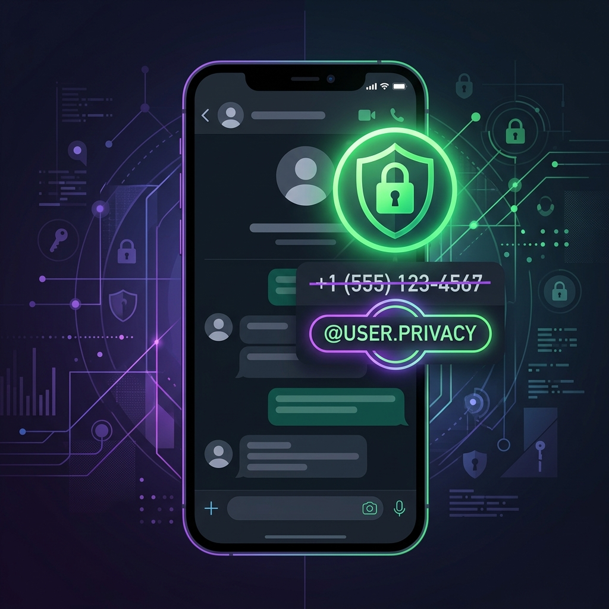
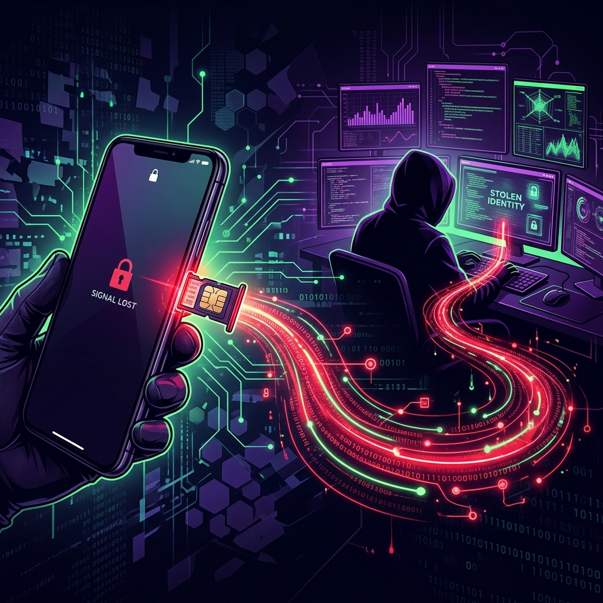

# WhatsApp Is Finally Getting Usernames — And It's a Bigger Deal Than You Think

For over fifteen years, your WhatsApp identity has been inseparable from your phone number. Every time you joined a group, messaged a business, or connected with a stranger from a Marketplace listing, you handed over the single most sensitive piece of personally identifiable information (PII) most people carry: the ten digits that link to your bank accounts, your two-factor authentication, your SIM card, and your real-world location.

That era is ending. As of late June 2026, WhatsApp has begun the global rollout of **usernames** — a feature that lets you connect with people by sharing a handle (like `@bilash_sec`) instead of your phone number. And alongside it, an optional **username key** that acts as a second gatekeeper, ensuring that even knowing your username isn't enough for a stranger to message you.

This isn't just a UX convenience. From a cybersecurity perspective, this is the most meaningful privacy upgrade WhatsApp has shipped since end-to-end encryption in 2016.

Let's break down exactly how it works, how to set it up, and — critically — the security implications most coverage is ignoring.

<!-- more -->

---

## Why Your Phone Number Was Always the Problem

Before we get into the new feature, it's worth understanding *why* phone-number-as-identity was such a liability.

### 1. Phone Numbers Are Permanent PII
Unlike an email address you can abandon or a social media handle you can change, your phone number is deeply entangled with your financial life. It's linked to your bank, your insurance, your government ID portals, and often serves as the recovery mechanism for your most critical accounts. Sharing it casually in a WhatsApp group is the digital equivalent of handing out your home address at a networking event.

### 2. Phone Numbers Enable SIM Swap Attacks

*Your phone number is the skeleton key to your digital life — and attackers know it.*

SIM swapping remains one of the most devastating identity theft vectors in 2026. Here's how it works:

1. An attacker gathers your phone number (from a leaked database, a WhatsApp group, or a public listing).
2. They contact your mobile carrier, impersonating you with stolen personal details.
3. The carrier ports your number to a new SIM card controlled by the attacker.
4. The attacker now receives all your SMS messages — including **two-factor authentication codes** for your bank, email, and cloud accounts.

The entire attack chain starts with one thing: **knowing your phone number.** Every WhatsApp group you've ever joined has potentially exposed this.

### 3. Phone Numbers Enable Targeted Harassment
Journalists, activists, domestic abuse survivors, and public figures have long faced a brutal trade-off on WhatsApp: participate in group conversations (which are essential for coordination) and expose their phone number to every member, or stay silent. Usernames eliminate this trade-off entirely.

### 4. Cross-Platform Data Correlation
Data brokers and intelligence agencies routinely correlate phone numbers across platforms. If your WhatsApp number matches your Telegram, Signal, and LinkedIn accounts, an adversary can build a comprehensive profile of your communications, social graph, and even physical movements. Usernames break this correlation chain.

---

## How WhatsApp Usernames Work

### Setting Up Your Username

Starting the week of June 29, 2026, WhatsApp is rolling out username reservations globally. Here's how to claim yours:

**Step 1:** Update WhatsApp to the latest version from your app store.

**Step 2:** Navigate to **Settings → Account → Username**.

**Step 3:** Enter your desired username. WhatsApp will check availability in real-time.

**Step 4:** Confirm your selection. Your username is now reserved and will become fully functional as the feature completes its global rollout later in 2026.

!!! tip "Pro Tip: Reserve Early"
    Usernames are first-come, first-served. If you have a common name or a brand identity, reserve your preferred handle now before someone else claims it.

### The Username Key: Your Second Lock

This is the feature that separates WhatsApp's implementation from a simple handle system like Telegram or Discord.

When you enable a **username key**, WhatsApp generates a unique code tied to your account. Anyone who wants to message you for the first time must know *both* your username *and* your key. 

Think of it like this:

| Without Username Key | With Username Key |
| :--- | :--- |
| Someone knows `@bilash_sec` → They can message you | Someone knows `@bilash_sec` → Not enough |
| | Someone knows `@bilash_sec` + `A7X9K2` → They can message you |

You can **reset your key at any time**, which instantly blocks all future contact attempts from anyone who only had the old key. This is particularly powerful for:

- **Businesses** that want to accept customer messages temporarily, then close the channel.
- **Event organizers** who share their username in a conference chat but want to cut off contact afterward.
- **Anyone** being harassed — resetting the key is an instant, silent block on all unknown senders.

### What Usernames Don't Change

It's important to understand the boundaries:

- **Your phone number is still required** to create and log into your WhatsApp account. Usernames are a *privacy layer*, not a replacement for phone-based registration.
- **Existing contacts** who already have your phone number will still see it. Usernames primarily protect you from *new* contacts.
- **There is no public directory.** You cannot search for people by username. You must know someone's exact username to contact them. This is a deliberate anti-harvesting decision by Meta.

---

## The Cybersecurity Perspective: What This Actually Protects

*Usernames add a critical new layer between your identity and the outside world.*

Let's put on our red team hats and evaluate what this feature actually mitigates — and what it doesn't.

### What It Mitigates

#### ✅ Reduces SIM Swap Attack Surface
If you exclusively share your username with new contacts (and never your phone number), the number of people who know your phone number shrinks dramatically. Fewer exposure points = fewer opportunities for a SIM swap attacker to acquire your number.

#### ✅ Limits OSINT Reconnaissance
For penetration testers and threat actors alike, a phone number is one of the richest OSINT pivots available. It can be fed into tools like Maltego, SpiderFoot, or even simple Google dorking to uncover linked accounts, carrier information, and geographic location. A username provides none of this intelligence.

#### ✅ Protects Against Bulk Scraping
WhatsApp groups have historically been a goldmine for scraping phone numbers. Marketing companies, scammers, and data brokers have exploited this at scale. Without phone numbers being shared in groups, this entire attack vector collapses.

#### ✅ Mitigates Caller ID Spoofing Chains
Once an attacker has your phone number, they can spoof calls and SMS messages appearing to come from your number, targeting your contacts with social engineering attacks. Keeping the number private prevents this chain from starting.

### What It Doesn't Fix

#### ❌ The Phone Number Is Still the Account Root
WhatsApp still requires a phone number for registration and login. If an attacker performs a SIM swap, they can still take over your WhatsApp account — usernames don't change this. **Two-Step Verification (a custom PIN)** remains your most critical defense here.

#### ❌ Metadata Collection by Meta
Usernames do not change the underlying data collection practices. Meta still has access to your phone number, message metadata (who you talk to, when, how often), device information, and IP address. End-to-end encryption protects message *content*, but the metadata remains visible to Meta's infrastructure.

#### ❌ Existing Contacts Already Have Your Number
If you've been using WhatsApp for years, hundreds or thousands of contacts already have your phone number stored. Usernames protect you going forward, but they can't retroactively erase what's already been shared.

---

## Your Privacy Hardening Checklist

Now that usernames are available, here's a comprehensive checklist to maximize your WhatsApp security posture:

### Immediate Actions

- [x] **Reserve your username** — Go to Settings → Account → Username.
- [x] **Enable the Username Key** — Add the second authentication layer for incoming messages.
- [x] **Enable Two-Step Verification** — Go to Settings → Account → Two-Step Verification and set a strong 6-digit PIN.
- [x] **Restrict your "About" info** — Set it to "My Contacts" or "Nobody."
- [x] **Restrict your Profile Photo** — Set visibility to "My Contacts" to prevent strangers from scraping it.
- [x] **Restrict "Last Seen" and "Online"** — Set these to "Nobody" or "My Contacts."

### Advanced Measures

- [x] **Lock your SIM with your carrier** — Contact your mobile provider and request a SIM lock PIN or port-out protection.
- [x] **Use an authenticator app** for all accounts that support it — stop relying on SMS 2FA wherever possible.
- [x] **Audit your WhatsApp groups** — Leave any groups where you don't know all members personally, as your phone number may have already been exposed there.
- [x] **Review Linked Devices** — Go to Settings → Linked Devices and remove any sessions you don't recognize.

---

## The Bigger Picture: Messaging Privacy in 2026

WhatsApp's username rollout doesn't exist in a vacuum. It's part of a broader industry trend toward decoupling identity from phone numbers:

- **Signal** has supported usernames (without phone number sharing) since early 2024.
- **Telegram** has always used usernames as the primary contact method.
- **iMessage** allows Apple ID-based messaging without phone numbers.
- **Matrix/Element** uses fully decentralized identifiers with no phone number requirement at all.

WhatsApp is arguably the last major messenger to adopt this model — but it's also the one with **2+ billion users worldwide**, making its implementation the most impactful by an order of magnitude. When WhatsApp makes a privacy feature default, it doesn't just protect tech-savvy users who already knew to use Signal; it protects the billions of everyday users who never thought to ask for it.

---

## The Bottom Line

WhatsApp usernames aren't just a cosmetic update. They represent a fundamental shift in how the world's largest messaging platform handles identity. For cybersecurity professionals, the takeaway is clear: **the less your phone number circulates, the smaller your attack surface.**

Reserve your username today. Enable the key. Lock down your SIM. And stop sharing your phone number with people who only need to message you.

Your phone number is a skeleton key. Stop handing it out like a business card.
