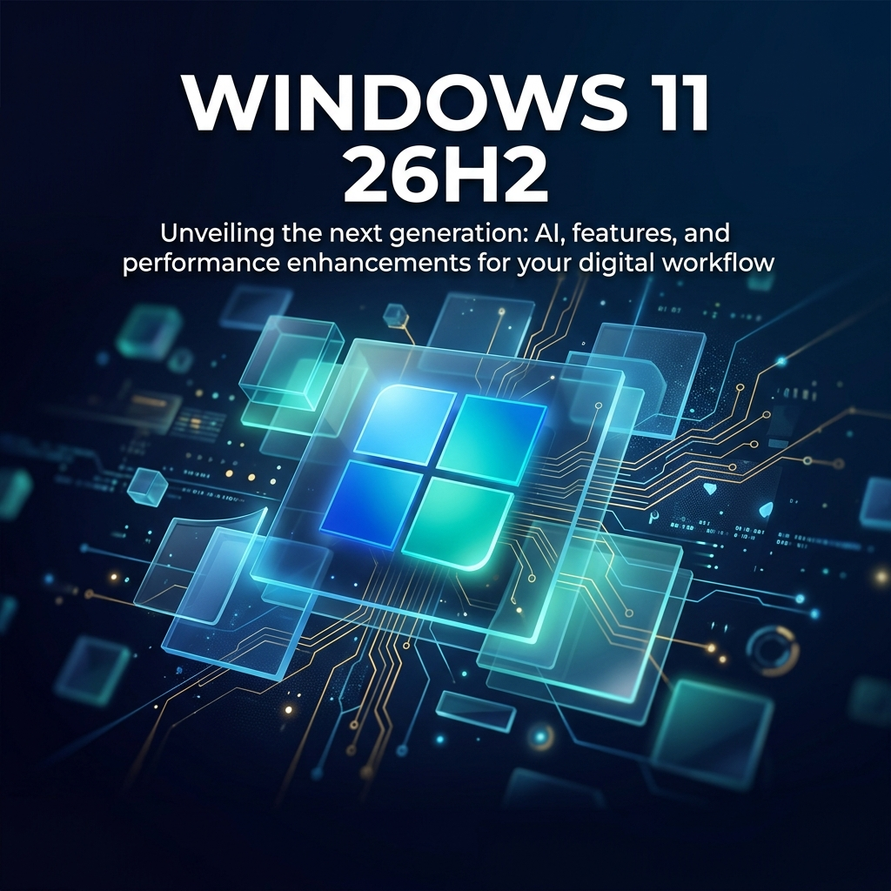

--- 
title: 'Windows 11 26H2: Everything You Need to Know — Features, AI Integration, Security, and the Great Architecture Split'
date: 2026-06-23
authors:
  name: Bilash J. Shahi
  title: Cybersecurity Professional
  picture: https://avatars.githubusercontent.com/elodvk
  url: https://purplesec.org
tags:
  - Windows 11
  - Microsoft
  - 26H2
  - Copilot
  - AI
  - Security
  - Enterprise
  - Operating Systems
description: 'A massively detailed guide to Windows 11 version 26H2 — the fall 2026 annual update. Covers the enablement package delivery model, AI-powered features like Copilot Vision and Click to Do, the 26H1 vs 26H2 architecture split, security hardening with hotpatching, Smart App Control, and Pluton, enterprise migration strategies from Windows 10, and what it all means for IT professionals.'
image: blog/assets/windows11_26h2_hero.png
---

Windows 11, version 26H2 is officially confirmed as Microsoft's next annual feature update, slated for general availability in the **fall of 2026**. But calling it a "feature update" understates what's actually happening beneath the surface — and dramatically overstates the size of the installation package.

This is the most detailed breakdown you'll find of 26H2: what it is, what it isn't, how it's delivered, what features it unlocks, how it fits into the broader Windows servicing strategy, and what IT professionals and power users need to plan for. We'll also cover the elephant in the room — the **26H1 vs 26H2 architecture split** that is quietly fragmenting the Windows ecosystem in a way Microsoft has never done before.

---

## What Is Windows 11 26H2?

At its core, Windows 11 version 26H2 is the annual "H2" (second half) feature update for the mainstream x86-64 Windows ecosystem. It follows the same naming convention Microsoft has used since Windows 10: the "26" refers to the year (2026) and "H2" refers to the second half release.

But here's the critical nuance: **26H2 is not a traditional feature update**. There is no massive ISO download. There is no 30-minute installation process. There is no anxiety-inducing "Working on updates — 45% complete" screen.

Instead, 26H2 is delivered as a **small enablement package (eKB)** — approximately 174–200 KB in size — that flips a version number switch on your existing installation. If your device is already running Windows 11 version 24H2 or 25H2, the "update" to 26H2 requires only a single quick restart.

This is possible because versions 24H2, 25H2, and 26H2 all share the **same underlying servicing branch and source code**. The enablement package doesn't install new operating system components — it activates capabilities that are already present on your machine, delivered through the monthly cumulative updates you've been receiving all along.

---

## How the Enablement Package Model Works

To understand why 26H2 is so lightweight, you need to understand how Microsoft has fundamentally restructured Windows servicing.

### The Old Model (Windows 10 Era)

In the Windows 10 era, each semi-annual feature update was essentially a full OS re-installation. Your machine would download gigabytes of data, run a lengthy offline installation process, and reboot multiple times. IT teams dreaded these updates because they were disruptive, time-consuming, and prone to compatibility issues.

### The New Model (Windows 11 24H2+)

Starting with version 24H2, Microsoft moved to a "shared core" approach. The actual operating system components — the kernel, drivers, shell, and frameworks — are updated continuously through **monthly cumulative updates** (Patch Tuesday). These are the updates that actually change your system's behavior and introduce new features.

The annual "H2" version bump is merely a **maintenance marker** that:

1. **Resets the support clock**: Gives your device a fresh 24 months (Home/Pro) or 36 months (Enterprise/Education) of support.
2. **Activates gated features**: Enables any features Microsoft has pre-staged but hasn't yet turned on via Controlled Feature Rollout (CFR).
3. **Updates the version number**: Changes your build string from "25H2" to "26H2" for compatibility and compliance reporting.

### What This Means for You

| Scenario | What Happens |
| :--- | :--- |
| **Running 24H2 or 25H2** | Tiny enablement package (~200 KB), single reboot, 5–10 minutes total. |
| **Running an older version (23H2 or earlier)** | Full cumulative update required first, then enablement package. Longer process. |
| **Running 26H1 (ARM devices)** | **Cannot update to 26H2.** Different core. Separate update path. (More on this below.) |

---

## The 26H1 vs 26H2 Split: Windows Fragmentation

This is the most consequential — and least discussed — aspect of the 2026 Windows release strategy. For the first time in Windows history, Microsoft is shipping **two concurrent versions of Windows 11 that are fundamentally incompatible with each other**.

### What Is 26H1?

Windows 11 version 26H1 was released in early 2026 as a **specialized, hardware-enabling branch** designed for new ARM-based silicon. It shipped on devices powered by:

- **Qualcomm Snapdragon X2 Series** processors
- **NVIDIA RTX Spark** (the new Grace Blackwell-based platform)
- Other next-generation ARM SoCs

Crucially, 26H1 is **built on a different Windows core** than the mainstream 24H2/25H2/26H2 line. It contains platform-specific optimizations, new driver stacks, and architectural changes required to support cutting-edge ARM hardware.

### Why They Can't Merge

Because 26H1 and 26H2 are built on different underlying platforms:

- **Devices running 26H1 cannot update to 26H2.**
- **Devices running 26H2 cannot update to 26H1.**
- They follow **separate servicing timelines** and will receive their own independent future updates.

### What This Means

| Aspect | 26H1 (ARM Branch) | 26H2 (Mainstream Branch) |
| :--- | :--- | :--- |
| **Target Hardware** | Next-gen ARM silicon (Snapdragon X2, RTX Spark) | Intel/AMD x86-64 processors |
| **Windows Core** | New platform core | Shared 24H2/25H2 core |
| **Update Path** | Separate future updates | Enablement package from 24H2/25H2 |
| **Purpose** | Hardware enablement for new innovations | Stability, maintenance, feature activation |
| **Support Timeline** | Independent lifecycle | 24 months (Home/Pro) / 36 months (Enterprise) |

For **enterprise IT teams**, this creates a new management complexity: if your fleet includes both traditional x86 PCs and new ARM-based Copilot+ PCs, you are now managing **two separate Windows release trains**. Deployment rings, compatibility testing, and policy management must account for this divergence.

---

## Features and Improvements

Microsoft has shifted to a model of **continuous feature delivery**. Rather than bundling major new capabilities exclusively into the annual H2 release, features are rolled out throughout the year via monthly cumulative updates and Controlled Feature Rollouts (CFRs).

That said, the features arriving in the 26H2 timeframe — whether via the enablement package itself or the surrounding monthly updates — are substantial.

### AI-Powered Features

#### Microsoft Copilot & Copilot Vision

Copilot remains the central AI hub within Windows 11, offering system-level assistance for drafting text, summarizing documents, and managing PC settings. But the more transformative development is **Copilot Vision**.

Copilot Vision allows the AI to **analyze your screen content in real time**, providing guided support, explaining what you're looking at, and assisting with tasks as they happen. Think of it as a real-time AI tutor that can see what you see. It represents a fundamental shift from "AI you ask questions to" to "AI that watches and helps proactively."

#### Click to Do

Exclusive to **Copilot+ PCs** (devices with NPUs capable of 40+ TOPS), Click to Do is an AI-powered context-aware assistant that activates with `Windows key + mouse click` or `Windows key + Q`.

When triggered, an overlay appears that analyzes the content under your cursor and suggests intelligent actions:

- **For text**: Summarize, rewrite, translate, or explain selected passages.
- **For images**: Blur backgrounds, erase objects, or perform reverse image searches.
- **Privacy**: All analysis is performed **locally on your device** using the NPU — no data is sent to the cloud.

#### Microsoft Recall

Recall creates a searchable visual timeline of your desktop activity, allowing you to retrace your steps using natural language queries. ("Show me the spreadsheet I was working on Tuesday afternoon.")

Key details for security-conscious users:

- **Opt-in only**: Recall is not enabled by default.
- **Processed locally**: All data stays on-device.
- **Enterprise controls**: IT administrators can manage, restrict, or completely disable Recall via Intune policies.
- **Encryption**: Snapshots are encrypted at rest and tied to your Windows Hello credentials.

#### AI Agents

Microsoft is pushing aggressively into **agentic AI** — AI systems that don't just respond to prompts but autonomously plan and execute multi-step tasks. Key developments:

- **Computer-using agents** are now generally available, interacting directly with websites and desktop applications through the UI.
- **Microsoft Scout** serves as an always-on personal agent.
- Developers can build agent-native applications using new **Work IQ APIs**.

### Shell and UI Improvements

#### Windows Search Overhaul

Perhaps the most user-impactful improvement is the ongoing overhaul of Windows Search:

| Improvement | Details |
| :--- | :--- |
| **Disable web results** | Users can now toggle off web and Microsoft Store results entirely, focusing purely on local files and apps. |
| **Substring search** | Find files with compound names by searching partial terms (e.g., searching "April" finds "MeetingNotesApril.docx"). |
| **Typo tolerance** | Search is now more forgiving of typos and partial words. |
| **Speed** | Results appear after typing as few as two characters. |

#### Start Menu Customization

The redesigned Start menu experience allows users to independently show or hide the "Pinned," "Recent," and "All apps" sections through a centralized Start settings page.

#### File Explorer Refinements

File Explorer continues to receive incremental improvements:

- **Performance**: Bulk file deletion is now at least 30% faster. Copy and transfer operations have been optimized.
- **Tabs**: Middle-click support now opens folders in new tabs directly from the address bar and Home page.
- **Dark mode**: The Copy dialog has been fully reworked for visual consistency in Dark mode.
- **Responsiveness**: Better handling of high DPI/text scaling scenarios.

#### Taskbar Fixes

A persistent issue where the system tray was cut off or pushed off-screen when using the "smaller taskbar" option has been resolved.

### Virtualization and Stability

Recent Insider builds have addressed critical stability issues:

- Fixed `HYPERVISOR_ERROR` (0x20001) bugchecks during system restarts and VM operations.
- Fixed `KMODE_EXCEPTION_NOT_HANDLED` (0x1E) crashes when running certain gaming applications under virtualization.
- Improved reliability for the *Settings > Apps > Startup* page.

---

## Security Hardening

Windows 11 26H2 arrives in an era where Microsoft is treating security as a **platform-level default**, not an optional feature. Several major security investments have matured significantly throughout 2026.

### Smart App Control (SAC)

Smart App Control provides reputation-based protection that blocks untrusted or potentially unwanted applications. A major 2026 update **removed the requirement for a clean Windows installation** to toggle SAC on or off — users can now manage it directly through the Windows Security app under *App & Browser Control*.

### Windows Hello & Passwordless Authentication

Microsoft is pushing passkeys as the **default identity verification path**. Key developments:

- **Passkey support** for Microsoft Entra allows device-bound, phishing-resistant authentication on both managed and personal devices.
- Passwords are increasingly treated as an attack surface to be eliminated, not a convenience feature to supplement.
- **TPM 2.0** remains mandatory, binding all credentials to the physical device hardware.

### Microsoft Pluton Security Processor

Pluton continues to serve as the hardware root of trust by integrating security directly into the CPU die, eliminating the vulnerable communication channel between a traditional discrete TPM chip and the processor.

| Processor Family | Pluton Support |
| :--- | :--- |
| **AMD** | Ryzen 6000 series and later |
| **Intel** | Core Ultra and Series 3 |
| **Qualcomm** | Snapdragon 8cx Gen 3 and X Series |

Pluton firmware is kept current directly through Windows Update — no manual intervention required.

### Hotpatching (Enterprise)

One of the most impactful enterprise security features in the 26H2 era is **hotpatching** — the ability to apply security updates to in-memory processes without requiring a system restart.

**How it works:**

- Devices receive **hotpatches** (rebootless security updates) for two consecutive months.
- Every third month, a **baseline cumulative update** (which requires a reboot) is applied.
- Net result: only **4 reboots per year** for security patching instead of 12.

**Requirements:**

- Windows 11 Enterprise or Education, version 24H2 or later.
- Managed through Intune and Windows Autopatch.

By mid-2026, many organizations have begun defaulting to hotpatching, dramatically improving compliance rates and reducing user disruption.

---

## Hardware Requirements

Microsoft has confirmed that there are **no changes to hardware requirements** for Windows 11 26H2. The existing baseline remains:

| Requirement | Specification |
| :--- | :--- |
| **Processor** | 64-bit, dual-core, 1 GHz or faster (compatible CPU list) |
| **RAM** | 4 GB minimum |
| **Storage** | 64 GB minimum |
| **Firmware** | UEFI, Secure Boot capable |
| **TPM** | Version 2.0 |
| **Display** | 9" diagonal, 720p, 8 bits per color channel |
| **Graphics** | DirectX 12 compatible with WDDM 2.0 driver |
| **Internet** | Required for initial setup of Home edition |

### Copilot+ PC Requirements (For AI Features)

To access the full suite of AI-powered features (Click to Do, Recall, advanced Windows Studio Effects), your device must qualify as a **Copilot+ PC**:

| Requirement | Specification |
| :--- | :--- |
| **NPU** | 40+ TOPS (trillion operations per second) |
| **RAM** | 16 GB minimum |
| **Storage** | 256 GB SSD minimum |
| **Compatible Processors** | Snapdragon X series, Intel Core Ultra (Series 2+), AMD Ryzen AI 300 series |

---

## Support Lifecycle

Once 26H2 reaches general availability (expected October 2026), its support lifecycle follows the standard Windows 11 cadence:

| Edition | Support Duration | Estimated End of Support |
| :--- | :--- | :--- |
| **Home, Pro, Pro Education, Pro for Workstations** | 24 months | ~October 2028 |
| **Enterprise, Education, IoT Enterprise** | 36 months | ~October 2029 |

### LTSC Context

For organizations requiring long-term stability without annual feature updates, the most recent **Long-Term Servicing Channel** release is **Windows 11 Enterprise LTSC 2024** (based on version 24H2):

- **End of Updates (Enterprise LTSC):** October 9, 2029
- **End of Support (IoT Enterprise Extended):** October 10, 2034

LTSC releases occur every 2–3 years and do not follow the annual H2 cycle.

---

## The Windows 10 Migration Factor

Windows 11 26H2 arrives approximately one year after the most significant milestone in recent Windows history: the **end of support for Windows 10 on October 14, 2025**.

As of mid-2026, millions of devices worldwide are still running Windows 10 without security updates — a ticking time bomb for organizational security posture. Microsoft offers **Extended Security Updates (ESU)** as a paid subscription bridge, but this is a temporary lifeline, not a long-term solution.

### Migration Checklist for IT Teams

For organizations still completing their Windows 10 to Windows 11 migration, here's a practical framework:

**1. Hardware Audit**

Windows 11's hardware requirements (TPM 2.0, Secure Boot, compatible CPU generation) are stricter than Windows 10's. Use the **PC Health Check app** or endpoint management solutions (Intune, SCCM) to identify non-compliant devices that require hardware refresh.

**2. Application Compatibility Testing**

Test critical line-of-business (LOB) applications for Windows 11 compatibility. Pay special attention to:

- Legacy 32-bit applications
- Applications with kernel-mode drivers
- Applications that interact with the Windows shell or taskbar

**3. Phased Deployment Rings**

Rather than migrating your entire fleet at once:

| Ring | Scope | Purpose |
| :--- | :--- | :--- |
| **Pilot** | Small, diverse user group | Validate LOB apps, drivers, and policies |
| **Early Adopters** | IT staff and tech-savvy users | Broader compatibility validation |
| **Broad Deployment** | General user population | Production rollout |
| **Holdback** | Critical infrastructure | Final migration after broad validation |

**4. Policy and Configuration Review**

- Review existing Group Policy and Intune configurations for Windows 11 compatibility.
- Update security baselines (Microsoft publishes Windows 11 security baselines).
- Plan for BitLocker, Windows Hello, and Credential Guard enablement.

**5. User Communication**

Prepare documentation for end users covering UI changes (centered taskbar, new Start menu, Snap Layouts) to reduce helpdesk call volume during rollout.

---

## What 26H2 Is Not

It's worth being explicit about what 26H2 **isn't**, because the marketing language can be misleading:

- **It is not a major OS overhaul.** If you're expecting a Windows Vista → Windows 7 style transformation, this isn't it. The visual shell, start menu, and core UX are evolutionary, not revolutionary.
- **It is not the exclusive delivery vehicle for new features.** The most significant features in the 26H2 timeframe (Copilot Vision, Click to Do, Search improvements) are delivered through monthly updates, not the enablement package itself.
- **It is not a universal update.** Devices on version 26H1 (ARM) cannot receive 26H2. The Windows ecosystem is now architecturally bifurcated.
- **It does not change hardware requirements.** If your PC runs Windows 11 today, it will run 26H2.

---

## Should You Update?

### For Home Users

**Yes, as soon as it's available.** The enablement package is tiny, the reboot is quick, and it resets your support clock. There's virtually no risk and no reason to delay.

### For Enterprise IT

**Plan for it, but don't rush it.** The enablement package model makes 26H2 one of the lowest-risk annual updates Microsoft has ever shipped. However:

- Test your deployment rings as you would any version change.
- Validate that your compliance and reporting tools correctly detect the new version string.
- If you have ARM-based Copilot+ PCs in your fleet, recognize that they are on a separate servicing track and plan accordingly.
- Consider enabling hotpatching to minimize the ongoing reboot burden.

### For Developers

**Pay attention to the 26H1/26H2 split.** If you're building applications that need to run on both ARM and x86 Windows, you may be dealing with two different OS behaviors and API surfaces. Test on both platforms.

---

## Timeline

| Milestone | Date |
| :--- | :--- |
| **26H2 enters Insider Experimental Channel** | June 2026 (ongoing) |
| **26H2 expected general availability** | October/November 2026 |
| **26H2 Home/Pro end of support** | ~October 2028 |
| **26H2 Enterprise/Education end of support** | ~October 2029 |

---

## The Bigger Picture

Windows 11 26H2 is less about any single feature and more about a fundamental shift in how Windows is built, delivered, and maintained.

The operating system is becoming a **continuously evolving platform** rather than a product that ships in discrete, transformative versions. The annual H2 release is a checkpoint — a moment to reset support timelines and activate pre-staged features — but the real innovation happens in the monthly updates between checkpoints.

The 26H1/26H2 architectural split signals something even more profound: Microsoft is willing to **fragment the Windows ecosystem** to support new hardware paradigms. ARM-based PCs and traditional x86 PCs are now on separate tracks, and the gap between them may widen as ARM silicon (Qualcomm Snapdragon X2, NVIDIA Grace Blackwell) becomes more capable and more prevalent.

For users, the message is simple: keep your system current, enable automatic updates, and stop worrying about "big bang" upgrades. They don't exist anymore.

For IT professionals, the message is more nuanced: understand the new servicing model, plan for architectural divergence, and leverage the new security primitives (hotpatching, Pluton, passkeys) that make the continuous update model actually viable in enterprise environments.

Windows 11 26H2 isn't the most exciting update Microsoft has ever shipped. It might be the most *mature*.

---

## References & Further Reading

1. [Microsoft — Windows 11 version 26H2 Insider Preview announcement](https://blogs.windows.com/windows-insider/)
2. [BleepingComputer — Windows 11 26H2 enablement package details](https://www.bleepingcomputer.com)
3. [TechSpot — Windows 11 26H2 analysis and servicing model](https://www.techspot.com)
4. [PCWorld — Windows 11 26H2 overview](https://www.pcworld.com)
5. [Microsoft — Windows 11 release information and lifecycle](https://learn.microsoft.com/en-us/windows/release-health/windows11-release-information)
6. [Microsoft — Copilot+ PC features and requirements](https://www.microsoft.com/en-us/windows/copilot-plus-pcs)
7. [Microsoft — Smart App Control documentation](https://support.microsoft.com/en-us/topic/smart-app-control)
8. [Microsoft — Windows Hello and passwordless strategy](https://www.microsoft.com/en-us/security/business/solutions/passwordless-authentication)
9. [Microsoft — Pluton security processor](https://www.microsoft.com/en-us/security/blog/topic/pluton/)
10. [Microsoft — Hotpatching for Windows 11 Enterprise](https://learn.microsoft.com/en-us/windows/deployment/update/hotpatch-windows-client-overview)
11. [WindowsLatest — Windows Search improvements and web result toggle](https://www.windowslatest.com)
12. [Neowin — Disable web search results in Windows 11](https://www.neowin.net)
13. [Microsoft — Windows 10 end of support and ESU program](https://www.microsoft.com/en-us/windows/end-of-support)
14. [TechPowerUp — 26H1 vs 26H2 architecture comparison](https://www.techpowerup.com)
15. [Microsoft — Windows lifecycle fact sheet](https://learn.microsoft.com/en-us/lifecycle/faq/windows)
