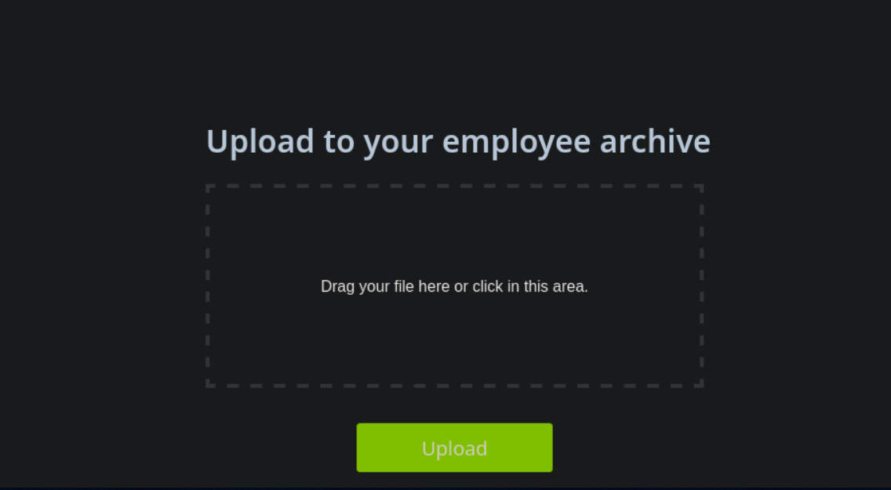
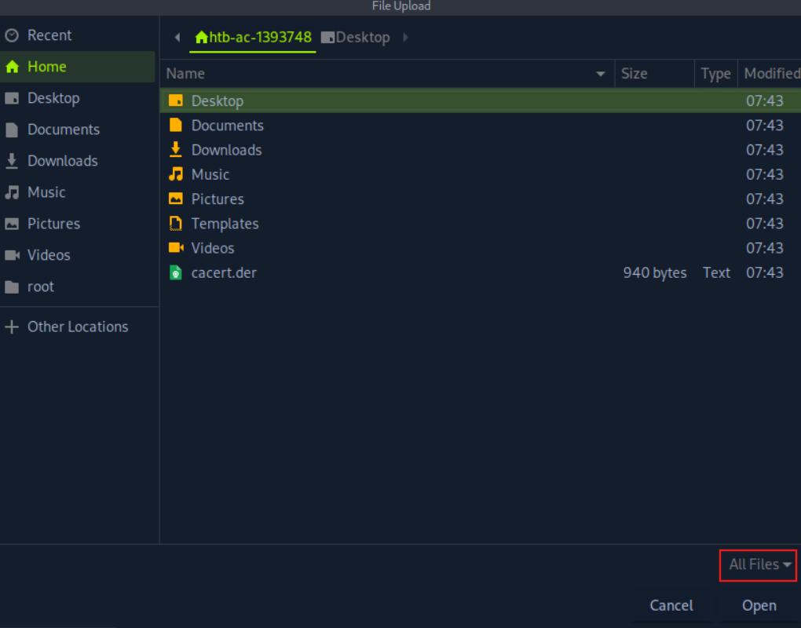
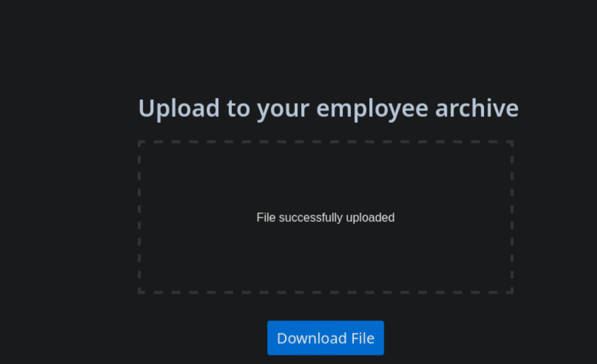
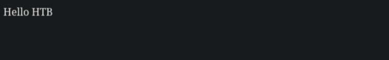

# Absent Validation

!!! abstract "The best case for an attacker"
    Some applications perform **no validation at all** and accept any file type by default. You upload your script, visit it, and you have code execution. Always test this first — it costs one upload and can end the engagement immediately.

## Spotting an Unrestricted Upload

Take this Employee File Manager. It says nothing about allowed types, and the drop zone happily accepts a `.php` file:



The front-end raises no complaint when we select a PHP file:



No front-end restriction is a strong hint that the back-end may be just as permissive. If so, we can upload an arbitrary file and take over the server.

!!! tip "Front-end silence ≠ back-end silence"
    A permissive browser form is encouraging, but the server may still validate. Don't assume — *prove* it with the test below.

## Prove Code Execution First

Before throwing a real shell, confirm the server **executes** your file rather than just storing it. Upload a minimal proof-of-concept. For PHP, write this to `test.php`:

```php title="test.php"
<?php echo "Hello World"; ?>
```

Upload it through the form:



Then browse to the uploaded file's location:



Interpret the result carefully:

| Result | Meaning | Next step |
|--------|---------|-----------|
| Page prints **Hello World** | PHP executed → **RCE confirmed** | [Weaponize](weaponization.md) |
| Page prints **raw source** (`<?php ... ?>`) | File stored but **not executed** | Useful for XSS/XXE, not RCE here → [Limited uploads](limited-uploads.md) |
| Upload rejected | Some validation exists | Move to the [bypass chapters](client-side-validation.md) |

!!! warning "Find the upload directory"
    Code execution is useless if you can't reach the file. Common storage paths: `/uploads/`, `/files/`, `/images/`, `/profile_images/`, `/attachments/`. Watch the upload response, the page DOM, and any image `src` after upload — they frequently leak the exact path.

## Why "Hello World" and Not a Shell?

A no-op PoC is deliberate tradecraft:

- It's **quiet** — `echo "Hello World"` won't trip behavioural alerts the way `system()` calls might.
- It **isolates the variable** — if it renders as source, you know the problem is *execution*, not your shell code.
- It's **safe to leave behind** if cleanup is delayed (though you should still remove it).

## Key Takeaways

!!! success "Revision recap"
    - Always test absent validation first — it's one upload away from full compromise.
    - Confirm execution with a harmless `<?php echo "Hello World"; ?>` before weaponizing.
    - **Hello World rendered** = RCE; **source shown** = stored-only (pivot to limited uploads).
    - You must know the upload directory to reach your file — hunt for it in responses/DOM.

➡️ Next: [Weaponization](weaponization.md) — turn that execution into a shell.
