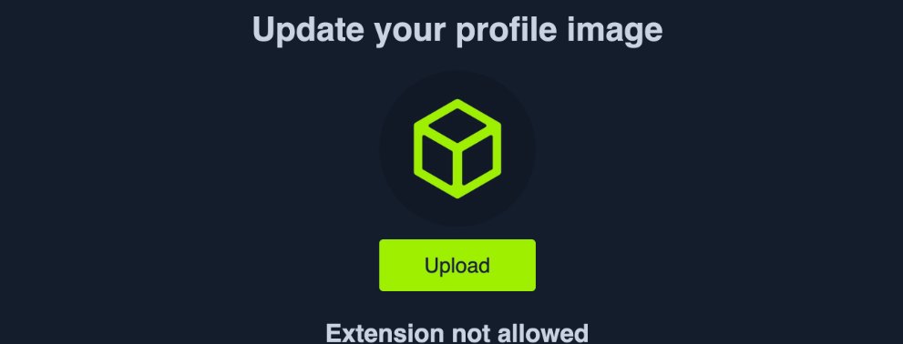
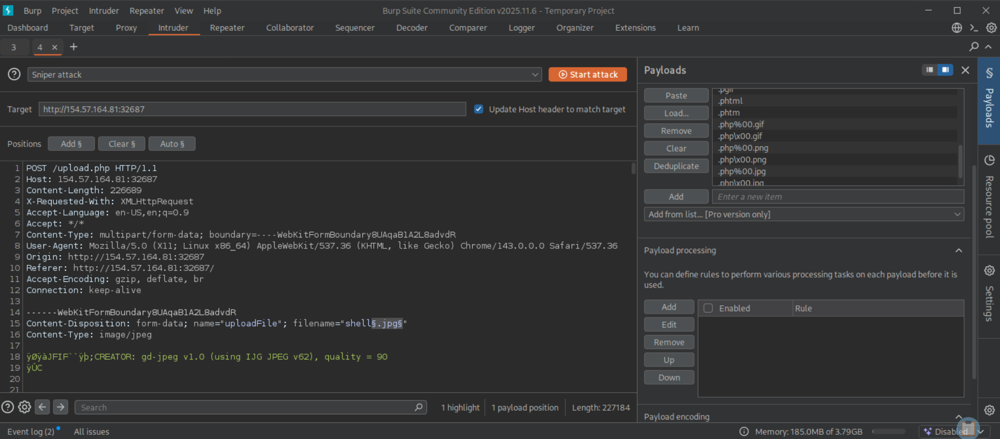
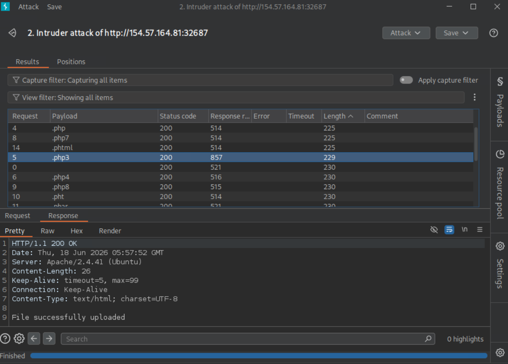
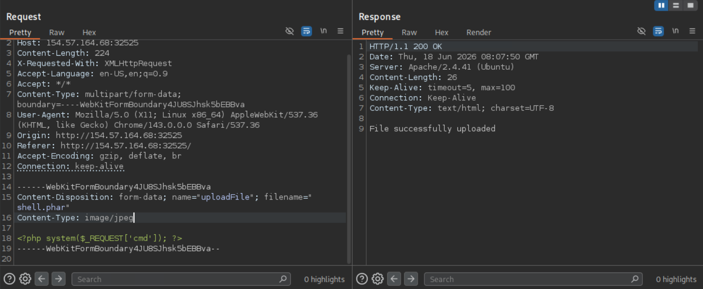
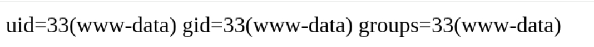

# Bypassing Blacklist Filters

!!! abstract "Why blacklists fail"
    The right place for security controls is the **back-end server**, where attackers can't directly manipulate them. But a poorly written back-end check is still beatable. The weakest server-side approach is testing the file extension against a **blacklist** of disallowed extensions — because a blacklist must enumerate *every* dangerous extension, and it never does.

## Confirming Server-Side Validation

Let's try one of the [client-side bypasses](client-side-validation.md) — intercept an image upload with Burp, swap the file content and filename for our PHP script, and forward it:



This time the attack fails — we get **"Extension not allowed"**. That tells us the application validates on the **back-end**, in addition to the front-end.

There are generally two ways a server validates an extension:

1. Testing against a **blacklist** of disallowed types.
2. Testing against a **whitelist** of allowed types.

The validation may also inspect the *file type* or *file content* for matching (covered in [Type & MIME Filters](type-filters.md)). The weakest of all is the **extension blacklist**.

## What a Blacklist Looks Like

```php
$fileName = basename($_FILES["uploadFile"]["name"]);
$extension = pathinfo($fileName, PATHINFO_EXTENSION);
$blacklist = array('php', 'php7', 'phps');

if (in_array($extension, $blacklist)) {
    echo "File type not allowed";
    die();
}
```

The code takes the file extension and compares it against a list of blacklisted extensions. The flaw: the list is **not comprehensive**. Many other extensions still execute as PHP on the back-end but were never added to the list.

!!! tip "Abuse case sensitivity"
    The comparison above is **case-sensitive** and only considers lowercase. On Windows servers, file names are case-insensitive, so a mixed-case extension like `.pHp` can slip past the blacklist and still execute as PHP.

## Fuzzing for Allowed Extensions

Since the app tests the extension, fuzz the upload with a list of candidate extensions and watch which ones *don't* return the error. Useful wordlists:

- **PayloadsAllTheThings** — extension lists for PHP and .NET.
- **SecLists** — common web extensions.

Intercept the `/upload.php` request, send it to **Burp Intruder**, clear the auto positions, and set a single payload position on the extension in `filename="HTB.php"`. Load the PHP extensions wordlist under **Payload Options**, and **un-tick URL-encoding** so the `.` before the extension isn't encoded. Start the attack:



Sort the results by **Length**. Requests with a distinct Content-Length (e.g. 229, 230) passed validation — they responded with **"File successfully uploaded"** — while the rest returned **"Extension not allowed"**:



!!! note "Common PHP-executable extensions to try"
    `.phtml`, `.php3`, `.php4`, `.php5`, `.php7`, `.phps`, `.pht`, `.phar`, `.pgif`, `.inc`. Not all work on every server config — this is exactly why fuzzing beats guessing.

## Uploading a Non-Blacklisted Extension

Pick an allowed extension that still executes PHP. `.phar` is frequently permitted and runs as PHP. Send that request to **Repeater**, change the filename to a non-blacklisted extension, and set the body to your web shell:



The file uploads successfully. Now visit it in the upload directory (here `profile_images`) and run a command to confirm RCE:



!!! warning "Not every allowed extension executes"
    Fuzzing finds extensions the *blacklist* allows — but execution depends on the **web server configuration** (which extensions are mapped to the PHP handler). Try several allowed extensions until one runs code.

## Key Takeaways

!!! success "Revision recap"
    - A blacklist must list *every* dangerous extension — and never does.
    - Confirm a server-side filter by watching for an **"Extension not allowed"** response.
    - Fuzz the extension with Burp Intruder + a PHP/.NET extension wordlist (un-tick URL encoding).
    - `.phtml`, `.php5`, `.phar`, `.pht` are classic blacklist escapees.
    - On Windows, try mixed case (`.pHp`) to beat case-sensitive checks.
    - "Allowed by the blacklist" ≠ "executes" — confirm RCE, try several extensions.

➡️ Next: [Whitelist Filters](whitelist-filters.md) — the stronger sibling, and how weak regex still loses.
