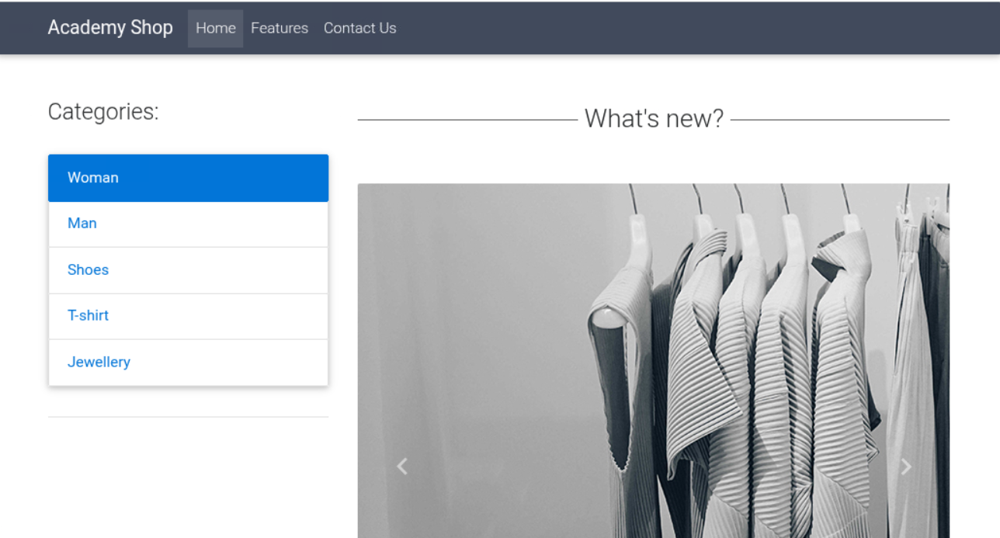
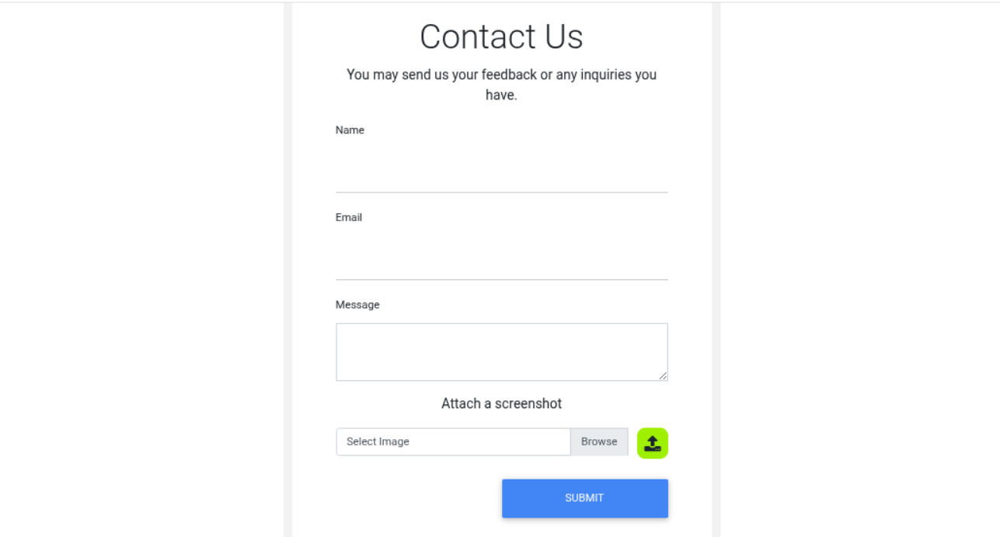
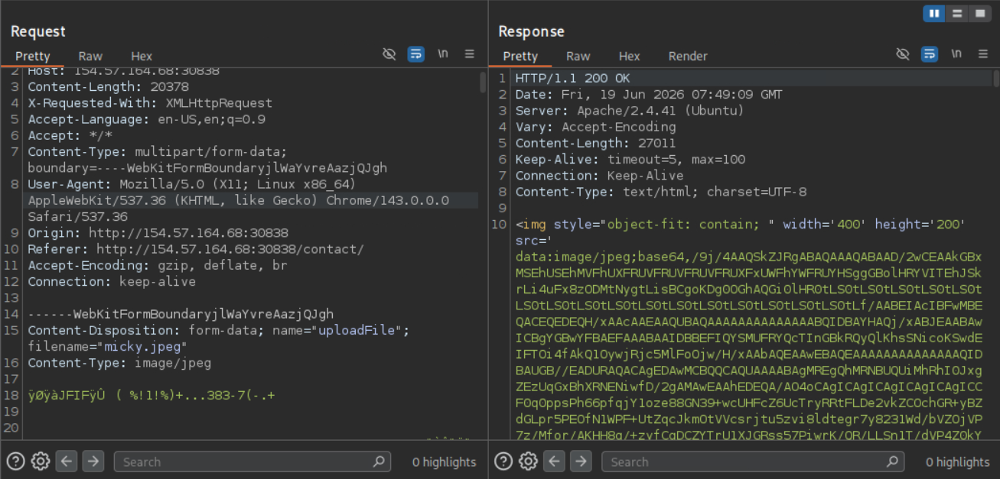
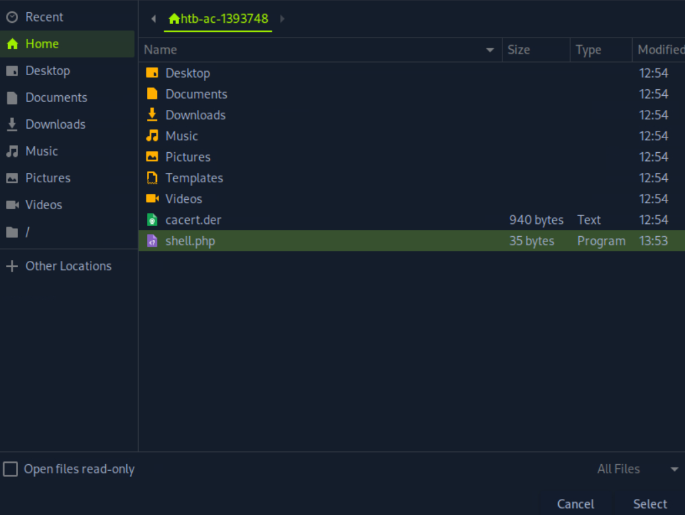
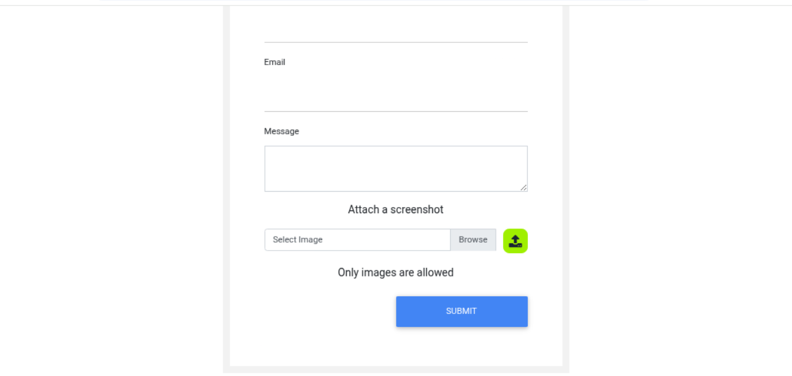
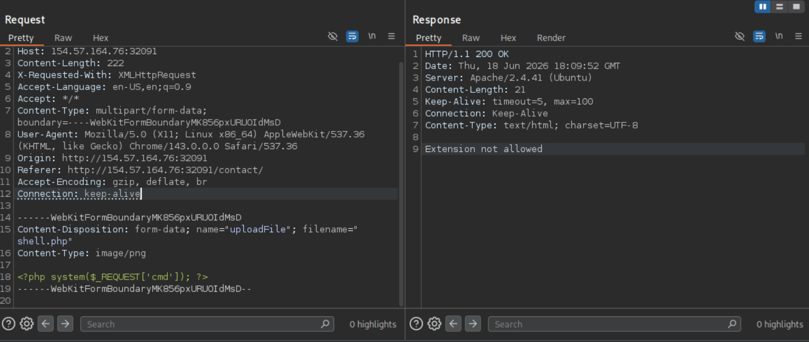

## Scenario

You are contracted to perform a penetration test for a company's e-commerce web application. The web application is in its early stages, so you will only be testing any file upload forms you can find.

Try to utilize what you learned in this module to understand how the upload form works and how to bypass various validations in place (if any) to gain remote code execution on the back-end server.

## Let's go

We are presented with the following page upon accessing the webpage hosted by the target machine. We can see various categories, all of which do nothing when clicked on. We have a features page, this can also not be accessed. We do, however, have a contact page.




When accessing this contact page, we are met with the following screen. We see a form where we can input a Name, Email and Message, as well as upload an image. While the form itself is of interest, we can see that the file upload is what we came here for.





Using `curl`, we can confirm that the website is running `php`:

```shell
curl -s http://154.57.164.68:30838/index.php -o /dev/null -w "%{http_code}\n"
200
```

If we send in a sample `.jpg` image of Micky Mouse, we can see that the request data is the following:



A POST request is made where the image is uploaded, while the form data is uploaded separately by a GET request. The uploaded image is also returned as base64 encoded data. This means we cannot see where the image is hosted on the webserver.

Let’s start by fuzzing the data with several PHP file extensions and see if anything gets through. We will swap the data of the image with an XXE exploit and add some magic bytes to the front to have it recognized as an image file. This way, we can try and get access to the `upload.php` file and see what checks are being performed. This way, we can perfectly bypass the checks.





Only images are allowed:



This seems to be a client side validation.


```js
function checkFile(File) {
  var file = File.files[0];
  var filename = file.name;
  var extension = filename.split('.').pop();

  if (extension !== 'jpg' && extension !== 'jpeg' && extension !== 'png') {
    $('#upload_message').text("Only images are allowed");
    File.form.reset();
  } else {
    $("#inputGroupFile01").text(filename);
  }
}
```

I was able to bypass the client side filter, but there seems to be backend filters too:

