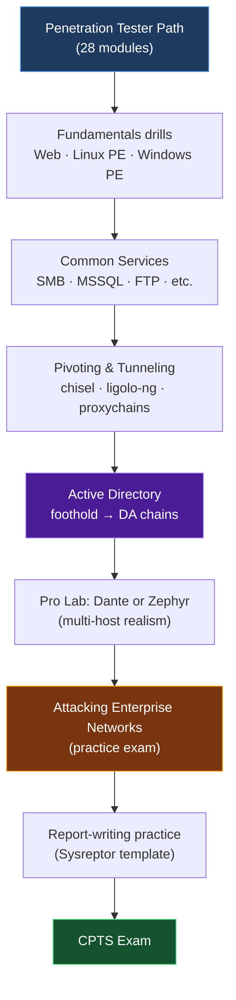

# :lucide-list-checks: CPTS Practice Machines & Exam Prep

A focused, **whole-exam** roadmap — not just Active Directory. The CPTS is broad, and the fastest way to fail is to over-index on one domain. This page maps practice machines and labs to every knowledge area the exam actually tests.

!!! abstract "What the CPTS exam covers"
    The exam is a fully hands-on, 10-day assessment where you compromise a simulated enterprise network and deliver a **professional penetration testing report**. Per the official exam page, the knowledge domains are:[^chaoskist]

    - **Web application attacks** (your external entry point)
    - **Linux & Windows privilege escalation**
    - **Active Directory attacks** (the heaviest single domain)
    - **Pivoting & lateral movement**
    - **Post-exploitation** (loot, secrets, persistence) and **reporting**

---

## The #1 Preparation: The Path Itself

Before any retired box, the most exam-aligned material is the content you already pay for.

!!! tip "Highest-signal prep, in order"
    1. **Complete the Penetration Tester job-role path** (28 modules). Every module maps directly to exam content.[^deephacking]
    2. **Do the "Attacking Enterprise Networks" module** — its lab is effectively a practice exam: external foothold → web → pivot → full AD compromise.[^htbforum]
    3. **A Pro Lab** — *Dante* (broad methodology + pivoting) or *Zephyr* (AD-heavy). See [Pro Labs](#pro-labs-the-closest-thing-to-the-exam) below.
    4. **Retired boxes** (this page) to drill any weak domain.

CPTS, unlike OSCP, **permits automated tooling** (Metasploit, etc.) and weights *methodology, chaining, and reporting* heavily. Practice the workflow, not just the exploit.

---

## Recommended Study Sequence

---

## Domain 1 — Web Application Attacks

The external foothold on CPTS is almost always a web app. Drill enumeration, common CVEs, SQLi, file upload, SSTI, command injection, and auth bypass.

| Machine | Difficulty | Focus |
|---|---|---|
| **Cap** | Easy | IDOR, pcap creds, Linux capabilities to root |
| **Sau** | Easy | SSRF → request-baskets, Maltrail RCE |
| **Soccer** | Easy | Default creds, WebSocket SQLi |
| **Editorial** | Easy | SSRF, git secret leakage |
| **Codify** | Easy | Node.js vm2 sandbox escape (RCE) |
| **Devvortex** | Easy | Joomla enum, CVE → creds |
| **Usage** | Easy | Laravel SQLi, admin panel RCE |
| **BountyHunter** | Easy | XXE → file read → privesc |
| **OpenSource** | Medium | Source-code review, git, Werkzeug |
| **Stocker** | Easy | NoSQLi auth bypass, SSTI in PDF gen |

!!! note "You've already built deep web skills"
    Your [File Upload Attacks series](index.md) covers one of the most-tested web vectors on the exam end-to-end. Pair it with the boxes above for SQLi/SSTI/SSRF variety.

---

## Domain 2 — Linux Privilege Escalation

Master sudo misconfigs, SUID/SGID, capabilities, cron jobs, PATH hijacking, and credential reuse.

| Machine | Difficulty | Focus |
|---|---|---|
| **Shocker** | Easy | Shellshock → sudo perl to root |
| **Cap** | Easy | `cap_setuid` capability abuse |
| **Tabby** | Easy | LXD/LXC container group escape |
| **Academy** | Easy | sudo + composer, env leakage |
| **Magic** | Medium | SUID + PATH hijack |
| **Traverxec** | Easy | nostromo RCE → SSH key → journalctl sudo |
| **Sunday** | Easy | shadow backup, sudo wget |

!!! tip "Run the enumeration, then verify by hand"
    Use `linpeas`, but always confirm *why* a finding is exploitable. The exam rewards understanding, not script output.

---

## Domain 3 — Windows Privilege Escalation

Focus on service misconfigs, token impersonation (`SeImpersonatePrivilege` → Potato attacks), unquoted service paths, registry/AlwaysInstallElevated, GPP passwords, and stored credentials.

| Machine | Difficulty | Focus |
|---|---|---|
| **Querier** | Medium | MSSQL, GPP cpassword, `SeImpersonate` (Potato) |
| **Jeeves** | Medium | Jenkins RCE, KeePass, token to SYSTEM |
| **Servmon** | Easy | NVMS path traversal, NSClient++ privesc |
| **Remote** | Easy | Umbraco RCE, TeamViewer creds |
| **Love** | Easy | SSRF → Voting app RCE, AlwaysInstallElevated |
| **Worker** | Medium | Azure DevOps, SVN, service abuse |
| **Optimum** | Easy | HFS RCE → kernel exploit (MS16-032/098) |

!!! warning "Potato attacks are exam-relevant"
    `SeImpersonatePrivilege` on service accounts (IIS, MSSQL) is extremely common in AD environments. Be fluent with **PrintSpoofer / GodPotato / JuicyPotatoNG** before exam day.

---

## Domain 4 — Attacking Common Services

The exam network runs real services. Practice attacking SMB, MSSQL, FTP, NFS, RDP, WinRM, and SNMP directly.

| Machine / Lab | Difficulty | Focus |
|---|---|---|
| **Archetype** | Starting Point | MSSQL `xp_cmdshell`, SMB shares, `winexe` |
| **Oopsie** | Starting Point | Web auth bypass, IDOR, SUID |
| **Vaccine** | Starting Point | FTP creds, SQLi, sudo VI escape |
| **Querier** | Medium | MSSQL relay + GPP |
| **Mantis** | Hard | MSSQL + Kerberos in an AD context |

!!! note "Start Here if you're rusty"
    The HTB **Starting Point** tier (Archetype, Oopsie, Vaccine, etc.) maps almost one-to-one onto the *Attacking Common Services* and *Shells & Payloads* modules — ideal warm-ups.

---

## Domain 5 — Pivoting, Tunneling & Lateral Movement

This is the domain most single-box practice **can't** teach you — and it's heavily tested. You must be fluent moving between network segments.

**Tooling to master:** `ligolo-ng`, `chisel`, `sshuttle`, SSH local/remote/dynamic port forwarding, `proxychains`, and Metasploit's `autoroute`/`socks_proxy`.

| Resource | Type | Why it matters |
|---|---|---|
| **Pro Lab: Dante** | Multi-host lab | Beginner-friendly RTO L1 — pivoting, web, lateral movement across subnets[^dante] |
| **Pro Lab: Zephyr** | Multi-host lab | AD enumeration & exploitation at scale; closest to the exam's AD core[^zephyr] |
| **Attacking Enterprise Networks** | Path module | The official end-to-end practice scenario[^htbforum] |
| **Reel / Reel2** | Hard boxes | Phishing foothold + AD lateral movement |

!!! danger "Don't skip pivoting"
    Many exam failures come from candidates who can own a single host but freeze when the next target is only reachable *through* the host they just compromised. Drill double-pivots until they're muscle memory.

---

## Domain 6 — Active Directory (Highest Weight)

AD is the spine of the exam. Practice the full chain: enumeration → AS-REP/Kerberoast → ACL abuse → delegation → DCSync. The table below is condensed; many of these are documented in depth in the [Pwned walkthroughs](/walkthroughs/).

| Machine | Difficulty | Key AD Techniques | Documented |
|---|---|---|---|
| **Forest** | Easy | AS-REP roasting, DCSync | ✅ [writeup](/walkthroughs/forest/) |
| **Sauna** | Easy | AS-REP, autologon creds, DCSync | ✅ [writeup](/walkthroughs/sauna/) |
| **Active** | Easy | GPP cpassword, Kerberoasting |  |
| **Support** | Easy | LDAP, Resource-Based Constrained Delegation |  |
| **Cascade** | Medium | LDAP recon, VNC creds, AD Recycle Bin |  |
| **Resolute** | Medium | Password spray, DnsAdmins DLL |  |
| **Monteverde** | Medium | Azure AD Connect abuse |  |
| **Escape** | Medium | ADCS ESC1, MSSQL | ✅ [writeup](/walkthroughs/escape/) |
| **Certified** | Medium | ADCS ESC9, shadow credentials | ✅ [writeup](/walkthroughs/Certified/) |
| **Blackfield** | Hard | AS-REP, LSASS, Backup Operators |  |
| **Sizzle** | Hard | ADCS + multi-step chaining | ✅ [writeup](/walkthroughs/sizzle/) |
| **Rebound** | Insane | RBCD, RemotePotato0, constrained delegation | ✅ [writeup](/walkthroughs/Rebound/) |

---

## Pro Labs — The Closest Thing to the Exam

| | **Dante** | **Zephyr** |
|---|---|---|
| **Best for** | Methodology, pivoting, mixed Linux/Windows | Active Directory at scale |
| **Difficulty** | Beginner-friendly (RTO L1) | Intermediate |
| **Teaches** | Tunneling, web, lateral movement, looting[^dante] | AD enumeration & exploitation chains[^zephyr] |
| **CPTS fit** | Broad exam methodology | The AD-heavy exam core |

!!! tip "If you only do one Pro Lab"
    Pick **Zephyr** if your AD is weak, or **Dante** if your pivoting/methodology is weak. Doing both is the strongest possible non-exam preparation.

---

## Post-Exploitation & Reporting

The CPTS is **not passed by rooting boxes alone** — you must submit a professional report, and it is graded. Budget real time for it.

- Practice with the official **HTB CPTS report template** and tools like **Sysreptor**.[^sysreptor]
- Document *as you go*: every credential, every command, every screenshot, mapped to findings with CVSS, impact, and remediation.
- Treat the report as 30–40% of your effort, not an afterthought.

!!! success "Exam-day mindset"
    Enumerate exhaustively, take structured notes from minute one, pivot deliberately, and keep findings organized for the report. Methodology beats memorized exploits.

---

## References

[^chaoskist]: ChaosKist — *HackTheBox CPTS Guide and Review* (exam knowledge domains). <https://medium.com/@chaoskist/hackthebox-certified-penetration-testing-specialist-htb-cpts-guide-and-review-dbb0d30ddb09>
[^deephacking]: Deep Hacking — *HackTheBox Certified Penetration Testing Specialist 2025*. <https://blog.deephacking.tech/en/posts/htb-cpts-review/>
[^htbforum]: Hack The Box Forum — *Lab Training for CBBH / CPTS* (Attacking Enterprise Networks, Dante, Zephyr). <https://forum.hackthebox.com/t/lab-training-for-cbbh-cpts/323897>
[^dante]: Hack The Box — *How to play Pro Labs* (Dante overview). <https://help.hackthebox.com/en/articles/5185470-how-to-play-pro-labs>
[^zephyr]: Hack The Box — *Professional Labs: Zephyr*. <https://www.hackthebox.com/blog/professional-labs-zephyr>
[^sysreptor]: dollarboysushil — *HackTheBox CPTS Exam Report Writing using Sysreptor*. <https://dollarboysushil.com/posts/cpts-report-writing-guide/>
