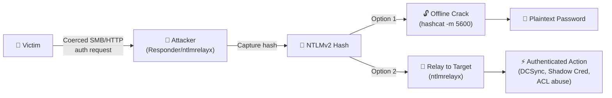

# NTLMv2 Hash Coercion & Leaking

## What Is NTLM Coercion?

NTLM coercion (also called "forced authentication" or "hash disclosure") is a class of attacks that trick a Windows system into initiating an NTLM authentication handshake with an attacker-controlled server. When this happens, the victim's **NTLMv2 challenge-response hash** (Net-NTLMv2) is transmitted over the network and can be:

1. **Captured** — for offline cracking with hashcat/john
2. **Relayed** — forwarded in real-time to another service (NTLM relay attacks)
3. **Used for lateral movement** — via pass-the-hash or relay-to-LDAP for AD escalation

!!! danger "Why This Matters"
    A single leaked NTLMv2 hash from a Domain Admin on a Domain Controller can lead to **full domain compromise** via relay to LDAP (adding DCSync rights) or offline cracking.

---

## Attack Categories

| Category | Trigger | User Interaction | Examples |
|---|---|---|---|
| **File-Based** | Browsing to / opening a malicious file | Minimal (browse folder) to moderate (open file) | .url, .lnk, .scf, .library-ms, desktop.ini, .docx, .xlsx, .pdf, .rtf, .xml, .m3u, .wax, .asx |
| **RPC-Based** | Calling a Windows RPC interface | None (network access only) | PetitPotam, PrinterBug, DFSCoerce, ShadowCoerce, CheeseOunce |
| **URI Handler** | Clicking a crafted link | Single click | search:, search-ms:, ms-search:, file:// |
| **Protocol-Based** | Interacting with Windows services | Varies | WebDAV, WPAD, LLMNR/NBNS poisoning, mDNS |
| **Application-Specific** | Using a vulnerable application feature | Moderate | Outlook, Teams, Office macros, SQL xp_dirtree, SSRF chains |

---

## Section Contents

<div class="grid cards" markdown>

- :material-file-document-outline: **[File-Based Coercion](file-based-coercion.md)**

    Every file type that can trigger NTLM authentication — from zero-click browse-to-folder attacks to open-document vectors.

    Covers: `.url`, `.lnk`, `.scf`, `.library-ms`, `desktop.ini`, `searchConnector-ms`, `.docx`, `.xlsx`, `.rtf`, `.xml`, `.pdf`, `.m3u`, `.wax`, `.asx`, `.jnlp`, `.theme`, `.diagcab`, `.contact`

- :material-server-network: **[RPC-Based Coercion](rpc-based-coercion.md)**

    Server-side coercion via Windows RPC interfaces — force Domain Controllers and servers to authenticate to you without any user interaction.

    Covers: PetitPotam (MS-EFSR), PrinterBug (MS-RPRN), DFSCoerce (MS-DFSNM), ShadowCoerce (MS-FSRVP), CheeseOunce, Coercer tool

</div>

---

## Quick Reference: File Types That Leak NTLMv2

| File Type | Extension | Trigger | Interaction Required | Still Works (2026)? |
|---|---|---|---|---|
| URL File (URL field) | `.url` | Browse folder | None (just browse) | ✅ Yes |
| URL File (Icon field) | `.url` | Browse folder | None (just browse) | ✅ Yes |
| LNK Shortcut (Icon) | `.lnk` | Browse folder | None (just browse) | ✅ Yes |
| Library-ms | `.library-ms` | Extract from archive | None (just extract) | ✅ Yes (CVE-2025-24071) |
| SearchConnector-ms | `.searchConnector-ms` | Browse folder | None (just browse) | ✅ Yes |
| Windows Theme | `.theme` | Open file | Single click | ✅ Yes |
| SCF File | `.scf` | Browse folder | None (just browse) | ⚠️ Patched (modern Windows) |
| Desktop.ini | `desktop.ini` | Browse folder | None (just browse) | ⚠️ Patched (modern Windows) |
| Autorun.inf | `autorun.inf` | Insert media | None (legacy) | ❌ Disabled |
| Word (IncludePicture) | `.docx` | Open document | Open file | ✅ Yes |
| Word (External Template) | `.docx` | Open document | Open file | ✅ Yes |
| Word (Frameset) | `.docx` | Open document | Open file | ✅ Yes |
| Excel (External Cell) | `.xlsx` | Open document | Open file | ✅ Yes |
| RTF (objdata/objautlink) | `.rtf` | Open document | Open file | ✅ Yes |
| XML Stylesheet | `.xml` | Open in Word | Open file | ✅ Yes |
| PDF (Adobe Reader) | `.pdf` | Open + accept dialog | Open + click Allow | ⚠️ Requires user approval |
| M3U Playlist | `.m3u` | Open in media player | Open file | ✅ Yes |
| WAX Playlist | `.wax` | Open in WMP | Open file | ✅ Yes |
| ASX Playlist | `.asx` | Open in WMP | Open file | ✅ Yes |
| HTML (img src) | `.htm/.html` | Open locally in browser | Open file from disk | ✅ Yes (local only) |
| JNLP (Java Web Start) | `.jnlp` | Open file | Open file | ⚠️ Requires Java |
| Diagcab (Diagnostic) | `.diagcab` | Open file | Open file | ✅ Yes |
| Contact (vCard) | `.contact` | Open file | Open file | ✅ Yes |

---

## Core Tooling

| Tool | Purpose | Platform |
|---|---|---|
| **[ntlm_theft](https://github.com/Greenwolf/ntlm_theft)** | Generate 21+ file types for NTLM coercion | Python |
| **[Responder](https://github.com/lgandx/Responder)** | Capture NTLMv2 hashes via fake SMB/HTTP/etc servers | Python |
| **[Coercer](https://github.com/p0dalirius/Coercer)** | Automate RPC-based coercion (all known vectors) | Python |
| **[PetitPotam](https://github.com/topotam/PetitPotam)** | MS-EFSR coercion (unauthenticated on unpatched DCs) | Python |
| **[ntlmrelayx](https://github.com/fortra/impacket)** | Relay captured NTLM auth to other services | Python (Impacket) |
| **[Inveigh](https://github.com/Kevin-Robertson/Inveigh)** | Windows-native LLMNR/NBT-NS/mDNS poisoner | PowerShell/.NET |
| **[hashcat](https://hashcat.net/hashcat/)** | Crack NTLMv2 hashes offline | C (GPU) |
| **[Pretender](https://github.com/RedTeamPentesting/pretender)** | Modern replacement for Responder (Go) | Go |

---

## The Capture Chain

Regardless of coercion method, the exploitation follows the same pattern:



---

## Hashcat Mode Reference

| Hash Type | Mode | Example |
|---|---|---|
| NTLMv2 (Net-NTLMv2) | `-m 5600` | `user::DOMAIN:challenge:response:...` |
| NTLMv1 (Net-NTLMv1) | `-m 5500` | `user::DOMAIN:lm:ntlm:challenge` |
| NT Hash (NTLM) | `-m 1000` | `aad3b435b51404eeaad3b435b51404ee` |

```bash
# Crack NTLMv2 hash captured by Responder
hashcat -m 5600 captured_hash.txt /usr/share/wordlists/rockyou.txt -r /usr/share/hashcat/rules/best64.rule
```

---

## Defense Summary

| Mitigation | What It Blocks | Difficulty |
|---|---|---|
| **Disable NTLM entirely** (Restrict NTLM GPO) | Everything | High (compatibility issues) |
| **Block outbound SMB** (port 445/139) at firewall | All SMB-based coercion to external | Medium |
| **EPA (Extended Protection for Authentication)** | NTLM relay attacks | Medium |
| **Require SMB signing** | NTLM relay to SMB targets | Low |
| **Require LDAP signing + channel binding** | Relay to LDAP (DCSync attacks) | Medium |
| **Disable LLMNR/NBT-NS/mDNS** | Responder/Inveigh poisoning | Low |
| **Restrict NTLM to specific servers** | Limits which servers accept NTLM | Medium |
| **Patch (CVE-2025-24054, etc.)** | Specific file-based vectors | Low |
| **User training** | Phishing with malicious file attachments | Low effectiveness |
