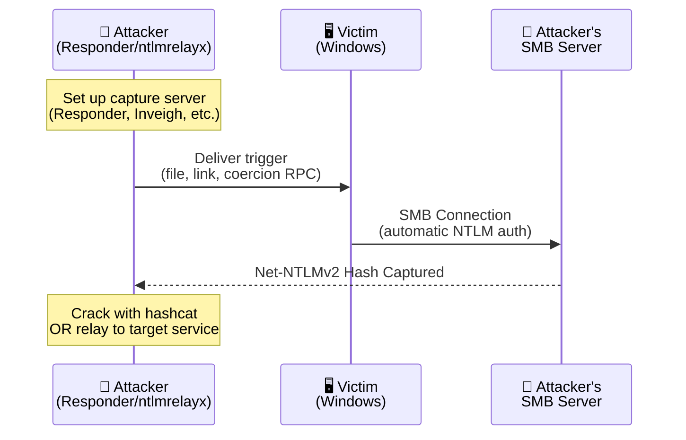

# NTLMv2 Hash Theft

## What Is NTLMv2 Hash Theft?

NTLMv2 hash theft (also called NTLM coercion or forced authentication) is a class of attacks that trick a Windows system into initiating NTLM authentication to an attacker-controlled server. When this happens, the victim's **Net-NTLMv2 challenge/response hash** is sent over the network and can be:

1. **Captured** — for offline password cracking (hashcat mode 5600)
2. **Relayed** — forwarded to another service to authenticate as the victim (ntlmrelayx)

This is one of the most versatile and widely-used attack techniques in Active Directory penetration testing.

## The Core Mechanism

Every technique in this section follows the same fundamental flow:



**Why it works:** Windows automatically attempts NTLM authentication when a process tries to access a UNC path (`\\server\share`). Many Windows features — file icons, search indexing, Office document loading, media playlists — resolve UNC paths without explicit user consent.

## Capture Infrastructure

Before using any coercion technique, you need a server to capture the incoming authentication:

| Tool | Use Case | Command |
|---|---|---|
| **Responder** | Capture hashes on the wire | `responder -I eth0 -v` |
| **Inveigh** | .NET/PowerShell hash capture (on Windows) | `Invoke-Inveigh -ConsoleOutput Y` |
| **ntlmrelayx** | Relay captured auth to another target | `ntlmrelayx.py -t ldaps://dc01 -smb2support` |
| **smbserver.py** | Simple SMB capture server | `impacket-smbserver share . -smb2support` |

## What To Do With Captured Hashes

### Option 1: Offline Cracking

```bash
# hashcat — mode 5600 is Net-NTLMv2
hashcat -m 5600 captured_hashes.txt /path/to/wordlist.txt -r /path/to/rules.rule
```

### Option 2: NTLM Relay

Instead of cracking, relay the authentication to another service in real-time:

```bash
# Relay to LDAP on a Domain Controller (for AD object modification)
ntlmrelayx.py -t ldaps://dc01.corp.local --escalate-user attacker

# Relay to ADCS web enrollment (ESC8 — instant Domain Admin)
ntlmrelayx.py -t http://ca01.corp.local/certsrv/certfnsh.asp --adcs --template DomainController
```

### Option 3: Pass-the-Hash (if you crack it)

Once cracked, the cleartext password enables:
- Pass-the-Hash with the NT hash
- Kerberos ticket requests
- Full authenticated access

## Section Contents

This knowledge base section is divided into:

| Article | Focus |
|---|---|
| [File-Based Coercion](file-based-coercion.md) | Files that trigger NTLM auth when browsed, opened, or extracted — .library-ms, .url, .lnk, .theme, Office docs, PDF, media playlists, search: URI |
| [Protocol-Based Coercion](protocol-coercion.md) | RPC/DCOM-based coercion: PetitPotam, PrinterBug, DFSCoerce, ShadowCoerce, RemoteMonologue, and relay chains |

## Key CVEs (2020–2026)

| CVE | Year | File/Vector | Interaction Required |
|---|---|---|---|
| CVE-2021-36942 | 2021 | PetitPotam (EFS RPC) | None (network) |
| CVE-2021-1678 | 2021 | NTLM relay to RPC | None (network) |
| CVE-2022-26925 | 2022 | LSA Spoofing (PetitPotam variant) | None (network) |
| CVE-2023-23397 | 2023 | Outlook calendar invite (UNC reminder sound) | Zero-click |
| CVE-2023-35636 | 2023 | Outlook "crumb" parameter | Click link |
| CVE-2024-43451 | 2024 | .theme file NTLM leak | Browse/preview |
| CVE-2024-38030 | 2024 | Theme file bypass of prior patch | Browse/preview |
| CVE-2025-24054 | 2025 | .library-ms NTLM spoofing | Extract ZIP |
| CVE-2025-24071 | 2025 | .library-ms in Explorer (zero-click on extract) | Extract ZIP |
| CVE-2026-32202 | 2026 | Explorer preview handler | Browse folder |
| Unpatched (2026) | 2026 | search: URI handler (Huntress) | Click link |

## Defense Quick Reference

| Mitigation | Effect |
|---|---|
| Disable NTLM where possible | Eliminates the attack class entirely |
| Enforce SMB signing | Prevents relay (but not capture) |
| Restrict outbound SMB (port 445) | Prevents hash leak to external servers |
| Enable Extended Protection for Authentication (EPA) | Prevents relay to web services |
| Block .library-ms, .searchConnector-ms via email gateway | Prevents delivery of coercion files |
| Patch — keep Windows updated | Closes specific coercion vectors |
| Monitor for outbound SMB to non-DC IPs | Detects coercion in progress |
